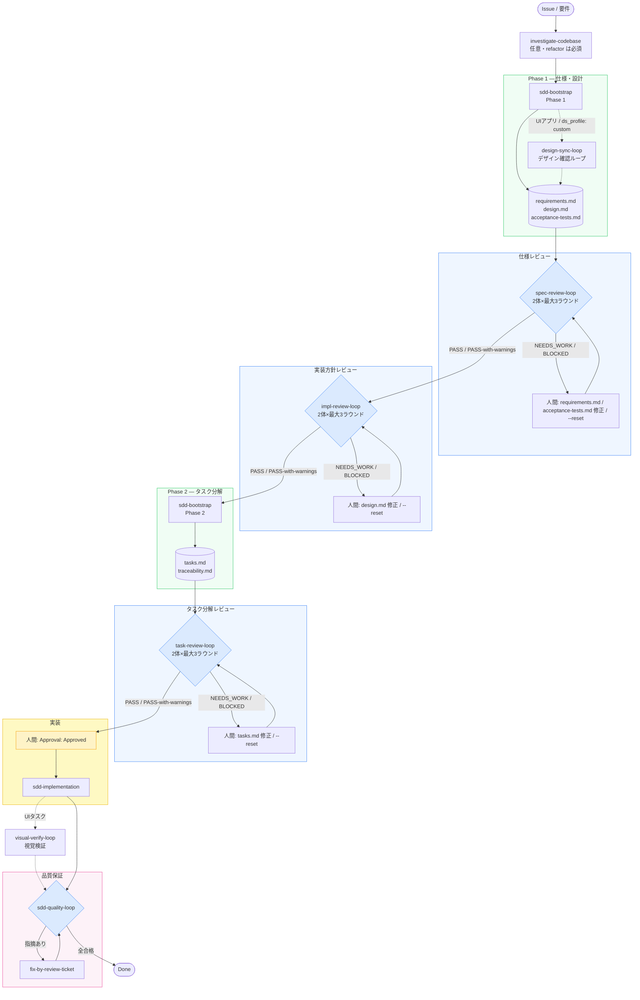

# SDD Forge

v1.8.0 — 仕様化・実装・品質保証を責務ごとに分離した SDD（仕様駆動開発）プラグインです。Codex CLI、Claude Code、Copilot CLI の 3 環境に対応します。

## クイックスタート（2コマンド）

```bash
# Step 1: 仕様化フェーズ — 要件から承認済みタスクまで
/sdd-bootstrap:bootstrap feature https://github.com/your-org/your-repo/issues/42
# → 人間が tasks.md の Approval: Draft を Approval: Approved に変更

# Step 2: 実装・品質保証フェーズ — 承認済みタスクから Done まで
/sdd-ship:ship specs/<feature>/tasks.md
```

> **lite トラック（社内アプリ向け）**: `/sdd-bootstrap:bootstrap feature --lite <source>` → `/sdd-ship:ship --lite specs/<feature>/tasks.md`



> **Brownfield 既存プロジェクトへの導入**: 上記フローの前に `/sdd-adopt` を実行してください（[詳細](docs/workflow-guide.md)）。
>
> **LITE トラック** (`spec_profile: lite`): spec-review-loop / impl-review-loop / task-review-loop はスキップ。traceability/ADR/evidence-bundle/cross-model/critical を省略。下図参照。


## Getting Started

プラグインのインストールと運用手順は [docs/workflow-guide.md](docs/workflow-guide.md) をご覧ください。
**初めての方は workflow-guide.md の正常系フローからお読みください。**

`install.sh` / `install.ps1` には read-only の MCP サーバーが同梱されており、既定で配置・登録されます。

### MCP サーバー

#### sdd-forge-mcp

`sdd-forge-mcp` は、対象リポジトリの SDD 状態（spec / タスク / レビューチケット / 品質ゲート結果 / evidence）を構造化データとして読み取るための **read-only** MCP サーバーです。書き込み API は一切持たず、stdio 経由で MCP クライアント（Claude Code / Codex）から子プロセスとして起動されます。

#### local-env-mcp

`local-env-mcp` は、ローカル開発環境の情報を読み取るための **read-only** MCP サーバーです。実行機能を一切持たず、以下の 3 つの構造化 JSON ツールで環境情報を提供します:

- `get_os_info`: プラットフォーム・CPU・メモリ・OS バージョン・Node.js ランタイムバージョン
- `get_toolchain_versions`: コンパイル時に固定された 14 種の CLI（node/npm/pnpm/yarn/bun/deno/git/gh/python3/go/rustc/cargo/java/docker）のバージョン一括取得
- `list_available_clis`: 上記 14 種の CLI の可用性を確認

**セキュリティ境界**: 入力スキーマにコマンド・引数・パスを受け取るフィールドがなく、プローブ対象は外部入力から到達不可のコンパイル時固定リストのみです。環境変数値・ユーザー名・ホスト名は応答に含まれません。

**自動登録**: installer は Cursor (`~/.cursor/mcp.json`) と VS Code（ユーザープロファイル `mcp.json`）への自動登録も行います。詳細は [USERGUIDE.md](USERGUIDE.md) を参照してください。

導入オプション（詳細と トラブルシュート）は [USERGUIDE.md](USERGUIDE.md#mcp-サーバー) を参照してください。

## アンインストール

`install.sh` / `install.ps1` が登録した内容を取り消します。各 CLI（Codex / Claude / Copilot）からプラグインと marketplace を解除し、インストール済みファイル（既定では `${XDG_DATA_HOME:-$HOME/.local/share}/sdd-plugins`）と Codex エージェントロール（`~/.codex/agents/sdd-*.toml`）を削除します。

```bash
# macOS / Linux — 全環境からアンインストール（既定で全プラグイン対象）
./uninstall.sh

# 登録だけ解除し、ファイルは残す
./uninstall.sh --keep-files

# 特定環境・特定プラグインだけ対象にする
./uninstall.sh --target Claude --plugins sdd-bootstrap,sdd-ship
```

```powershell
# Windows
./uninstall.ps1
./uninstall.ps1 -KeepFiles
./uninstall.ps1 -Target Claude -Plugins sdd-bootstrap,sdd-ship
```

主なオプション（`.sh` / `.ps1` 共通、PowerShell は `-CamelCase`）:

| オプション | 説明 |
|---|---|
| `--target All\|Codex\|Claude\|Copilot\|FilesOnly` | 対象環境。`FilesOnly` は CLI 解除をスキップしファイルのみ削除 |
| `--plugins <comma>` | 対象プラグイン。既定は全プラグイン |
| `--keep-files` | CLI 登録のみ解除し、インストール済みファイルは保持 |
| `--skip-plugin-uninstall` | CLI からの登録解除をスキップ |
| `--skip-agent-uninstall` | Codex エージェント TOML の削除をスキップ |

登録解除はべき等です（既に存在しないプラグイン／marketplace は成功扱い）。Codex エージェントロールは **本プロジェクトがインストールしたファイルのみ** を削除し、利用者自身が `~/.codex/agents/` に置いたファイルは（`sdd-*` という名前のものを含め）削除しません。また `--plugins` で一部のみ指定した場合は marketplace を削除しません（marketplace を消すと、そこからインストールされた他のプラグインも巻き添えで消えるため）。

## 特徴

- **仕様レビューループ (`spec-review-loop`)**: requirements.md と acceptance-tests.md に対して `spec-reviewer-a/b` が独立してレビューし、`Spec-Review-Status: Passed` になるまで実装方針レビューを開始させません。
- **実装方針レビューループ (`impl-review-loop`)**: design.md に対して `impl-reviewer-a/b` が独立したブラインドレビューを最大3ラウンド実施し、`Impl-Review-Status: Passed` になるまで tasks.md 生成をブロックします。PASS-with-warnings（Minor のみ）も通過扱い。BLOCKED + `--reset` で新attemptを開始。
- **タスク分解レビューループ (`task-review-loop`)**: tasks.md に対して `task-reviewer-a/b` が独立したブラインドレビューを最大3ラウンド実施します。依存関係サイクル検出・Blockers 正準形式検証を含みます。
- **Phase 1/2 分割**: `sdd-bootstrap-interviewer` は Phase 1（仕様・設計・受入テスト）の後に `spec-review-loop`、次に `impl-review-loop` を通し、Phase 2（タスク・トレーサビリティ）の後に `task-review-loop` を通す三段階の独立レビューを必須にします。
- **軽量トラック sdd-lite**: 社内・部署内アプリ向けの中量SDDトラック。要件/設計/タスク生成・単一承認・implement-task・lite-gateの4ステップで構成し、evidence-bundle/ADR必須/cross-model/critical を省略。`spec-review-loop` / `impl-review-loop` / `task-review-loop` もスキップ。既存プラグインとの加算的昇格に対応。
- **統一デザインシステム統合**: UI アプリでは `ds_profile: custom` を選ぶと、プロジェクト直下の `design-system/`（W3C DTCG 準拠 design-tokens.json・design-system.md・ui-patterns.md）を契約として生成・強制します。仕様段階は `design-sync-loop`（ui-ux-pro-max シード生成 / Figma DTCG 取込 / claude.ai/design 確認ループ）、実装段階は `visual-verify-loop`（Claude Preview / wpf-visual-verify による視覚検証）、品質検証は `check-design-system`（warn 開始の決定論ゲート）の3層で支えます。a11y 基準は WCAG 2.2 AA。非 UI プロジェクトへのオーバーヘッドはゼロです。
- **バッチ実装 (`implement-tasks`)**: 承認済みタスクを依存関係順に連続実行し、全タスクが `Implementation Complete` になった時点で `quality-gate` を自動起動します。`### Blockers` セクションのタスク参照を解析して依存関係を自動解決します。
- **責務の明確な分離**: 仕様化・実装・品質保証を別々のスキルが担当し、実装者が自分の成果物を甘く採点する構造を排除します。
- **人間承認ゲート**: エージェントはタスク承認も WFI 承認も自己承認できず、フック + 決定論的スクリプトの二重防衛により不正な承認を防止します。critical タスクは二者承認（`Approval:` + 別名義の `Second Approval:`）が必須で、sudo でもバイパスできません。
- **独立した批判レビュー**: 実装者とは別の `sdd-evaluator` エージェント (またはセッション) が新しい視点で検証します。
- **sudoモード**: *承認待ち*（タスク承認・`accepted` 差分・定型サインオフ）を期限付きで自動通過させ、ソロワークの効率を向上。判断フォーク（`requires_human_decision`・アーキ/認証/セキュリティ決定・WFI 承認）と AGENT_STOP・決定論的ゲートは常時人間/有効。入り方は [`/sdd-sudo` スキル](plugins/sdd-quality-loop/skills/sdd-sudo/SKILL.md) を参照。
- **リスク適応ゲート**: タスクごとに `Risk:` 階層 (`low / medium / high / critical`) を設定し、階層に比例した決定論的ゲートセットを強制します。新ゲート `check-risk`（階層と `Risk Rationale` を検証）・`check-traceability`（REQ→AC→TEST→証跡チェーンを検証）を追加。`check-contract` は階層最小セットの superset 強制（Pass 4）と TDD Red→Green 証跡（Pass 5）を実施。高/critical はプロベナンス付き evidence bundle を必須とし、critical は HMAC-SHA256 署名 + クリーンツリー強制。非コード (`stack: shell/docs/spec`) リポジトリでは compile 系チェックを理由付きで waive 可能。正準対応表: [`risk-gate-matrix.md`](plugins/sdd-quality-loop/references/risk-gate-matrix.md)。
- **3環境に対応**: Claude Code、Codex CLI、Copilot CLI の環境でスキル・エージェント・フック・スクリプトがリポジトリ内ファイルを通じて相互ハンドオフし、環境を超えて作業を継続できます。
- **バグ修正トラック (`diagnose`)**: ハードなバグ・リグレッション・フレーキーテスト・性能退行に対し、フル SDD を通す前に再現→計装→根本原因→最小修正の5フェーズ診断規律を回し、軽量トラックへの入口を兼ねます。詳細は [docs/workflow-guide.md の「バグ修正トラック（diagnose）」](docs/workflow-guide.md#バグ修正トラックdiagnose)をご覧ください。

## ドキュメントマップ

| ドキュメント | 対象読者・目的 |
|---|---|
| [README](README.md) (本ファイル) | 概要とフロー図 |
| [docs/workflow-guide.md](docs/workflow-guide.md) | 開発業務フロー：正常系・異常系・仕様変更・レビュー運用 |
| [docs/skill-reference.md](docs/skill-reference.md) | 21スキル・エージェント・フック・スクリプトの詳細 |
| [docs/troubleshooting.md](docs/troubleshooting.md) | 問題解決と対応策 |
| [docs/THREAT-MODEL.md](docs/THREAT-MODEL.md) | 脅威モデル：信頼境界・攻撃面・リスク低減策 |
| [docs/agent-capability-matrix.md](docs/agent-capability-matrix.md) | エージェント能力マトリクス：各エージェントが実行できる操作の一覧 |
| [CHANGELOG.md](CHANGELOG.md) | 変更履歴と版移行ガイド |
| [specs/sdd-lite/design.md](specs/sdd-lite/design.md) | sdd-lite 設計 |
| [plugins/sdd-lite/references/lite-flow-policy.md](plugins/sdd-lite/references/lite-flow-policy.md) | sdd-lite 規約・昇格 |

## 週次セルフ改善 (自動運用)

[.github/workflows/self-improvement.yml](.github/workflows/self-improvement.yml) が毎週月曜 09:00 JST に [.github/self-improvement-prompt.md](.github/self-improvement-prompt.md) の指示でリポジトリを監査し、Issue 起票と小さな改善 PR の作成まで自動で行います。人間の作業はレビューとマージのみです。

初回セットアップ (1回だけ):

1. 手元で `claude setup-token` を実行し、トークンをリポジトリの Secrets に `CLAUDE_CODE_OAUTH_TOKEN` として登録 (Claude Pro/Max のサブスクリプション枠を消費。API 従量課金なし)
2. Settings → Actions → General → Workflow permissions で "Allow GitHub Actions to create and approve pull requests" を有効化

## 変更履歴

詳しい変更履歴と版移行ガイドは [CHANGELOG.md](CHANGELOG.md) をご参照ください。
