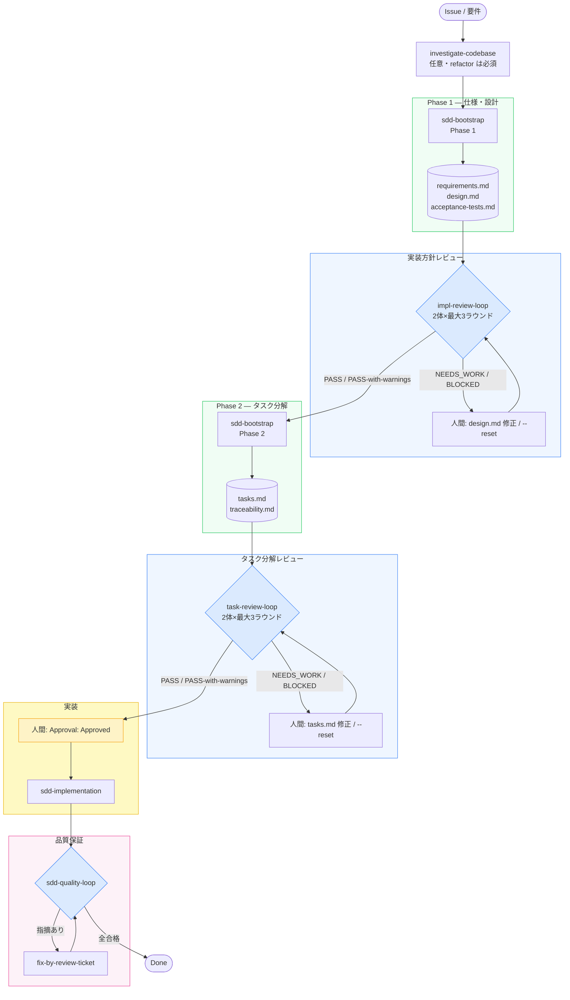
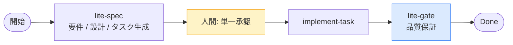

# SDD Forge

v0.14.0 — 仕様化・実装・品質保証を責務ごとに分離した SDD（仕様駆動開発）プラグインです。Codex CLI、Claude Code、Copilot CLI の 3 環境に対応します。

> **Brownfield 既存プロジェクトへの導入**: 上記フローの前に `/sdd-adopt` を実行してください（[詳細](docs/workflow-guide.md)）。

> **LITE トラック** (`spec_profile: lite`): impl-review-loop / task-review-loop はスキップ。traceability/ADR/evidence-bundle/cross-model/critical を省略。下図参照。

## Getting Started

プラグインのインストールと運用手順は [docs/workflow-guide.md](docs/workflow-guide.md) をご覧ください。
**初めての方は workflow-guide.md の正常系フローからお読みください。**

## 特徴

- **実装方針レビューループ (`impl-review-loop`)**: design.md に対して2体の独立したブラインドレビュアー（A: 構造健全性、B: 実装可能性/リスク）が最大3ラウンドのレビューを実施し、`Impl-Review-Status: Passed` になるまで tasks.md 生成をブロックします。PASS-with-warnings（Minor のみ）も通過扱い。BLOCKED + `--reset` で新attemptを開始。
- **タスク分解レビューループ (`task-review-loop`)**: tasks.md に対して2体の独立したブラインドレビュアー（A: 構造カバレッジ14チェック、B: 品質/リスク8チェック）が最大3ラウンドのレビューを実施します。依存関係サイクル検出・Blockers 正準形式検証を含む。
- **Phase 1/2 分割**: `sdd-bootstrap-interviewer` が Phase 1（仕様・設計・受入テスト）と Phase 2（タスク・トレーサビリティ）に分割され、`impl-review-loop` 通過を Phase 2 の前提条件とします。
- **軽量トラック sdd-lite**: 社内・部署内アプリ向けの中量SDDトラック。要件/設計/タスク生成・単一承認・implement-task・lite-gateの4ステップで構成し、evidence-bundle/ADR必須/cross-model/critical を省略。`impl-review-loop` / `task-review-loop` もスキップ。既存プラグインとの加算的昇格に対応。
- **バッチ実装 (`implement-tasks`)**: 承認済みタスクを依存関係順に連続実行し、全タスクが `Implementation Complete` になった時点で `quality-gate` を自動起動します。`### Blockers` セクションのタスク参照を解析して依存関係を自動解決します。
- **責務の明確な分離**: 仕様化・実装・品質保証を別々のスキルが担当し、実装者が自分の成果物を甘く採点する構造を排除します。
- **人間承認ゲート**: エージェントはタスク承認も WFI 承認も自己承認できず、フック + 決定論的スクリプトの二重防衛により不正な承認を防止します。critical タスクは二者承認（`Approval:` + 別名義の `Second Approval:`）が必須で、sudo でもバイパスできません。
- **独立した批判レビュー**: 実装者とは別の `sdd-evaluator` エージェント (またはセッション) が新しい視点で検証します。
- **sudoモード**: *承認待ち*（タスク承認・`accepted` 差分・定型サインオフ）を期限付きで自動通過させ、ソロワークの効率を向上。判断フォーク（`requires_human_decision`・アーキ/認証/セキュリティ決定・WFI 承認）と AGENT_STOP・決定論的ゲートは常時人間/有効。入り方は [`/sdd-sudo` スキル](plugins/sdd-quality-loop/skills/sdd-sudo/SKILL.md) を参照。
- **リスク適応ゲート**: タスクごとに `Risk:` 階層 (`low / medium / high / critical`) を設定し、階層に比例した決定論的ゲートセットを強制します。新ゲート `check-risk`（階層と `Risk Rationale` を検証）・`check-traceability`（REQ→AC→TEST→証跡チェーンを検証）を追加。`check-contract` は階層最小セットの superset 強制（Pass 4）と TDD Red→Green 証跡（Pass 5）を実施。高/critical はプロベナンス付き evidence bundle を必須とし、critical は HMAC-SHA256 署名 + クリーンツリー強制。非コード (`stack: shell/docs/spec`) リポジトリでは compile 系チェックを理由付きで waive 可能。正準対応表: [`risk-gate-matrix.md`](plugins/sdd-quality-loop/references/risk-gate-matrix.md)。
- **3環境に対応**: Claude Code、Codex CLI、Copilot CLI の環境でスキル・エージェント・フック・スクリプトがリポジトリ内ファイルを通じて相互ハンドオフし、環境を超えて作業を継続できます。

## ドキュメントマップ

| ドキュメント | 対象読者・目的 |
|---|---|
| [README](README.md) (本ファイル) | 概要とフロー図 |
| [docs/workflow-guide.md](docs/workflow-guide.md) | 開発業務フロー：正常系・異常系・仕様変更・レビュー運用 |
| [docs/skill-reference.md](docs/skill-reference.md) | 14スキル・エージェント・フック・スクリプトの詳細 |
| [docs/troubleshooting.md](docs/troubleshooting.md) | 問題解決と対応策 |
| [docs/THREAT-MODEL.md](docs/THREAT-MODEL.md) | 脅威モデル：信頼境界・攻撃面・リスク低減策 |
| [docs/agent-capability-matrix.md](docs/agent-capability-matrix.md) | エージェント能力マトリクス：各エージェントが実行できる操作の一覧 |
| [CHANGELOG.md](CHANGELOG.md) | 変更履歴と版移行ガイド |
| [specs/sdd-lite/design.md](specs/sdd-lite/design.md) | sdd-lite 設計 |
| [plugins/sdd-lite/references/lite-flow-policy.md](plugins/sdd-lite/references/lite-flow-policy.md) | sdd-lite 規約・昇格 |

## 週次セルフ改善 (自動運用)

[.github/workflows/self-improvement.yml](.github/workflows/self-improvement.yml) が毎週月曜 09:00 JST に [.github/self-improvement-prompt.md](.github/self-improvement-prompt.md) の指示でリポジトリを監査し、Issue 起票と小さな改善 PR の作成まで自動で行います。人間の作業はレビューとマージのみです。

初回セットアップ (1回だけ):

1. 手元で `claude setup-token` を実行し、トークンをリポジトリの Secrets に `CLAUDE_CODE_OAUTH_TOKEN` として登録 (Claude Pro/Max のサブスクリプション枠を消費。API 従量課金なし)
2. Settings → Actions → General → Workflow permissions で "Allow GitHub Actions to create and approve pull requests" を有効化

## 変更履歴

詳しい変更履歴と版移行ガイドは [CHANGELOG.md](CHANGELOG.md) をご参照ください。
