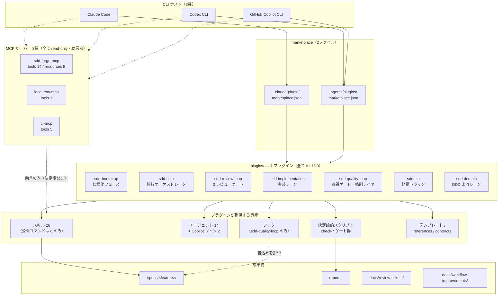
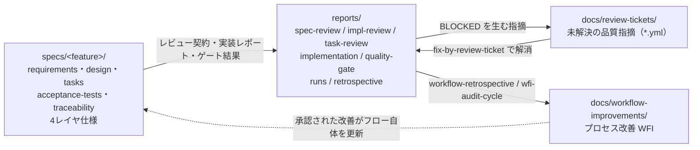

# SDD Forge アーキテクチャ概要

SDD Forge は、Claude Code / Codex CLI / GitHub Copilot CLI の 3 つの CLI ホスト上で同一の仕様駆動開発（SDD）ワークフローを動かすためのプラグインスイートです。本書はリポジトリ全体を1枚で俯瞰するための入口であり、プラグイン・スキル・エージェント・フック・決定論的スクリプト・MCP サーバーがどう噛み合っているかを説明します。

個々のスキル仕様は [skill-reference.md](../skill-reference.md)、運用手順は [workflow-guide.md](../workflow-guide.md)、プラグイン間の正準契約は [PLUGIN-CONTRACTS.md](../../PLUGIN-CONTRACTS.md) を参照してください。

---

## 1. 全体像

図の読み方:

- **実線** は起動・生成の経路、**点線** は助言・拒否といった非生成的な作用を表します。
- marketplace は 2 ファイルあり、Claude Code は `.claude-plugin/marketplace.json` を、Codex CLI / Copilot CLI は `.agents/plugins/marketplace.json` を参照します。登録されているプラグインの集合は両者で同一（7 プラグイン）です。
- Codex CLI 用のエージェントロール定義は marketplace とは別に `.codex/agents/sdd-*.toml`（4 ファイル）としてリポジトリ直下に置かれ、インストーラが `~/.codex/agents/` へ配置します。
- `skills/adversarial-review/` は `plugins/` の外にある単独スキルで、どのプラグインマニフェストにも同梱されず、インストーラの配置対象外です（利用するには手動コピーが必要）。

---

## 2. プラグイン 7 種の責務

| プラグイン | 責務 | スキル | エージェント | スクリプト | フック |
|---|---|---|---|---|---|
| `sdd-bootstrap` | 仕様化フェーズ。調査・インタビュー・仕様生成・タスク生成をルーティングし、デザインシステム同期ループも持つ | 5 | 1（`investigator`）+ Copilot ツイン 1 | 2 | なし |
| `sdd-ship` | 実装・品質保証フェーズのエントリ。`implement-tasks` → `quality-gate`（または `lite-gate`）→ `workflow-retrospective` を順に呼ぶだけの **純粋オーケストレータ** | 1 | 0 | 0 | なし |
| `sdd-review-loop` | spec / impl / task の 3 レビューゲート。**レビュアー 6 体**（各ステージ A/B の 2 体編成）を抱え、ブラインドレビュー × 最大 3 ラウンドを回す | 3 | 6 | 5 | なし |
| `sdd-implementation` | 承認済みタスクの実装レーン。単発実装・一括実装・バグ診断・視覚検証 | 4 | 0 | 5 | なし |
| `sdd-quality-loop` | 独立検証と Done 判定、レビューチケット修正、クロスモデル検証、WFI 監査、ワークフロー回顧。**強制レイヤの本体** | 6 | 5 | 37 | **あり（3ホスト分）** |
| `sdd-lite` | 社内・部署内アプリ向けの軽量トラック（要件/設計/タスクの 3 ファイル + 軽量ゲート） | 2 | 0 | 2 | なし |
| `sdd-domain` | DDD 上流レーン。プロジェクトに 1 回だけ承認済みドメインモデルを用意し、Phase 1 へ注入する | 5 | 2（`domain-reviewer-a/b`） | 1 | なし |

合計: スキル **26**、エージェント **14**（+ Copilot 用ツイン 2: `sdd-investigator` と `sdd-evaluator` のみ）。スクリプト数は `.sh` / `.ps1` / `.py` / `.js` の実装を 1 つに数えた**ベース名**の数です（例: `check-contract` は `.sh`/`.ps1`/`.py` の 3 実装で 1 とカウント）。

構造的に押さえておくべき非対称性:

- **`sdd-ship` は agents / scripts / hooks / templates を一切持たない。** スキル 1 個（`ship`）だけの純粋オーケストレータであり、実行能力はすべて他プラグインへ委譲します。トラック解決とハンドシェイク以外のロジックをここに実装しないことが設計上の約束です。
- **フックを持つのは `sdd-quality-loop` だけ。** リポジトリ全体で `hooks/` ディレクトリを持つプラグインは 1 つしかなく、そこに `claude-hooks.json` / `hooks.json` / `copilot-hooks.json` の 3 ホスト分が同居します。したがって「フックによる強制」は常にこのプラグインが提供している、と読んで構いません。
- **決定論的スクリプトも `sdd-quality-loop` に偏在する**（37 / 全体の大半）。他プラグインのスクリプトは precheck・構造チェックなどレーン固有の前処理が中心です。
- **`sdd-review-loop` はレビュアー 6 体を抱える唯一のプラグイン。** `spec-reviewer-a/b`、`impl-reviewer-a/b`、`task-reviewer-a/b` が 2 体ずつのブラインド編成を作ります。

### スキルの可視性

全 26 スキルが `disable-model-invocation: true` を持ち、モデルが勝手にスキルを起動することはありません。さらに内部スキルは `user-invocable: false` を持ち、スラッシュコマンドメニューにも現れません。**ユーザーに見える公開コマンドは次の 6 つだけ**です。

| 公開コマンド | 役割 |
|---|---|
| `/sdd-bootstrap:bootstrap` | 仕様化フェーズのエントリ |
| `/sdd-ship:ship` | 実装・品質保証フェーズのエントリ |
| `/sdd-domain:domain-model` | DDD 上流レーンのエントリ |
| `/sdd-implementation:diagnose` | バグ診断の独立エントリ |
| `/sdd-quality-loop:fix-by-review-ticket` | BLOCKED 後の人間による再開点 |
| `/sdd-quality-loop:sdd-sudo` | 人間専用の期限付きトグル |

---

## 3. 3 系統のマニフェストがなぜ必要か

各プラグインは同じ内容を **3 つの異なるマニフェスト**で宣言します。

| ディレクトリ | 読み手 | 位置づけ |
|---|---|---|
| `.claude-plugin/plugin.json` | Claude Code | Claude Code のプラグイン探索先 |
| `.codex-plugin/plugin.json` | Codex CLI | Codex CLI のプラグイン探索先 |
| `.plugin/plugin.json` | GitHub Copilot CLI | Copilot CLI のプラグイン探索先 |

同じ内容を 3 回書いているのではなく、**ホストごとに探索ディレクトリもフィールドの形も違う**ため、1 ファイルでは表現できません。`sdd-quality-loop` の 3 ファイルを並べると差異がはっきりします。

| フィールド | `.claude-plugin` | `.codex-plugin` | `.plugin` |
|---|---|---|---|
| `skills` | **配列** `["./skills/"]` | **文字列** `"./skills/"` | **文字列・`./` なし** `"skills/"` |
| `hooks` | `"./hooks/claude-hooks.json"` | `"./hooks/hooks.json"` | `"hooks/copilot-hooks.json"` |
| `agents` | （宣言なし。`agents/` を規約で探索） | （宣言なし） | `"copilot-agents/"` を明示 |
| `interface` | なし | **あり**（`displayName` / `shortDescription` / `longDescription` / `developerName` / `category` / `capabilities` / `defaultPrompt`） | なし |

要点:

1. **`skills` の形状が 3 通り。** Claude Code は配列を、Codex CLI は `./` 付き相対パス文字列を、Copilot CLI は `./` を持たない相対パス文字列を受け取ります。
2. **`hooks` の指す先が 3 通り。** 同じ PreToolUse ガードでも、Claude Code は Node.js の exec 形式（`claude-hooks.json`）、Codex CLI は POSIX shell + `command_windows` の PowerShell フォールバック（`hooks.json`）、Copilot CLI は stdout へ `permissionDecision` JSON を返す形式（`copilot-hooks.json`）と、起動規約そのものが違います。
3. **Codex 版だけが `interface{}` ブロックを持つ。** Codex CLI のプラグインカタログ表示（表示名・カテゴリ・能力一覧・既定プロンプト）に使われるメタデータで、他の 2 ホストには対応するフィールドがありません。
4. **エージェントの供給経路も違う。** Copilot CLI 版だけが `agents` を明示し、Copilot 専用に書き下ろした `copilot-agents/` を指します。Copilot 用ツインが存在するのは `sdd-investigator` と `sdd-evaluator` の 2 体だけです。

7 プラグイン × 3 マニフェスト = **21 ファイル**がバージョン同期の対象で、`scripts/bump-version.sh` がこの 21 ファイルに加えて 2 つの marketplace、README の現行リリース行、バージョンを直書きしているテスト資産をまとめて書き換え、最後に旧バージョン文字列が残っていないかを検証します（同スクリプト内のコメントは "18 files" と書かれていますが、実際の glob は 7 プラグイン分＝21 ファイルを走査します）。

---

## 4. 強制レイヤ 3 段

SDD Forge の「エージェントに勝手をさせない」仕組みは、性質の異なる 3 段で構成されています。単段では必ず穴が空くため、意図的に重ねてあります。

### (a) PreToolUse フック — 実行前に止める

`sdd-quality-loop/hooks/` の 3 ファイルが、ツール呼び出しの**直前**に 2 本のガードを差し込みます。

| ガード | matcher | 防ぐもの |
|---|---|---|
| `kill-switch` | `*`（全ツール） | プロジェクトルート（および git ルートまでの親）に `AGENT_STOP` が存在する間、**すべてのツール使用を停止**。人間がファイルを消すまで再開しない |
| `sdd-hook-guard` | `Edit\|Write\|MultiEdit\|apply_patch\|Bash\|bash\|shell\|exec_command\|exec` | 自己承認（`Approval: Approved` の書込み）、WFI 承認（`Status: Approved`）、および保護パスへの書込みを拒否。シェル経由の迂回（リダイレクト・`tee`/`cp`/`mv`/`rm`、`eval`/`xargs` などの間接実行）も `guard-invariants.json` のパターン集合で検出 |

3 ホスト分の定義が必要な理由は §3 のとおりです。フックは**層防御であって最終防衛線ではありません**。Copilot CLI ではサブエージェント内でフックが発火しない既知の不具合があるなど、環境依存で無効化されうるためです。

### (b) 決定論的スクリプト — 事後に機械で落とす

フックをすり抜けた、あるいはフックが無効な環境で作られた状態は、`check-*` 群が**再現可能な判定**として弾きます。これがゲートの最終防衛線です。`quality-gate` が呼ぶ主なものだけでも次のとおりです。

`check-workflow-state` / `check-task-state` / `check-contract` / `check-traceability` / `check-evidence-bundle` / `check-risk` / `check-placeholders` / `check-component-coverage` / `check-design-system` / `check-domain-conformance`

これらは LLM の判断を経由しません。同じ入力に対して常に同じ verdict を返し、フックと違って「エージェントが動いていない環境」（CI、人間の手動実行）でも同じ結論になります。だからこそ、フックが効かない環境ではこれらを手で回せば同じ不変条件を確認できます。

### (c) レビューゲート — 内容の妥当性を人と AI で審査する

決定論的スクリプトは「形が整っているか」しか見られません。要件の妥当性・設計方針・タスク分解の質は、独立した 2 体のレビュアーによるブラインドレビューで審査します。

| ゲート | プラグイン | 対象 | 結果の記録先 |
|---|---|---|---|
| `spec-review-loop` | `sdd-review-loop` | `requirements.md`、`acceptance-tests.md` | `reports/spec-review/<feature>/attempt-N/round-M/spec-review-contract.json` |
| `impl-review-loop` | `sdd-review-loop` | `design.md` + 4 つのレイヤ仕様 | `reports/impl-review/.../impl-review-contract.json` |
| `task-review-loop` | `sdd-review-loop` | `tasks.md`、`traceability.md` | `reports/task-review/.../task-review-contract.json` |
| `quality-gate` | `sdd-quality-loop` | 実装完了タスクの独立検証・Done 判定 | `reports/quality-gate/<timestamp>-<task-id>.md` |

**なぜ 3 段必要か。** (a) は速いが環境依存で外れうる。(b) は環境非依存で確実だが、機械的に検査できる性質しか見られない。(c) は内容を見られるが、LLM の判断であるため単独では信頼の根拠にならない。3 段はそれぞれ別の失敗モードを担当しており、置き換え可能な関係にはありません。加えて (c) の結論は (b) の `check-workflow-state` がハッシュで検証するため、レビューゲートの結果自体も決定論的な裏付けを持ちます。

---

## 5. 保護機構 2 系統

「エージェントが書き換えられないもの」には、**独立した 2 系統**があります。目的も対象も解除手順も異なるので、混同しないでください。

### (A) hook-guard による書込み禁止 — 強制チェーン自体を守る

守る対象は、**強制の仕組みそのもの**です。エージェントが自分を縛っているコードを書き換えられたら、他のすべてのガードが意味を失います。

正準リストは [`plugins/sdd-quality-loop/references/guard-invariants.json`](../../plugins/sdd-quality-loop/references/guard-invariants.json) の `protected_gate_suffixes`（80 エントリ）と `protected_gate_plugin_json_suffixes`（3 エントリ）で、ここから `generate-guard-invariants.py` が sh / ps1 / js / py の 4 実装へ同じ定数を生成します（`scripts/generated/`）。含まれるものの例:

- `.github/workflows/test.yml`（CI 定義そのもの）
- `contracts/capability-registry.json` / `contracts/capability-registry.schema.json` と、その `plugins/sdd-quality-loop/contracts/` 側のベンダーコピー
- `sdd-hook-guard.{sh,ps1,py,js}` と `kill-switch.{sh,ps1,js}`、3 ホスト分の `hooks/*.json`
- `check-contract` / `check-evidence-bundle` / `check-component-coverage` などのゲートスクリプト
- `plugins/sdd-review-loop/agents/impl-reviewer-{a,b}.md`、`task-reviewer-{a,b}.md`（レビュアー定義）と、対応する SKILL.md
- `tests/gates.tests.sh` / `tests/eval.tests.sh` / `tests/guard-parity.tests.sh` / `tests/constant-parity.tests.sh`
- `sdd/project-context.approval.json` / `sdd/approver-registry.yaml` などの承認サイドカー
- `guard-invariants.json` 自身と、その生成物一式（リストがリスト自身を守る）

**この禁止は `sdd-sudo` でも解除されません。** ガードのメッセージが明言しているとおり、強制チェーンは sudo でバイパスできない領域です。

変更したいときの経路は 1 本だけです。

1. エージェントは変更案を `specs/<feature>/human-copy/` 配下に **staged** する。`human-copy/` プレフィックスを持つパスは staging 例外として書込み可能で、`sdd-hook-guard` は `(?:^|/)specs/[^/]+/human-copy/` にマッチしたパスを保護対象から外します（`..` を含むパスは正規化後に判定されるため、traversal で本体へ届くことはありません）。ただし保護リスト側が human-copy パスそのものを名指ししている場合（既存の publisher スクリプトなど）は例外の対象外で、staging 領域にあっても保護されたままです。
2. 変更内容を `specs/<feature>/human-copy/MANIFEST.sha256` にハッシュ束縛する。GNU `sha256sum` 形式（`<64桁hex>` + 半角スペース 2 個 + リポジトリ相対パス）で、コミット順に 1 行 1 ターゲット。複数ターゲットは 1 トランザクションとして扱われます。
3. **人間が** `plugins/sdd-quality-loop/scripts/apply-human-copy.{sh,ps1}` を実行して適用する。ステージング内容のハッシュがマニフェストと一致することを確認し、シンボリックリンクを 1 セグメントずつ拒否しながら anchored に辿り、ジャーナル付きの原子的 rename で公開します（設計の根拠は ADR-0011 / ADR-0025）。

現在 `specs/` 配下には `human-copy/` を持つフィーチャーが 14 件あります。うち 12 件はバッチ単位の `human-copy/MANIFEST.sha256` を、残る `epic-136-phase1-guards` と `second-approval-mask` はタスク単位の `human-copy/T-NNN.MANIFEST.sha256` を伴っています。

### (B) レビュー後の凍結 — 審査済みの内容を守る

守る対象は、**レビューが通った時点の仕様の中身**です。レビュアーが読んだバイト列と、実装が参照するバイト列が食い違えば、レビューの証跡は無意味になります。

レビューゲートが PASS すると、対象ドキュメントは**内容が凍結**されます。凍結されるのは `specs/<feature>/` の以下です。

- `requirements.md` / `acceptance-tests.md`（spec-review 通過後）
- `design.md` と 4 つのレイヤ仕様 `ux-spec.md` / `frontend-spec.md` / `infra-spec.md` / `security-spec.md`（impl-review 通過後）
- `tasks.md` の本体 / `traceability.md`（task-review 通過後）

束縛はハッシュで行われ、レビュー契約 JSON に保存されます。

| 契約ファイル | 保存されるハッシュ |
|---|---|
| `reports/spec-review/<feature>/attempt-N/round-M/spec-review-contract.json` | `requirements_sha256`、`acceptance_sha256` |
| `reports/impl-review/.../impl-review-contract.json` | `requirements_sha256`、`acceptance_sha256`、`design_sha256`、`layer_sha256` |
| `reports/task-review/.../task-review-contract.json` | `requirements_sha256`、`acceptance_sha256`、`tasks_sha256` |

各契約はさらに、レビュアーごとの `allowed_input_manifest`（読んだ全ファイルの path + sha256）と `prior_round_contract_sha256` を持ち、ラウンド間の連鎖も検証されます。

**凍結後に変更してよいのは status / approval 行だけです。** その正準定義は [`plugins/sdd-quality-loop/scripts/check-workflow-state.sh`](../../plugins/sdd-quality-loop/scripts/check-workflow-state.sh) の `normalized_hash()`（188〜206 行付近）で、ステージごとに次のフィールドだけを既定値へ書き戻してからハッシュを取ります。

| stage | 正規化されるフィールド |
|---|---|
| `spec` | `Spec-Review-Status:` → `Pending` |
| `impl` | `Impl-Review-Status:` → `Pending` |
| `task` | `Task-Review-Status:` → `Pending`、`Approval:` → `Draft`、`Status:` → `Planned`、`Second Approval:` 行の削除 |

つまりライフサイクル遷移（Pending → Passed、Draft → Approved、Planned → In Progress → Done）は吸収されますが、本文を 1 バイトでも書き換えれば正規化後のハッシュが一致せず、`check-workflow-state` が落ちます。再レビュー用の追加の正準形（`rereview_normalized_hash()`）も同様に、ライフサイクルフィールドだけを別の一様な値へ書き戻すもので、本文の編集を吸収することはありません。

**凍結後に正当な更新が必要になったら**、凍結されていない **addendum** に書きます。

- `reports/implementation/<task-id>.md`（実装レポート）
- `specs/<feature>/verification/<task-id>.evidence.json`（検証証跡）
- ユーザー向け文書（`docs/` 配下、README、USERGUIDE など）

凍結アーティファクトを名指しした `Done When` を持つタスクは、その文言を等価な addendum レコードを指すよう改訂します。これは仕様変更なので、人間の明示的な承認と、実装後の provenance 再レビューによる再束縛が必要です（AGENTS.md「Post-review artifact freeze」/ WFI-004）。

### 2 系統の対比

| | (A) hook-guard 書込み禁止 | (B) レビュー後の凍結 |
|---|---|---|
| 守るもの | 強制チェーンのコード・設定・レビュアー定義 | 審査済みの仕様本文 |
| 正準リスト | `references/guard-invariants.json` | 各 `*-review-contract.json` のハッシュ |
| 検知タイミング | 書込みの**直前**（PreToolUse） | ゲート実行時（`check-workflow-state`） |
| 例外 | `specs/<feature>/human-copy/` への staging | status / approval 行のみ（`normalized_hash()`） |
| 解除手順 | 人間が `apply-human-copy` で適用 | 人間承認 + addendum への記録 + provenance 再レビュー |
| `sdd-sudo` | **解除されない** | 該当なし（ハッシュ検証） |

---

## 6. MCP 3 種の位置づけ

| サーバー | 提供内容 | ツール数 |
|---|---|---|
| `sdd-forge-mcp` | 対象リポジトリの SDD 状態（spec / タスク / レビューチケット / 品質ゲート結果 / evidence）を構造化データで読む | tools 14（core 8 + evidence 6）、resources 5 |
| `local-env-mcp` | ローカル環境情報（OS・CPU・メモリ・ツールチェーンのバージョン・CLI の可用性）。実行機能なし | tools 3 |
| `ci-mcp` | GitHub Actions の CI 状態（ワークフロー実行・ジョブ・ジョブログ・成果物メタデータ）。`https://api.github.com` への GET のみ | tools 5 |

3 サーバーとも **read-only** で、`package.json` の `engines.node` は **>= 22.19.0** です。ツール契約（入出力スキーマ）の正準ソースは `contracts/` 配下の `*-mcp-tools.v1.schema.json` です。

**位置づけは一貫して「助言層（advisory）」です。** MCP が返す情報はエージェントの判断材料にはなりますが、それによって `tasks.md` の Approval / Status 判定や品質ゲートの合否確認といったファイルベースの手続きが自動的に進むことはなく、その判定を上書きすることもありません。SDD ワークフローの決定権は常にファイルベースの手続き側（§4 の 3 段）にあります。この位置づけを維持するため、状態を変更・作成・進行させる write tool をこれらのサーバーへ追加しない方針が継続されています。

導入・除外・選択導入の手順、トークン設定、各クライアントへの登録方法は [USERGUIDE.md の MCP サーバー節](../../USERGUIDE.md#mcp-サーバー)（`ci-mcp` 固有の設定は [同 ci-mcp 節](../../USERGUIDE.md#ci-mcp)）と [README.md](../../README.md) を参照してください。MCP のセキュリティ境界は [THREAT-MODEL.md](../THREAT-MODEL.md) の "MCP Security Cross-Reference" 節が扱います。

---

## 7. 成果物の流れ

`AGENTS.md` の「Sources Of Truth」節が定める正準は次の 3 つです。この 3 つと矛盾する記述はどこにあっても従属します。

| 正準 | 何の真実か |
|---|---|
| `tasks.md` | タスクの承認・実行順序・作業ステータス |
| `traceability.md` | 要件・設計・契約・コード・テスト・最終ステータスの対応 |
| `docs/review-tickets/*.yml` | 未解決の品質指摘 |

各ディレクトリの役割:

- **`specs/<feature>/`** — 仕様そのもの。現在 38 フィーチャーが存在します。フィーチャーの登録状況は `specs/workflow-state-registry.json` が `profile`（`full` / `lite` / `legacy`）とともに保持し、`contracts/workflow-state-registry.schema.json` が形状を検証します。`specs/` 直下に未登録のディレクトリがあれば `check-workflow-state` が落ちます。
- **`reports/`** — 証跡。`spec-review/` `impl-review/` `task-review/`（レビュー契約）、`implementation/<task-id>.md`（実装レポート）、`quality-gate/<timestamp>-<task-id>.md`（品質ゲート結果）、`runs/`（run レコード）、`retrospective/`、`review-context/`、`notes/`。
- **`docs/review-tickets/*.yml`** — 品質ゲートが Done をブロックした指摘。`/sdd-quality-loop:fix-by-review-ticket` が人間による再開点になります。
- **`docs/workflow-improvements/`** — ワークフロー自体の改善提案（WFI）。`workflow-retrospective` が Draft を起こし、`wfi-audit-cycle` が 2 サイクルの独立監査で Human-Pending へ移し、承認は人間だけが行えます（WFI 承認ガードは **sudo でも解除されません**）。

横断的な正準の置き場所（`AGENTS.md`「Source Artifact Locations」より）:

- `docs/adr/NNNN-*.md` — すべての ADR。他の場所に ADR は置けません。現在の最大番号は **0031**（`0028` は意図的な欠番）。
- `contracts/` — API とデータの契約（22 ファイル）。
- `docs/architecture/` — アーキテクチャ図とコンテキスト文書。**本書がその最初の 1 件です。**

---

## 関連ドキュメント

- [README.md](../../README.md) — プロジェクト概要・クイックスタート・インストール
- [AGENTS.md](../../AGENTS.md) — エージェント向けの正準ルール（Sources Of Truth / Source Artifact Locations / 凍結規則）
- [PLUGIN-CONTRACTS.md](../../PLUGIN-CONTRACTS.md) — プラグイン間ハンドオフの正準契約（トラック選択・ハンドシェイク・レジストリスキーマ）
- [USERGUIDE.md](../../USERGUIDE.md) — MCP サーバーとエージェントモデルルーティングの運用ガイド
- [docs/workflow-guide.md](../workflow-guide.md) — 開発業務フローの運用ガイド
- [docs/skill-reference.md](../skill-reference.md) — 各スキル・エージェント・スクリプトの詳細リファレンス
- [docs/THREAT-MODEL.md](../THREAT-MODEL.md) — 脅威モデル・信頼境界・残存リスク
- [docs/agent-capability-matrix.md](../agent-capability-matrix.md) — エージェントごとのツールスコープと強制手段
- [docs/adr/README.md](../adr/README.md) — ADR の採番規約と索引
