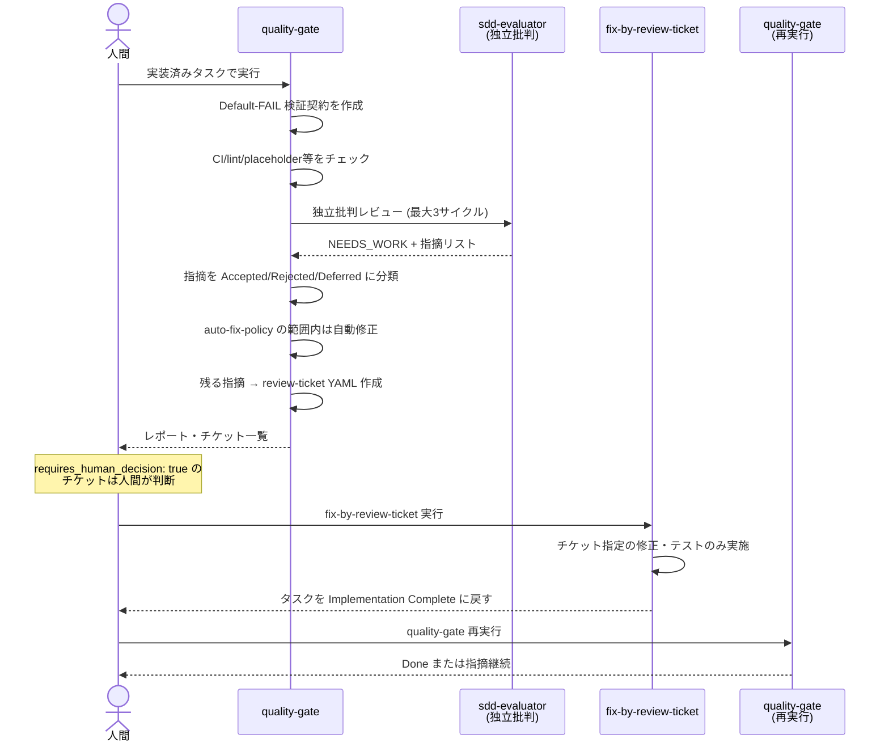

# SDD ワークフロー詳細（コントリビューター向け）

例外フロー・詳細ガイドラインです。ユーザー向けガイドは [../workflow-guide.md](../workflow-guide.md) を参照してください。

## 4. 異常系・例外フロー

### 4.1 実装中に仕様変更が発生した

**状況**: 企画や顧客から要件変更が来た。進行中のタスクを止めるべきか？

**何が起きるか**
- `implement-task` は進行中でも新情報に対応できません。
- `tasks.md` と仕様が不一致になるリスクがあります。

**対応手順**

1. **進行中のタスクを Blocked にする** (人間)
   ```markdown
   ## T-001 API実装
   Status: Blocked
   ### Blockers
   - 仕様変更: キャンセル手数料計算ルール (Issue #45) が仕様要件に反映されていない
   ```

2. **仕様変更を sdd-bootstrap-interviewer に入力** (AI)
   - 新要件を GitHub Issue URL または テキストとして渡す
   - Interviewer が `requirements.md` / `design.md` / `traceability.md` を更新
   - 影響範囲の分析と新タスク分割

3. **影響タスクの再承認** (人間)
   - 仕様変更に伴う新タスクや変更タスク
   - `Approval: Draft` に戻して人間が再確認し `Approved` に変更

4. **実装再開** (AI)
   - Blocked タスクの Blockers をクリアして `Status: In Progress` に戻す
   - `implement-task` を再実行

**関連スキル**
- `sdd-bootstrap-interviewer` (仕様更新)
- 該当ドキュメント: `workflow-retrospective` が「仕様変更頻発」を friction として検出可能

### 4.2 タスクが Blocked になった

**状況**: implement-task が タスクを Blocked にして停止した。

**原因別対応表**

| 原因 | 対応手順 | 関連スキル |
|---|---|---|
| **要件・設計が曖昧** | 1. `sdd-bootstrap-interviewer` で ambiguous セクションを確認<br/>2. Open Questions を明確化<br/>3. requirements/design 更新<br/>4. `Approval: Approved` で再承認<br/>5. `implement-task` 再実行 | `sdd-bootstrap-interviewer` |
| **認証・認可・breaking API・アーキテクチャ判断が必要** | 1. 判断内容をドキュメント化<br/>2. `docs/adr/NNNN-<slug>.md` に Decision として記録<br/>3. 設計ドキュメント更新<br/>4. `Approval: Approved` で再承認<br/>5. `implement-task` 再実行 | ADR 作成 (人間) |
| **無関係な未コミット変更と干渉** | 1. 無関係変更を `git stash` または別ブランチへ退避<br/>2. または該当変更をコミット<br/>3. `implement-task` 再実行 | `git` (人間) |
| **必須テストが実行不可** | 1. テスト環境を整備 (DB, API mock など)<br/>2. テスト実行確認<br/>3. `implement-task` 再実行 | 環境整備 (人間) |
| **承認スコープ超過** (タスク仕様より大きな実装が必要) | 1. タスクを分割<br/>2. `sdd-bootstrap-interviewer` で新タスク生成<br/>3. 新タスクを `Approved` に変更<br/>4. 各タスク単位で `implement-task` | `sdd-bootstrap-interviewer` |

**確認すべきこと**: `tasks.md` の Blockers 欄は必ず記述されているか？(check-task-state が強制)

### 4.3 品質ゲートで指摘が出た (差し戻しループ)

**状況**: `Implementation Complete` タスクに `quality-gate` を実行。Critical/Major 指摘が出た。

**何が起きるか**



**対応手順**

1. **指摘の分類を確認** (AI: quality-gate)
   - `severity: critical` (誤動作・契約違反・セキュリティ欠陥)
   - `severity: major` (未テスト受入条件・未処理エラーパス・仕様逸脱)
   - `severity: minor` (スタイル・命名など)

2. **auto-fix 範囲内の指摘は自動修正** (AI: quality-gate)
   - `auto_fix_allowed: true` で `status: resolved`

3. **修正不可な指摘を review-ticket YAML に記録** (AI: quality-gate)
   ```yaml
   ticket_id: RT-0042
   status: open
   type: logic-fix
   severity: major
   target:
     feature: reservation
     task: T-002
     files:
       - src/controllers/CancellationController.ts
   summary: キャンセル手数料計算で小数点丸めが実装されていない
   problem: 手数料計算後 Math.round() されていないため、0.5円未満の金額が混在する可能性がある。
   expected_fix: Math.round(fee * 100) / 100 をフローに追加。対応テストを追加。
   references:
     - specs/reservation/design.md#fee-calculation
     - specs/reservation/acceptance-tests.md#fee-rounding
   auto_fix_allowed: false
   requires_human_decision: false
   review_cycles: 1
   ```

4. **requires_human_decision チケットの判断** (人間)
   - `true` の場合: 人間が意思決定後、`status: open` のままにするか `status: rejected` にするか決定
   - `false` の場合: AI が自動修正可能

5. **修正実施** (AI: fix-by-review-ticket)
   - チケット指定の修正のみ実施
   - チケット外の改善は行わない
   - テスト追加・更新

6. **再検証** (AI: quality-gate 再実行)
   - Critical/Major が全て解消されるまで繰り返す
   - 1回の quality-gate 実行内での独立批判レビューは最大 3 サイクル

7. **Done 判定**
   - Critical/Major 指摘がゼロ
   - `check-contract` が全て passes
   - Traceability が current

**関連スキル**
- `quality-gate`
- `fix-by-review-ticket`

### 4.4 他部署・利害関係者レビューの取り込み

**状況**: QA・セキュリティ・デザイン・法務などから指摘が来た。

**推奨運用** (プラグイン仕様ではなく、実装ガイダンス)

**(a) 仕様レベルの指摘** (要件そのものの変更)
1. GitHub/GitLab Issue で指摘を受け取る
2. 4.1「仕様変更」フローに同じ対応
3. `sdd-bootstrap-interviewer` で仕様を更新
4. 影響タスクを再承認

**(b) 実装レベルの指摘** (仕様は正しいが実装がそれに従っていない)
1. 指摘者が `docs/review-tickets/RT-NNNN.yml` として YAML チケットを起票
   - または quality-gate で自動生成された既存チケット
2. チケットの必須フィールド (後述)
3. `fix-by-review-ticket` で修正

### Review-Ticket YAML の必須フィールドと severity 付け方

```yaml
# docs/review-tickets/RT-0001.yml
ticket_id: RT-0001
status: open | resolved | rejected
type: <指摘の種別 (例: test-gap)>
severity: critical | major | minor
target:
  feature: <feature-name>
  task: <task-id>
  files:
    - <file-path>
    - <file-path>
summary: <1行の要約>
problem: |
  詳細な問題記述
  複数行可
expected_fix: |
  期待される修正の詳細
  複数行可
references:
  - specs/feature/requirements.md#section
  - https://github.com/...
auto_fix_allowed: true | false
requires_human_decision: true | false
review_cycles: <実施済みサイクル数>
```

**Severity の付け方**

| Severity | 判断基準 | 例 |
|---|---|---|
| `critical` | • 誤動作・完全機能不提供<br/>• コントラクト (OpenAPI/JSON Schema) 違反<br/>• セキュリティ欠陥 (認可バイパス等)<br/>• 検証の偽造 (hardcoded return など) | API が仕様と異なるパラメーターを要求、SQL インジェクション脆弱性、テストが常に pass で実装ない |
| `major` | • 受入条件にテストがない<br/>• エラーパス未処理<br/>• 仕様との乖離 (許可範囲外)<br/>• スコープクリープ | キャンセル手数料計算ロジックにテストなし、ネットワークエラー時の例外処理なし、仕様に「確認ダイアログ」とあるが実装なし |
| `minor` | • スタイル・命名<br/>• 非ブロッキング cleanup | 関数名が仕様と異なる、import 順序が乱れている |

**注**: チケットは本来、quality-gate スキルが unresolved/非自動修正指摘を自動生成します。ここは「他部署から事後的に指摘が来た場合の手順」です。

### 4.5 利用者・顧客からの不具合報告

**状況**: ユーザーから「予約キャンセルできない」と報告。Issue が作られた。

**対応手順**

1. **Issue URL を read-only で読み込み** (AI)
   - Issue 本文で再現条件・期待動作・影響を理解
   - `sdd-bootstrap-interviewer` の `bugfix` モード入力に整形

2. **仕様化** (AI: sdd-bootstrap-interviewer bugfix)
   - `requirements.md`: Observed Behavior / Expected Behavior / Scope
   - `design.md`: Root Cause Analysis / Corrective Actions
   - `acceptance-tests.md`: Regression Test (この問題が再発しないテスト)
   - `tasks.md`: 最小修正

3. **他のスキルと同じフロー** (3.2 不具合修正 を参照)

**重要**: Issue への書き込み (コメント、close など) は **明示依頼時のみ**。

### 4.6 リファクタリングで意図しない動作差分が出た

**状況**: `baseline-behavior.md` に記録した BL-005 の動作が refactor 後に変わった。

**対応手順**

1. **差分を分類** (AI: quality-gate)
   - 入力パラメータを identical に再現
   - 出力を正規化 (timestamp → `<TIMESTAMP>`, UUID → `<RANDOM>`, host path → `<ENV>`)

2. **3値分類**
   - `fix-required`: 予期しない差分 → レビューチケット + Done ブロック
   - `accepted`: タスク記述で許可された意図的な変更 → 人間が承認 + `baseline-behavior.md` 更新
   - `environmental`: 正規化後に差分なし → 対応不要

3. **Differential Baseline Verification セクション** (品質レポートに記載)
   ```markdown
   ## Differential Baseline Verification

   | BL-ID | Description | Classification | Evidence |
   |---|---|---|---|
   | BL-005 | キャンセル手数料計算での小数点丸め | accepted | refactor で浮動小数点精度向上により値が 0.001 以下で異なる。設計で「許容値以下の丸め誤差」と明記 |
   | BL-012 | キャンセルAPI応答時間 | environmental | timestamp は <TIMESTAMP> に正規化後、出力構造同一 |
   ```

4. **accepted 差分の人間承認** (人間)
   - 変更が設計の範囲内か確認
   - `baseline-behavior.md` を更新して新 BL を記録
   - sudo モードが有効な場合はこの承認は自動通過し、`(sudo <ISO8601>)` マークを記録（`fix-required` は自動通過しない）

### 4.7 セッション中断・コンテキスト喪失からの再開

**状況**: 実装中に接続が切れた、またはコンテキスト limit に達した。

**何が起きるか**
- 専用 `resume` スキルはありません。
- `tasks.md` と `reports/implementation/<task-id>.md` が正本です。
- メモリや会話履歴には依存しません。

**対応手順**

1. **現在位置を復元** (AI: implement-task)
   - `git status` → 無関係変更は保護
   - `git diff` → タスク相関変更を確認
   - `tasks.md` → Status と Blockers を読む

2. **implement-task または implement-tasks を再実行** (AI)
   ```txt
   # 1タスクずつ手動実行
   Use the implement-task skill for specs/reservation/tasks.md

   # バッチ再開（残りの承認済みタスクを依存関係順に自動再開）
   Use the implement-tasks skill for specs/reservation/tasks.md
   ```
   - Skill が `In Progress` タスクを優先選択
   - 既存変更を保護
   - 実装を継続（`implement-tasks` は全タスク完了後に quality-gate を自動起動）

3. **Session Handoff セクション** (実装レポート)
   - 前セッションで記録した現在位置
   - 次セッションで読み返して復帰

**重要**: ファイルベース (git + markdown) 設計により、環境が変わっても再開可能。

### 4.8 エージェントの暴走を止めたい (緊急停止)

**状況**: エージェントが想定外の操作をしている。

**対応手順**

1. **AGENT_STOP ファイルを作成** (人間)

   **Bash / Git Bash**
   ```bash
   touch AGENT_STOP
   ```

   **PowerShell**
   ```powershell
   New-Item AGENT_STOP
   ```

2. **エージェントのすべてのツール操作がブロック**
   - Hook guard (`sdd-hook-guard`) が全ツール呼び出しを拒否
   - エージェントは即座に停止

3. **再開** (問題が解決したら)
   ```bash
   rm AGENT_STOP    # Bash
   ```
   ```powershell
   Remove-Item AGENT_STOP    # PowerShell
   ```

**制約**: Hook が有効でない環境では AGENT_STOP ファイルはシグナルとして機能しません。
- Codex で `plugin_hooks` フラグ未設定
- Copilot サブエージェント内

その場合は手動でセッションを終了してください。

### 4.9 sudoモード運用

**目的**: ソロワーク・低リスク作業で、人間の **承認待ち** (タスク承認、`accepted` 差分承認、quality-gate の定型サインオフ) を期限付きで自動通過させ、効率を向上させます。判断・統治・緊急制御は sudo でも人間に残ります（後述）。

**▶ 入り方（最短3ステップ）**

1. CLI で `/sdd-sudo` と入力（既定 8h。`/sdd-sudo 4h` などで時間指定）— これだけで有効化。
2. そのまま作業。承認待ちが自動通過し、各所に `(sudo <時刻>)` の監査マークが残る。
3. 終わったら `/sdd-sudo off`（`/sdd-sudo status` で残り時間確認）。期限が来れば自動失効。

> sudo は **人間専用**。エージェントは `SDD_SUDO` を作成・延長・再有効化できません。

**いつ使う**

- 自分だけで実施する低リスク変更 (ドキュメント、コメント、小規模リファクタ)
- 確実性の高いバグ修正で、round-trip review delay を避けたい
- SDD ワークフロー自体のテスト
- チームで「このタスクは approval 不要」と事前合意した場合

**いつ避ける**

- 共有リポジトリ・本番環境の変更
- 大規模アーキテクチャ変更
- セキュリティ・認証・認可 関連の変更
- 決定論的ゲート（contract 検証、placeholder 検出）の自信がない場合

**有効化**

```txt
/sdd-sudo 8h              # デフォルト 8 時間
/sdd-sudo 4h              # 4 時間
/sdd-sudo 24h             # 最大 24 時間
```

**動作**

1. `SDD_SUDO` ファイルをプロジェクトルートに作成（`expires-epoch` (unix-seconds) で期限を記録）
2. **自動通過する＝承認ゲートのみ**:
   - tasks.md の `Approval: Draft → Approved`（タスク承認）
   - `refactor`/`bugfix` の baseline 差分 `accepted` 承認（`baseline-behavior.md` を更新）
   - quality-gate の定型サインオフ（contract 承認・定型 Done）
   - 各通過時に `Approval: Approved (sudo 2026-06-12T15:30:45Z)` と記録（audit mark）
3. **sudo でも通さない＝判断・統治・制御**:
   - `requires_human_decision: true` チケット（業務判断）
   - architecture / auth / authz / breaking-API / security 決定（ADR 級の判断）
   - WFI `status: Approved`（ワークフロー統治の変更）
   - **AGENT_STOP**（緊急制御・常時有効）
   - 決定論的スクリプト (`check-contract`, `check-placeholders`, `check-task-state`, `check-sdd-structure`) は常に実行・検査
4. **要約**: sudo 中に人間へ残るのは「真の判断フォーク（エージェントは Blocked / Open Question で停止）」と「緊急停止」のみ。

**状態確認**

```txt
/sdd-sudo status         # 有効期限と残り時間を表示
```

**無効化**

```txt
/sdd-sudo off            # 即座に無効化
```

または、`SDD_SUDO` ファイルを手動削除。

**期限自動失効**

- Unix timestamp で常に `now > expires-epoch` をチェック
- 失効後は自動で「無効」の扱い (ファイル削除なし)
- 再度有効化するには `/sdd-sudo` を明示的に再実行

**audit trail**

- タスク tasks.md に `(sudo <ISO8601>)` 記号で deferral を記録
- 品質ゲート報告書に sudo 期間を明記
- 全証拠ファイル (contract, report) は通常通り保管

**hard policy**

- エージェント自身が `SDD_SUDO` を作成・延長しない (人間の明示実行のみ)
- 期限切れ後の自動再有効化はしない
- 不明な場合は人間に質問

詳細は `/sdd-sudo` スキル と `plugins/sdd-quality-loop/references/sudo-mode-policy.md` を参照。

### 4.10 トレーサビリティのドリフト検出

**状況**: integrity-policy で以下が検出された。

| ドリフト | 例 | 検出方法 | 対応 |
|---|---|---|---|
| **要件にコード・テストがない** | `requirements.md` のある要件に対応する実装・テストがない | `traceability.md` マッピング確認 | テスト追加、または要件の見直し |
| **承認タスクのない実装** | `tasks.md` に T-004 がないまま T-004.ts が実装されている | `check-task-state` / `integrity-policy` | タスク追加補正 |
| **OpenAPI と実装の不一致** | OpenAPI で `parameters: [id]` だが、実装で `POST body` で受け取っている | contract validation | API 修正 or contract 更新 |
| **ADR のないアーキテクチャ変更** | 認証を OAuth から SAML へ変更したが ADR がない | design.md の Decision 確認 | ADR 補記 |

**対応**

- **軽微なギャップ** (マッピングの記載漏れなど): quality-gate が直接修正
- **曖昧・重大なギャップ**: レビューチケット → 人間判定

---

## 5. プロセス自体の改善 (workflow-retrospective)

### 計測指標

`workflow-retrospective` が `reports/implementation/`、`reports/quality-gate/`、`docs/review-tickets/` を read-only で集計:

| 指標 | 計算方法 | 意味 |
|---|---|---|
| **QG Cycles** | タスクごとの quality-gate レポート数 | 品質ゲートの実行回数 (多いほどリワーク大) |
| **Blocked Count** | レポート上の `Blocked` 判定の回数 | 仕様・環境不備の頻度 |
| **Tickets** | severity 別 (critical / major / minor) のレビューチケット数 | 品質問題の分布 |
| **Auto-fixed** | `auto_fix_allowed: true` かつ `status: resolved` のチケット数 | 自動修正の割合 (type 別に 50% 未満で friction 候補) |
| **Outcome** | 最終タスク状態 (`Done` または未完了) | タスクの完了状況 |

### Friction 検出条件

以下のパターンが複数タスクにわたって繰り返される場合、friction として記録:

1. **同種チケットの反復**
   - 例: 「キャンセル手数料計算」関連指摘が T-001, T-002, T-003 で各 1 件以上

2. **同一フェーズの複数 Blocked**
   - 例: 「仕様曖昧」を理由に Blocked が 2 回以上

3. **auto-fix 率 50% 未満**
   - 手動修正が多発している → 自動化機会を検討

### WFI (Workflow Improvement) ライフサイクル

1. **Draft**: workflow-retrospective が `templates/workflow-improvement.template.md` から生成
   ```markdown
   # Workflow Improvement

   ## WFI-ID
   WFI-001

   ## Status
   Status: Draft

   ## Problem Evidence
   RT-0042, RT-0043 (同種の test-gap チケットが T-001 / T-002 で反復)

   ## Root Cause Hypothesis
   仕様段階で「手数料計算」の計算タイミングが曖昧

   ## Proposed Change
   | Target File | Change Description |
   |---|---|
   | AGENTS.md | 金額計算を含む要件には「計算タイミング」の明記を必須とするガイドラインを追加 |
   ```
   Status は `Status: <値>` 形式で記録します（許容値: `Draft | Approved | Applied | Verified | Rejected`）。`Approved` に設定できるのは人間のみで、AI は `Draft` / `Applied` / `Verified` を設定します。フックガードが `docs/workflow-improvements/WFI-*.md` への `Status: Approved` のエージェント書き込みを拒否します（sudo でも解除されません）。

2. **人間が Approved に変更**
   - 改善内容に同意 → 適用

3. **適用**: プロジェクト側ファイルのみ修正
   - `AGENTS.md` / `CLAUDE.md` 更新
   - `specs/` template 更新
   - task-splitting guideline 更新
   - **プラグイン本体は変更しない**

4. **効果検証**: 次フィーチャーの retrospective で結果セクションを追加
   ```markdown
   ## Result (WFI-001 適用後)
   - Blocked count: 3 → 0 (改善)
   - 仕様段階での friction: 検出なし
   ```

**改善例**

仕様変更が頻発している場合:
- タスク粒度を細分化 (1 タスク = 1 API endpoint など)
- Question bank (よくある質問リスト) を `CLAUDE.md` に追加
- Interviewer への明確な role/constraint を AGENTS.md に記述

### 週次セルフ改善ルーチンとの境界と優先順位

sdd-forge リポジトリ自体には、WFI ループとは別に週次セルフ改善ルーチン
(`.github/workflows/self-improvement.yml` + `.github/self-improvement-prompt.md`) が存在します。
2つの改善ループが互いの成果を潰さないよう、以下のプロトコルで分離・調停します。

**スコープ分離 (原則)**

| ループ | 対象 | 変更してよいもの |
|---|---|---|
| workflow-retrospective (WFI) | SDD **プロセス**の摩擦 | プロジェクト側ワークフローファイルのみ (`AGENTS.md` / `CLAUDE.md` / `specs/` テンプレート等。`plugins/` 内は禁止) |
| 週次セルフ改善 | リポジトリという**プロダクト** | コード・テスト・docs・インストーラ等 (下記の不可侵領域を除く) |

競合は、このリポジトリ自身を SDD でドッグフーディングした場合 (両ループが同じリポジトリに作用する場合) にのみ発生します。

**調停ルール**

1. **不可侵領域**: 週次セルフ改善は `docs/workflow-improvements/` と `reports/` を読み取り専用として扱う。
   また、コミットメッセージや PR に `WFI-` 参照を持つ変更を巻き戻さない。WFI 由来の変更に疑義がある場合は、
   変更せず週次 Issue に「要人間判断」として記載する。
2. **着手前の台帳照合**: 週次セルフ改善は作業選定前に `docs/workflow-improvements/WFI-*.md` と
   open Issue/PR を確認し、WFI で追跡中のテーマを選ばない。逆に workflow-retrospective も WFI 起票前に
   `self-improvement` ラベルの open Issue を確認し、重複する場合は WFI 本文で Issue 番号を参照する。
3. **provenance の義務**: 承認済み WFI を適用するコミット / PR には必ず WFI ID (`WFI-NNN`) を含める。
   これがルール 1 の巻き戻し禁止を機械的に判定する手がかりになる。
4. **単一飛行**: open な `auto/improve-*` PR が存在する間、週次セルフ改善は新しい PR を作らない
   (既存 Issue への追記のみ)。
5. **優先順位**: 衝突した場合は「人間の直接指示 > 承認済み WFI > 週次セルフ改善」の順に優先する。
   下位のループは上位の決定を覆す変更を提案できるが、適用には上位 (最終的には人間) の承認が必要。

---

## 6. 成果物ディレクトリマップ

```
project-root/
├── AGENTS.md                          # ロール定義 (sdd-adopt が作成)
├── CLAUDE.md                          # Claude interaction guideline
├── docs/
│   ├── adr/                           # Architecture Decision Records
│   │   ├── 0001-oauth-selection.md    # (sdd-bootstrap-interviewer または 人間 が作成)
│   │   └── 0002-...md
│   ├── review-tickets/                # 品質指摘 YAML (quality-gate または 人間 が作成)
│   │   ├── RT-0001.yml
│   │   ├── RT-0002.yml
│   │   └── ...
│   └── workflow-improvements/         # プロセス改善提案 (workflow-retrospective が作成)
│       ├── WFI-001.md
│       └── ...
├── reports/
│   ├── implementation/                # タスク実装レポート (implement-task が作成)
│   │   ├── T-001.md
│   │   ├── T-002.md
│   │   └── ...
│   ├── quality-gate/                  # 品質ゲートレポート (quality-gate が作成)
│   │   ├── 2024-06-12T10:30:00Z.md
│   │   └── ...
│   └── retrospective/                 # ワークフロー回顧 (workflow-retrospective が作成)
│       ├── 2024-06-19T14:00:00Z.md
│       └── ...
└── specs/
    └── reservation/                   # Feature name (sdd-bootstrap-interviewer が作成)
        ├── requirements.md            # 要件定義
        ├── design.md                  # 設計決定
        ├── acceptance-tests.md        # 受入条件・テスト
        ├── tasks.md                   # タスク分割 (2軸状態管理)
        ├── traceability.md            # 整合性マッピング
        ├── investigation.md           # 調査結果 (investigate-codebase が作成)
        ├── baseline-behavior.md       # 基線動作 (investigate-codebase が作成、refactor/bugfix)
        ├── verification/              # 検証契約 (quality-gate が作成)
        │   ├── T-001.contract.json
        │   ├── T-002.contract.json
        │   └── ...
        └── adr/                       # ⚠️ 旧配置 (sdd-adopt が docs/adr/ へ移行)
```

**各ディレクトリと作成スキル**

| パス | 説明 | 作成者 |
|---|---|---|
| `specs/<feature>/requirements.md` | 要件 | `sdd-bootstrap-interviewer` |
| `specs/<feature>/design.md` | 設計・決定 | `sdd-bootstrap-interviewer` |
| `specs/<feature>/acceptance-tests.md` | 受入条件 | `sdd-bootstrap-interviewer` |
| `specs/<feature>/tasks.md` | タスク一覧 (状態管理) | `sdd-bootstrap-interviewer` |
| `specs/<feature>/traceability.md` | 要件↔コード↔テスト整合性 | `sdd-bootstrap-interviewer` |
| `specs/<feature>/investigation.md` | 既存コード調査 | `investigate-codebase` |
| `specs/<feature>/baseline-behavior.md` | 動作基線 (refactor/bugfix) | `investigate-codebase` |
| `specs/<feature>/verification/<task-id>.contract.json` | 検証契約 (Default-FAIL) | `quality-gate` |
| `specs/<feature>/verification/<task-id>.evidence.json` | report・contract・passing evidence の SHA-256 証跡bundle | `quality-gate` |
| `docs/adr/NNNN-<slug>.md` | アーキテクチャ決定 | `sdd-bootstrap-interviewer` または 人間 |
| `docs/review-tickets/RT-NNNN.yml` | 品質指摘 | `quality-gate` |
| `docs/workflow-improvements/WFI-NNN.md` | ワークフロー改善案 | `workflow-retrospective` |
| `reports/implementation/<task-id>.md` | 実装進捗・自己レビュー | `implement-task` |
| `reports/quality-gate/<timestamp>.md` | 品質検証・独立レビュー | `quality-gate` |
| `reports/retrospective/<timestamp>.md` | フロー計測・friction 分析 | `workflow-retrospective` |

---

## 7. リスク適応ゲート (risk-adaptive)

各タスクは `Risk:` 階層 (`low | medium | high | critical`) を持ち、その階層が
「どの決定論的ゲートを必須とするか」を駆動します。正準対応表は
[`risk-gate-matrix.md`](../plugins/sdd-quality-loop/references/risk-gate-matrix.md)。
階層が上がるほど必須セットは厳しくなり、下位階層の必須セットを包含します
(非ダウングレード superset 則)。

### 階層 → 必須ゲート (概要)

| 階層 | 追加で必須になるもの |
|------|----------------------|
| `low` | baseline (lint / typecheck / build / placeholder-scan / task-state)。`unit-tests` は理由付きで waive 可 |
| `medium` | `unit-tests` + `acceptance-tests` + `regression` |
| `high` | `requirement-traceability`、`tdd` の Red→Green 証跡、provenance (`spec_revision` / `build_env` / `review_verdict == PASS`)。`cross-model-verify` は opt-in で利用可 |
| `critical` | クリーンツリー上の HMAC `signature` (dirty はハードフェイル)、二者承認 (`Second Approval`、sudo でバイパス不可)、**`cross-model-verify`（必須、waiver 可）** |

> **cross-model-verify の 2 層構造**
> - **収集層**（非決定論的・opt-in・**ローカル専用**）: `prepare-panelist-input` が consent を確認しサニタイズ後、`sdd-panelist-gpt`（OpenAI / codex CLI 経由）と `sdd-panelist-gemini`（Google / gemini CLI 経由）を盲目・並列に起動。各パネリストは read-only で、verdict JSON のみを出力する。**CI では収集層は一切実行されない**（コスト管理・外部送信防止のため）。
> - **ゲート層**（決定論的・CI テスト可）: `check-cross-model` がローカル保存の verdict JSON を読み取り、コンセンサスポリシーを適用してアグリゲート JSON を生成。CI ではフィクスチャを使ってネットワーク不要で検証する。
>
> `critical` かつ `cross_model: required` のタスクで収集層未実行（または waiver なし）の場合、ゲートは fail-closed でブロックする。`high` の opt-in は contract の check id 存在で判定。

### 配線 (どのフェーズで誰が見るか)

- **`sdd-bootstrap-interviewer`** — タスク生成時に `Risk:` / `Risk Rationale:` を提案し、
  階層から `Required Workflow:` を導出 (`low→test-after` / `medium→acceptance-first` /
  `high`・`critical→tdd`)。最終的な階層は人間が承認時に確定。
- **`implement-task`** — `tdd` タスクでは Red→Green を逐次キャプチャ (失敗→成功の出力を保存)。
- **`quality-gate`** — `check-risk` → `check-placeholders` → `check-task-state` →
  `check-contract` (tier superset + tdd red/green) → `check-traceability` の順で実行し、
  `Done` 前に `check-evidence-bundle` で provenance / signature を検証。

### レガシー互換

`Risk:` フィールドが **無い** タスク/contract は **レガシーモード**で動作し、
階層強制を一切行いません (baseline-protection のみ)。absent は `medium` に
マップ**しません** — 階層強制は opt-in で、`risk` が存在するときだけ有効になるため、
既存の (本機能以前の) contract はそのまま通過します。

`check-risk` は `high`/`critical` タスクが `Required Workflow: tdd` を宣言していない場合に
fail-closed で拒否します。署名鍵・sudo トークンは外部 (`SDD_EVIDENCE_KEY` /
`~/.sdd/`) のみに置かれ、エージェントからは読めません。

### stack 記述子 (非コードリポジトリ)

contract の任意フィールド `stack` (`code` | `shell` | `docs` | `spec`) で、compile 系
チェックの適用可否を切り替えます。非コードスタック (`shell` / `docs` / `spec`) では
`lint` / `typecheck` / `build` を理由付き (`waiver_reason` 非空) で waive 可能 —
コンパイルツールチェーンを持たない shell / Markdown / JSON リポジトリ向けです。
テスト / トレーサビリティ / placeholder / task-state 系チェックは**全スタックで必須**の
ままなので、コードタスクが `stack` を使ってテストを免れることはできません。
absent / `""` / `code` は従来挙動 (compile 系も必須) で、完全な後方互換です。

---

## Branch protection & merge queue

GitHub 上の `main` ブランチは以下の保護ルールでガード されています。本ルールセットは`.github/rulesets/main.json`で定義され、GitHub API 経由で適用されます。

### 保護ルール

| ルール | 要件 |
|---|---|
| **Pull request required** | マージ前に PR が必須。1 人以上の承認が必要。古いレビューは新しいプッシュで自動却下 |
| **Status checks required** | 以下のすべてのステータスチェックが PASS である必要があります:<br/>• `test (windows-latest)`<br/>• `test (macos-latest)`<br/>• `test (ubuntu-latest)`<br/>• `required-checks` (summary job)<br/>ブランチは常にメインブランチと最新の状態である必要があります |
| **Branches up to date** | マージ前にベースブランチとの衝突がないこと |
| **Force push blocked** | `git push --force-with-lease` を含む強制プッシュは禁止 |
| **Deletion blocked** | ブランチ削除は禁止 |

### Merge queue (CI + merge 順序制御)

本リポジトリでは GitHub の merge queue 機能を使用しています。

- **トリガー**: `.github/workflows/test.yml` に `merge_group:` トリガーを追加し、merge queue に入ったすべての PR に対して完全なテスト実行(3 OS × full matrix) が自動実行されます
- **効果**: 複数の PR が同時にマージ待ちになったとき、順序保証 + 各 PR が独立したテスト環境で検証されるため、「前の PR がレッドで次の PR もレッドになる」というフレークを回避できます

### 設定の適用

ローカル環境で `.github/rulesets/main.json` を更新した後、以下で GitHub に反映:

```bash
# gh CLI で自動適用 (管理者権限が必要、Team/Enterprise プランが必須)
./scripts/apply-branch-protection.sh

# Free/Pro plan の場合は手動で GitHub UI から設定
# Settings → Rules → Branch rules で上記ルール表を参考に設定
```

> **注意**: GitHub free tier ではリセット機能が使えません。Team/Enterprise への契約が必要です。

### Self-improvement workflow との連携

`.github/workflows/self-improvement.yml` で自動生成される PR は、上記保護ルールを **経由** します。つまり:

- Auto-merge による自動マージはできません (status check が必須)
- 人間が明示的に「マージ」をタップしてから、CI が実行されます
- CI が PASS したら merge queue に入り、順序を守ってマージされます

### Release の安全性 (レッドでは出荷しない)

`.github/workflows/release.yml` は `release: published` と `workflow_dispatch` で
のみ起動し、リリース成果物は `main` のタグから切り出されます。`main` は上記の
必須ステータスチェックにより常にグリーン (全 CI 通過済み) が保証されるため、
タグ付けされたリリースコミットは既にフルテストを通過しています。

> リリースの CI ゲートは **ブランチ保護の必須チェック (マージ時)** で担保します。
> release.yml に `workflow_run` 自動トリガーは **付けません** — それを付けると
> `main` への push でテストが通るたびにリリースジョブが起動し、タグではない
> `refs/tags/main` を archive しようとして毎回失敗 (レッド) するためです。
> 緊急時は `workflow_dispatch` で手動リリースできます。

---
