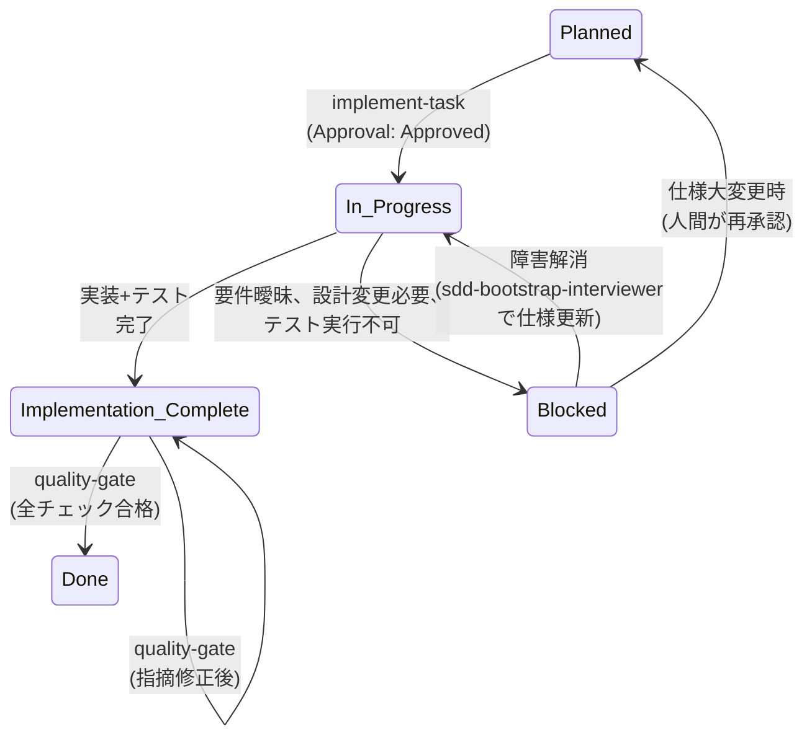
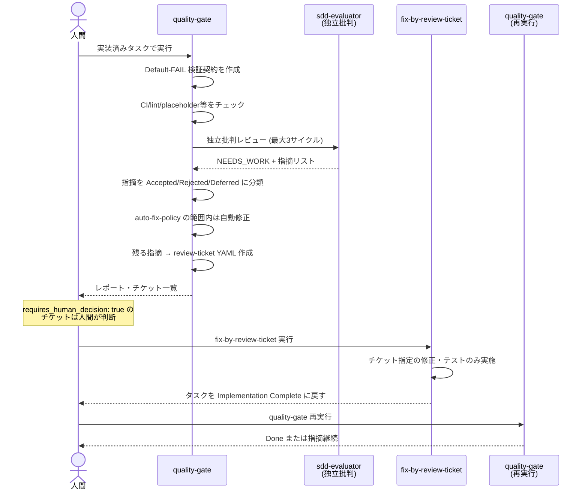

# SDD 開発業務フローガイド

実際のソフトウェア開発業務 (仕様変更、レビュー差し戻し、他部署レビュー、障害報告) の中で SDD プラグインをどう運用するかを説明するガイドです。各スキルの個別仕様は [skill-reference.md](skill-reference.md) を参照してください。

---

## 1. ロールと責務

| ロール | 主な責務 | このワークフローでの具体的操作 |
|---|---|---|
| **プロダクトオーナー/企画** | 要件定義、優先度付け、受け入れ判定 | Issue発行 → requirements確認 → Approval: Approved への変更 → 品質ゲート結果の最終判定 |
| **開発者** | 仕様理解、実装、テスト、自己レビュー | investigate-codebase (任意) → implement-task → 実装レポート作成 |
| **レビュアー/QA・他部署** | 独立検証、リスク指摘、仕様逸脱検出 | requirements/design確認 → quality-gate での批判レビュー → review-ticket で指摘 |
| **AIエージェント** | 調査、仕様生成、実装、品質検証 | investigate-codebase / sdd-bootstrap-interviewer / implement-task / quality-gate / fix-by-review-ticket を実行 |

### 人間にしかできない操作

以下の操作は **人間のみが実行可能** です。エージェント・スキルは自動承認できません。

1. **タスク承認**: `tasks.md` の `Approval` フィールドを `Draft` → `Approved` に変更する。フック (承認ガード) がエージェントの自己承認を物理的にブロックします。
2. **品質ゲート差分の承認**: `baseline-behavior.md` の差分が `accepted` に分類される場合、人間がその変更を明示的に承認する必要があります。
3. **WFI (Workflow Improvement) の承認**: `docs/workflow-improvements/WFI-NNN.md` の `status` を `Draft` → `Approved` に変更する。
4. **人間判断が必要な指摘対応**: `requires_human_decision: true` のレビューチケットは自動修正されません。
5. **AGENT_STOP ファイルの管理**: エージェント暴走時の緊急停止・再開。
6. **重要なアーキテクチャ決定**: ADR (Architecture Decision Record) が必要な判断。

---

## 2. タスクの状態モデル

### 2軸モデル

タスク状態は **Approval 軸** (Draft / Approved) と **Status 軸** (5つの状態) の2軸で管理されます。

**Approval**: 人間のみが遷移可能
- `Draft` → `Approved`: 人間が明示的に変更
- `Approved` → `Draft`: 仕様更新時に人間が戻す

**Status**: スキルが遷移、人間が要件により設定
- `Planned` → `In Progress` → `Implementation Complete` → `Done` (正常系)
- `In Progress` → `Blocked` → `In Progress` (復帰可能)
- 品質ゲートで差し戻された場合は `Implementation Complete` のまま保持、または `Blocked` (Done にはならない)

### Status 遷移図



### 状態別の必須証跡 (check-task-state が強制)

| Status | Approval 要件 | 必須証跡 |
|---|---|---|
| `In Progress` | **Approved** | — |
| `Implementation Complete` | **Approved** | • `reports/implementation/<task-id>.md` が task id を言及 |
| `Done` | **Approved** | • Quality-gate レポートが task id を言及<br/>• `specs/<feature>/verification/<task-id>.contract.json` が存在 |
| `Blocked` | Draft / Approved 両方可 | • 非空の `### Blockers` セクション (実装値記述必須) |

---

## 3. 正常系フロー

### 3.1 新機能開発 (feature)

| ステップ | 実行者 | 成果物 | 確認すべきこと |
|---|---|---|---|
| 1. Issue受領 | 人間 | GitHub/GitLab Issue | 要件が明確か？スコープは？依存関係は？ |
| 2. 調査 (任意) | AI (investigate-codebase) | `specs/<feature>/investigation.md`<br/>`specs/<feature>/baseline-behavior.md` | 既存コード/API契約/テストの知見が証跡付きか？ |
| 3. 仕様化 | AI (sdd-bootstrap-interviewer) | `specs/<feature>/requirements.md`<br/>`specs/<feature>/design.md`<br/>`specs/<feature>/acceptance-tests.md`<br/>`specs/<feature>/tasks.md`<br/>`specs/<feature>/traceability.md`<br/>契約 JSON / ADR | 要件が実装可能か？設計に異議はないか？タスク粒度は適正か？ |
| 4. 承認 | 人間 | `tasks.md` の `Approval: Approved` | タスク1の承認が済んだか？ |
| 5. 実装 (タスク単位) | AI (implement-task) | 実装コード<br/>テストコード<br/>`reports/implementation/<task-id>.md` | 設計通りか？テストは十分か？無関係変更は混在していないか？ |
| 6. 品質検証 | AI (quality-gate) + 人間 | `specs/<feature>/verification/<task-id>.contract.json`<br/>`reports/quality-gate/<timestamp>.md`<br/>`docs/review-tickets/RT-*.yml` | 全チェック合格？Critical/Major 指摘は resolved？ |
| 7. 指摘修正 (必要時) | AI (fix-by-review-ticket) | 修正コード・テスト | チケット指定範囲を超えていないか？ |
| 8. 再検証 (指摘有時) | AI (quality-gate 再実行) | 更新契約・レポート | Critical/Major が解消されたか？ |
| 9. 繰り返し | — | — | 全タスク Done まで 5〜8 を繰り返し |
| 10. 回顧 | AI (workflow-retrospective) | `reports/retrospective/<timestamp>.md`<br/>`docs/workflow-improvements/WFI-*.md` | 同種指摘の反復はないか？Blocked が頻発していないか？ |
| 11. 改善検討 | 人間 | WFI 承認 | 検出された friction を認めるか？ |

**例: 予約キャンセル機能の実装**

- Issue #42: 「設備予約のキャンセル機能」
- Investigation で既存 API 設計、権限判定ロジック、キャンセル手数料計算ルールを抽出
- Interviewer が 3 タスク生成:
  - T-001: キャンセル API エンドポイント実装 (backend)
  - T-002: キャンセル手数料計算テスト (unit)
  - T-003: キャンセル UI フォーム実装 (frontend)
- 人間が T-001 を Approved
- implement-task が T-001 実装
- quality-gate で T-001 検証 → Done
- 同様に T-002, T-003 処理
- 完了後 workflow-retrospective で「キャンセル手数料計算の仕様が曖昧で 2 回 Blocked」を friction として検出
- WFI-001: 仕様テンプレートに「手数料計算ロジック」セクション追加を提案

### 3.2 不具合修正 (bugfix)

| ステップ | 実行者 | 成果物 | 確認すべきこと |
|---|---|---|---|
| 1. Issue受領 | 人間 | GitHub Issue (再現条件) | 再現手順が明確か？影響範囲は？ |
| 2. 仕様化 | AI (sdd-bootstrap-interviewer) | `specs/<feature>/requirements.md` (観測/期待)<br/>`specs/<feature>/design.md` (修正方針)<br/>`specs/<feature>/acceptance-tests.md` (回帰テスト)<br/>`specs/<feature>/tasks.md` (最小修正) | 修正範囲は最小限か？回帰テストは十分か？ |
| 3. 承認 | 人間 | `Approval: Approved` | 修正方針に同意するか？ |
| 4. 実装 | AI (implement-task) | 修正コード<br/>回帰テスト<br/>実装レポート | 規定の修正方針を逸脱していないか？ |
| 5. 品質検証 | AI (quality-gate) + 人間 | 検証契約<br/>品質レポート<br/>指摘 YAML | 副作用はないか？ |
| 6. 完了 | — | — | Done に至る |

### 3.3 リファクタリング (refactor)

リファクタリングは **動作変更なし** が前提です。`baseline-behavior.md` が必須。

| ステップ | 実行者 | 成果物 | 確認すべきこと |
|---|---|---|---|
| 1. Issue受領 | 人間 | GitHub Issue (リファクタ対象) | スコープは何か？動作変更はあるか？ |
| 2. 調査 (必須) | AI (investigate-codebase refactor) | `specs/<feature>/investigation.md`<br/>`specs/<feature>/baseline-behavior.md` | BL-xxx で現在の動作が完全に記録されているか？ |
| 3. 仕様化 | AI (sdd-bootstrap-interviewer refactor) | requirements (変更なし)<br/>design (新構造)<br/>acceptance-tests (BL 同値)<br/>tasks.md<br/>traceability | 受入条件は「BL と同一」と記述されているか？ |
| 4. 承認 | 人間 | — | 設計と受入条件に同意 |
| 5. 実装 | AI (implement-task) | 新構造コード<br/>テスト<br/>実装レポート | 過度な変更はないか？ |
| 6. 差分検証 | AI (quality-gate) | 契約<br/>**Differential Baseline Verification** セクション | 各 BL を `fix-required` / `accepted` / `environmental` に分類<br/>**タイムスタンプ・UUID・ホスト固有パスは正規化** |
| 7. 完了 | — | — | `environmental` のみか、`accepted` は人間承認済みか |

**差分テスト 3 分類の表**

| Classification | 意味 | アクション |
|---|---|---|
| `fix-required` | After-state がタスク記述と矛盾 (意図しない差分) | レビューチケット作成・Done ブロック |
| `accepted` | タスク記述で明示的に許可された意図的な変更 | 人間が Approved → `baseline-behavior.md` を更新 |
| `environmental` | 正規化後に差分なし (タイムスタンプ、UUID など) | 対応不要 |

### 3.4 既存プロジェクトへの途中導入 (brownfield)

既存プロジェクトに SDD を導入する場合のフロー。

| ステップ | 実行者 | 成果物 | 確認すべきこと |
|---|---|---|---|
| 1. 構造確認 | AI / 人間 | `scripts/check-sdd-structure.sh` 出力 | 必須ディレクトリ不足？ |
| 2. 構造導入 | AI (sdd-adopt) | `AGENTS.md`<br/>`CLAUDE.md`<br/>`docs/adr/`<br/>`docs/review-tickets/`<br/>`reports/`<br/>ホスト別テンプレート (GitHub Actions / GitLab CI) | ファイルが適切に作成されたか？既存ファイルとの競合は？ |
| 3. 仕様化開始 | AI (sdd-bootstrap-interviewer) | feature/bugfix/refactor 仕様 | 上記 3.1〜3.3 に同じ |

---

## 4. 異常系・例外フロー

### 4.1 実装中に仕様変更が発生した

**状況**: 企画や顧客から要件変更が来た。進行中のタスクを止めるべきか？

**何が起きるか**
- `implement-task` は進行中でも新情報に対応できません。
- `tasks.md` と仕様が不一致になるリスクがあります。

**対応手順**

1. **進行中のタスクを Blocked にする** (人間)
   ```markdown
   ## T-001 API実装
   Status: Blocked
   ### Blockers
   - 仕様変更: キャンセル手数料計算ルール (Issue #45) が仕様要件に反映されていない
   ```

2. **仕様変更を sdd-bootstrap-interviewer に入力** (AI)
   - 新要件を GitHub Issue URL または テキストとして渡す
   - Interviewer が `requirements.md` / `design.md` / `traceability.md` を更新
   - 影響範囲の分析と新タスク分割

3. **影響タスクの再承認** (人間)
   - 仕様変更に伴う新タスクや変更タスク
   - `Approval: Draft` に戻して人間が再確認し `Approved` に変更

4. **実装再開** (AI)
   - Blocked タスクの Blockers をクリアして `Status: In Progress` に戻す
   - `implement-task` を再実行

**関連スキル**
- `sdd-bootstrap-interviewer` (仕様更新)
- 該当ドキュメント: `workflow-retrospective` が「仕様変更頻発」を friction として検出可能

### 4.2 タスクが Blocked になった

**状況**: implement-task が タスクを Blocked にして停止した。

**原因別対応表**

| 原因 | 対応手順 | 関連スキル |
|---|---|---|
| **要件・設計が曖昧** | 1. `sdd-bootstrap-interviewer` で ambiguous セクションを確認<br/>2. Open Questions を明確化<br/>3. requirements/design 更新<br/>4. `Approval: Approved` で再承認<br/>5. `implement-task` 再実行 | `sdd-bootstrap-interviewer` |
| **認証・認可・breaking API・アーキテクチャ判断が必要** | 1. 判断内容をドキュメント化<br/>2. `docs/adr/NNNN-<slug>.md` に Decision として記録<br/>3. 設計ドキュメント更新<br/>4. `Approval: Approved` で再承認<br/>5. `implement-task` 再実行 | ADR 作成 (人間) |
| **無関係な未コミット変更と干渉** | 1. 無関係変更を `git stash` または別ブランチへ退避<br/>2. または該当変更をコミット<br/>3. `implement-task` 再実行 | `git` (人間) |
| **必須テストが実行不可** | 1. テスト環境を整備 (DB, API mock など)<br/>2. テスト実行確認<br/>3. `implement-task` 再実行 | 環境整備 (人間) |
| **承認スコープ超過** (タスク仕様より大きな実装が必要) | 1. タスクを分割<br/>2. `sdd-bootstrap-interviewer` で新タスク生成<br/>3. 新タスクを `Approved` に変更<br/>4. 各タスク単位で `implement-task` | `sdd-bootstrap-interviewer` |

**確認すべきこと**: `tasks.md` の Blockers 欄は必ず記述されているか？(check-task-state が強制)

### 4.3 品質ゲートで指摘が出た (差し戻しループ)

**状況**: `Implementation Complete` タスクに `quality-gate` を実行。Critical/Major 指摘が出た。

**何が起きるか**



**対応手順**

1. **指摘の分類を確認** (AI: quality-gate)
   - `severity: critical` (誤動作・契約違反・セキュリティ欠陥)
   - `severity: major` (未テスト受入条件・未処理エラーパス・仕様逸脱)
   - `severity: minor` (スタイル・命名など)

2. **auto-fix 範囲内の指摘は自動修正** (AI: quality-gate)
   - `auto_fix_allowed: true` で `status: resolved`

3. **修正不可な指摘を review-ticket YAML に記録** (AI: quality-gate)
   ```yaml
   ticket_id: RT-0042
   status: open
   type: logic-fix
   severity: major
   target:
     feature: reservation
     task: T-002
     files:
       - src/controllers/CancellationController.ts
   summary: キャンセル手数料計算で小数点丸めが実装されていない
   problem: 手数料計算後 Math.round() されていないため、0.5円未満の金額が混在する可能性がある。
   expected_fix: Math.round(fee * 100) / 100 をフローに追加。対応テストを追加。
   references:
     - specs/reservation/design.md#fee-calculation
     - specs/reservation/acceptance-tests.md#fee-rounding
   auto_fix_allowed: false
   requires_human_decision: false
   review_cycles: 1
   ```

4. **requires_human_decision チケットの判断** (人間)
   - `true` の場合: 人間が意思決定後、`status: open` のままにするか `status: rejected` にするか決定
   - `false` の場合: AI が自動修正可能

5. **修正実施** (AI: fix-by-review-ticket)
   - チケット指定の修正のみ実施
   - チケット外の改善は行わない
   - テスト追加・更新

6. **再検証** (AI: quality-gate 再実行)
   - Critical/Major が全て解消されるまで繰り返す
   - 1回の quality-gate 実行内での独立批判レビューは最大 3 サイクル

7. **Done 判定**
   - Critical/Major 指摘がゼロ
   - `check-contract` が全て passes
   - Traceability が current

**関連スキル**
- `quality-gate`
- `fix-by-review-ticket`

### 4.4 他部署・利害関係者レビューの取り込み

**状況**: QA・セキュリティ・デザイン・法務などから指摘が来た。

**推奨運用** (プラグイン仕様ではなく、実装ガイダンス)

**(a) 仕様レベルの指摘** (要件そのものの変更)
1. GitHub/GitLab Issue で指摘を受け取る
2. 4.1「仕様変更」フローに同じ対応
3. `sdd-bootstrap-interviewer` で仕様を更新
4. 影響タスクを再承認

**(b) 実装レベルの指摘** (仕様は正しいが実装がそれに従っていない)
1. 指摘者が `docs/review-tickets/RT-NNNN.yml` として YAML チケットを起票
   - または quality-gate で自動生成された既存チケット
2. チケットの必須フィールド (後述)
3. `fix-by-review-ticket` で修正

### Review-Ticket YAML の必須フィールドと severity 付け方

```yaml
# docs/review-tickets/RT-0001.yml
ticket_id: RT-0001
status: open | resolved | rejected
type: <指摘の種別 (例: test-gap)>
severity: critical | major | minor
target:
  feature: <feature-name>
  task: <task-id>
  files:
    - <file-path>
    - <file-path>
summary: <1行の要約>
problem: |
  詳細な問題記述
  複数行可
expected_fix: |
  期待される修正の詳細
  複数行可
references:
  - specs/feature/requirements.md#section
  - https://github.com/...
auto_fix_allowed: true | false
requires_human_decision: true | false
review_cycles: <実施済みサイクル数>
```

**Severity の付け方**

| Severity | 判断基準 | 例 |
|---|---|---|
| `critical` | • 誤動作・完全機能不提供<br/>• コントラクト (OpenAPI/JSON Schema) 違反<br/>• セキュリティ欠陥 (認可バイパス等)<br/>• 検証の偽造 (hardcoded return など) | API が仕様と異なるパラメーターを要求、SQL インジェクション脆弱性、テストが常に pass で実装ない |
| `major` | • 受入条件にテストがない<br/>• エラーパス未処理<br/>• 仕様との乖離 (許可範囲外)<br/>• スコープクリープ | キャンセル手数料計算ロジックにテストなし、ネットワークエラー時の例外処理なし、仕様に「確認ダイアログ」とあるが実装なし |
| `minor` | • スタイル・命名<br/>• 非ブロッキング cleanup | 関数名が仕様と異なる、import 順序が乱れている |

**注**: チケットは本来、quality-gate スキルが unresolved/非自動修正指摘を自動生成します。ここは「他部署から事後的に指摘が来た場合の手順」です。

### 4.5 利用者・顧客からの不具合報告

**状況**: ユーザーから「予約キャンセルできない」と報告。Issue が作られた。

**対応手順**

1. **Issue URL を read-only で読み込み** (AI)
   - Issue 本文で再現条件・期待動作・影響を理解
   - `sdd-bootstrap-interviewer` の `bugfix` モード入力に整形

2. **仕様化** (AI: sdd-bootstrap-interviewer bugfix)
   - `requirements.md`: Observed Behavior / Expected Behavior / Scope
   - `design.md`: Root Cause Analysis / Corrective Actions
   - `acceptance-tests.md`: Regression Test (この問題が再発しないテスト)
   - `tasks.md`: 最小修正

3. **他のスキルと同じフロー** (3.2 不具合修正 を参照)

**重要**: Issue への書き込み (コメント、close など) は **明示依頼時のみ**。

### 4.6 リファクタリングで意図しない動作差分が出た

**状況**: `baseline-behavior.md` に記録した BL-005 の動作が refactor 後に変わった。

**対応手順**

1. **差分を分類** (AI: quality-gate)
   - 入力パラメータを identical に再現
   - 出力を正規化 (timestamp → `<TIMESTAMP>`, UUID → `<RANDOM>`, host path → `<ENV>`)

2. **3値分類**
   - `fix-required`: 予期しない差分 → レビューチケット + Done ブロック
   - `accepted`: タスク記述で許可された意図的な変更 → 人間が承認 + `baseline-behavior.md` 更新
   - `environmental`: 正規化後に差分なし → 対応不要

3. **Differential Baseline Verification セクション** (品質レポートに記載)
   ```markdown
   ## Differential Baseline Verification

   | BL-ID | Description | Classification | Evidence |
   |---|---|---|---|
   | BL-005 | キャンセル手数料計算での小数点丸め | accepted | refactor で浮動小数点精度向上により値が 0.001 以下で異なる。設計で「許容値以下の丸め誤差」と明記 |
   | BL-012 | キャンセルAPI応答時間 | environmental | timestamp は <TIMESTAMP> に正規化後、出力構造同一 |
   ```

4. **accepted 差分の人間承認** (人間)
   - 変更が設計の範囲内か確認
   - `baseline-behavior.md` を更新して新 BL を記録

### 4.7 セッション中断・コンテキスト喪失からの再開

**状況**: 実装中に接続が切れた、またはコンテキスト limit に達した。

**何が起きるか**
- 専用 `resume` スキルはありません。
- `tasks.md` と `reports/implementation/<task-id>.md` が正本です。
- メモリや会話履歴には依存しません。

**対応手順**

1. **現在位置を復元** (AI: implement-task)
   - `git status` → 無関係変更は保護
   - `git diff` → タスク相関変更を確認
   - `tasks.md` → Status と Blockers を読む

2. **implement-task を再実行** (AI)
   ```txt
   Use the implement-task skill for specs/reservation/tasks.md
   ```
   - Skill が `In Progress` タスクを優先選択
   - 既存変更を保護
   - 実装を継続

3. **Session Handoff セクション** (実装レポート)
   - 前セッションで記録した現在位置
   - 次セッションで読み返して復帰

**重要**: ファイルベース (git + markdown) 設計により、環境が変わっても再開可能。

### 4.8 エージェントの暴走を止めたい (緊急停止)

**状況**: エージェントが想定外の操作をしている。

**対応手順**

1. **AGENT_STOP ファイルを作成** (人間)

   **Bash / Git Bash**
   ```bash
   touch AGENT_STOP
   ```

   **PowerShell**
   ```powershell
   New-Item AGENT_STOP
   ```

2. **エージェントのすべてのツール操作がブロック**
   - Hook guard (`sdd-hook-guard`) が全ツール呼び出しを拒否
   - エージェントは即座に停止

3. **再開** (問題が解決したら)
   ```bash
   rm AGENT_STOP    # Bash
   ```
   ```powershell
   Remove-Item AGENT_STOP    # PowerShell
   ```

**制約**: Hook が有効でない環境では AGENT_STOP ファイルはシグナルとして機能しません。
- Codex で `plugin_hooks` フラグ未設定
- Copilot サブエージェント内

その場合は手動でセッションを終了してください。

### 4.9 トレーサビリティのドリフト検出

**状況**: integrity-policy で以下が検出された。

| ドリフト | 例 | 検出方法 | 対応 |
|---|---|---|---|
| **要件にコード・テストがない** | `requirements.md` のある要件に対応する実装・テストがない | `traceability.md` マッピング確認 | テスト追加、または要件の見直し |
| **承認タスクのない実装** | `tasks.md` に T-004 がないまま T-004.ts が実装されている | `check-task-state` / `integrity-policy` | タスク追加補正 |
| **OpenAPI と実装の不一致** | OpenAPI で `parameters: [id]` だが、実装で `POST body` で受け取っている | contract validation | API 修正 or contract 更新 |
| **ADR のないアーキテクチャ変更** | 認証を OAuth から SAML へ変更したが ADR がない | design.md の Decision 確認 | ADR 補記 |

**対応**

- **軽微なギャップ** (マッピングの記載漏れなど): quality-gate が直接修正
- **曖昧・重大なギャップ**: レビューチケット → 人間判定

---

## 5. プロセス自体の改善 (workflow-retrospective)

### 計測指標

`workflow-retrospective` が `reports/implementation/`、`reports/quality-gate/`、`docs/review-tickets/` を read-only で集計:

| 指標 | 計算方法 | 意味 |
|---|---|---|
| **QG Cycles** | タスクごとの quality-gate レポート数 | 品質ゲートの実行回数 (多いほどリワーク大) |
| **Blocked Count** | レポート上の `Blocked` 判定の回数 | 仕様・環境不備の頻度 |
| **Tickets** | severity 別 (critical / major / minor) のレビューチケット数 | 品質問題の分布 |
| **Auto-fixed** | `auto_fix_allowed: true` かつ `status: resolved` のチケット数 | 自動修正の割合 (type 別に 50% 未満で friction 候補) |
| **Outcome** | 最終タスク状態 (`Done` または未完了) | タスクの完了状況 |

### Friction 検出条件

以下のパターンが複数タスクにわたって繰り返される場合、friction として記録:

1. **同種チケットの反復**
   - 例: 「キャンセル手数料計算」関連指摘が T-001, T-002, T-003 で各 1 件以上

2. **同一フェーズの複数 Blocked**
   - 例: 「仕様曖昧」を理由に Blocked が 2 回以上

3. **auto-fix 率 50% 未満**
   - 手動修正が多発している → 自動化機会を検討

### WFI (Workflow Improvement) ライフサイクル

1. **Draft**: workflow-retrospective が `templates/workflow-improvement.template.md` から生成
   ```markdown
   # Workflow Improvement

   ## WFI-ID
   WFI-001

   ## Status
   Draft

   ## Problem Evidence
   RT-0042, RT-0043 (同種の test-gap チケットが T-001 / T-002 で反復)

   ## Root Cause Hypothesis
   仕様段階で「手数料計算」の計算タイミングが曖昧

   ## Proposed Change
   | Target File | Change Description |
   |---|---|
   | AGENTS.md | 金額計算を含む要件には「計算タイミング」の明記を必須とするガイドラインを追加 |
   ```
   Status の許容値は `Draft | Approved | Applied | Verified | Rejected`。`Approved` に設定できるのは人間のみで、AI は `Draft` / `Applied` / `Verified` を設定します。

2. **人間が Approved に変更**
   - 改善内容に同意 → 適用

3. **適用**: プロジェクト側ファイルのみ修正
   - `AGENTS.md` / `CLAUDE.md` 更新
   - `specs/` template 更新
   - task-splitting guideline 更新
   - **プラグイン本体は変更しない**

4. **効果検証**: 次フィーチャーの retrospective で結果セクションを追加
   ```markdown
   ## Result (WFI-001 適用後)
   - Blocked count: 3 → 0 (改善)
   - 仕様段階での friction: 検出なし
   ```

**改善例**

仕様変更が頻発している場合:
- タスク粒度を細分化 (1 タスク = 1 API endpoint など)
- Question bank (よくある質問リスト) を `CLAUDE.md` に追加
- Interviewer への明確な role/constraint を AGENTS.md に記述

---

## 6. 成果物ディレクトリマップ

```
project-root/
├── AGENTS.md                          # ロール定義 (sdd-adopt が作成)
├── CLAUDE.md                          # Claude interaction guideline
├── docs/
│   ├── adr/                           # Architecture Decision Records
│   │   ├── 0001-oauth-selection.md    # (sdd-bootstrap-interviewer または 人間 が作成)
│   │   └── 0002-...md
│   ├── review-tickets/                # 品質指摘 YAML (quality-gate または 人間 が作成)
│   │   ├── RT-0001.yml
│   │   ├── RT-0002.yml
│   │   └── ...
│   └── workflow-improvements/         # プロセス改善提案 (workflow-retrospective が作成)
│       ├── WFI-001.md
│       └── ...
├── reports/
│   ├── implementation/                # タスク実装レポート (implement-task が作成)
│   │   ├── T-001.md
│   │   ├── T-002.md
│   │   └── ...
│   ├── quality-gate/                  # 品質ゲートレポート (quality-gate が作成)
│   │   ├── 2024-06-12T10:30:00Z.md
│   │   └── ...
│   └── retrospective/                 # ワークフロー回顧 (workflow-retrospective が作成)
│       ├── 2024-06-19T14:00:00Z.md
│       └── ...
└── specs/
    └── reservation/                   # Feature name (sdd-bootstrap-interviewer が作成)
        ├── requirements.md            # 要件定義
        ├── design.md                  # 設計決定
        ├── acceptance-tests.md        # 受入条件・テスト
        ├── tasks.md                   # タスク分割 (2軸状態管理)
        ├── traceability.md            # 整合性マッピング
        ├── investigation.md           # 調査結果 (investigate-codebase が作成)
        ├── baseline-behavior.md       # 基線動作 (investigate-codebase が作成、refactor/bugfix)
        ├── verification/              # 検証契約 (quality-gate が作成)
        │   ├── T-001.contract.json
        │   ├── T-002.contract.json
        │   └── ...
        └── adr/                       # ⚠️ 旧配置 (sdd-adopt が docs/adr/ へ移行)
```

**各ディレクトリと作成スキル**

| パス | 説明 | 作成者 |
|---|---|---|
| `specs/<feature>/requirements.md` | 要件 | `sdd-bootstrap-interviewer` |
| `specs/<feature>/design.md` | 設計・決定 | `sdd-bootstrap-interviewer` |
| `specs/<feature>/acceptance-tests.md` | 受入条件 | `sdd-bootstrap-interviewer` |
| `specs/<feature>/tasks.md` | タスク一覧 (状態管理) | `sdd-bootstrap-interviewer` |
| `specs/<feature>/traceability.md` | 要件↔コード↔テスト整合性 | `sdd-bootstrap-interviewer` |
| `specs/<feature>/investigation.md` | 既存コード調査 | `investigate-codebase` |
| `specs/<feature>/baseline-behavior.md` | 動作基線 (refactor/bugfix) | `investigate-codebase` |
| `specs/<feature>/verification/<task-id>.contract.json` | 検証契約 (Default-FAIL) | `quality-gate` |
| `docs/adr/NNNN-<slug>.md` | アーキテクチャ決定 | `sdd-bootstrap-interviewer` または 人間 |
| `docs/review-tickets/RT-NNNN.yml` | 品質指摘 | `quality-gate` |
| `docs/workflow-improvements/WFI-NNN.md` | ワークフロー改善案 | `workflow-retrospective` |
| `reports/implementation/<task-id>.md` | 実装進捗・自己レビュー | `implement-task` |
| `reports/quality-gate/<timestamp>.md` | 品質検証・独立レビュー | `quality-gate` |
| `reports/retrospective/<timestamp>.md` | フロー計測・friction 分析 | `workflow-retrospective` |

---

## 関連ドキュメント

- [README.md](../README.md) — プラグイン概要・インストール
- [skill-reference.md](skill-reference.md) — 各スキル仕様の詳細リファレンス
- [troubleshooting.md](troubleshooting.md) — 一般的な問題と解決方法
