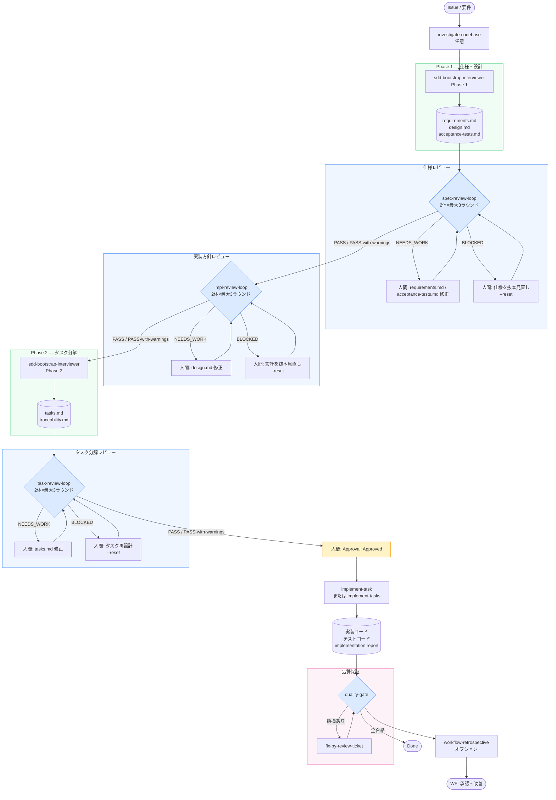
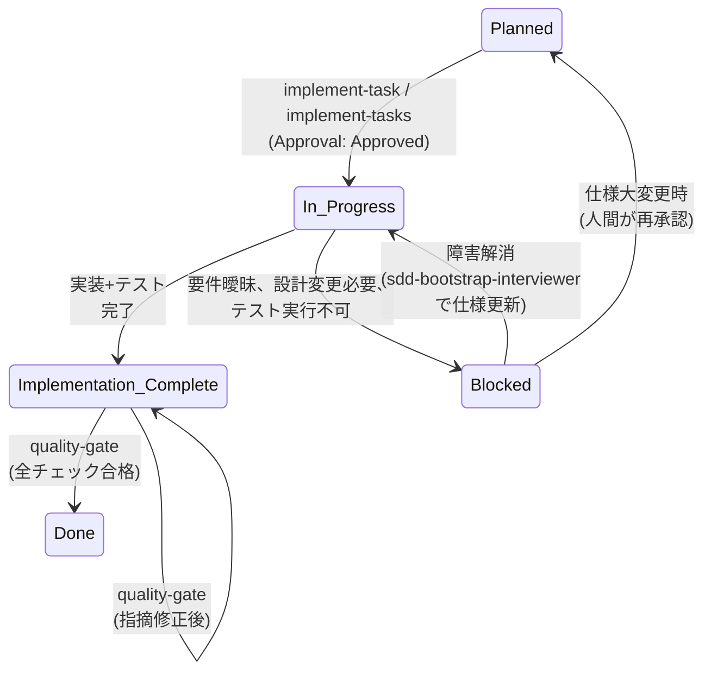

# SDD 開発業務フローガイド

実際のソフトウェア開発業務 (仕様変更、レビュー差し戻し、他部署レビュー、障害報告) の中で SDD プラグインをどう運用するかを説明するガイドです。各スキルの個別仕様は [skill-reference.md](skill-reference.md) を参照してください。

## 2コマンドクイックリファレンス

| コマンド | 役割 | 実行者 |
|---|---|---|
| `/sdd-bootstrap:run <mode> <source>` | 仕様化フェーズ: 要件 → 仕様 → タスク契約 | AI + 人間レビュー |
| `/sdd-ship:run specs/<feature>/tasks.md` | 実装・品質保証フェーズ: 承認済みタスク → Done | AI (人間承認後) |

**フルトラック**: `sdd-bootstrap` → 人間承認 → `sdd-ship`

**lite トラック**: `sdd-bootstrap --lite` → 人間承認 → `sdd-ship --lite`

内部スキル（`implement-task`、`quality-gate` 等）は `sdd-ship` が自動的に呼び出します。

---

## 全体フロー図 (feature / fullstack)



> **LITE トラック** (`spec_profile: lite`): spec-review-loop / impl-review-loop / task-review-loop はスキップ。Phase 1 → Phase 2 が直結し、lite-gate で品質保証。

---

## 1. ロールと責務

| ロール | 主な責務 | このワークフローでの具体的操作 |
|---|---|---|
| **プロダクトオーナー/企画** | 要件定義、優先度付け、受け入れ判定 | Issue発行 → requirements確認 → Approval: Approved への変更 → 品質ゲート結果の最終判定 |
| **開発者** | 仕様理解、実装、テスト、自己レビュー | investigate-codebase (任意) → implement-task → 実装レポート作成 |
| **レビュアー/QA・他部署** | 独立検証、リスク指摘、仕様逸脱検出 | requirements/design確認 → quality-gate での批判レビュー → review-ticket で指摘 |
| **AIエージェント** | 調査、仕様生成、実装、品質検証 | investigate-codebase / sdd-bootstrap-interviewer / implement-task / quality-gate / fix-by-review-ticket を実行 |

### 人間にしかできない操作

以下の操作は **人間のみが実行可能** です。エージェント・スキルは自動承認できません。各項目に sudo モードでの扱いを併記します。

1. **タスク承認**【sudo: 自動通過（承認ゲート）】: `tasks.md` の `Approval` フィールドを `Draft` → `Approved` に変更する。フック (承認ガード) がエージェントの自己承認を物理的にブロックします。
2. **品質ゲート差分の承認**【sudo: 自動通過（承認ゲート）】: `baseline-behavior.md` の差分が `accepted` に分類される場合、人間がその変更を明示的に承認する必要があります。
3. **WFI (Workflow Improvement) の承認**【sudo: 対象外（ワークフロー統治の判断）】: `docs/workflow-improvements/WFI-NNN.md` の `Status` を `Draft` → `Approved` に変更する。フックガードがエージェントの WFI 自己承認を物理ブロックします（sudo でも解除されません）。
4. **人間判断が必要な指摘対応**【sudo: 対象外（業務判断）】: `requires_human_decision: true` のレビューチケットは自動修正されません。
5. **AGENT_STOP ファイルの管理**【sudo: 対象外（緊急制御・常時有効）】: エージェント暴走時の緊急停止・再開。
6. **重要なアーキテクチャ決定**【sudo: 対象外（ADR 級の判断）】: ADR (Architecture Decision Record) が必要な判断。

> **sudo の原則**: sudo モードは「承認待ち」(1, 2) だけを自動化します。判断・統治・緊急制御 (3, 4, 5, 6) は sudo でも人間に残ります（brownfield と並ぶ明示例外）。sudo 中に人間へ残るのは「真の判断フォーク（エージェントは Blocked / Open Question で停止し人間に委ねる）」と「緊急停止」のみです。

---

## 2. タスクの状態モデル

### 2軸モデル

タスク状態は **Approval 軸** (Draft / Approved) と **Status 軸** (5つの状態) の2軸で管理されます。

**Approval**: 人間のみが遷移可能
- `Draft` → `Approved`: 人間が明示的に変更
- `Approved` → `Draft`: 仕様更新時に人間が戻す

**Status**: スキルが遷移、人間が要件により設定
- `Planned` → `In Progress` → `Implementation Complete` → `Done` (正常系)
- `In Progress` → `Blocked` → `In Progress` (復帰可能)
- 品質ゲートで差し戻された場合は `Implementation Complete` のまま保持、または `Blocked` (Done にはならない)

### Status 遷移図



### 状態別の必須証跡 (check-task-state が強制)

| Status | Approval 要件 | 必須証跡 |
|---|---|---|
| `In Progress` | **Approved** | — |
| `Implementation Complete` | **Approved** | • `reports/implementation/<task-id>.md` が task id を言及 |
| `Done` | **Approved** | • `specs/<feature>/verification/<task-id>.evidence.json` が存在<br/>• report、contract、passing evidence の task ID・PASS判定・SHA-256 が検証済み |
| `Blocked` | Draft / Approved 両方可 | • 非空の `### Blockers` セクション (実装値記述必須) |

### registry profile（full / lite / legacy）

`specs/workflow-state-registry.json` は feature ごとに `profile` を持ち、`contracts/workflow-state-registry.schema.json` がその形状を検証します。

| profile | 意味 |
|---|---|
| `full` | 全レビュー（spec-review-loop / impl-review-loop / task-review-loop）の provenance が必須。標準トラックの feature はここに属する。 |
| `lite` | 軽量トラック（sdd-lite）用。レビューループの検証をスキップする。 |
| `legacy` | provenance が復元不能な過去の feature を bounded grandfathering する区分。機能は有効のまま維持されるが、スキーマの `const` と完全一致する固定の `legacy` オブジェクト（`reason` 等）が必須で、内容の書き換えは許されない。 |

`legacy` は履歴上の事実を凍結するための区分であり、新規 feature が意図的に `legacy` を選ぶことはない。

---

## 3. 正常系フロー

### 3.1 新機能開発 (feature)

| ステップ | 実行者 | 成果物 | 確認すべきこと |
|---|---|---|---|
| 1. Issue受領 | 人間 | GitHub/GitLab Issue | 要件が明確か？スコープは？依存関係は？ |
| 2. 調査 (任意) | AI (investigate-codebase) | `specs/<feature>/investigation.md`<br/>`specs/<feature>/baseline-behavior.md` | 既存コード/API契約/テストの知見が証跡付きか？ |
| **3a. 仕様化 [Phase 1]** | **AI (sdd-bootstrap-interviewer)** | `specs/<feature>/requirements.md`<br/>`specs/<feature>/design.md`<br/>`specs/<feature>/acceptance-tests.md`<br/>契約 JSON / ADR<br/>`requirements.md` に `Spec-Review-Status: Pending` | 要件・設計の骨格は整っているか？Open Questions が過剰でないか？ |
| **3b. 仕様レビュー** | **AI (spec-review-loop) + 人間** | `reports/spec-review/<feature>/attempt-1/round-N/`<br/>→ `integrated-verdict.json`<br/>→ requirements.md に `Spec-Review-Status: Passed` | `spec-reviewer-a/b` の独立レビューが全通過か？ NEEDS_WORK なら requirements/acceptance-tests を修正して再実行 |
| **3c. 実装方針レビュー** | **AI (impl-review-loop) + 人間** | `reports/impl-review/<feature>/attempt-1/round-N/`<br/>→ `integrated-verdict.json`<br/>→ design.md に `Impl-Review-Status: Passed` | `impl-reviewer-a/b` の独立レビューが全通過か？ NEEDS_WORK なら design.md 修正して再実行 |
| **3d. 仕様化 [Phase 2]** | **AI (sdd-bootstrap-interviewer)** | `specs/<feature>/tasks.md`<br/>`specs/<feature>/traceability.md` | `Impl-Review-Status: Passed` が確認されてから生成される。タスク粒度は適正か？ |
| **3e. タスク分解レビュー** | **AI (task-review-loop) + 人間** | `reports/task-review/<feature>/attempt-1/round-N/`<br/>→ `integrated-verdict.json`<br/>→ tasks.md に `Task-Review-Status: Passed` | `task-reviewer-a/b` の独立レビューが全通過か？ NEEDS_WORK なら tasks.md 修正して再実行 |
| 4. 承認 | 人間 | `tasks.md` の `Approval: Approved` | タスク1の承認が済んだか？ |
| 5. 実装 (タスク単位 **または一括**) | AI (implement-task **または implement-tasks**) | 実装コード<br/>テストコード<br/>`reports/implementation/<task-id>.md` | 設計通りか？テストは十分か？無関係変更は混在していないか？<br/>**implement-tasks を使う場合**: 依存関係を自動解決し、全承認済みタスク完了後に quality-gate を自動起動 |
| 6. 品質検証 | AI (quality-gate) + 人間 | `specs/<feature>/verification/<task-id>.contract.json`<br/>`specs/<feature>/verification/<task-id>.evidence.json`<br/>`reports/quality-gate/<timestamp>.md`<br/>`docs/review-tickets/RT-*.yml` | 全チェック合格？証跡hash一致？Critical/Major 指摘は resolved？ |
| 7. 指摘修正 (必要時) | AI (fix-by-review-ticket) | 修正コード・テスト | チケット指定範囲を超えていないか？ |
| 8. 再検証 (指摘有時) | AI (quality-gate 再実行) | 更新契約・レポート | Critical/Major が解消されたか？ |
| 9. 繰り返し | — | — | 全タスク Done まで 5〜8 を繰り返し |
| 10. 回顧 | AI (workflow-retrospective) | `reports/retrospective/<timestamp>.md`<br/>`docs/workflow-improvements/WFI-*.md` | 同種指摘の反復はないか？Blocked が頻発していないか？ |
| 11. 改善検討 | 人間 | WFI 承認 | 検出された friction を認めるか？ |

> **LITE プロファイル (`spec_profile: lite`)**: ステップ 3b/3c/3e のレビューゲートはスキップされます。acceptance-tests.md が不在の場合も同様。

**例: 予約キャンセル機能の実装**

- Issue #42: 「設備予約のキャンセル機能」
- Investigation で既存 API 設計、権限判定ロジック、キャンセル手数料計算ルールを抽出
- Interviewer が Phase 1 生成: requirements.md / design.md / acceptance-tests.md
- `spec-review-loop` で仕様レビュー → 独立 Reviewer-A/B が PASS
- `impl-review-loop` でレビュー → Reviewer-A が ARCH-COVERAGE FAIL（バックエンド API 設計不足を指摘）→ NEEDS_WORK → 人間が design.md 修正 → ラウンド2 で PASS
- Interviewer が Phase 2 生成: 3 タスク
  - T-001: キャンセル API エンドポイント実装 (backend)
  - T-002: キャンセル手数料計算テスト (unit)
  - T-003: キャンセル UI フォーム実装 (frontend)
- `task-review-loop` でレビュー → PASS (clean)
- 人間が T-001 を Approved
- implement-task が T-001 実装
- quality-gate で T-001 検証 → Done
- 同様に T-002, T-003 処理
- 完了後 workflow-retrospective で「キャンセル手数料計算の仕様が曖昧で 2 回 Blocked」を friction として検出
- WFI-001: 仕様テンプレートに「手数料計算ロジック」セクション追加を提案

### 3.2 不具合修正 (bugfix)

| ステップ | 実行者 | 成果物 | 確認すべきこと |
|---|---|---|---|
| 1. Issue受領 | 人間 | GitHub Issue (再現条件) | 再現手順が明確か？影響範囲は？ |
| **2a. 仕様化 [Phase 1]** | **AI (sdd-bootstrap-interviewer)** | `specs/<feature>/requirements.md`<br/>`specs/<feature>/design.md`<br/>`specs/<feature>/acceptance-tests.md` | 修正範囲は最小限か？回帰テストは十分か？ |
| **2b. 仕様レビュー** | **AI (spec-review-loop) + 人間** | `Spec-Review-Status: Passed` in requirements.md | 独立した spec-reviewer-a/b が修正対象・再現条件・回帰条件を検証したか？ |
| **2c. 実装方針レビュー** | **AI (impl-review-loop) + 人間** | `Impl-Review-Status: Passed` in design.md | 独立した impl-reviewer-a/b が修正方針の妥当性を確認したか？ |
| **2d. 仕様化 [Phase 2]** | **AI (sdd-bootstrap-interviewer)** | `specs/<feature>/tasks.md` (最小修正) | タスクは最小修正に絞られているか？ |
| **2e. タスク分解レビュー** | **AI (task-review-loop) + 人間** | `Task-Review-Status: Passed` in tasks.md | 独立した task-reviewer-a/b が最小修正の依存関係と検証可能性を確認したか？ |
| 3. 承認 | 人間 | `Approval: Approved` | 修正方針に同意するか？ |
| 4. 実装 | AI (implement-task) | 修正コード<br/>回帰テスト<br/>実装レポート | 規定の修正方針を逸脱していないか？ |
| 5. 品質検証 | AI (quality-gate) + 人間 | 検証契約<br/>品質レポート<br/>指摘 YAML | 副作用はないか？ |
| 6. 完了 | — | — | Done に至る |

### 3.3 リファクタリング (refactor)

リファクタリングは **動作変更なし** が前提です。`baseline-behavior.md` が必須。

| ステップ | 実行者 | 成果物 | 確認すべきこと |
|---|---|---|---|
| 1. Issue受領 | 人間 | GitHub Issue (リファクタ対象) | スコープは何か？動作変更はあるか？ |
| 2. 調査 (必須) | AI (investigate-codebase refactor) | `specs/<feature>/investigation.md`<br/>`specs/<feature>/baseline-behavior.md` | BL-xxx で現在の動作が完全に記録されているか？ |
| **3a. 仕様化 [Phase 1]** | **AI (sdd-bootstrap-interviewer refactor)** | requirements (変更なし)<br/>design (新構造)<br/>acceptance-tests (BL 同値) | 受入条件は「BL と同一」と記述されているか？ |
| **3b. 仕様レビュー** | **AI (spec-review-loop) + 人間** | `Spec-Review-Status: Passed` in requirements.md | 独立した spec-reviewer-a/b が BL 同値の受入条件を検証したか？ |
| **3c. 実装方針レビュー** | **AI (impl-review-loop) + 人間** | `Impl-Review-Status: Passed` in design.md | 独立した impl-reviewer-a/b が循環依存・構造問題を検証したか？ |
| **3d. 仕様化 [Phase 2]** | **AI (sdd-bootstrap-interviewer)** | tasks.md<br/>traceability | タスクの粒度と依存関係が正しいか？ |
| **3e. タスク分解レビュー** | **AI (task-review-loop) + 人間** | `Task-Review-Status: Passed` in tasks.md | 独立した task-reviewer-a/b がタスクの依存関係と検証可能性を確認したか？ |
| 4. 承認 | 人間 | — | 設計と受入条件に同意 |
| 5. 実装 | AI (implement-task) | 新構造コード<br/>テスト<br/>実装レポート | 過度な変更はないか？ |
| 6. 差分検証 | AI (quality-gate) | 契約<br/>**Differential Baseline Verification** セクション | 各 BL を `fix-required` / `accepted` / `environmental` に分類<br/>**タイムスタンプ・UUID・ホスト固有パスは正規化** |
| 7. 完了 | — | — | `environmental` のみか、`accepted` は人間承認済みか |

**差分テスト 3 分類の表**

| Classification | 意味 | アクション |
|---|---|---|
| `fix-required` | After-state がタスク記述と矛盾 (意図しない差分) | レビューチケット作成・Done ブロック |
| `accepted` | タスク記述で明示的に許可された意図的な変更 | 人間が Approved → `baseline-behavior.md` を更新 |
| `environmental` | 正規化後に差分なし (タイムスタンプ、UUID など) | 対応不要 |

### 3.4 既存プロジェクトへの途中導入 (brownfield)

既存プロジェクトに SDD を導入する場合のフロー。

| ステップ | 実行者 | 成果物 | 確認すべきこと |
|---|---|---|---|
| 1. 構造確認 | AI / 人間 | `scripts/check-sdd-structure.sh` 出力 | 必須ディレクトリ不足？ |
| 2. 構造導入 | AI (sdd-adopt) | `AGENTS.md`<br/>`CLAUDE.md`<br/>`docs/adr/`<br/>`docs/review-tickets/`<br/>`reports/`<br/>ホスト別テンプレート (GitHub Actions / GitLab CI) | ファイルが適切に作成されたか？既存ファイルとの競合は？ |
| 3. 仕様化開始 | AI (sdd-bootstrap-interviewer) | feature/bugfix/refactor 仕様 | 上記 3.1〜3.3 に同じ |

---


> 異常系フロー・後処理・リスク適応ゲート・ブランチ保護の詳細は [`docs/contributor/workflow-detail.md`](contributor/workflow-detail.md) を参照してください。

## 軽量トラック（sdd-lite）

社内・部署内アプリ向けの「中量」開発トラック。フル SDD の部分集合として設計されており、加算的昇格で段階的に厳格化できます。

### 4ステップフロー

```
1. lite-spec       要件 + 設計 + タスク を生成（traceability/ADR/受入の重い記述は任意）
   ↓
2. [人間] 単一承認  tasks.md の Approval: Draft → Approved（AI は既存ガードでブロック）
   ↓
3. implement-task  既存スキルを無改変流用。In Progress → Implementation Complete。Done化はしない
   ↓
4. lite-gate       決定論的チェックを実行し lite 品質レポート（VERDICT: PASS）を生成 → Done
```

前提: 対象リポジトリで `sdd-adopt` を一度実行し SDD 構造（AGENTS.md + 必須ディレクトリ）を用意しておくこと。

### フル SDD との差分

| 項目 | sdd-lite | フル SDD |
|---|---|---|
| **省くもの** | | |
| traceability.md 必須 | 任意 | 必須 |
| ADR 必須化 | 任意 | 必須 |
| evidence-bundle（SHA-256/署名） | 不要 | 必須 |
| contract.json | 不要（lite 品質レポートで代替） | 必須 |
| cross-model 検証 | 不要 | critical で必須 |
| critical 階層・二者承認 | 使用しない | `Risk: critical` 時に必須 |
| WFI / retrospective | 任意 | 推奨 |
| 品質ゲート多重サイクル | 単発 | 最大3サイクル |
| **維持するもの** | | |
| 要件・設計・タスク | 必須（lite テンプレート） | 必須 |
| 単一の人間承認 | 必須（フック保護） | 必須 |
| kill-switch（AGENT_STOP） | 有効 | 有効 |
| 独立した軽量ゲート | lite-gate が検証コマンドを自分で再実行 | quality-gate が独立検証 |
| 実装レポート | 必須 | 必須 |

### 昇格手順（フル SDD へ）

lite 成果物はフル SDD の部分集合であり、書き直しゼロの加算で移行できます。

| 追加するもの | 有効化される機構 |
|---|---|
| tasks に `Risk:` + `Risk Rationale:` | 階層強制（check-risk / check-contract Pass4） |
| 本体の `check-task-state` を使用 | evidence-bundle 必須・Done の機械的証明 |
| contract に `cross_model: required` | クロスモデル検証 |
| critical タスク | 二者承認 + 署名 + provenance |
| `traceability.md` 生成 | REQ→AC→TEST→証跡チェーン |

成果物の場所・命名（`specs/<feature>/`、`reports/`）はフル SDD と同一のため、sdd-lite を外して sdd-bootstrap / quality-loop の本フローへ連続的に移行できます。詳細は [`plugins/sdd-lite/references/lite-flow-policy.md`](../plugins/sdd-lite/references/lite-flow-policy.md) を参照。

---

## バグ修正トラック（diagnose）

バグ修正・回帰・フレーキーテスト・性能退行は、フル SDD（3レビューループ）を通す前に `/sdd-implementation:diagnose` で診断規律を回す。1行修正にフルフローを強制するのは過剰であり、`diagnose` が軽量トラックへの入口を兼ねる。

### 4ステップフロー

```text
1. /sdd-implementation:diagnose <issue|症状+再現手順>
     5フェーズ規律（詳細は plugins/sdd-implementation/skills/diagnose/SKILL.md）:
     ① *このバグ* で赤になる tight な feedback loop を1本作る（これが本体。赤にできる前に仮説を立てない）
     ② 再現+最小化  ③ 反証可能な仮説 3–5個  ④ 1変数ずつ計測  ⑤ 修正前に回帰テスト（正しい seam が無ければそれ自体が finding）
     → 出力: reports/diagnosis/<id>.md（根本原因・最小再現・回帰テスト）
   ↓
2. lite-spec   診断結果を入力に要件/設計/タスクを生成（/sdd-lite:lite-spec）
   ↓
3. [人間] 単一承認  →  implement-task  で修正を適用
   ↓
4. lite-gate   診断レポートと回帰テストが task-reviewer-b の BUGFIX-DIAGNOSTIC-PATH を満たす → Done
```

### 昇格条件

修正が `Risk: high/critical` 面（認証・認可・決済・PII・データマイグレーション・公開 API 契約）に触れる場合のみ、フルトラックへ加算移行する（`Risk:` + evidence bundle。詳細は [`risk-gate-matrix.md`](../plugins/sdd-quality-loop/references/risk-gate-matrix.md)）。

> 原則: `diagnose` は診断証跡を**供給**する実行スキル、`BUGFIX-DIAGNOSTIC-PATH` はその証跡を**検査**するゲート。前者が後者に食わせる補完関係。

---

## 関連ドキュメント

- [README.md](../README.md) — プロジェクト概要・フロー図
- [skill-reference.md](skill-reference.md) — 各スキル仕様の詳細リファレンス
- [troubleshooting.md](troubleshooting.md) — 一般的な問題と解決方法
