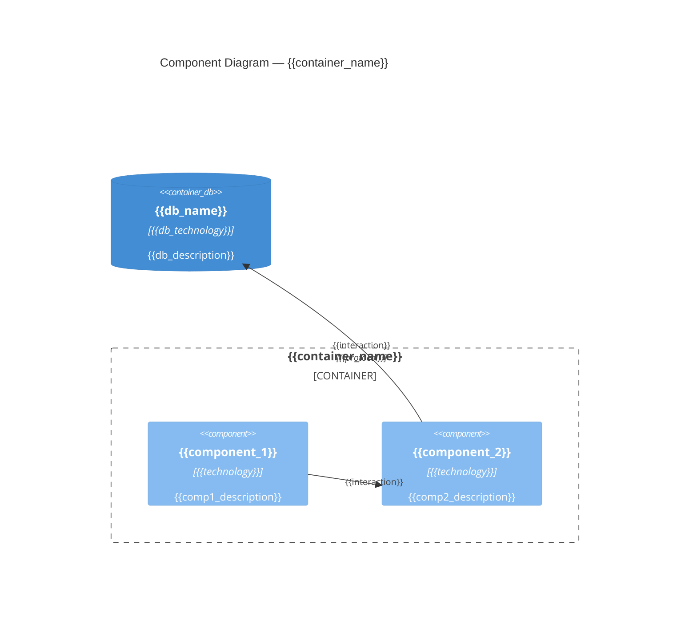

# C4 Component: {{container_name}}

## Diagram

## Elements

| Name | Responsibility | Technology | Dependencies |
|------|---------------|-----------|-------------|
| {{component_1}} | {{responsibility}} | {{technology}} | {{deps}} |
| {{component_2}} | {{responsibility}} | {{technology}} | {{deps}} |

## Related ADRs

- {{adr_link}}
