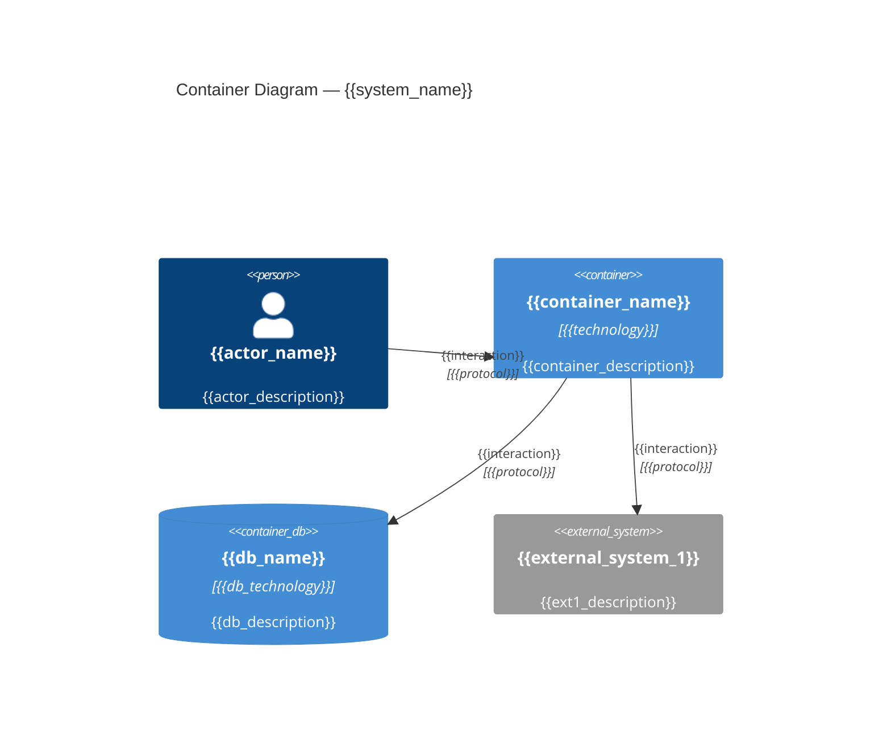

# C4 Container: {{system_name}}

## Diagram

## Elements

| Name | Type | Responsibility | Technology | Dependencies |
|------|------|---------------|-----------|-------------|
| {{container_name}} | Container | {{responsibility}} | {{technology}} | {{deps}} |
| {{db_name}} | Database | {{responsibility}} | {{technology}} | — |

## Related ADRs

- {{adr_link}}
