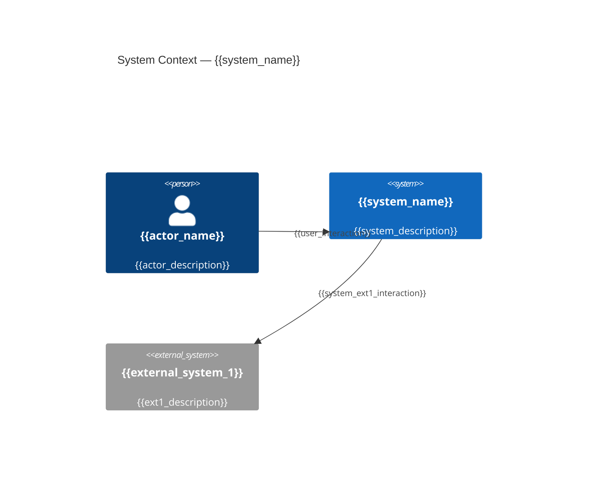

# C4 Context: {{system_name}}

## Diagram

## Elements

| Name | Type | Responsibility | Technology |
|------|------|---------------|-----------|
| {{actor_name}} | Person | {{responsibility}} | — |
| {{system_name}} | System | {{responsibility}} | {{technology}} |
| {{external_system_1}} | External System | {{responsibility}} | {{technology}} |

## Related ADRs

- {{adr_link}}
