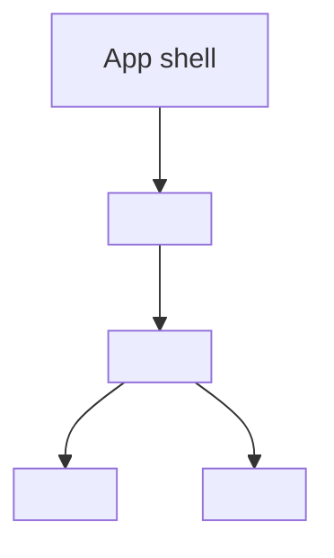

# Frontend Specification: <feature>

Use canonical REQ-NNN and AC-NNN identifiers. Replace examples with concrete
technology and contract choices; record reasoned N/A values for non-UI work.

## Technology Stack

| Layer | Technology | Version | Rationale | Constraint |
|---|---|---|---|---|
| Runtime | `<runtime>` | `<version>` | `<why>` | `<support boundary>` |
| UI | `<framework or N/A>` | `<version>` | `<why>` | `<constraint>` |
| Test | `<runner>` | `<version>` | `<why>` | `<environment>` |

## Component Tree



Annotate ownership, server/client boundaries, error boundaries, and lazy-load
boundaries.

## State Shape

| State Slice | Owner | Shape | Initial State | Transition | Persistence | REQ | AC |
|---|---|---|---|---|---|---|---|
| `<slice>` | `<component/store/server>` | `<type>` | `<value>` | `<event>` | `<none/session/durable>` | REQ-NNN | AC-NNN |

```ts
interface FeatureState {
  status: "idle" | "loading" | "ready" | "error";
  selectedId: string | null;
  items: Array<{ id: string; label: string }>;
  errorMessage: string | null;
}
```

## Routes and Components

| Route | Component | Auth | Parameters | Data Source | Loading/Error Boundary | REQ | AC |
|---|---|---|---|---|---|---|---|
| `/example/:id` | `ExampleView` | `<public/role>` | `id: string` | `<client/query>` | `<boundary>` | REQ-NNN | AC-NNN |

## API Client Strategy

Define base URL ownership, generated versus handwritten types, authentication
attachment, timeout, cancellation, retry policy, idempotency, cache ownership,
validation, error normalization, telemetry, and test doubles.

```ts
interface FeatureRequest {
  featureId: string;
  includeHistory: boolean;
}

interface FeatureResponse {
  featureId: string;
  displayName: string;
  updatedAt: string;
  permissions: string[];
}
```

## Code Splitting and Size Budget

| Boundary | Loading Strategy | Initial Budget | Async Budget | Measurement | AC |
|---|---|---:|---:|---|---|
| `<route>` | `<lazy/eager>` | `<150 kB gzip>` | `<75 kB gzip>` | `<tool/command>` | AC-NNN |

Document shared-chunk limits, prefetch rules, and regression thresholds.

## Performance Budget

| Metric | Target | Percentile | Device/Network | Measurement | AC |
|---|---:|---|---|---|---|
| LCP | `<2.5 s` | p75 | `<profile>` | `<tool>` | AC-NNN |
| INP | `<200 ms` | p75 | `<profile>` | `<tool>` | AC-NNN |
| CLS | `<0.1` | p75 | `<profile>` | `<tool>` | AC-NNN |

## Empty, Loading, Error, and Success Behavior

Map each state to its component, accessible feedback, recovery action, REQ-NNN,
and AC-NNN. Do not use a spinner without a timeout and failure path.

## Dependencies

| Dependency | Version | Purpose | Alternative | License / Supply-Chain Note |
|---|---|---|---|---|
| `<package>` | `<exact/range>` | `<purpose>` | `<rejected option>` | `<policy>` |

## Testing

Specify unit, component, integration, accessibility, performance, and
end-to-end coverage with TEST-NNN identifiers and deterministic fixtures.

## Open Questions

- `<owner>: <question>; blocks REQ-NNN/AC-NNN or non-blocking`
