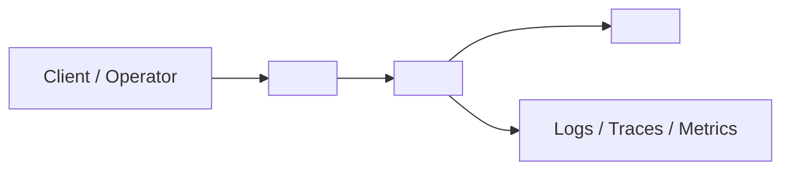
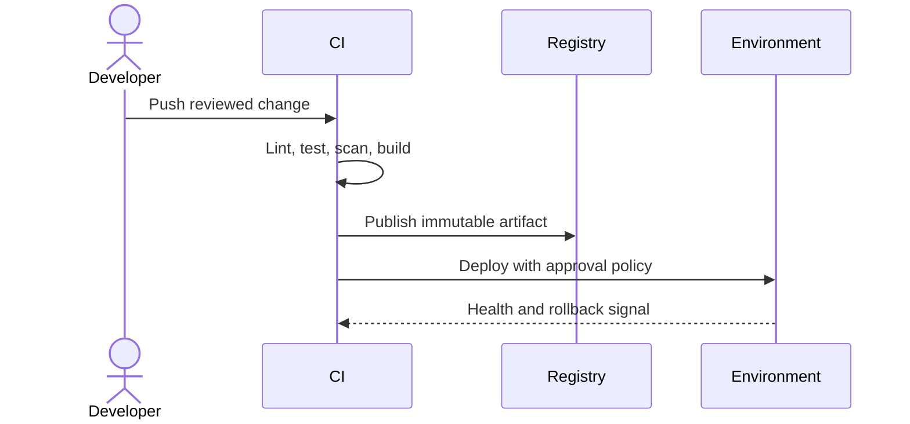

# Infrastructure Specification: <feature>

Use REQ-NNN and AC-NNN identifiers for every operational target. For local-only
work, state the equivalent execution environment and explain inapplicability.

## Deployment Topology



Document regions, networks, trust boundaries, dependencies, and failure domains.

## CI/CD Sequence



## Environments

| Environment | URL | Auth | Trigger | Classification | Promotion Rule |
|---|---|---|---|---|---|
| local | `<URL/path>` | `<mechanism>` | `<command>` | `<data class>` | `<rule>` |
| staging | `<URL or N/A>` | `<mechanism>` | `<event>` | `<data class>` | `<rule>` |
| production | `<URL or N/A>` | `<mechanism>` | `<event>` | `<data class>` | `<rule>` |

## Infrastructure as Code

```hcl
module "feature" {
  source      = "<module-source>"
  environment = var.environment
  # Replace with reviewed resources; never place secrets in source.
}
```

Name state storage, locking, drift detection, policy checks, and ownership.

## Scaling Strategy

Define horizontal/vertical limits, queue or concurrency bounds, autoscaling
signals, capacity assumptions, backpressure, graceful degradation, and
load-test evidence.

## Service Level Objectives

| Signal | Numeric Target | Window | Measurement | Error-Budget Action | AC |
|---|---:|---|---|---|---|
| Availability | `>= 99.9%` | 30 days | `<source>` | `<freeze/rollback>` | AC-NNN |
| p95 latency | `<= 300 ms` | 7 days | `<source>` | `<investigate/rollback>` | AC-NNN |

## Data Residency and Retention

| Entity | Residency | Retention | Backup | Deletion Verification | REQ | AC |
|---|---|---|---|---|---|---|
| `<entity>` | `<region>` | `<duration>` | `<RPO/RTO>` | `<evidence>` | REQ-NNN | AC-NNN |

## Observability

| Logs | Traces | Metrics | Alert | Owner | Runbook |
|---|---|---|---|---|---|
| `<events/redaction>` | `<spans>` | `<SLI>` | `<threshold>` | `<team>` | `<link>` |

Include correlation IDs, sampling, cardinality limits, PII redaction, dashboards,
synthetic checks, and alert-routing tests.

## Cost Estimate

| Driver | Assumption | Monthly Range | Alert Threshold | Optimization |
|---|---|---:|---:|---|
| `<compute/storage/egress>` | `<volume>` | `<currency range>` | `<amount>` | `<action>` |

## Rollback

Define trigger, owner, command/runbook, data compatibility, maximum rollback
time, smoke checks, and evidence path. Tie the success criteria to AC-NNN.

## Open Questions

- `<owner>: <question>; blocks REQ-NNN/AC-NNN or non-blocking`
