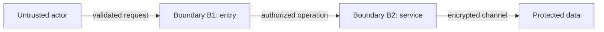
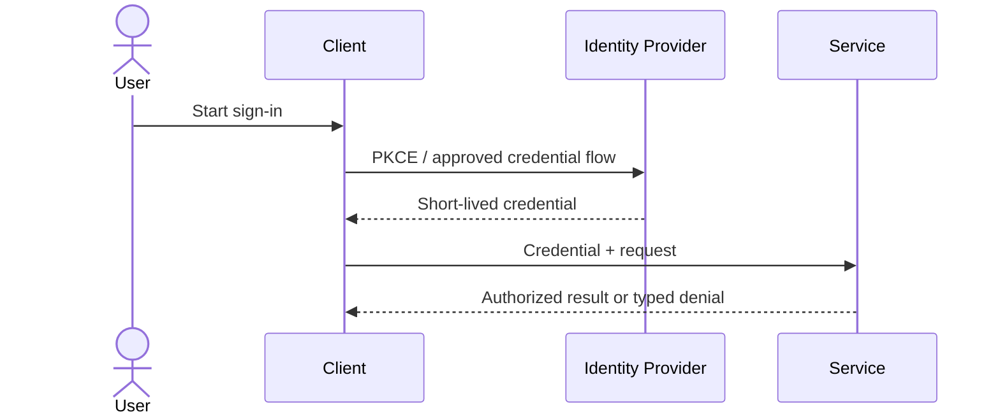

# Security Specification: <feature>

Use REQ-NNN and AC-NNN identifiers. Assess security even when other layers are
`N/A — no change`; never put credentials or real secrets in this document.

## Trust Boundaries

| Boundary | Source | Destination | Assets | Validation | AuthN/AuthZ | REQ | AC |
|---|---|---|---|---|---|---|---|
| B1 | `<source>` | `<destination>` | `<asset>` | `<schema/control>` | `<mechanism>` | REQ-NNN | AC-NNN |
| B2 | `<source>` | `<destination>` | `<asset>` | `<schema/control>` | `<mechanism>` | REQ-NNN | AC-NNN |

## STRIDE Analysis

Provide at least two rows for every boundary.

| Boundary | Threat | STRIDE | Abuse Case | Mitigation | Verification | REQ-NNN | AC-NNN |
|---|---|---|---|---|---|---|---|
| B1 | `<identity spoofing>` | Spoofing | `<scenario>` | `<control>` | TEST-NNN | REQ-NNN | AC-NNN |
| B1 | `<input tampering>` | Tampering | `<scenario>` | `<control>` | TEST-NNN | REQ-NNN | AC-NNN |
| B2 | `<data disclosure>` | Information Disclosure | `<scenario>` | `<control>` | TEST-NNN | REQ-NNN | AC-NNN |
| B2 | `<resource exhaustion>` | Denial of Service | `<scenario>` | `<control>` | TEST-NNN | REQ-NNN | AC-NNN |

## Authentication Flow

Define credential type, TTL, refresh, revocation, session binding, MFA,
failure feedback, audit events, and account-recovery boundaries.

## Authorization

| Actor / Role | Resource | Action | Decision Point | Default | Denial Evidence | REQ | AC |
|---|---|---|---|---|---|---|---|
| `<role>` | `<entity>` | `<action>` | `<policy location>` | deny | `<audit/test>` | REQ-NNN | AC-NNN |

Specify tenant/entity ownership, confused-deputy defenses, and fail-closed
behavior.

## Data Classification and Protection

| Entity | Classification | At Rest | In Transit | Retention | Deletion | Access Log | REQ | AC |
|---|---|---|---|---|---|---|---|---|
| `<entity>` | `<public/internal/confidential/restricted>` | `<encryption/key>` | `<protocol>` | `<duration>` | `<method>` | `<event>` | REQ-NNN | AC-NNN |

## OWASP Mapping

| OWASP Risk | Exposure | Control | Verification | Owner |
|---|---|---|---|---|
| Broken Access Control | `<surface>` | `<control>` | TEST-NNN | `<owner>` |
| Injection | `<surface>` | `<validation/encoding>` | TEST-NNN | `<owner>` |
| Cryptographic Failures | `<surface>` | `<control>` | TEST-NNN | `<owner>` |

## Secrets Management

Document secret source, injection, scope, rotation, revocation, audit,
redaction, local-development handling, and break-glass procedure. Repositories,
templates, logs, and review manifests must not contain secret values.

## SBOM and Supply Chain

Define lockfile policy, provenance, signature verification, SBOM generation,
dependency and license scanning, update cadence, artifact immutability, and
response ownership.

## Security Tests

| Test | Boundary | Attack / Control | Expected Result | Evidence | AC |
|---|---|---|---|---|---|
| TEST-NNN | B1 | `<malformed/unauthorized input>` | `<fail closed>` | `<path>` | AC-NNN |
| TEST-NNN | B2 | `<tampered credential/data>` | `<reject and audit>` | `<path>` | AC-NNN |

Include negative authorization, path/input validation, secret scanning,
dependency scanning, encryption configuration, rate-limit, and audit-log tests.

## Open Questions

- `<owner>: <question>; blocks REQ-NNN/AC-NNN or non-blocking`
