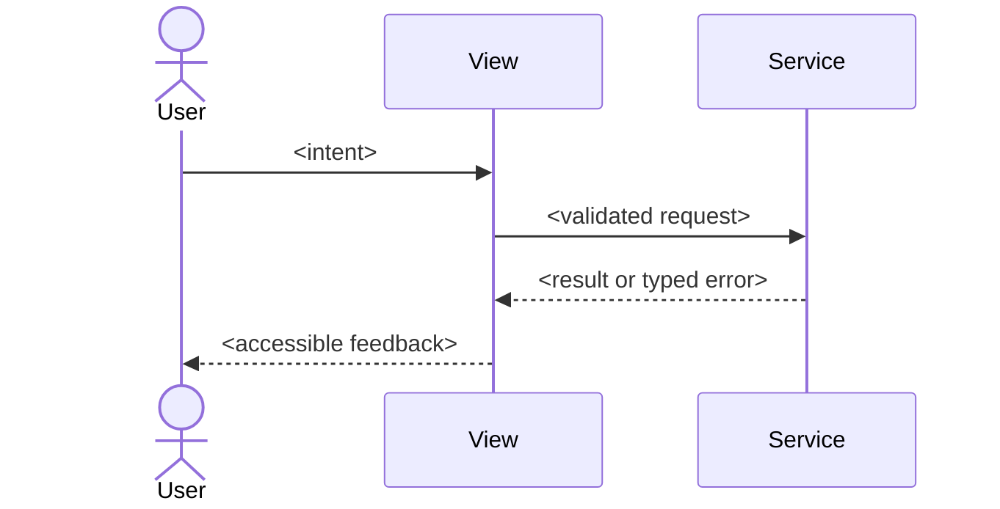
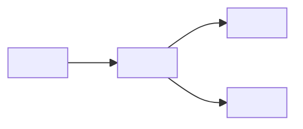

# UX Specification: <feature>

Use REQ-NNN and AC-NNN identifiers from the approved core specification.
Replace every guided example with feature-specific content; use
`N/A — no change: <reason>` only when the layer is genuinely unaffected.

## Scope and User Journeys

- Primary user: <role and goal>
- Entry point: <where the journey starts>
- Success outcome: <observable outcome tied to AC-NNN>
- Excluded journey: <boundary and reason>

## Target Views

| View | User | Purpose | Entry | Exit | REQ | AC |
|---|---|---|---|---|---|---|
| `<view-name>` | `<role>` | `<job to be done>` | `<trigger>` | `<result>` | REQ-NNN | AC-NNN |

## Component States

| Component | State | Trigger | Visible Feedback | Recovery | REQ-NNN | AC-NNN |
|---|---|---|---|---|---|---|
| `<component>` | Empty | `<condition>` | `<message/action>` | `<next action>` | REQ-NNN | AC-NNN |
| `<component>` | Loading | `<condition>` | `<progress semantics>` | `<timeout behavior>` | REQ-NNN | AC-NNN |
| `<component>` | Error | `<condition>` | `<plain-language error>` | `<retry/fallback>` | REQ-NNN | AC-NNN |
| `<component>` | Success | `<condition>` | `<confirmation>` | `<next action>` | REQ-NNN | AC-NNN |

## Interaction Sequence

## Wireframe Attachments

| View | Local Attachment | Source | Reviewed At | Notes |
|---|---|---|---|---|
| `<view-name>` | `<relative path or none>` | `<manual input>` | `<ISO8601>` | `<annotation>` |

Mockups are optional. When none are supplied, record `None — manual visual
refinement skipped`; do not block the specification.

## Navigation Map

Document deep links, back behavior, guarded routes, and lost-state recovery.

## Accessibility

Target WCAG 2.2 AA. Specify semantic landmarks, heading order, accessible
names, keyboard order, focus restoration, error association, live-region use,
contrast, reduced motion, zoom, and screen-reader announcements. Every
exception requires an owner, mitigation, and linked AC-NNN.

## Responsive Behavior

| Breakpoint | Width | Layout | Navigation | Input Method |
|---|---:|---|---|---|
| Small | `<0–639px>` | `<single-column behavior>` | `<compact navigation>` | touch / keyboard |
| Medium | `<640–1023px>` | `<adaptive behavior>` | `<navigation behavior>` | touch / pointer |
| Large | `<1024px+>` | `<expanded behavior>` | `<navigation behavior>` | pointer / keyboard |

Define reflow, target sizes, overflow, virtual keyboard, and orientation rules.

## Design Tokens

| Token | Value | Usage | Accessibility Constraint |
|---|---|---|---|
| `color.text.primary` | `<value>` | `<usage>` | `<contrast target>` |
| `space.control.gap` | `<value>` | `<usage>` | `<zoom/reflow behavior>` |
| `motion.feedback` | `<value>` | `<usage>` | `<reduced-motion alternative>` |

## Open Questions

- `<owner>: <question>; blocks REQ-NNN/AC-NNN or non-blocking`
