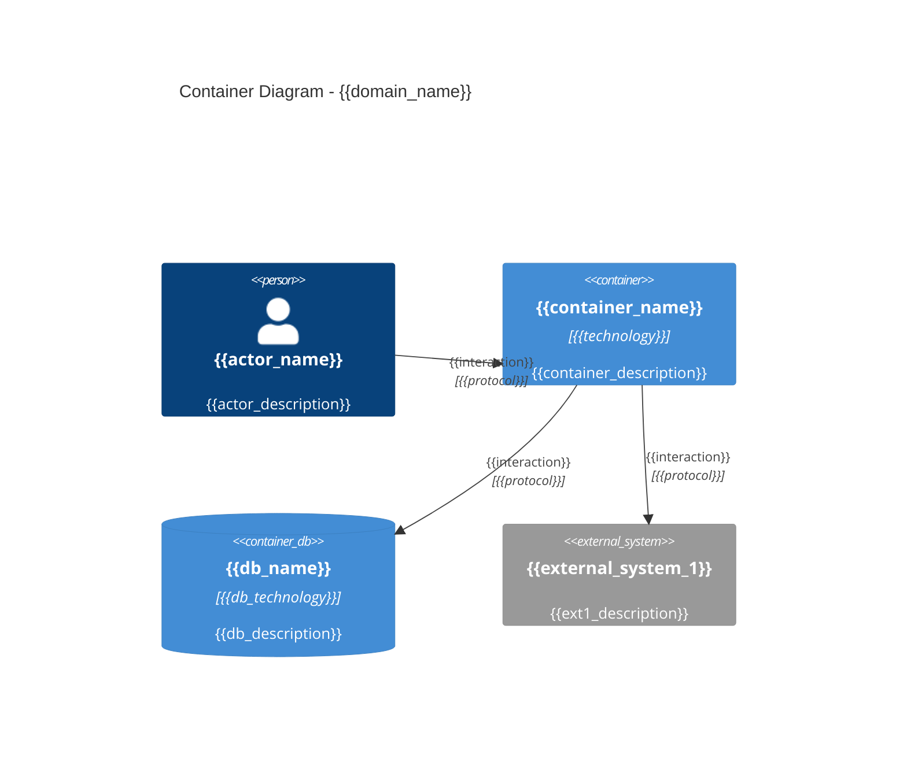

# C4 Container: {{domain_name}}

Stage: 7 of 7 (C4 Container)
Seed-Source: {{seed_source}}

Container level only in this lane (Component/Code levels are out of scope
per requirements.md Non-goals). Actors, containers, and external systems are
drawn from the bounded contexts, aggregates, and message flows established
in the earlier stages.

## Diagram

## Elements

| Name | Type | Responsibility | Technology | Dependencies |
|---|---|---|---|---|
| {{container_name}} | Container | {{responsibility}} | {{technology}} | {{deps}} |
| {{db_name}} | Database | {{responsibility}} | {{technology}} | - |

## Context-to-Container Mapping

Which bounded context (from the Context Map, stage 4) each container
implements, so the C4 diagram stays traceable back to the domain model.

| Container | Implements Context(s) | Aggregates Hosted |
|---|---|---|
| {{container_name}} | {{implemented_contexts}} | {{hosted_aggregates}} |

## Related ADRs

- {{adr_link}}

## Open Questions

{{open_questions}}

## Unknowns

{{unknowns}}

Record anything the human could not yet answer here, verbatim. Never invent
an answer to fill this section.
