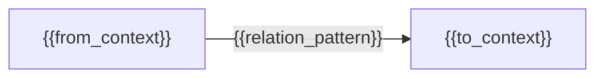

# Context Map: {{domain_name}}

Domain-Model-Status: Pending
Stage: 4 of 7 (Context Map)
Seed-Source: {{seed_source}}

`Domain-Model-Status` tracks this domain model's review/approval state:
`Pending` (default; not yet reviewed), `Reviewed` (domain-review-loop
reached PASS), or `Approved` (a human has signed off by editing this line
directly). Only a human may set `Approved`; the hook guard rejects an
agent-authored write of that value. Editing any file under `domain/` after
approval resets this field to `Pending`, requiring re-review (AC-014).

## Bounded Contexts

| Context | Description | Core Terms | Aggregates |
|---|---|---|---|
| {{context_name}} | {{context_description}} | {{core_terms}} | {{context_aggregates}} |

## Context Relations

Relation `pattern` values match
`contracts/domain-contract.v1.schema.json`'s `contextRelation.pattern` enum:
`partnership`, `shared-kernel`, `customer-supplier`, `conformist`,
`anticorruption-layer`, `open-host-service`, `published-language`,
`separate-ways`.

| From Context | To Context | Pattern | Note |
|---|---|---|---|
| {{from_context}} | {{to_context}} | {{relation_pattern}} | {{relation_note}} |

## Context Map Diagram

## Open Questions

{{open_questions}}

## Unknowns

{{unknowns}}

Record anything the human could not yet answer here, verbatim. Never invent
an answer to fill this section.
