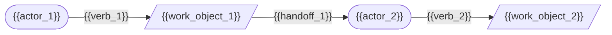

# Domain Story: {{domain_name}}

Stage: 1 of 7 (Domain Story)
Seed-Source: {{seed_source}}

## Actors

| Actor | Role | Goal |
|---|---|---|
| {{actor_name}} | {{actor_role}} | {{actor_goal}} |

## Story Narrative

{{narrative}}

A Domain Story is told as a sequence of numbered activities: an actor uses a
work object to do something, optionally producing or handing off another work
object to the next actor.

1. {{actor_1}} {{verb_1}} {{work_object_1}} ({{annotation_1}})
2. {{actor_2}} {{verb_2}} {{work_object_2}} ({{annotation_2}})

## Work Objects

| Work Object | Description | Produced By | Consumed By |
|---|---|---|---|
| {{work_object_name}} | {{work_object_description}} | {{producer}} | {{consumer}} |

## Story Diagram

## Boundary Observations

{{boundary_observations}}

Notes on where this story's actors and work objects appear to cluster into a
candidate bounded context. These observations feed the Context Map stage
(stage 4); they are not yet a final boundary decision.

## Open Questions

{{open_questions}}

## Unknowns

{{unknowns}}

Record anything the human could not yet answer here, verbatim. Never invent
an answer to fill this section.
