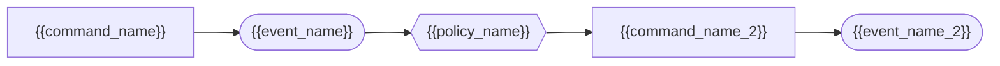

# Event Storming: {{domain_name}}

Stage: 2 of 7 (Event Storming)
Seed-Source: {{seed_source}}

## Domain Events

Domain events are named in past tense (something that happened).

| Event | Trigger | Triggered By | Resulting State Change |
|---|---|---|---|
| {{event_name}} | {{trigger}} | {{triggered_by}} | {{state_change}} |

## Commands

Commands are named in imperative form (something requested).

| Command | Issued By | Produces Event | Precondition |
|---|---|---|---|
| {{command_name}} | {{issued_by}} | {{produced_event}} | {{precondition}} |

## Policies

A policy is a reactive rule: "Whenever {{event}}, then {{command}}."

| Policy | Reacts To Event | Issues Command | Rationale |
|---|---|---|---|
| {{policy_name}} | {{reacted_event}} | {{issued_command}} | {{rationale}} |

## Actors and Read Models

| Actor | Reads | Decides | Issues Command |
|---|---|---|---|
| {{actor_name}} | {{read_model}} | {{decision}} | {{command}} |

## Hotspots

Unresolved disagreements, risks, or open design questions surfaced during
Event Storming. Record every hotspot; do not resolve it silently.

| Hotspot | Description | Owner |
|---|---|---|
| {{hotspot_name}} | {{hotspot_description}} | {{owner}} |

## Timeline Diagram

## Candidate Aggregate Clusters

{{candidate_aggregate_clusters}}

Groupings of events/commands that appear to share a consistency boundary.
These clusters are candidates for the Domain Model stage (stage 5); they are
not yet approved aggregates.

## Open Questions

{{open_questions}}

## Unknowns

{{unknowns}}

Record anything the human could not yet answer here, verbatim. Never invent
an answer to fill this section.
