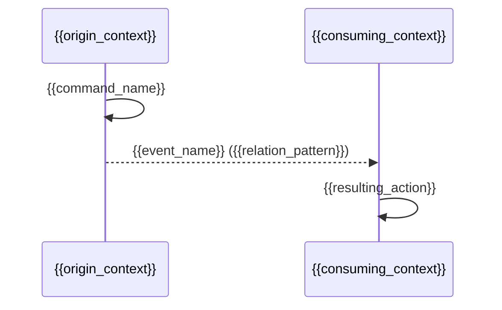

# Domain Message Flow: {{domain_name}}

Stage: 6 of 7 (Domain Message Flow)
Seed-Source: {{seed_source}}

Traces how commands, events, and policies from the Event Storming stage
(stage 2) flow across the bounded contexts and aggregates defined in the
Context Map (stage 4) and Domain Model (stage 5) stages.

## Message Catalog

| Message | Kind | Origin Context | Origin Aggregate | Destination Context(s) |
|---|---|---|---|---|
| {{message_name}} | command \| event | {{origin_context}} | {{origin_aggregate}} | {{destination_contexts}} |

## Cross-Context Flows

| Flow | Originating Event | Relation Pattern Used | Consuming Context | Resulting Action |
|---|---|---|---|---|
| {{flow_name}} | {{originating_event}} | {{relation_pattern}} | {{consuming_context}} | {{resulting_action}} |

## Sequence Diagram

## Failure and Compensation Paths

| Message | Failure Mode | Compensation |
|---|---|---|
| {{message_name}} | {{failure_mode}} | {{compensation}} |

## Open Questions

{{open_questions}}

## Unknowns

{{unknowns}}

Record anything the human could not yet answer here, verbatim. Never invent
an answer to fill this section.
