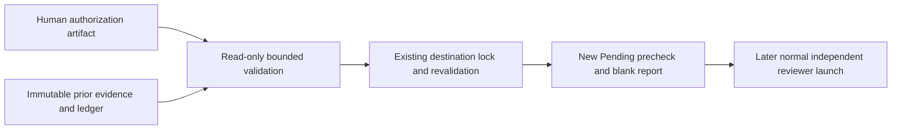

# Design: a9-interrupted-review-recovery

Impl-Review-Status: Passed
Feature Type: bugfix

## Technical Summary / Architecture

Extend only the spec-review transition contract with an explicit recovery branch. Existing normal reset selects terminal contracts (`plugins/sdd-review-loop/scripts/spec-review-precheck.sh:388-397`); the separate branch validates interruption, not a verdict. Existing lock/publication mechanism is `:400-449`. Context: human -> local orchestrator -> Bash/PowerShell precheck -> repository evidence. Container: existing local script runtime. Component: pure recovery validation, existing own-stage contract validation, existing persisted identity verifier, existing locked destination writer. No deployment unit or architecture reorganization; no new ADR or C4 files required for this bounded bugfix.

## Components

| Component | Responsibility | Technology | New/Existing |
|---|---|---|---|
| spec-review-precheck twins | Exclusive recovery option and destination writer | Bash / PowerShell | existing, narrow extension proposed |
| bounded recovery validator | Closed record/path/hash validation shared only if current runtimes can call it without new dependency | installed current runtime / stdlib | minimal proposed helper, implementation choice after gate |
| own-stage validate_contract / Test-Contract | Validate preceding NEEDS_WORK and internal reviewer/summary/verdict coherence | existing precheck functions | reuse; `spec-review-precheck.sh:225-364` |
| validate-review-context-set twins | Verify persisted A identity without reserve | existing scripts | reuse; `.sh:518-573` |

## Layer Specifications

| Layer | Canonical detail | Owner | Status |
|---|---|---|---|
| UX | ux-spec.md#scope-and-user-journeys | specification author | N/A — no change: no UI |
| Frontend | frontend-spec.md#technology-stack | specification author | N/A — no change: no frontend |
| Infrastructure | infra-spec.md#deployment-topology | workflow maintainer | proposed local CLI controls |
| Security | security-spec.md#trust-boundaries | security reviewer | assessed, pending review |

## Design System Compliance

N/A — ds_profile: none

## Cross-Layer Dependencies

| From | To | Contract | REQ | AC | Verification |
|---|---|---|---|---|---|
| requirements.md | infra-spec.md | Explicit option / lock / preservation | REQ-001,004,005 | AC-001, AC-004, AC-005 | TEST-001-015,084-107 |
| security-spec.md | infra-spec.md | Human evidence / pins / persisted identity | REQ-002,003 | AC-002, AC-003 | TEST-016-083 |

## ADR Change Log

None: preserve existing topology and identity algorithm. Contract evolution is specified in contracts/spec-review-interrupted-recovery.v1.data-contract.md; no shared sequential identifier claim.

## Data Plan / API Contract Plan

Data Entities: New closed `spec-review-interrupted-recovery/v1` document and separate human-origin authorization artifact; new-route prechecks add `recovery.record_path` and `recovery.record_sha256`.

Existing Data Affected: Read the source precheck, prior contract, input pins, interrupted inventory and identity ledger. Preserve their bytes, statuses and reservations; write only the fresh target precheck and blank report.

Migration Strategy: No migration, backfill or deletion. Existing prechecks remain valid without `recovery`; new-route prechecks require its exact two-field provenance.

New entity: closed `spec-review-interrupted-recovery/v1` record; human authorization evidence is separate, explicitly captured and never agent-signed. Historical evidence is read-only. No migration. Proposed additive precheck field `recovery: {record_path, record_sha256}` is optional for legacy records, required on the new route. Schema remains spec-review-precheck/v1; no verdict field in recovery. Existing precheck construction is `spec-review-precheck.sh:440-449`; compatibility consumers must be tested before implementation release. Normative field and semantic validation: proposed data contract.

### Contract detail inside the admitted design input

Reviewers need not read the external contract to evaluate this policy. The proposed closed JSON record has exactly schema, feature, source, target, authorization, previous_contract, interrupted_precheck, pinned_inputs, interrupted_artifacts and reviewer_a. Source/target each have exactly integer attempt/round; source round 2 or 3, target source+1/1. References have exactly path/sha256: contained real nonsymlink repository-relative paths, no absolute/dot/dotdot/empty segment/backslash/control character; 64 lowercase hexadecimal digest. Reject duplicate decoded members, missing/unknown/mis-cased keys and wrong types at every object level. Feature equals CLI lowercase slug.

Pinned inputs are exactly requirements, acceptance, investigation and calibration, sorted by unique canonical paths. Interrupted inventory is exactly source precheck, A raw, A reservation receipt, A host allocation receipt, diagnostic report and external A invocation, also sorted and unique; source directory has only the five local files. reviewer_a has exactly invocation reference, sequence (positive integer), stage (spec), role (spec-reviewer-a), nonempty run_id/host_session_id and record_sha256; repeated invocation references/pins must agree. No verdict or current-ledger-tip field.

Separate human-origin authorization artifact must contain exactly one bare line each: Feature, Source Attempt, Source Round, Target Attempt, Target Round, Maximum Rounds (3), Decision (Authorize interrupted A-before-B recovery), Recovery Binding SHA256. Additional explanatory prose may not duplicate a binding. The orchestrator must match the actual human approval and human report of applying the exact bounded artifact in the user channel, retaining the original user-message reference and approved content/binding digest. Only the human's own message is an origin source; an agent summary, self-claim, file alone, or human-copy transaction log alone is insufficient. This is the existing human-outside-agent boundary (plugins/sdd-quality-loop/references/deterministic-check-policy.md:124-132), not cryptographic human authentication. Before invoking recovery the orchestrator establishes that origin prerequisite; the validator checks the artifact's eight contents, raw hash and recovery binding only. Unknown or mismatched origin blocks launch. No new approval is requested; AUTH-001 records the existing approval and actual human application. Conversation prose is not a signature. Its binding digest hashes the record excluding top-level authorization, recursively sorted object keys, retained array order, UTF-8 ensure_ascii JSON, comma/colon separators without spaces and no final newline; contract numbers are integers. Complete artifact raw hash goes in authorization reference; complete recovery-record raw hash goes in saved precheck recovery.record_sha256. Recovery provenance has exactly record_path/record_sha256, optional on legacy prechecks, mandatory on this route, validated if present. It never proves PASS. The full mutation mapping is acceptance-tests.md; semantics are validation steps below.

## Validation / Publication Sequence

1. Reject reset combination, duplicates and unknown/case-variant flags. Recovery requires target N+1/1 and Pending.
2. Validate real contained record/evidence paths and closed JSON; orchestrator-established original human approval/application origin prerequisite and validator-checked authorization contents/hash with matching recovery digest; digest excludes only the authorization reference to avoid circular hashing, using canonical JSON as defined in contract.
3. Determine immediate prior attempt's actual latest round; require its immediately preceding round's own-stage validated NEEDS_WORK. Validate all current requirements/acceptance/investigation/calibration pins against interrupted precheck, composite input binding, full exact interrupted inventory, host allocation and interrupted A diagnostic.
4. Verify A invocation using existing persisted verifier without `--reserve`, bind sequence/record hash/receipt. Correlate all invocation manifests and ledger bindings to source round to establish no B reservation, launch or output; ambiguity rejects. Never claim the raw A BLOCKED completed a review (`review-context-boundary.md:260-269`).
5. Acquire existing lock, revalidate source, pins and absent target; publication uses existing target path. Write only fresh Pending precheck with recovery hash and blank report. No history/status/input/ledger changes. On partial write fail nonzero, never publish success; partial destination is not auto-erased/reused by recovery.
6. Fresh reviewers are reserved only by later normal launch. Actual A9 recovery and its attempt 4 remain unavailable until repair spec/design/task gates, human approval, implementation and quality gate are complete.

## Test Strategy / Deployment / CI Plan

Unit scope: Test the proposed pure recovery validator's decoded-key/type/schema rules, canonical digest, authorization bindings, repeated pins and source/target predicates with table-driven values and isolated path fixtures in both runtimes. No mocks for pure predicates, hashing or real path/symlink checks; no new helper architecture is required.

Integration scope: Exercise the actual existing own-stage contract validator, persisted identity verifier, ledger chain/receipts, lock, under-lock revalidation and destination writer together in disposable repository fixtures; do not mock these boundaries. Inject controlled publication failure for TEST-095 and verify nonzero failure, quarantined partial target and no reuse.

Acceptance scope: Execute every acceptance-tests.md mutation and AC-001–005 oracle through both CLI prechecks against isolated fixtures, preserving live A9 evidence.

Run every concrete matrix case in both runtimes using isolated fixtures. Regression inventory: tests/spec-review-loop.tests.sh; tests/downstream-review-precheck.tests.sh/.ps1; tests/downstream-review-precheck-parity.tests.sh; loop-driver, loop-inventory, loop-consistency, loop-escalation twins; review-prompt-calibration and layer-input suites; existing guard and compatibility trace suites. Missing PowerShell or newly reachable SKIP branches must be reported unverified/pending real execution. No tests that mutate live A9 evidence are run here.

## Security Boundaries / Constraint Compliance

Two boundaries and mitigations are canonical in security-spec.md. Fail closed on ambiguous authorization, B attribution, symlinks, conflicting bindings or malformed records. No global-sidecar validation changes (`validate-approval-sidecar.py:152-163`); reuse full identity-chain verification (`validate-review-context-set.sh:518-573`). REQ-001-005 correspond to validation sequence 1-6 and AC-001, AC-002, AC-003, AC-004, AC-005.

## Assumptions / Open Questions / Risks

Reverify current source/target/Pending/pins and consumer contracts at both review and implementation; shared tree can change. AUTH-001 from requirements.md remains a real execution input, not a fabricated signature. No other product unknowns. Risk: authorization origin cannot be proven by hashing alone; untrusted author-created evidence must be rejected. Larger runtime/consumer changes require an explicit proposed scope delta.
