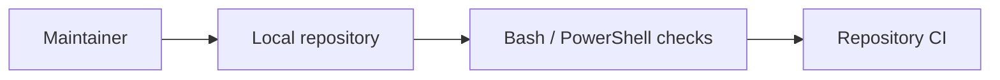

# Infrastructure Specification: Bootstrap Interviewer Enhancement

## Topology

## CI/CD and Environments

No deployed service or cloud environment is added. Local and CI validation run
the same repository fixtures. Plugin manifests and marketplace catalogs are
released together at version `1.4.0`.

## IaC, Scaling, and Cost

IaC and runtime scaling are not applicable. Added cost is bounded to static
file checks and review-input hashing.

## SLOs and Observability

- Validation availability target: 100% deterministic execution for valid local
  fixtures (AC-013).
- p95 selected-feature check target: under 2 seconds on the repository fixture
  corpus (AC-012).
- Failures expose a nonzero exit and stable file/value diagnostic.

## Rollback

Revert the synchronized release commit. Repository-only checker mode remains
the compatibility path throughout rollout.
