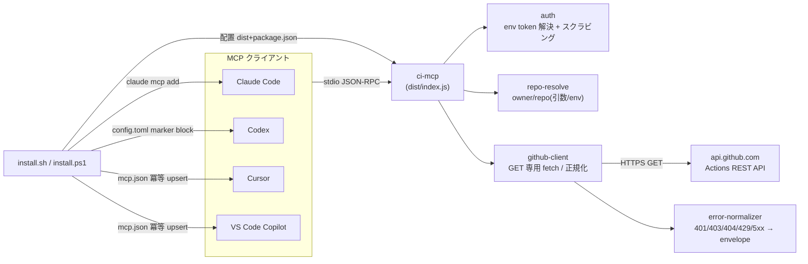

# Design: ci-mcp

Impl-Review-Status: Pending
Feature Type: api-only (read-only MCP server; no frontend/UI)

## Technical Summary

`mcp/ci-mcp/` に sdd-forge-mcp / local-env-mcp と同型の TypeScript + MCP SDK
(stdio)サーバーを新設する。CI 情報は GitHub Actions REST API(`api.github.com`)
への **GET 専用** HTTP 呼び出しのみから取得し、GitHub への write(POST/PATCH/
PUT/DELETE)・ローカル FS 書込み・shell 起動・任意コマンド実行は行わない。
認証は環境変数経由の read-only PAT のみで、トークン値はログ・エラー・応答に
出さない(スクラビング)。配布は ADR-0003(esbuild 単一バンドル + dist コミット
+ dist-parity CI)を踏襲。installer(sh/ps1)は `VALID_MCPS` / `MCP_LIST` に
`ci-mcp` を追加し、Claude / Codex / Cursor / VS Code への既存登録経路
(local-env-mcp で確立)に相乗りする。

**公式 github-mcp-server との関係**: 公式サーバーは Actions を含む GitHub 全域を
write 込みで公開しうる汎用 MCP である。ci-mcp はその置換・重複ではなく、
sdd-forge ワークフロー向けに **(1) エンベロープ正準化**(既存 2 MCP と同一の
`Result<T>` 契約でクライアントのエラー処理を共有)、**(2) read-only 保証**
(write ツールを型・静的検査レベルで排除し read/write 分離方針の read 側を機械的に
担保)、**(3) installer 同梱**(4 クライアントへの冪等登録)、の 3 点で差別化した
狭スコープ(Actions read のみ)の情報源を提供する。公式サーバーを併用する構成も
妨げない。

## Architecture

- サーバーは起動時に GitHub API を呼ばない(トークン検証も遅延)。ツール呼び出し
  時にのみ GET リクエストを行う(起動 <= 1 s SLO 維持)。
- トークン未設定はツール呼び出し時に `auth-missing` として返し、プロセスは
  落とさない(起動診断は成功のまま)。
- 応答の TTL キャッシュは第一版では持たない(CI 状態は鮮度が重要)。将来的な
  短 TTL は OQ 化せず後続 ADR とする(Assumptions 参照)。

## Components

| Component | Responsibility | Technology | New/Existing |
|---|---|---|---|
| `mcp/ci-mcp/src/index.ts` | エントリポイント・stdio transport 起動・起動診断(スクラビング) | TypeScript + @modelcontextprotocol/sdk | New |
| `mcp/ci-mcp/src/server.ts` | McpServer 構築・5 ツール登録 | 同上 | New |
| `mcp/ci-mcp/src/envelope.ts` | Result エンベロープ(既存 2 MCP と同一構造 + 追加 error code) | TypeScript | New(local-env-mcp から複製 + 拡張) |
| `mcp/ci-mcp/src/auth.ts` | 環境変数からの read-only トークン解決(優先順位)・スクラビングユーティリティ | TypeScript | New |
| `mcp/ci-mcp/src/repo-resolve.ts` | owner/repo の解決(ツール引数 / 環境変数、exec なし) | TypeScript | New |
| `mcp/ci-mcp/src/github-client.ts` | GET 専用 fetch ラッパ・上流エラー正規化・ジョブログ truncation・トークンヘッダ付与(値は非記録) | node fetch (undici) | New |
| `mcp/ci-mcp/src/tools/actions.ts` | 5 ツール実装(list_workflow_runs / get_workflow_run / list_run_jobs / get_job_log / list_run_artifacts) | TypeScript + zod | New |
| `mcp/ci-mcp/src/diagnostics.ts` | stderr JSON 診断・トークン/ヘッダのスクラビング(local-env-mcp と同型) | TypeScript | New |
| `contracts/ci-mcp-tools.v1.schema.json` | 全ツール応答の JSON Schema 契約 | JSON Schema | New |
| `install.sh` / `install.ps1` | VALID_MCPS / MCP_LIST 拡張 + トークン変数案内 | bash 3.2 / PowerShell | Existing(拡張) |
| `uninstall.sh` / `uninstall.ps1` | ci-mcp 登録解除 + 配置削除 | bash 3.2 / PowerShell | Existing(拡張) |
| `.github/workflows/test.yml` | ci-mcp のテスト + dist-parity 追加 | GitHub Actions | Existing(拡張) |

## Layer Specifications

| Layer | Summary | Canonical Detail | Owner | Status |
|---|---|---|---|---|
| UX | N/A — no change: GUI なし。消費者は AI クライアントと installer CLI のみ | [UX specification](ux-spec.md) | — | N/A |
| Frontend | N/A — no change: フロントエンド UI なし。ランタイム要件のみ記録 | [Frontend specification](frontend-spec.md) | — | N/A |
| Infrastructure | ローカル実行 + GitHub API への外向き HTTPS。esbuild バンドル配布・CI dist-parity・installer 配置/登録 | [Infrastructure specification](infra-spec.md#deployment-topology) | 実装タスク担当 | Planned |
| Security | write 非提供境界(B2)・トークン非漏えい・上流エラー正規化・IDE 設定ファイル保全(B3) | [Security specification](security-spec.md#trust-boundaries) | 実装タスク担当 | Planned |

## Cross-Layer Dependencies

| From | To | Contract / Decision | REQ | AC | Verification |
|---|---|---|---|---|---|
| requirements.md | security-spec.md | GET 専用・write API 不使用・write ツールなし | REQ-003 | AC-006, AC-007 | TEST-006, TEST-007 |
| requirements.md | security-spec.md | トークンは env のみ・値を非漏えい(スクラビング) | REQ-005 | AC-008, AC-009 | TEST-008, TEST-009 |
| requirements.md | security-spec.md | 上流エラー/rate limit の正規化・本文非転載 | REQ-006 | AC-010, AC-011 | TEST-010, TEST-011 |
| requirements.md | infra-spec.md | ADR-0003 準拠の dist 配布 + dist-parity CI | REQ-009 | AC-014 | TEST-014 |
| security-spec.md | infra-spec.md | installer は IDE 設定の他エントリを破壊しない(冪等 upsert)・トークン値を保存しない | REQ-010, REQ-011 | AC-016, AC-018 | TEST-016, TEST-018 |
| requirements.md | contracts/ci-mcp-tools.v1.schema.json | 全応答のエンベロープ契約(+ 追加 error code) | REQ-004 | AC-001〜005, AC-013 | TEST-001〜005, TEST-013 |

## ADR Change Log

| ADR | Decision | Status | Layer Impact | Supersedes | Date |
|---|---|---|---|---|---|
| ADR-0006 | ci-mcp は GitHub Actions を read-only(GET 専用)で提供し、write ツールを持たず、認証は env の read-only PAT のみ・値をスクラビングする。repo 内 mcp/ci-mcp/ 同梱で公式 github-mcp-server とは差別化する | Proposed | Security, Infra | none | 2026-07-06 |

## Data Plan

Data Entities: なし(永続データを持たない)。ツール応答はリクエスト毎に GitHub
API から取得し、キャッシュを持たない(第一版)。

Existing Data Affected: `~/.cursor/mcp.json`、VS Code ユーザープロファイル
`mcp.json`、`~/.codex/config.toml`、Claude Code の user-scope 設定(installer が
ci-mcp キーのみ upsert / 削除)。トークン値は installer もサーバーも永続化しない。

Migration Strategy: 不要(新規 feature)。IDE 設定ファイルは変更前の他エントリを
保持することをテストで保証(AC-016 / AC-018)。壊れた JSON は上書きしない
(local-env-mcp の ADR-0005 フェイルセーフを継承)。

## API / Contract Plan

- MCP ツール 5 種(いずれも read-only、破壊的操作なし)。owner/repo の解決は
  `repo-resolve`(OQ-001、暫定案: 各ツールが `owner` / `repo` を任意引数で受け、
  未指定時は環境変数 `CI_MCP_REPO`(`owner/repo` 形式)にフォールバック。両方
  なければ `invalid-input`):
  - `list_workflow_runs`(入力: `owner?`, `repo?`, `branch?`, `status?`(enum:
    queued/in_progress/completed 等), `event?`, `perPage?`(1..100))→
    `{ kind: "workflow-runs", runs: [{ id, name, status, conclusion, branch,
    event, runNumber, createdAt, updatedAt, htmlUrl }] }`
  - `get_workflow_run`(入力: `owner?`, `repo?`, `runId`)→
    `{ kind: "workflow-run", run: { id, name, workflowName, status, conclusion,
    branch, event, runNumber, headSha, createdAt, updatedAt, runStartedAt,
    htmlUrl } }`
  - `list_run_jobs`(入力: `owner?`, `repo?`, `runId`)→
    `{ kind: "run-jobs", jobs: [{ id, name, status, conclusion, startedAt,
    completedAt, failedStep? }] }`
  - `get_job_log`(入力: `owner?`, `repo?`, `jobId`)→
    `{ kind: "job-log", jobId, log, truncated, returnedBytes }`(log は末尾優先
    で <= 256 KiB)
  - `list_run_artifacts`(入力: `owner?`, `repo?`, `runId`)→
    `{ kind: "run-artifacts", artifacts: [{ id, name, sizeBytes, expired,
    expiresAt, createdAt }] }`(バイナリ内容は含まない、OQ-002)
- エラーエンベロープは既存 2 MCP と同一構造(`ok`/`data` | `ok`/`error`)。
  error code enum は既存 7 種を契約互換のため保持し、ci-mcp 固有の
  **`upstream-error`**(GitHub 5xx / ネットワーク失敗)、**`rate-limited`**
  (429 / 403 + rate-limit ヘッダ)、**`auth-missing`**(トークン未設定)を
  追加する(計 10 種)。追加は sdd-forge-mcp / local-env-mcp の v1 enum の
  上位互換拡張として扱う。
- 上流 HTTP ステータス → error code マッピング(REQ-006):

  | GitHub 応答 | error code | 備考 |
  |---|---|---|
  | 401 Unauthorized | `auth-missing` | トークン不正/失効。値は details に載せない |
  | 403 + `x-ratelimit-remaining: 0` | `rate-limited` | リセット時刻を details(非機微) |
  | 403(その他) | `path-denied` | スコープ不足等 |
  | 404 Not Found | `not-found` | run/job/artifact 不在 |
  | 429 Too Many Requests | `rate-limited` | 同上 |
  | 5xx / ネットワーク失敗 / timeout | `upstream-error` | 上流本文は転載しない |

- 認証(OQ-004、暫定案): トークン解決の優先順位は
  `CI_MCP_GITHUB_TOKEN` → `GH_READONLY_TOKEN` → `GITHUB_TOKEN` の順。最初に
  見つかった非空値を使用。`Authorization: Bearer <token>` として付与するが、
  トークン値・ヘッダは診断ログにもエラーにも出さない。未解決時は `auth-missing`。
- ジョブログ取得(REQ-008): Actions API のログエンドポイント(zip または
  redirect されるプレーンテキスト)を GET し、受信ストリームを 256 KiB の
  リングバッファで末尾優先に保持。上限超過時 `truncated: true` + `returnedBytes`。
- 契約は `contracts/ci-mcp-tools.v1.schema.json`(v1)。破壊的変更は v2 + 新 ADR
  を要する(既存 MCP と同じ規約)。artifact 内容取得(OQ-002)や GHES base URL
  (OQ-003)は必要になれば v1 のマイナー互換拡張または新 REQ で扱う。
- installer 登録形式は local-env-mcp と同一(command: node, args:
  `[<install-root>/mcp/ci-mcp/dist/index.js]`)。トークン env はサーバー起動時に
  クライアントが渡す想定で、installer は値を保存せず変数名を案内するのみ。

## Test Strategy

- TDD(high リスクタスク): github-client(GET 固定・エラー正規化)、auth
  (スクラビング)、repo-resolve(exec なし)は Red→Green evidence を記録する。
- 単体/契約: ツール応答の契約準拠(ajv で `ci-mcp-tools.v1.schema.json` 検証、
  追加 error code を含む。AC-013)。
- integration(fake GitHub API): 実ネットワークに接続せず、ローカルの
  フェイク HTTP サーバー(またはインジェクトした fetch)で run / job / log /
  artifact 応答をスタブし、5 ツールの正常系(AC-001〜005)と error-path
  (401/403/404/429/5xx。AC-010/011)を検証。
- error-path: 大容量ログ fixture で truncation(AC-004)、rate-limit fixture で
  `rate-limited` + 非機微 details(AC-011)。
- no-secrets: canary トークン env + 応答/`stderr`/エラーの grep(AC-009)。
- 静的 write 検査: fetch の write メソッド(POST/PATCH/PUT/DELETE)・
  `child_process`(exec/spawn/execFile)・fs 書込み API・`eval` を禁止パターンと
  し 0 件を確認(AC-007)。入力スキーマに write 誘発フィールドが無いことも検査
  (AC-006)。
- auth: トークン未設定で `auth-missing`・プロセス継続(AC-008)。
- スモーク: MCP Inspector CLI で `tools/list`(5 ツール。AC-015)。
- installer: `tests/install.tests.sh` / `.ps1` の既存ハーネス(HOME 隔離)に
  ci-mcp 配置・4 クライアント登録・冪等性・トークン変数案内・uninstall ケースを
  追加(AC-016〜018)。
- CI: `.github/workflows/test.yml` に ci-mcp の typecheck / test / dist-parity
  ジョブを追加(既存 2 MCP と同型)。

## Security Boundaries

| Trust Boundary | Auth/Authz Mechanism | Data Classification | OWASP Concerns |
|---|---|---|---|
| B1: MCP クライアント ↔ サーバー(stdio) | なし(OS ユーザー境界) | internal | Injection(入力スキーマで遮断) |
| B2: サーバー ↔ GitHub Actions API(HTTPS GET) | env の read-only PAT・GET 固定・shell なし | internal(上流出力は untrusted) | Broken Access Control / SSRF / 資格情報漏えい / DoS |
| B3: installer ↔ IDE 設定ファイル | ユーザー権限・管理キーのみ upsert・トークン値を保存しない | internal | データ破壊(フェイルセーフで防止) |

Detailed controls: [Security specification](security-spec.md#trust-boundaries)。

## Deployment / CI Plan

- 配布: ADR-0003 と同一。`mcp/ci-mcp/dist/index.js` をコミットし、installer が
  `dist/*` + `package.json` の最小ペイロードを配置。
- installer は `place_mcp_servers()` / `Install-McpServerPayloads` の既存
  複数 MCP ループ(local-env-mcp 追加時に汎化済み)をそのまま利用し、
  `VALID_MCPS` / `MCP_LIST` に `ci-mcp` を足す。
- CI: test.yml に ci-mcp ジョブ追加。dist-parity は既存 MCP と同じ「再ビルド →
  diff」方式。GitHub API に依存するテストは fake サーバーで実ネットワークを
  使わない(CI は外向き通信なしで green)。
- ロールバック: 単一 revert で dist ごと戻る(ADR-0003 の利点)。installer 変更も
  同一 PR に含め、revert 単位を揃える。

## Constraint Compliance

| Requirement Constraint | Design Response |
|---|---|
| write 操作を持たない(read/write 分離方針) | ツール入力に action/method/body なし。GitHub API は GET 固定。write メソッド・write ツール不在を静的検査(AC-006/AC-007) |
| read-only(ローカル書込みなし) | fs 書込み API 不使用を静的検査。ツール経路では fs 読み取りも不使用 |
| トークン非漏えい | env のみで受領・`Authorization` 値/トークンを応答/ログ/エラーに含めない(スクラビング、AC-009)。gh CLI 実行なし(exec 禁止の静的検査) |
| 上流エラー正規化 | 401/403/404/429/5xx をエンベロープ error code にマップ、上流本文非転載(AC-010/011) |
| ジョブログ上限 | 256 KiB 末尾優先 truncate + `truncated` フラグ(AC-004) |
| ADR-0003 踏襲 | esbuild 単一バンドル + dist コミット + dist-parity CI + Node >= 20 |
| install 時選択可・デフォルト同梱 | 既存 `--mcp` / `--skip-mcp` 機構に `ci-mcp` を追加、`MCP_LIST` 既定に含める |
| 公式 github-mcp-server と非重複 | Actions read のみの狭スコープ + エンベロープ正準 + read-only 保証 + installer 同梱で差別化 |

## Assumptions

- requirements.md の Assumptions を参照(github.com を第一対象、read-only PAT の
  提供、「read-only」の解釈 = ADR-0006)。
- GitHub Actions REST API のエンドポイント(list workflow runs / get run /
  list jobs / download job logs / list artifacts)が read scope の
  fine-grained PAT で GET 可能である(実装タスク着手時に公式ドキュメントで
  最新のパス・スコープを確認する)。
- installer の既存 MCP 機構(local-env-mcp で複数 MCP に汎化済み)は名前追加で
  ci-mcp に対応できる(install.sh:18-21 の `MCP_LIST` / `VALID_MCPS` で確認)。
- 応答キャッシュを持たない設計は CI 状態の鮮度優先による。短 TTL が必要になれば
  後続 ADR で追加する(現時点では OQ 化しない)。

## Open Questions

### OQ-001: 対象リポジトリ(owner/repo)の指定方法

requirements.md OQ-001 と同一。暫定案(ツール引数優先・`CI_MCP_REPO` 環境変数
フォールバック・exec による git remote 参照なし)を本書「API / Contract Plan」に
記載。正準の優先順位は製品判断として、ツール入力スキーマ確定前に確定する。

Owner: 実装タスク担当(ツール入力設計) / 承認は人間
Blocks Implementation: partial(入力スキーマ確定に必要)
Resolution Path: 製品判断 → 本節と契約を更新

### OQ-002: artifact のダウンロード保存の要否

requirements.md OQ-002 と同一。第一案はメタデータ列挙のみ。中身取得(サイズ
上限付きで応答内に返す or ローカル保存)が必要かは製品判断。ローカル保存は
read-only 方針と衝突するため、必要なら新 ADR + contract マイナー変更。

Owner: 製品判断(人間)
Blocks Implementation: no(第一案で REQ-002 充足)
Resolution Path: 利用実態確認 → 必要なら新 REQ / 新 ADR / contract v1.1

### OQ-003: GitHub Enterprise Server の base URL 設定可否

requirements.md OQ-003 と同一。第一案は `api.github.com` 固定。GHES 対応が要件
なら `CI_MCP_API_BASE_URL` を追加。SSRF 面から、任意 URL でなく既知ホストの
allowlist / 形式検証を伴う設計とする。

Owner: 製品判断(人間)
Blocks Implementation: no(github.com 固定で MVP 成立)
Resolution Path: 需要確認 → 必要なら base URL 環境変数 + allowlist を design に追加

### OQ-004: read-only トークンの環境変数名と優先順位

requirements.md OQ-004 と同一。暫定案(`CI_MCP_GITHUB_TOKEN` →
`GH_READONLY_TOKEN` → `GITHUB_TOKEN`)を本書に記載。`GITHUB_TOKEN` を
フォールバックに含めるか(高権限トークン混入リスク)は製品判断。GitHub PAT
インベントリの read-only PAT 方針と整合させる。

Owner: 製品判断(人間)
Blocks Implementation: partial(認証実装タスク冒頭で確定)
Resolution Path: 製品判断 → 本節と security-spec.md を更新

## Risks

- write API / write ツールの混入は read/write 分離方針を破綻させる。→ GET 固定
  と write メソッド・write ツール不在の静的検査(AC-006/AC-007)を必須。
- トークンの応答/ログ/エラー漏えい。→ スクラビング + canary 検査(AC-009)。
- SSRF(base URL や owner/repo 経由で任意ホストへ到達)。→ 第一版はホスト固定
  (`api.github.com`)。GHES 対応時(OQ-003)は allowlist / 形式検証を必須化。
- 上流仕様変更・rate limit 挙動差。→ 正規化レイヤー + fake HTTP のエラーパス
  テストで吸収。手動での `gh` フォールバック手順を USERGUIDE に併記(REQ-012)。
- ジョブログの巨大出力によるメモリ枯渇。→ リングバッファ + 256 KiB 上限。
