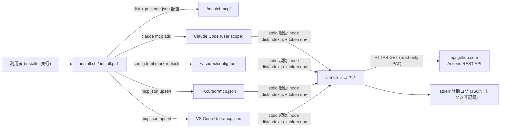
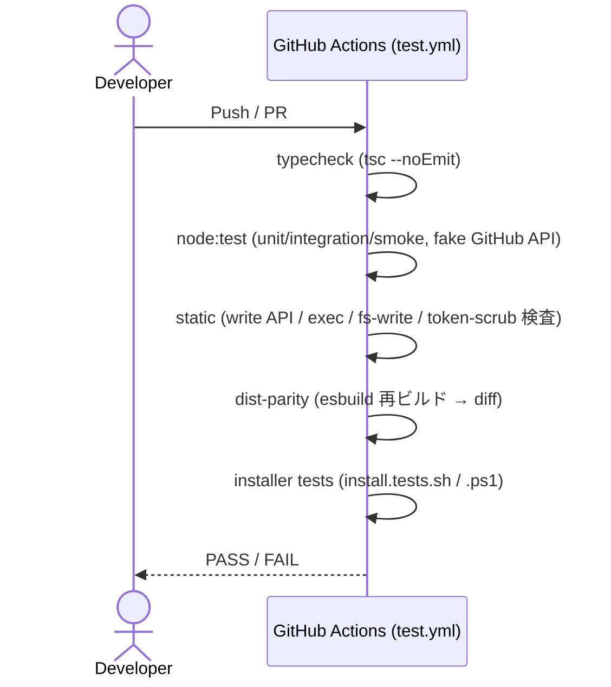

# Infrastructure Specification: ci-mcp

ローカル実行 + GitHub API への外向き HTTPS(GET 専用)。クラウド配備はない。
sdd-forge-mcp / local-env-mcp の infra-spec を踏襲し、差分(GitHub API への
外向き通信、トークン env)を明示する。

## Deployment Topology

- ネットワーク: サーバーは `api.github.com` への外向き HTTPS GET のみ行う
  (待受ポートなし)。第一版は base URL を github.com に固定(GHES は OQ-003)。
- 障害ドメイン: MCP プロセス単体 + 上流 GitHub API 可用性。クライアントごとに
  独立プロセス。上流障害・rate limit はエラーエンベロープに正規化(REQ-006)。

## CI/CD Sequence

CI は実ネットワークに接続せず、GitHub API はフェイク HTTP でスタブする
(REQ-013)。リリースは既存 release.yml のリポジトリ配布に相乗り(dist コミット
済みのため追加ビルド工程なし)。

## Environments

| Environment | URL | Auth | Trigger | Classification | Promotion Rule |
|---|---|---|---|---|---|
| local dev | mcp/ci-mcp/(repo 内) | OS ユーザー / fake API | npm run build / test | internal | PR + CI green |
| local usage | <install-root>/mcp/ci-mcp/ | OS ユーザー + read-only PAT(env) | installer 実行 | internal | main マージ済みのみ配布 |
| staging / production | N/A | — | — | — | N/A(ローカル専用) |

## Infrastructure as Code

N/A — no cloud: installer スクリプト(install.sh / install.ps1 / uninstall.*)
が配置・登録の正準定義(REQ-010, REQ-011)。Terraform 等は使用しない。上流の
GitHub リポジトリ・PAT の準備は利用者側の責務(README / USERGUIDE で案内)。

## Scaling Strategy

N/A — 単一ユーザー・ステートレス。応答キャッシュを持たない(CI 状態鮮度優先)。
GitHub API の rate limit は上流側の制約であり、到達時は `rate-limited` として
正規化する(REQ-006)。ジョブログは 256 KiB 上限でメモリ使用を抑制(REQ-008)。

## Service Level Objectives

| Signal | Numeric Target | Window | Measurement | Error-Budget Action | AC |
|---|---:|---|---|---|---|
| サーバー起動時間 | <= 1 s | 毎回 | smoke テスト(GitHub API 未接続) | 回帰調査 | AC-015 |
| ツール応答 p95(上流正常時) | <= 2 s | テスト実行(fake API) | integration 計測 | 上流 latency 見直し | AC-001 |
| ジョブログ応答上限 | <= 256 KiB 返却 | 毎回 | truncation テスト | 上限見直し | AC-004 |

上流 GitHub API の latency / 可用性はサーバーの管理外であり、SLO は fake API
下での自コード応答時間に対して定義する。

## Data Residency and Retention

| Entity | Residency | Retention | Backup | Deletion Verification | REQ | AC |
|---|---|---|---|---|---|---|
| CI メタデータ・ジョブログ | プロセスメモリのみ(キャッシュなし) | リクエスト処理中のみ / 応答後破棄 | なし | プロセス終了 | REQ-002 | AC-001〜005 |
| read-only トークン | 環境変数(プロセス env) | プロセス寿命のみ・永続化しない | なし | プロセス終了 | REQ-005 | AC-008, AC-009 |
| IDE 設定ファイル(mcp.json 等) | ユーザーホーム | ユーザー管理 | installer は変更前に他エントリ保持を保証・トークン値は書かない | uninstall テスト | REQ-010, REQ-011 | AC-016, AC-018 |

## Observability

| Logs | Traces | Metrics | Alert | Owner | Runbook |
|---|---|---|---|---|---|
| stderr JSON 診断(起動時 1 行 + 致命エラー)。トークン値・`Authorization` ヘッダ・上流レスポンス本文を含めない(REQ-005, REQ-006) | N/A | N/A | N/A | 利用者 | USERGUIDE の troubleshooting 節(REQ-012) |

installer の通知メッセージ(登録成功 / クライアント未導入スキップ / 必要な
トークン環境変数名の案内 / 壊れ JSON エラー)は AC-016 / AC-017 / AC-018 の
検証対象。

## Cost Estimate

N/A — ローカル実行のみ(クラウドコストなし)。GitHub API 呼び出しは利用者の
PAT の rate limit 枠を消費するが、金銭コストは発生しない。

## Rollback

- トリガー: dist-parity 失敗、installer による IDE 設定破壊の報告、トークン
  漏えいの疑い、write API 混入の検知。
- 手順: 該当 PR を単一 revert(dist 含む、ADR-0003 方式)→ installer 再実行で
  旧構成を再登録。uninstall.sh / .ps1 で ci-mcp 登録エントリの手動除去も可能
  (REQ-011)。
- 最大ロールバック時間: revert + 再インストールで 10 分以内。
- 検証: `tests/install.tests.sh` の冪等ケース + AC-018 の uninstall ケースを
  再実行して green を確認。

## Open Questions

- なし(OQ-001〜004 は requirements.md / design.md 管理。インフラ影響は
  外向き HTTPS 先が github.com 固定である点のみで、GHES base URL は OQ-003)
