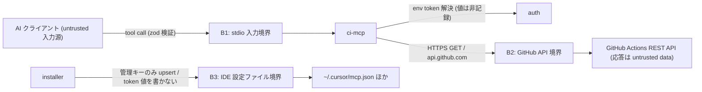
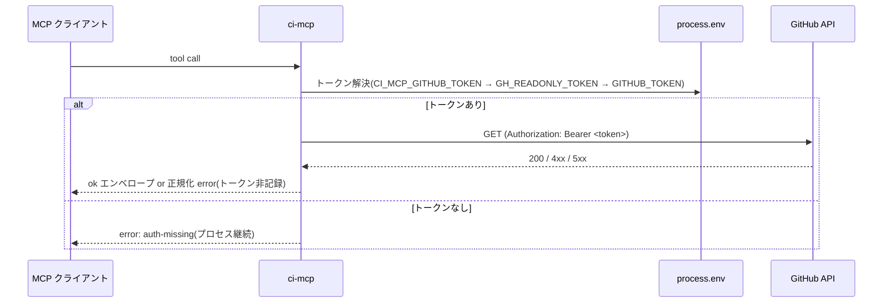

# Security Specification: ci-mcp

GitHub への write を一切行わない read-only CI 情報サーバー、環境変数トークンの
取り扱い、上流エラー正規化、および installer の IDE 設定ファイル操作の
セキュリティ仕様。REQ-NNN / AC-NNN は requirements.md / acceptance-tests.md の
正準 ID を参照する。

## Trust Boundaries

| Boundary | Source | Destination | Assets | Validation | AuthN/AuthZ | REQ | AC |
|---|---|---|---|---|---|---|---|
| B1 | MCP クライアント | ci-mcp | ツール入力 | zod スキーマ(owner/repo + read 絞り込みのみ、action/method/body 系フィールドなし) | なし(OS ユーザー境界) | REQ-003, REQ-007 | AC-006, AC-012 |
| B2 | ci-mcp | GitHub Actions API | CI メタデータ・ジョブログ・トークン | GET 固定 / ホスト固定(api.github.com) / 上限 truncation / 上流エラー正規化 | env の read-only PAT(値を非漏えい) | REQ-001, REQ-003, REQ-005, REQ-006 | AC-007, AC-009, AC-010 |
| B3 | installer | IDE 設定ファイル | mcp.json / config.toml | JSON parse 検証・管理キーのみ upsert・壊れ JSON は不変更・トークン値を書かない | ユーザー権限 | REQ-010, REQ-011 | AC-016, AC-018 |

## STRIDE Analysis

| Boundary | Threat | STRIDE | Abuse Case | Mitigation | Verification | REQ-NNN | AC-NNN |
|---|---|---|---|---|---|---|---|
| B1 | 入力経由の write 誘発 | Tampering / Elevation of Privilege | ツール入力に `method: "POST"` や `action: "rerun"` を渡して write を誘発 | 入力スキーマに write 誘発フィールド(action/method/body)が型レベルで存在しない。API 呼び出しは GET 固定 | TEST-006, TEST-007 | REQ-003 | AC-006, AC-007 |
| B2 | トークン漏えい | Information Disclosure | 応答/ログ/エラーに `Authorization` ヘッダ値・PAT が混入 | トークンは env のみで受領、`Authorization` 値を診断ログ・エラー message/details・応答に含めない(スクラビング)。canary トークンで grep 検査 | TEST-009 | REQ-005 | AC-009 |
| B2 | 認証情報の欠落によるクラッシュ/誤動作 | Denial of Service | トークン未設定でプロセスが落ちる/未認証で大量リクエスト | 未設定は `auth-missing` エンベロープで返しプロセス継続。GET のみで write 副作用なし | TEST-008 | REQ-005 | AC-008 |
| B2 | 任意ホストへの到達(SSRF) | Tampering / Information Disclosure | base URL や owner/repo 経由で内部/攻撃者ホストへ GET | 第一版は base URL を `api.github.com` に固定。owner/repo は path 要素として URL エンコードし、ホストを差し替えられない。GHES 対応(OQ-003)は allowlist / 形式検証必須 | TEST-006, TEST-010 | REQ-001, REQ-007 | AC-006, AC-010 |
| B2 | 上流エラー本文経由の情報汚染 | Tampering / Information Disclosure | GitHub の 4xx/5xx 本文にトークンや内部情報が反映され応答へ転載される | 上流レスポンス本文を応答に転載せず、正規化した error code + 非機微 message のみ返す。rate-limit details も非機微に限定 | TEST-010, TEST-011 | REQ-006 | AC-010, AC-011 |
| B2 | 巨大ジョブログによる資源枯渇 | Denial of Service | 攻撃的に巨大なジョブログを取得させメモリを枯渇 | リングバッファ + 256 KiB 上限(末尾優先)・`truncated` フラグ | TEST-004 | REQ-008 | AC-004 |
| B3 | IDE 設定の破壊 | Tampering | upsert 失敗で他 MCP エントリが消える | 管理キーのみ更新・他エントリ保持・壊れ JSON は不変更でエラー通知(local-env-mcp ADR-0005 継承) | TEST-016, TEST-018 | REQ-010, REQ-011 | AC-016, AC-018 |
| B3 | トークン値の設定ファイル書き込み | Information Disclosure | installer が IDE 設定にトークン値を平文で書く | installer は env 変数名を案内するのみで、トークン値を設定ファイルに書かない | TEST-016 | REQ-010 | AC-016 |

## Authentication Flow

ci-mcp 自身は認証サーバーではなく、環境変数で与えられた read-only PAT を GitHub
API への Bearer トークンとして中継するのみ。ネットワーク待受なし。優先順位の
確定は OQ-004。

## Authorization

| Actor / Role | Resource | Action | Decision Point | Default | Denial Evidence | REQ | AC |
|---|---|---|---|---|---|---|---|
| MCP クライアント | CI 情報(run/job/artifact メタデータ・ログ) | read | ツール定義(5 種のみ公開、GET 固定) | deny(未定義ツールなし) | tools/list スモーク | REQ-002 | AC-015 |
| MCP クライアント | GitHub への write(rerun/cancel/dispatch 等) | write | 提供しない(ツール自体が存在しない・GET 固定) | deny | 静的検査 + 入力スキーマ検査 | REQ-003 | AC-006, AC-007 |
| MCP クライアント | ローカルファイルシステム | read/write | 提供しない | deny | 静的検査 | REQ-001 | AC-007 |
| MCP クライアント | トークン値の取得 | read | 提供しない(env 値を返すツールなし) | deny | no-secrets 検査 | REQ-005 | AC-009 |

## Data Classification and Protection

| Entity | Classification | At Rest | In Transit | Retention | Deletion | Access Log | REQ | AC |
|---|---|---|---|---|---|---|---|---|
| CI メタデータ・ジョブログ | internal | 保存しない(キャッシュなし) | HTTPS(上流)+ stdio(ローカル IPC) | 応答処理中のみ | 応答後破棄 / プロセス終了 | なし | REQ-002 | AC-001〜005 |
| read-only トークン | restricted | env(プロセス寿命)・応答/ログに出さない | HTTPS の Authorization ヘッダのみ | プロセス寿命 | プロセス終了 | なし(スクラビング) | REQ-005 | AC-009 |
| 上流エラー本文 | untrusted | 保存しない | — | 転載しない | — | — | REQ-006 | AC-010 |
| IDE 設定ファイル | internal(ユーザー所有) | ユーザーホーム | — | ユーザー管理 | uninstall で管理エントリのみ除去 | installer 出力 | REQ-010, REQ-011 | AC-016, AC-018 |

## OWASP Mapping

| OWASP Risk | Exposure | Control | Verification | Owner |
|---|---|---|---|---|
| Broken Access Control | write ツール/write API の誤公開 | ツール 5 種のみ・GET 固定・静的検査で write メソッド/exec/fs-write 禁止 | TEST-006, TEST-007 | 実装タスク担当 |
| Cryptographic / Sensitive Data Failures | トークンの応答/ログ漏えい | env のみ受領・スクラビング・canary 検査 | TEST-009 | 実装タスク担当 |
| Injection | ツール入力 → URL / write | enum + 形式検証・path 要素のエンコード・GET 固定 | TEST-006 | 実装タスク担当 |
| SSRF | base URL / owner/repo 経由の任意ホスト到達 | ホスト固定(api.github.com)・GHES は allowlist(OQ-003) | TEST-006, TEST-010 | 実装タスク担当 |
| Security Misconfiguration | IDE 設定破壊・トークン平文書込み | 冪等 upsert・壊れ JSON フェイルセーフ・トークン値非書込み | TEST-016, TEST-018 | 実装タスク担当 |
| Vulnerable Components | 依存 3 パッケージ(HTTP は Node 内蔵) | package-lock.json 固定・npm audit(CI) | CI | 実装タスク担当 |
| Identification & Authentication Failures | トークン未設定/失効 | `auth-missing` / 401→`auth-missing` 正規化・プロセス継続 | TEST-008, TEST-010 | 実装タスク担当 |

## Secrets Management

- read-only トークンは環境変数からのみ取得する(優先順位は OQ-004、暫定
  `CI_MCP_GITHUB_TOKEN` → `GH_READONLY_TOKEN` → `GITHUB_TOKEN`)。gh CLI 実行
  によるトークン取得は行わない(exec 回避、静的検査で `child_process` 禁止)。
- トークン値・`Authorization` ヘッダ値を応答・stderr ログ・エラー
  message/details に一切含めない(スクラビング。REQ-005 / AC-009 の canary
  検査対象)。診断ログは固定フィールド allowlist のみ出力(local-env-mcp の
  diagnostics と同型)。
- サーバーはローカルの秘密ファイル(.env / 署名鍵 等)にアクセスしない
  (ファイルシステム読取り自体を行わない設計)。
- installer は資格情報を扱わない: IDE 設定ファイルにコマンドパスのみ書き、
  トークン値は書かず、必要な環境変数名を案内する(REQ-010 / AC-016)。

## SBOM and Supply Chain

- package-lock.json をコミットし依存を固定(既存 2 MCP と同一運用)。HTTP は
  Node 内蔵 `fetch`(undici)で追加依存なし。
- dist-parity CI により、コミット済みバンドルが宣言された src / lockfile から
  再現可能であることを保証(改竄検知。REQ-009 / AC-014)。
- 依存は MIT ライセンスの 3 パッケージ(frontend-spec.md 参照)。npm audit を
  CI で実行。

## Security Tests

| Test | Boundary | Attack / Control | Expected Result | Evidence | AC |
|---|---|---|---|---|---|
| TEST-006 | B1 | write 誘発フィールド / 不正 owner/repo / パス文字列を入力 | `invalid-input`、write 不実行 | mcp/ci-mcp/tests/no-write/ | AC-006 |
| TEST-007 | B2 | src の静的検査 | fetch の write メソッド・exec/spawn/execFile・fs 書込み・eval が 0 件 | mcp/ci-mcp/tests/readonly/ | AC-007 |
| TEST-008 | B2 | トークン env 未設定で全ツール実行 | `auth-missing`・プロセス継続 | mcp/ci-mcp/tests/auth/ | AC-008 |
| TEST-009 | B1/B2 | canary トークン env 設定下で全ツール実行 | 応答・stderr・エラーに canary/`Authorization` 値が不在 | mcp/ci-mcp/tests/no-secrets/ | AC-009 |
| TEST-010 | B2 | 401/403/404/429/5xx / ネットワーク失敗の fake API | 正規化 error code・上流本文非転載 | mcp/ci-mcp/tests/error-paths/ | AC-010 |
| TEST-011 | B2 | 429 / 403+rate-limit ヘッダの fake API | `rate-limited` + 非機微 details のみ | mcp/ci-mcp/tests/error-paths/ | AC-011 |
| TEST-016/018 | B3 | 既存エントリありの mcp.json へ登録・再実行・uninstall | 他エントリ保持・冪等・ci-mcp のみ除去・トークン値非書込み | tests/install.tests.sh | AC-016, AC-018 |

## Open Questions

- OQ-004(トークン環境変数名と優先順位)はセキュリティ影響を伴う。暫定
  優先順位を design.md / 本書に記載済みで、正準確定はスクラビング境界の設計に
  影響しない(いずれの変数名でも値は非漏えい)。確定は認証実装タスク冒頭。
- OQ-003(GHES base URL)は SSRF 面の設計に影響する。第一版はホスト固定で
  リスクを回避し、対応時は allowlist / 形式検証を必須とする。
