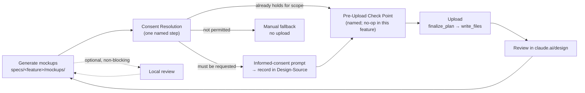

# Design: design-sync-consent

Impl-Review-Status: Pending
Feature Type: feature (workflow/policy change to an existing internal skill; no application code)

## Architecture Overview

There is no executable code path to design. `design-sync-loop` is a `SKILL.md` — natural-language instructions an agent follows — so the "implementation" of this feature is text, and its correctness is established by document-conformance assertions (see `acceptance-tests.md`). This is stated first because it bounds every decision below: the design cannot enforce anything at runtime, only specify it precisely enough that a mechanical gate (#139) and a project setting (#140) can be attached later.

The change has four edit surfaces:

| Surface | Files | Nature |
|---|---|---|
| **The loop itself** | `plugins/sdd-bootstrap/skills/design-sync-loop/SKILL.md` | the substantive change: consent unit, step order, local-review demotion, `Design-Source` record shape, the named pre-upload point |
| **Reconciliation** | `sdd-bootstrap-interviewer/SKILL.md:84`, `docs/workflow-guide.md:224` | remove the second and third independent statements of the per-upload model |
| **Protected staging** | `plugins/sdd-lite/skills/lite-spec/SKILL.md` | agent drafts, human applies (BL-004) |
| **Verification** | `tests/design-system-contract.tests.{sh,ps1}`, registered in `tests/run-all.{sh,ps1}` | the assertions (R-OQ-8); CI registration staged separately |

`plugins/sdd-bootstrap/skills/sdd-bootstrap-interviewer/references/claude-design-workflow.md` is listed as a target by the issue but is expected to need **no substantive change**: the fallback performs no upload (`:12`, `:70-71`), so a change to the egress consent unit does not reach it. The design records this as a deliberate no-op rather than dropping the file from the plan, so a reviewer can see it was considered. If reconciliation for #140's `off` mode later requires the fallback to describe being *forced* rather than *fallen back to*, that is #140's edit, not this one.

### The central structural decision

Today the loop fuses three things into one step (`SKILL.md:83-87`): deciding whether to upload, deciding *this* upload is acceptable, and performing the upload. Per-upload consent makes that fusion harmless — the human is present at each of the three.

Per-feature consent breaks it. This design therefore **splits the fused step into three named, separately-addressable stages**:



Each split earns its keep:

- **Consent Resolution is a step, not a question.** It has three outcomes, not two (AC-019). `must be requested` and `already holds` are what #138 needs; `not permitted` is what #140's `off` needs, and retrofitting a third outcome into a two-valued decision means re-cutting the flow. Adding it now costs one sentence.
- **The Pre-Upload Check Point exists and does nothing in this feature.** It is the single place between "mockups on disk" and "first byte out" where a blocking check attaches (#139). It is deliberately **distinct from consent**, because #140's `standing` mode skips consent — and if the check lived inside consent, `standing` would silently delete #139's control.
- **Local review moves off the path entirely.** Not "later in the path": off it. It becomes an offer the agent may make at any point, whose outcome feeds regeneration, and which nothing waits on.

The alternative considered and rejected: keep one step and add a "have we asked before?" conditional inside it. Cheaper to write, and it satisfies #138's five acceptance boxes. It fails REQ-006 on both counts — there is no place to put #139's gate that `standing` would not remove, and there is no outcome slot for `off`.

## Components

| Component | Status | Change |
|---|---|---|
| `plugins/sdd-bootstrap/skills/design-sync-loop/SKILL.md` — frontmatter `description:` (`:3`) | Existing (edited) | drop "per-upload human approval"; state the per-feature model (REQ-007 site 1) |
| — `## Loop` (`:66-90`) | Existing (restructured) | steps re-ordered per the diagram; consent resolution, pre-upload point, and the demoted local review written in |
| — `## Boundaries` (`:92-111`) | Existing (edited) | `:97-98` restated for the per-feature unit; `:94-95`, `:96`, `:99-111` unchanged (BL-003) |
| — `## Capability Detection` (`:22-30`) | **Untouched** | both branches preserved verbatim (AC-013); consent resolution is specified to run *after* it, so an absent tool never reaches a consent prompt |
| — `## Ensure design-system/` (`:32-64`) | **Untouched** | BL-007 — all seven `DS-006` literals have an occurrence inside this section (heading `:32`, `ui-ux-pro-max` `:39`, `design-system --persist` `:43`, `MASTER.md` `:44`, `design-system/design-tokens.json` `:45`, `figma-dtcg-import` `:53`, the D6 note `:56`), so leaving it intact satisfies BL-007 on its own |
| `plugins/sdd-bootstrap/skills/sdd-bootstrap-interviewer/SKILL.md:84` | Existing (edited) | one clause; `:86-87`'s `ds_profile: none` guarantee two lines below is not touched (AC-016) |
| `docs/workflow-guide.md:224` | Existing (edited) | one clause in §3.1b |
| `plugins/sdd-lite/skills/lite-spec/SKILL.md:62-66` | **Protected — staged only** | agent writes a `.draft.md` candidate at a non-protected path plus `MANIFEST.sha256`; a human applies it (BL-004) |
| `plugins/sdd-bootstrap/skills/sdd-bootstrap-interviewer/references/claude-design-workflow.md` | Existing (expected no-op) | reviewed; changed only if reconciliation demands it |
| `CHANGELOG.md:1301` | **Untouched** | historical release note (BL-006, AC-022) |
| `tests/design-system-contract.tests.{sh,ps1}` | Existing (extended) | the assertions live here (R-OQ-8 part 1) |
| `.github/workflows/test.yml` | **Protected — separate staged patch** | CI registration is staged for a human, outside this decomposition (R-OQ-8 part 3, BL-005) |
| `tests/run-all.sh`, `tests/run-all.ps1` | Existing (extended) | register the contract suite; unprotected, so agent-applicable (R-OQ-8 part 2) |
| `AGENTS.md` | **Untouched** | `ds_upload_consent` is #140 |
| `specs/workflow-state-registry.json` | Registration pending | one entry required (BL-009, INV-023) |

## Layer Specifications

| Layer | Summary | Canonical Detail | Owner | Status |
|---|---|---|---|---|
| UX | N/A — no rendered surface. The only human-perceivable change is an agent-emitted consent prompt inside an existing skill flow. | [UX specification](ux-spec.md#scope-and-user-journeys) | — | N/A — no change: no view, dialog, menu item or context action |
| Frontend | N/A — no browser, bundle, or build output. | [Frontend specification](frontend-spec.md#technology-stack) | — | N/A — no change: Markdown and shell/PowerShell test assertions only |
| Infrastructure | No new CI step inside this decomposition — CI registration is a separately staged patch (R-OQ-8 part 3); one protected human-copy staging round, for `lite-spec/SKILL.md`. | [Infrastructure specification](infra-spec.md#deployment-topology) | maintainers | Drafted |
| Security | **Load-bearing.** This feature relaxes a data-egress boundary: what leaves, to where, under whose consent, and what per-feature consent forfeits relative to per-upload. | [Security specification](security-spec.md#trust-boundaries) | security | Drafted |

## Design System Compliance

**N/A — ds_profile: none.**

`sdd-forge` is a CLI/plugin repository with no UI, so it has no project-level `design-system/` directory and never invokes `design-sync-loop` on itself. This feature changes the *specification of* the design-system integration loop without being a consumer of it — which is also why no mockup has ever been generated here (INV-010) and why every acceptance criterion is a document-conformance assertion.

## API & Contract Plan

### The loop's target shape

Written as the structure to be implemented. Placeholders marked `⟨OQ-n⟩` are values this design deliberately does **not** fill; they are human decisions recorded in `requirements.md` → Open Questions, and an implementation that invents them would be resolving a product question by fiat. Six of the ten were answered on 2026-08-04 and their slots below are filled from `requirements.md` → Resolutions. Two placeholders remain — `⟨OQ-6⟩` in step 4 and `⟨OQ-7⟩` in the field table — and neither blocks implementation. (OQ-9 and OQ-10 are also still open but occupy no slot here; they are hedged by AC-018 and owned by `security-spec.md` respectively.)

```
## Loop

1. Select project (Pull).                       [unchanged: SKILL.md:68-72]
2. Generate mockups.                            [unchanged: SKILL.md:73-80]

3. Resolve egress consent.  Exactly one of three outcomes:
   a. consent already holds for this feature AND this session  → continue to 5
      (R-OQ-1: the scope is the conjunction; both must match.  A consent whose
       session has ended does not hold, which is R-OQ-2's expiry rule, and one
       withdrawn mid-session does not hold either — AC-028.)
   b. consent has not been obtained for this scope          → step 4
   c. egress is not permitted                               → manual fallback
                                                              per claude-design-workflow.md;
                                                              no upload; record and return
      (A decline is transient — it binds this scope for this session and is not
       a persisted refusal; AC-026.)

4. Obtain informed consent (once per scope).  State, before asking:
   - what leaves: the generated HTML under specs/<feature>/mockups/, whose
     content is derived from this feature's REQ-NNN / AC-NNN and from
     design-system/design-tokens.json, and may therefore carry pre-release
     product decisions, interface copy and brand identity;
   - where it goes: claude.ai/design — an external service — into the project
     selected in step 1;
   - what happens there: content sent to an external service may be retained
     there; this repository does not control its retention;
   - what the consent covers: this feature's mockups, INCLUDING future
     regenerations of them, to the destination named above, for this session,
     and that further uploads inside that scope proceed without asking again
     (R-OQ-3 / AC-029 (d)).  Consent attaches to the feature and destination,
     not to a byte sequence: the loop regenerates between uploads, so
     byte-scoped consent would be stale by construction — the honest price is
     saying so here rather than re-asking on every change;
   - that the pull direction is NOT gated by this consent and also transmits a
     human-supplied project name (R-OQ-4 / AC-029 (e));
   - that the operator is asserting they have authority to send this content
     externally — this is a claim, not a check (R-OQ-5 / AC-029 (f));
   - ⟨OQ-6⟩ what, if anything, finalize_plan sends beyond the mockup files.
   Record the decision per "Design-Source consent record" below.

5. Pre-upload check point.  All uploads pass through here.
   This feature defines the point and performs no check at it.
   (DS-30 / issue #139 attaches a blocking secret/PII/placeholder scan here.)
   Its blocking behaviour, when a check exists, is a property of the check —
   it does not presume an interactive human is present.

6. Push.  finalize_plan then write_files.       [call pair unchanged: SKILL.md:85]

7. Review in the claude.ai/design browser UI.  Apply feedback; return to 2.
   No consent prompt is re-entered on this cycle.

Local review is OPTIONAL and non-blocking.  The agent may offer it at any
point and its feedback feeds step 2, but no upload waits on it.  Consequence,
stated because it is a control being removed: with local review optional,
mockup content can reach claude.ai without any human having read it.
```

Two properties of this shape are load-bearing and easy to lose in editing:

- **Consent resolution is after capability detection**, so an absent DesignSync tool never produces a consent prompt for an upload that cannot happen (AC-013, Edge Case 6).
- **The cycle edge returns to step 2, not step 3** (AC-009, TEST-014). A cycle that re-entered consent resolution would satisfy the step-order test while contradicting "one consent per scope".

### `Design-Source` consent record

`Design-Source` is free-form prose today with no schema, no template and no gate (INV-011), so "record the consent there" is unverifiable until fields are named. The design names a minimal, **additively extensible** set. It does not name their value domains where those are open questions.

| Field | Meaning | This feature | #140 (DS-31) |
|---|---|---|---|
| `Egress-Consent` | the decision | `granted` / `not-permitted` / `withdrawn` | unchanged; `standing` records `granted` once |
| `Egress-Consent-Scope` | the unit the consent covers | this feature **and** this session — both (R-OQ-1) | unchanged |
| `Egress-Consent-Subject` | what the consent covers sending | ⟨OQ-7: file list, hashes, or description⟩ | unchanged |
| `Egress-Destination` | the claude.ai/design project selected in step 1 | project id | unchanged |
| `Egress-Consent-Expiry` | when the consent stops applying | end of the session the consent was given in (R-OQ-2); never `none` | unchanged |
| `Egress-Consent-Party` | who consented | — | **added by #140** |
| `Egress-Consent-At` | ISO-8601 timestamp | — | **added by #140** |
| `Ds-Upload-Consent-Setting` | the project setting in force | — | **added by #140** |

Two rules make the shape extensible rather than exact: unknown fields are ignored by a reader, and absent optional fields do not make a record non-conforming. That is what lets #140 add three fields without invalidating records this feature writes (AC-020).

Three consequences of R-OQ-1/2/3 that the field table alone does not make obvious:

- **`withdrawn` is a third value, not the absence of a record.** A mid-session withdrawal (AC-028) must be distinguishable from "no consent was ever given" and from `not-permitted`, because the three have different histories and a reader auditing the trace needs to tell them apart. A withdrawn consent does not hold at step 3a.
- **A decline at step 3c is transient and is NOT written here** (AC-026). It binds the current upload attempt only; the next one asks again. Persisting a decline would silently convert a per-upload refusal into a session-long one, which is the opposite of what removing the per-upload prompt was meant to cost.
- **`Egress-Destination` is part of what consent is bound to** (R-OQ-3, AC-027). Consent for destination X does not carry to destination Y even inside the same feature and session, so a project change at step 1 re-enters step 4.

Destination by profile, per `SKILL.md:18-20`: `specs/<feature>/ux-spec.md` (full) and `specs/<feature>/design.md` (lite). The lite half travels through a protected file.

**The record is an audit trace, not an authorization.** It must say so in the skill (AC-012). `docs/THREAT-MODEL.md:12` places agent self-reports under NOT Trusted; unlike `tasks.md`'s `Approval: Approved`, which a hook-guard counter enforces (`docs/THREAT-MODEL.md:53`), nothing checks this line. A design that let a reader believe otherwise would be asserting a control this repository does not have. `security-spec.md` carries the full treatment.

### What is deliberately not built

No redaction step, no `input_digest`, no machine-checkable consent object — i.e. none of what `prepare-panelist-input` does for the other external-send path (`cross-model-verification-policy.md:270-318`). That asymmetry is real, is documented in `security-spec.md` as a residual risk, and is out of scope here: redaction is #139's territory and a structured consent object is #140's. Named so its absence is a decision.

## Data Plan

**No data model, no persistence, no migration.** The complete set of artifacts this feature writes or edits is the Components table.

Two on-disk artifacts are touched in shape, neither of which is a data store:

| Artifact | Shape | Change |
|---|---|---|
| `Design-Source` section in `ux-spec.md` / `design.md` | free-form Markdown section, agent-written, git-tracked | **gains named fields** (table above). Additive: existing records that carry only the current project-id/tokens content remain readable. No rewrite of existing spec directories. |
| `specs/<feature>/mockups/*.html` | semantic HTML, git-tracked (no `.gitignore` rule — INV-009) | **unchanged in shape.** Worth stating: these files are both the egress payload and a committed repository artifact, so the bytes that leave are also the bytes in history. |

No migration and no backfill follow, which is why `infra-spec.md`'s Rollback section can state a revert is complete.

## Security Boundaries

The authoritative treatment is [`security-spec.md`](security-spec.md#trust-boundaries), which is a normative layer of this specification. This section records the boundaries the design had to respect.

| Boundary | Trust posture | What the design commits to |
|---|---|---|
| **B1 — outbound to claude.ai/design** (`write_files`, `finalize_plan`) | External. Retention and downstream handling are outside this repository's control. | The gate survives; only its unit changes (BL-001). The disclosure states what leaves, where to, and that retention is possible and uncontrolled — and does not overclaim about `finalize_plan` (AC-005). |
| **B2 — inbound from claude.ai/design** (`get_file`) | Untrusted content. | **Unchanged.** `SKILL.md:99-101` already treats fetched content as data, not instructions, and this feature does not touch it. Named so its absence from the change set is a decision. |
| **B3 — the `Design-Source` consent record** | Agent-written; NOT trusted per `docs/THREAT-MODEL.md:12`; unguarded. | The design does **not** claim the record is an enforcement point. It requires the skill to say what it is (AC-012) and leaves whether it may authorize a *later session* to OQ-1/OQ-2 rather than assuming yes. |
| **B4 — the human decision point** | Trusted, but now consenting to a category rather than a payload. | The disclosure must state the scope and the frequency change (AC-004). The design does not claim informed consent to an undetermined future payload is equivalent to consent to a reviewed one; `security-spec.md` records the difference as the feature's principal residual risk. |

Authorization and data classification:

- **One protected gate file is written — by a human, never by an agent.** `plugins/sdd-lite/skills/lite-spec/SKILL.md` (BL-004, verified at `guard_invariants.py:4`). A second protected file, `.github/workflows/test.yml`, is deliberately kept out of this decomposition and staged separately (R-OQ-8 part 3, BL-005). Both claims carry the re-verification instruction in `requirements.md` → Assumptions.
- **No `SDD_SUDO` interaction.** This feature neither reads nor requires sudo state. Note for the reviewer: sudo explicitly does not license approving tasks while product decisions remain open (`sdd-bootstrap-interviewer/SKILL.md:223-227`), which is directly relevant given four blocking Open Questions.
- **No secret is read, written or transported by this feature.** The *egress path it governs* may carry confidential product material — that is B1's subject, and precisely why REQ-002 exists.

## Cross-Layer Dependencies

| From | To | Contract / Decision | REQ | AC | Verification |
|---|---|---|---|---|---|
| requirements.md | security-spec.md | what leaves, to where, under whose consent, and what per-feature consent forfeits | REQ-002 | AC-003, AC-004 | TEST-005…TEST-008 |
| requirements.md | infra-spec.md | protected-file staging round for `lite-spec/SKILL.md`; conditional second round for the CI workflow | REQ-007, REQ-008 | AC-023, AC-024 | TEST-038, TEST-039 |
| security-spec.md | design.md | `Design-Source` is an audit trace, not an authorization | REQ-004 | AC-012 | TEST-018 |
| design.md | (issue #139) | one named pre-upload point, no bypass, no interactivity precondition | REQ-006 | AC-017, AC-018 | TEST-025, TEST-026, TEST-027 |
| design.md | (issue #140) | three-valued consent outcome; additively extensible record | REQ-006 | AC-019, AC-020 | TEST-028…TEST-032 |

## ADR Change Log

| ADR | Decision | Status | Layer Impact | Supersedes | Date |
|---|---|---|---|---|---|
| _proposed, number TBD_ | Egress consent for design-sync is scoped per feature, resolved at one three-valued step, with a distinct pre-upload check point | Proposed | Security, Infrastructure | none | — |

Whether this warrants an ADR is a maintainer call and is **not** decided here. The argument for: it changes a data-egress control's unit, and #139 and #140 both build on the structural choice above, so a later reader asking "why is consent resolution separate from the upload?" has nowhere else to look. The argument against: the issue does not request one and `design-sync-loop/SKILL.md` will carry the reasoning.

**Number re-verification (AGENTS.md "Author-time sweeps", item 3).** `docs/adr/NNNN-*.md` is a repository-wide sequential namespace this branch does not own. `0025` appeared free at authoring time and the sequence already contains duplicates at `0002`, `0003` and `0004` (INV-025). Re-list `docs/adr/` at drafting time and take the then-highest plus one; do not consume a number on the strength of this table.

## Design Decisions

Three of these resolve *structural* questions the design owns. The rest are recorded as **unresolved on purpose** — they are product and security decisions, and the specification declining to make them is the correct behaviour, not an omission (`sdd-bootstrap-interviewer/SKILL.md:53`: "Record unknown product decisions under `Open Questions`; do not invent them").

**Resolved here (design's own scope):**

- **Split the fused push step into consent resolution → pre-upload point → upload.** Rationale in Architecture Overview. Chosen over an in-place conditional because the cheaper option leaves #139 and #140 without an attachment surface.
- **Consent resolution runs after capability detection, not before.** Otherwise an absent DesignSync tool produces a consent prompt for an upload that cannot occur — user-hostile, and it would break AC-013's auth-failure branch.
- **The consent outcome space is three-valued from the start.** `not permitted` costs one line now and a flow re-cut later.

**Resolved by human decision 2026-08-04, recorded in `requirements.md` → Resolutions:** OQ-1 (scope is feature ∧ session), OQ-2 (expires with the session; withdrawable mid-session), OQ-3 (consent binds feature + destination, not bytes), OQ-4 (pull direction stays ungated but is disclosed), OQ-5 (operator authority asserted, not enforced), OQ-8 (existing contract suite, registered in `run-all`, CI registration staged separately).

**Still unresolved — carried to the Open Questions section below:** OQ-6 (`finalize_plan` payload), OQ-7 (`送信対象` granularity), OQ-9 (`standing` + #139 interaction), OQ-10 (threat-model entry). None blocks implementation; each is hedged by an acceptance criterion that accepts the gap rather than guessing at it.

## Test Strategy

### Coverage table — every AC, every TEST

Stated as an exhaustive table rather than prose. `epic-136-phase4-docs`'s impl review found the same defect three rounds running: a plan that read well against the `REQ-*` headings while silently omitting an `AC-*` added later to close a gap. **If an AC has no row here, the plan is incomplete; that is the check.**

Requirement roll-up, so no `REQ-*` is reachable only through prose: **REQ-001** → AC-001, AC-002, AC-026, AC-027, AC-028; **REQ-002** → AC-003, AC-004, AC-005, AC-029; **REQ-003** → AC-006, AC-007, AC-008, AC-009; **REQ-004** → AC-010, AC-011, AC-012; **REQ-005** → AC-013, AC-014, AC-015, AC-016; **REQ-006** → AC-017, AC-018, AC-019, AC-020; **REQ-007** → AC-021, AC-022, AC-023; **REQ-008** → AC-024, AC-025.

The four criteria added when OQ-1/2/3/4/5 were resolved attach to the requirements those questions blocked: AC-026 (transient decline), AC-027 (destination binding) and AC-028 (mid-session withdrawal) refine REQ-001's consent-scope rule, and AC-029 (disclosure elements (d)–(f)) extends REQ-002's disclosure obligation with the three things the resolutions made it owe the operator.

| AC | TEST | Delivered by |
|---|---|---|
| AC-001 | TEST-001, TEST-002, TEST-003 | Loop steps 3-4 and the step-7 cycle edge |
| AC-002 | TEST-004 | step 3a's scope clause, filled with exactly one unit (feature ∧ session) |
| AC-003 | TEST-005, TEST-006, TEST-007 | step 4's three disclosure bullets |
| AC-004 | TEST-008 | step 4's fourth bullet |
| AC-005 | TEST-009 | step 4's `⟨OQ-6⟩` bullet |
| AC-006 | TEST-010 | the Loop's ordered structure |
| AC-007 | TEST-011, TEST-012 | the "Local review is OPTIONAL and non-blocking" paragraph |
| AC-008 | TEST-013 | its "Consequence" sentence |
| AC-009 | TEST-014 | step 7's "return to 2 … no consent prompt is re-entered" |
| AC-010 | TEST-015 | the `Design-Source` field table |
| AC-011 | TEST-016, TEST-017 | destination-by-profile sentence; lite half staged |
| AC-012 | TEST-018 | the "audit trace, not an authorization" statement |
| AC-013 | TEST-019, TEST-020 | `## Capability Detection` untouched + consent-after-detection ordering |
| AC-014 | TEST-021 | `claude-design-workflow.md` reviewed, no-op expected |
| AC-015 | TEST-022, TEST-023 | `## Boundaries` `:94-95` untouched |
| AC-016 | TEST-024 | `sdd-bootstrap-interviewer/SKILL.md:86-87` untouched |
| AC-017 | TEST-025, TEST-026 | Loop step 5, and the "all uploads pass through here" clause |
| AC-018 | TEST-027 | step 5's "does not presume an interactive human" clause |
| AC-019 | TEST-028, TEST-029, TEST-030 | step 3's three outcomes and step 3c's routing |
| AC-020 | TEST-031, TEST-032 | the field table's #140 column and the extensibility rules |
| AC-021 | TEST-033, TEST-034, TEST-035, TEST-036 | the four reconciliation edits |
| AC-022 | TEST-037 | `CHANGELOG.md` untouched |
| AC-023 | TEST-038 | draft candidate + `MANIFEST.sha256`; human applies |
| AC-024 | TEST-039 | staged CI patch; **stays red until a human applies it** (R-OQ-8 part 3) |
| AC-025 | TEST-040 | `## Ensure design-system/` untouched (BL-007) |
| AC-026 | TEST-041, TEST-042, TEST-043 | step 3c's transient-decline parenthetical, and the field table's "a decline is NOT written here" rule |
| AC-027 | TEST-044, TEST-045 | `Egress-Destination` in the field table plus the "destination X does not carry to destination Y" rule |
| AC-028 | TEST-046, TEST-047 | the `withdrawn` value and step 3a's withdrawal clause |
| AC-029 | TEST-048, TEST-049, TEST-050 | step 4's disclosure bullets (d) future regenerations, (e) pull direction, (f) asserted authority |

### How the assertions are written

- **Order is asserted structurally, not by presence** (TEST-010, TEST-014). Parse the numbered list and compare positions. A presence check passes against the current file, which contains every step in the old order.
- **`Design-Source` is asserted by field name, never by heading** (TEST-015). The heading exists today (`SKILL.md:28`, `:72`), so a heading assertion is vacuously true before the feature does anything.
- **Reconciliation is asserted per site, never globally** (TEST-033…TEST-036). Site 4 is Japanese and shares no substring with the English sites; and a global absence sweep would also flag `CHANGELOG.md:1301`, which AC-022 requires be preserved. A global sweep would therefore both miss the failure it exists to catch and manufacture a false one.
- **The negative assertions must not embed their own banned literal** (AGENTS.md "Author-time sweeps", item 2). Assemble the marker at runtime from non-contiguous parts, in the `.sh` and `.ps1` sources alike, so the suite is not a false-positive target of any vocabulary scan run over `tests/`.
- **Dual-runtime parity, with documented carve-outs only** (BL-008). Where an ASCII-only `.ps1` cannot carry a literal, state the reason where the asymmetry is created, following `tests/design-system-contract.tests.ps1:57`.
- **Case-sensitivity sweep applicability** (item 1). No `.sh` → `.ps1` port happens here, so the sweep applies narrowly to any newly added `-match` / `Select-String` site whose `.sh` counterpart compares case-sensitively; it still must be performed, with a mis-cased negative fixture per layer, before the change is reported Implementation Complete.

### The verification surface is itself in question

TEST-039 exists because the natural home for these assertions — `tests/design-system-contract.tests.{sh,ps1}`, which already asserts against `design-sync-loop/SKILL.md` at `DS-006` — **is executed by nothing**: absent from `tests/run-all.sh`, from `tests/run-all.ps1` and from every workflow, and `tests/run-all.sh` is itself not invoked by CI (INV-016, INV-017). Three resolutions were weighed, with materially different task plans:

| Option | Task-plan consequence |
|---|---|
| (a) extend `design-system-contract.tests.*` **and** register it in CI | adds `.github/workflows/test.yml` — a **second protected human-copy target** and a second staged candidate; engages the newly-reachable-branch rule below |
| (b) put the assertions in a suite CI already enumerates | no protected file; topical mismatch; the `DS-006` block stays unexecuted |
| (c) extend `design-system-contract.tests.*` and accept it does not run | zero cost, and the assertions are documentation rather than a guard |

**Resolved 2026-08-04 (R-OQ-8): option (a), split across the protected boundary.** Three parts:

1. The assertions live in the existing `tests/design-system-contract.tests.sh` / `.ps1`.
2. That suite is registered in `tests/run-all.sh` and `tests/run-all.ps1`. Neither is protected, so an agent may apply this.
3. CI registration is a **separate staged patch**, because `.github/workflows/test.yml` is protected and only a human can place it. It is tracked, and it is explicitly **not** a blocker on this feature's task decomposition.

The consequence is stated rather than glossed: after parts 1 and 2, the suite runs **locally** under `run-all` but still not in CI, because `tests/run-all.sh` is itself invoked by no workflow (INV-017 — re-verify with `grep -rn "run-all" .github/`, which returns nothing today). **AC-024 therefore stays red until the staged patch is applied by a human**, and that is the intended fail-closed state, not an oversight. AC-025 and the rest of the feature do not depend on it.

**Newly-reachable branch declaration (AGENTS.md "Author-time sweeps", item 5).** The declaration attaches to the staged CI patch, not to parts 1–2: when that patch lands, the entire `DS-001`…`DS-017` block — which has never executed on a CI runner — becomes reachable for the first time, on every leg of the OS matrix. Part 2 makes the same block newly reachable under a local `run-all` invocation. Both are named here so the implementation report can carry the required "pending first real execution" flag for the CI half and exercise the local half for real before reporting Implementation Complete, rather than a resulting failure reading as an unrelated surprise.

## Deployment & CI Plan

No service, no artifact, no build. Details in [`infra-spec.md`](infra-spec.md#deployment-topology).

Two operational facts belong here because they change task sequencing:

1. **Exactly one human-copy round is inside this plan** (`lite-spec/SKILL.md`). It cannot be written by an agent, so it is a blocking human action inside the implementation phase, not afterwards. The CI workflow's round is deliberately outside the plan (R-OQ-8 part 3), so it blocks AC-024 rather than the decomposition.
2. **Stack is `shell`** (Markdown plus shell/PowerShell assertions), so `lint` / `typecheck` / `build` are waivable with a reason per `risk-gate-matrix.md`'s Stack descriptor table. No `dist/` bundle is involved, so ADR-0003's same-commit rebuild obligation does not attach.

## Global Constraints

- The egress gate is not removed; only its unit changes (BL-001).
- `plugins/sdd-lite/skills/lite-spec/SKILL.md` is never written by an agent, live or staged (BL-004). Re-verify membership per `requirements.md` → Assumptions before relying on it.
- `.github/workflows/test.yml` is not touched by this feature's tasks at all; its CI registration is a separately staged patch for a human (R-OQ-8 part 3, BL-005).
- `CHANGELOG.md:1301` is unmodified (BL-006).
- The seven `DS-006` literals survive the restructuring (BL-007).
- Dual-runtime parity, with carve-outs documented at the point they are created (BL-008).
- `AGENTS.md` is not edited by this feature; `ds_upload_consent` belongs to #140.
- No version literal outside `scripts/bump-version.sh` changes.
- `specs/workflow-state-registry.json` needs one entry for this feature (BL-009).

## Assumptions

- Every `file:line` here is re-verified at implementation start (WFI-011). One issue-text citation was already found off by a line (INV-002).
- Protected-file membership and the CI registration surface are shared, git-tracked state this branch does not own; both carry explicit re-verification instructions in `requirements.md` → Assumptions, to be executed at spec-review time (they gate a reviewer's conclusion about the plan's shape) and again at implementation start.
- `DesignSync` tool semantics are outside this repository. The design does not assume anything about `finalize_plan` beyond its call position at `SKILL.md:85`.
- The loop has never run here (INV-010), so no claim below the level of "the text says X" is validated by observation.

## Open Questions

Ten, carried from `investigation.md` and tabulated in `requirements.md`. Four of them blocked implementation; **all four were answered by the human on 2026-08-04**, together with two non-blocking ones. Each is restated below in the template's per-question form with its resolution, because impl review reads this file and needs to see what closed the question, not merely that it closed.

### OQ-1: What is a "feature" for consent scoping? — **Resolved**

The issue writes "per-feature/セッション 1 回", naming two units that are not the same thing. Under the directory reading, consent granted on day 1 authorizes an upload on day 30, in a different session, possibly by a different operator, because the record lives in a git-tracked file. Under the session reading, the human is re-prompted per session and `Design-Source` is an audit trace rather than the authorization. The two readings disagree about what the record is *for*, so the record's meaning could not be written until this was answered.

Owner: product / security. Blocked Implementation: yes. **Resolution (R-OQ-1): the scope is the conjunction — feature ∧ session; both must match.** The narrower of the two readings was chosen because the issue's actual pain is being re-asked on every upload inside one working session, which session scoping already solves, while feature-only scoping would let a consent outlive the context it was given in, by days and across operators. Recorded at step 3a of the Loop and in `Egress-Consent-Scope`.

### OQ-2: Does consent expire, and can it be withdrawn? — **Resolved**

Unstated in the issue. A consent recorded in a git-tracked layer file with no expiry is permanent by construction, and survives into every future clone. Withdrawal is likewise unspecified — under per-upload, "decline" *was* the withdrawal, and that affordance disappears with the frequency change.

Owner: product / security. Blocked Implementation: yes. **Resolution (R-OQ-2): expiry follows from R-OQ-1 — a consent dies when its session ends — and withdrawal is additionally possible mid-session.** `Egress-Consent-Expiry` therefore never resolves to `none`. The withdrawal half is checked by AC-028 and carries the `withdrawn` value in the field table; the expiry half by AC-001 branch 3.

### OQ-3: What happens when the mockup content changes after consent was given? — **Resolved**

It always changes: `SKILL.md:87` returns the human to generation after every review, so consent is granted against revision *n* and spent against *n+1…k*. The unstated boundary is which changes re-trigger consent — a plain regeneration, a **new view or state**, a change to `design-system/design-tokens.json`, an edit to `requirements.md` that alters rendered copy, or a change of destination project (Edge Case 2). Guessing either makes the consent meaningless (never re-ask) or restores per-upload friction under another name (always re-ask).

Owner: product / security. Blocked Implementation: yes. **Resolution (R-OQ-3): consent attaches to the feature and the destination, not to a byte sequence.** Regeneration does not re-trigger it; a change of destination project does (AC-027, which is also what gives Edge Case 2 its coverage). Byte-scoped consent would be stale by construction given the loop's regeneration cycle, and re-consenting on every change collapses back to the per-upload behaviour this feature exists to remove. The price is paid in the disclosure rather than hidden: step 4 must state that the consent covers this feature's mockups *including future regenerations* (AC-029 (d)).

### OQ-8: Where do this feature's assertions run? — **Resolved**

Three options were weighed above, with different protected-file exposure. Owner: maintainers. Blocked Implementation: yes — it determined whether the task plan contained one human-copy round or two.

**Resolution (R-OQ-8): option (a), split across the protected boundary.** The assertions live in the existing `tests/design-system-contract.tests.{sh,ps1}`; that suite is registered in `tests/run-all.{sh,ps1}`, which are unprotected and so agent-applicable; and CI registration is a separate staged patch, tracked and explicitly **not** a blocker on this decomposition. The task plan therefore contains **one** certain human-copy round (`lite-spec/SKILL.md`), with the CI patch as a separate staged candidate rather than a second in-line blocking action. AC-024 stays red until a human applies that patch — the intended fail-closed state.

### Non-blocking, resolved

- **OQ-4 (is the ungated pull direction inside the consent statement's scope?) — Resolved (R-OQ-4):** gating it stays out of scope, but the disclosure must mention that the pull direction also transmits a human-supplied project name (AC-029 (e)). Omitting it would make the disclosure misleading by omission; gating it would be scope creep. The Non-goal is unchanged.
- **OQ-5 (consenting party when the operator is not the data owner) — Resolved (R-OQ-5):** the operator's authority is asserted, not enforced. No technical check is possible here, so the disclosure must state that the operator is claiming authority to send this content externally (AC-029 (f)), converting an invisible assumption into an explicit claim. Organisation-level enforcement belongs to #140's setting.

### Still open — none blocking

OQ-6 (`finalize_plan`'s payload — resolvable at implementation time by reading the tool contract, or stated as a limitation per AC-005), OQ-7 (`送信対象` granularity — AC-010 fixes the record's field *names* without fixing this value domain), OQ-9 (`standing` × #139 — hedged by AC-018, which states the check point's blocking behaviour without presuming an interactive human), OQ-10 (threat-model entry — a documentation question owned by `security-spec.md`, touching no criterion here).

## Risks

- **The specification can only make the repository *say* the right thing.** Every criterion is document conformance; nothing here prevents an agent from uploading without resolving consent. That is inherent to a `SKILL.md`-shaped control and is the reason #139 exists. Recorded rather than dismissed: if this feature ships and #139 does not, the repository will have *relaxed* an egress control and added no mechanical compensation. The relative sequencing of #138 and #139 is therefore a real risk, not a scheduling detail.
- **The `Design-Source` record becomes a standing authorization written by an untrusted actor.** Fully treated in `security-spec.md`. Mitigated here only by requiring the skill to say what the record is (AC-012) — which is documentation, not enforcement.
- **The four blocking Open Questions are closed, which retires this risk rather than mitigating it.** They were answered before Phase 2 rather than after, so `sdd-bootstrap-interviewer/SKILL.md:213-214` no longer stands in the way of task approval on their account. The failure mode it guarded against — an implementer filling a scope placeholder with a plausible default and nobody noticing a product decision was made in code review — is foreclosed because the slots now carry stated values with their rationale. The rule still applies to any ambiguity found elsewhere, and approval remains a human action (`:210-211`).
- **The second protected human-copy round did not materialise, but the CI gap it guarded is real and now deferred.** R-OQ-8 keeps `.github/workflows/test.yml` out of the in-line plan by staging it separately. The cost is that AC-024 stays red and the `DS-001`…`DS-017` block still does not execute in CI until a human applies that patch. That is visible and tracked rather than silent, but it is a deferral, not a fix.
- **Restructuring `SKILL.md` risks the `DS-006` literals** (BL-007) — and under R-OQ-8 the suite that would catch it runs under `run-all` but still not in CI (INV-017), so the guard is present locally and absent on the branch protection path exactly where the risk is highest. This is the sharpest argument for applying the staged CI patch promptly.
- **The reconciliation edit at `sdd-bootstrap-interviewer/SKILL.md:84` is two lines from the `ds_profile: none` guarantee at `:86-87`.** Adjacency of that kind is how AC-016 regressions happen; TEST-024 exists for it.
