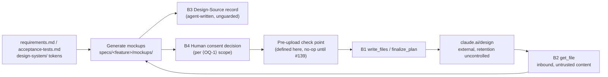

# Security Specification: design-sync-consent

This document is load-bearing, not a formality. The feature's entire content is a **relaxation of a data-egress control**: consent to send repository-derived content to an external service moves from per-upload to per-feature, the human review that currently precedes every upload becomes optional, and the durable record of the consent becomes an artifact written by an actor this repository's own threat model lists as untrusted. Nothing else in the feature is security-neutral either — the flow-order inversion is what removes the pre-egress human eye.

The document states, in order: what leaves the machine, where it goes, under whose consent, what the operator forfeits by the change, and what remains uncontrolled afterwards.

## What Leaves The Machine

Derived by reading the loop, not inferred. Every row cites the line that establishes it.

| # | Datum | Where it comes from | Which call sends it | Destination |
|---|---|---|---|---|
| E1 | Semantic HTML mockup files, one per target view × state (default, empty, loading, error; responsive breakpoints) | generated locally under `specs/<feature>/mockups/` (`design-sync-loop/SKILL.md:73-75`) | `write_files` (`:85`) | the claude.ai/design project the human selected at `:68-69` |
| E2 | The product intent encoded in E1 — view names, state names, interface copy, labels, field names, error strings, navigation structure | derived from this feature's `REQ-NNN` / `AC-NNN`, i.e. from `specs/<feature>/requirements.md` and `acceptance-tests.md` (`:76-77`) | `write_files` | same |
| E3 | Brand and design-token values — colour, typography, spacing | `design-system/design-tokens.json` (`:77`) | `write_files` | same |
| E4 | Interaction conventions | `design-system/ui-patterns.md` (`:78`) | `write_files` | same |
| E5 | Mockup file names and their relative paths, which encode the feature slug | `specs/<feature>/mockups/` | `write_files` | same |
| E6 | **Unknown** — whatever `finalize_plan` carries | not knowable from this repository | `finalize_plan` (`:85`) | same |
| E7 | A human-supplied project name, when a project is created | the human, at `:68-69` | `create_project` (`:68-69`) | claude.ai |
| E8 | Project and file identifiers used to read design-system context | the selected project | `list_projects`, `list_files`, `get_file` (`:68-71`) | claude.ai |

**E2 is the substantive one.** `SKILL.md:76-77` makes the mockup a *pure function* of the specification: "Derive every visual choice from REQ-NNN / AC-NNN". So whatever a feature's requirements contain — an unreleased product name, a customer's identifier used as an example, an internal endpoint rendered in an error state, the copy of a not-yet-announced feature — propagates into the HTML by construction. The mockup is not a sanitised rendering of the spec; it is a rendering of the spec.

**E6 is a hole in this inventory, and is recorded as one.** `finalize_plan` is called immediately before `write_files` and appears nowhere else in this repository (INV-007). Its payload cannot be determined here. AC-005 requires the consent disclosure to state this limitation rather than present an enumeration as complete — an unverifiable claim inside a consent prompt is a worse defect than an acknowledged gap. **OQ-6** owns resolving it.

**E7 and E8 are outside the consent gate today and stay outside it.** The pull step has no approval of any kind (INV-007), so a project name leaves on `create_project` with no gate at all. This feature does not change that (a Non-goal), but the consent disclosure's wording must not imply that "one consent covers this feature's egress" when an ungated outbound call sits four lines above it. **OQ-4** owns the wording boundary.

### What does not leave

Stated so the inventory has edges:

- `requirements.md` and `acceptance-tests.md` themselves are not uploaded — only visual choices derived from them (E2).
- No third-party host is contacted at render time: `SKILL.md:75` requires mockups carry no external assets. This is a *reference* constraint, not a content constraint; it prevents a mockup from beaconing, not from containing.
- No repository credential, key, or `SDD_SUDO` material is read or transported by this feature.

### One more property of the payload

`specs/<feature>/mockups/*.html` is **git-tracked** — `.gitignore` (read in full, 26 lines) has no `mockups` or `specs/**/*.html` rule (INV-009). The bytes that egress are the same bytes that enter repository history. That cuts both ways: an auditor can reconstruct exactly what was sent from the commit, and a mockup containing something that should not have left is also permanently in the repository.

## Under Whose Consent

| Question | Answer, and its basis |
|---|---|
| Who decides today? | The human operator, at each upload — `SKILL.md:83-87`, restated as an invariant at `:97-98` ("Uploads require explicit human approval **every time**"). |
| Who decides after this feature? | The same human, **once per ⟨OQ-1⟩ scope**. |
| Whose account receives it? | The claude.ai/design project selected at `:68-69`, reached through the `DesignSync` tool. The repository establishes nothing about the account model, and this document does not invent one. |
| Is the operator entitled to release the content? | **Unestablished.** In the enterprise context the issue's own Rationale invokes, the human at the terminal may not be authorized to release the employer's pre-release design outward. This feature must not *assert* operator consent is sufficient — **OQ-5**. #140's `off` is the mechanism that would express an organisation-level "no". |
| What is retained at the destination? | **Not knowable from this repository.** The disclosure must say retention is possible and outside this repository's control, and must not state a policy no artifact here supports (AC-003 element (c)). |

## What The Operator Gives Up

The precise question the change poses. Six items; each is a property held today and not held afterwards.

| # | Held today | After per-feature consent | Why it matters |
|---|---|---|---|
| L1 | **Per-payload review.** Local review is step 3 and push is step 4 (`SKILL.md:81-87`), so no byte reaches claude.ai without a human having looked at the generated mockups. | Local review is optional and off the path. The **first** upload of a feature may carry content no human has read — and so may every later one. | This, not the frequency change, is the substantive privacy delta. #139 exists specifically to replace this eye with a machine. |
| L2 | **Per-payload refusal.** Declining a single upload stops that upload and nothing else. | Refusal exists only at the scope boundary. Inside the scope there is no decision point at which to say no. | Under per-upload, "decline" *was* the withdrawal mechanism. It disappears with the frequency change, and no replacement is specified — **OQ-2**. |
| L3 | **Consent to determinate bytes.** The human approves *these* files. | Consent to a category whose members do not yet exist. `SKILL.md:87` guarantees regeneration between uploads, so consent is granted against revision *n* and spent against *n+1…k*. | An informed consent to an undetermined payload can only be informed about the *kind* of thing sent. That is a real reduction in what "informed" means, and it is why REQ-002's disclosure must describe the category accurately. |
| L4 | **Bounded blast radius per decision.** One "yes" authorizes one upload. | One "yes" authorizes an unbounded number. | Turns a repeated small decision into a single large one. Defensible — that is the issue's point — but it must be visible in the prompt (AC-004). |
| L5 | **Consent bound to a destination in practice.** The human sees each upload's destination as they approve it. | Nothing binds a consent to the project it was granted against. Step 1 lets the human select a different project later. | Consent to send to project A is not consent to send to project B, and the current text cannot distinguish them (Edge Case 2, folded into **OQ-3**). |
| L6 | **Consent that cannot outlive the moment.** Each approval is in-band and ephemeral. | Consent is carried by a git-tracked line in a layer file, readable by any later session, on any later clone, by any later operator. | Whether that line constitutes standing authorization is exactly **OQ-1** and **OQ-2**. If it does, consent is transferable and, absent an expiry, permanent. |

Not given up: the gate itself (BL-001), the manual fallback's zero-egress property (`claude-design-workflow.md:12`, `:70-71`), the non-blocking invariant, and the `ds_profile: none` path's silence.

## Trust Boundaries

| Boundary | Source | Destination | Assets | Validation | AuthN/AuthZ | REQ | AC |
|---|---|---|---|---|---|---|---|
| B1 | operator's machine | claude.ai/design | E1–E6: mockups and the product intent, brand tokens and interaction conventions they encode | **none today**; the pre-upload point defined by this feature is where #139's scan attaches | human consent, once per ⟨OQ-1⟩ scope | REQ-001, REQ-002 | AC-001, AC-003, AC-004 |
| B2 | claude.ai/design | operator's machine | design-system context returned by `get_file` | treated as data, not instructions (`SKILL.md:99-101`) | none — ungated read | — | **unchanged, out of scope** |
| B3 | agent | `ux-spec.md` / `design.md` `Design-Source` | the durable consent record | **none** — no schema, no template, no gate (INV-011) | none | REQ-004 | AC-010, AC-012 |
| B4 | human | the loop | the consent decision itself | the informed-consent disclosure | the operator, whose entitlement is unestablished (OQ-5) | REQ-002 | AC-003, AC-004 |

### B3, in detail — the finding this document exists to surface

`docs/THREAT-MODEL.md:12` places **agent self-reports** under *NOT Trusted*: "agents cannot write approval fields, evidence signatures, or sudo tokens". The repository enforces that where it matters — `tasks.md`'s `Approval: Approved` is guarded by a hook-guard counter that denies any net increase (`docs/THREAT-MODEL.md:53`), `Second Approval` likewise, and WFI `Status: Approved` is never bypassable even by sudo.

`Design-Source` has none of that. It is a free-form Markdown section with no schema, no template among the seven Phase-1 templates, no validator and no guard (INV-011). An agent can write any line into it.

Under per-upload consent this was a minor asymmetry: the record was a note *about* a decision that a live human had just made, and forging it bought nothing, because the next upload needed another live human. **After this feature the record becomes the standing carrier of an authorization covering every later upload in scope** — and, if OQ-1 resolves to the directory reading and OQ-2 to no expiry, covering every later *session* as well.

So the change quietly promotes an unguarded, agent-written text line from a note into an authorization, inside a system whose threat model explicitly does not trust agent-written authorizations. Three honest responses exist: guard it, scope it so it cannot authorize a later session, or state clearly that it is an audit trace and not an authorization. This feature takes the third (AC-012), and records the first two as OQ-1/OQ-2 territory. What it must not do is leave a reader to assume the first.

### The other external-send path, for comparison

This repository already sends repository-derived content to a third party, on the cross-model panelist path, and it does so very differently.

| Control | panelist path (`cross-model-verification-policy.md`) | design-sync path, after this feature |
|---|---|---|
| Redaction before send | `.env` content, SSH/AWS/GCP key material, absolute paths, private URLs — scanned and replaced (`:272-283`) | none (#139) |
| Record of what was sent | `input_digest`, 64-hex SHA-256 of the sanitized bundle (`:281-290`, `:106-108`) | free-form `Design-Source` prose |
| Consent representation | machine-readable object `consent: { kind, ref }`, `kind ∈ {human-flag, sudo}` (`:88-89`, `:108`) | a sentence |
| Consent enforcement | fail-closed: missing or invalid consent ⇒ exit 1 and **no panelist is contacted** (`:292-318`); the gate re-checks every verdict (`:194-196`) | an instruction in a `SKILL.md` |
| Audit | git-tracked verdict JSON records how and where consent was obtained (`:386-392`) | git-tracked prose |

The asymmetry is not an argument against DS-29 — it is the baseline the change must be judged against, and the vocabulary #139 and #140 will reuse. It is recorded as **Residual Risk R4** rather than closed here, because closing it is a larger change than either issue requests.

### An absence worth naming

`docs/THREAT-MODEL.md` does not mention claude.ai/design anywhere — grep across its 223 lines returns zero matches (INV-020) — while it *does* enumerate the panelist egress at `:16`. So the repository's threat model currently documents one of its two external-send paths. A reader consulting it would conclude design-sync egress either does not exist or was assessed and cleared; neither is true. Whether this feature closes that gap is **OQ-10**; that it is a gap is a fact, and precedent exists both ways (`epic-136-phase4-docs` treated the threat-model entry for the hole its own release closed as in scope).

## STRIDE Analysis

At least two rows per boundary, per the template.

| Boundary | Threat | STRIDE | Abuse case | Mitigation in this feature | Verification | REQ | AC |
|---|---|---|---|---|---|---|---|
| B1 | Unreviewed content egresses because no human read it | **Information Disclosure** | Iteration 3 of a mockup set renders an error state containing an internal hostname introduced by a requirements edit made after consent | **Partial only.** The disclosure warns about the category (REQ-002); the demotion's consequence is stated in the skill (AC-008). The eye that would have caught it is #139's, not this feature's. → **R1** | TEST-005, TEST-013 | REQ-002, REQ-003 | AC-003, AC-008 |
| B1 | Consent granted for scope A is spent on content outside A | **Elevation of Privilege** (of a decision) | A new view appears after consent and uploads unremarked; or the destination project is changed after consent | Scope must be named unambiguously (AC-002) and stated in the record. The re-trigger rule is **OQ-3**; the destination binding is L5 → **R2** | TEST-003, TEST-004 | REQ-001 | AC-001, AC-002 |
| B1 | An outbound call's payload is not disclosed | **Information Disclosure** | `finalize_plan` carries context the operator was never told about | The disclosure must not overclaim; the gap is stated (AC-005) → **R5** | TEST-009 | REQ-002 | AC-005 |
| B1 | Upload reaches the service by a path the check point does not cover | **Tampering (with the control)** | A branch of the loop calls `write_files` without passing the named point, so #139's future scan is bypassable by construction | Every upload path is required to pass one named point, asserted structurally | TEST-025, TEST-026 | REQ-006 | AC-017 |
| B2 | Fetched design context is treated as instructions | **Tampering / prompt injection** | A `get_file` response contains text shaped like directives | **Unchanged** — already mitigated at `SKILL.md:99-101`; named here so its absence from the change set is a decision, not an oversight | — | — | out of scope |
| B3 | A consent record is written without a human ever consenting | **Spoofing** | An agent writes `Egress-Consent: granted` and proceeds; nothing counts, hashes, or guards the line | **Not mitigated.** The record is characterised as an audit trace, not an authorization (AC-012). Guarding it is out of scope → **R3** | TEST-018 | REQ-004 | AC-012 |
| B3 | A stale record authorizes a later session | **Repudiation / Elevation of Privilege** | A `Design-Source` line from day 1 is read on day 30 by a different operator as standing authorization | **Unresolved by design** — this is exactly OQ-1 and OQ-2. The record carries an `Egress-Consent-Expiry` field so the answer has somewhere to live → **R2** | TEST-015 | REQ-004 | AC-010 |
| B4 | The operator consents without authority to release the content | **Elevation of Privilege** | An employee approves egress of an employer's pre-release design | **Not mitigated here.** The feature must not assert operator consent is sufficient (OQ-5); #140's `off` is the organisational mechanism | — | — | **OQ-5** |
| B4 | The operator does not realise this is the last prompt | **Repudiation** | A human approves what they believe is one upload and unknowingly authorizes the feature's whole stream | Disclosure must state the scope and the frequency change explicitly | TEST-008 | REQ-002 | AC-004 |
| B4 | The consent prompt appears where no egress occurs | **Denial of Service** (to the workflow) | A consent question leaks into `ds_profile: none` or the DesignSync-absent path, blocking a flow that uploads nothing | Consent resolution runs after capability detection; `ds_profile: none`'s guarantee is preserved | TEST-019, TEST-020, TEST-024 | REQ-005 | AC-013, AC-016 |

## Authorization

- **Protected enforcement-chain files.** `plugins/sdd-lite/skills/lite-spec/SKILL.md` is a member of `PROTECTED_GATE_SUFFIXES` (`plugins/sdd-quality-loop/scripts/generated/guard_invariants.py:4`, 42 entries) and of `PHASE2_HUMAN_COPY_TARGETS` (`:18`). The matcher is a case-insensitive `endswith()` on the normalized repository-relative path (`sdd-hook-guard.py:1001-1015`) with **no `human-copy/` carve-out**, so the staging destination is equally unwritable by an agent; only a human can place it. `.github/workflows/test.yml` is on the same list and becomes a second target only if OQ-8 resolves toward CI registration. **Re-verify both claims per `requirements.md` → Assumptions before relying on them.**
- **The guard's Bash-command matcher is broader than its write-path matcher.** A read-only command whose text merely names a protected path is denied; observed first-hand during this feature's investigation (INV-015) and previously recorded in `epic-136-phase4-docs/investigation.md:168`. Implementers and reviewers should restructure such commands rather than work around the guard.
- **No `SDD_SUDO` interaction.** This feature neither reads, creates, nor requires sudo state. Relevant nonetheless: sudo does not license approving tasks while product or security decisions remain open (`sdd-bootstrap-interviewer/SKILL.md:223-227`), and four Open Questions block here.
- **No approval-field surface.** This feature writes nothing to `tasks.md` approval fields, WFI status fields, or evidence bundles.

## Data Classification and Protection

| Entity | Classification | At rest | In transit | Retention | Deletion | Access log | REQ | AC |
|---|---|---|---|---|---|---|---|---|
| `specs/<feature>/mockups/*.html` (E1–E5) | **Confidential by default** — the issue's own boundary text says "treat mockups as potentially confidential" (`SKILL.md:97-98`), and the content is a pure function of the specification (`:76-77`) | git-tracked in the repository; no `.gitignore` rule (INV-009) | to claude.ai/design via `DesignSync`; transport properties are the tool's, not this repository's | at the destination: **unknown and uncontrolled by this repository** | not specified; the repository has no delete-at-destination affordance | none at the destination; locally, git history | REQ-002 | AC-003 |
| `finalize_plan` payload (E6) | **Unknown** | — | same call site (`SKILL.md:85`) | unknown | unknown | none | REQ-002 | AC-005 |
| `Design-Source` consent record | Internal; non-secret | git-tracked layer file | never leaves | permanent (git history) | not specified | git history | REQ-004 | AC-010, AC-012 |
| Design tokens (E3) | Internal-to-confidential — brand identity may be pre-release | `design-system/design-tokens.json`, git-tracked | with E1 | as E1 | — | — | REQ-002 | AC-003 |

**No secret is handled by this feature.** No credential, key, or token is read, written, or transported by the change itself. That is deliberately *not* the same statement as "no confidential data leaves": E1–E5 may carry confidential product material, and the feature's whole subject is the consent under which they do.

**No redaction exists on this path**, unlike the panelist path (`cross-model-verification-policy.md:272-283`). Adding it is #139.

## Security Tests

The mapping from boundary to executable check. Every row is a document-conformance assertion, because the loop has no executable code path — stated once, plainly, so no reader mistakes these for behavioural proofs.

| Boundary | Threat | Test | What would be missed without it |
|---|---|---|---|
| B1 | Information Disclosure | TEST-005, TEST-006, TEST-007 | a consent prompt that warns about confidentiality without naming the destination, or that asserts a retention policy nothing supports |
| B1 | Repudiation of scope | TEST-008 | an operator who does not know this is the last time they will be asked |
| B1 | Undisclosed payload | TEST-009 | an enumeration of "what leaves" that silently omits `finalize_plan` |
| B1 | Control tampering | TEST-025, TEST-026 | an upload path that bypasses the point #139 will attach to — which would make #139 ineffective on arrival |
| B1 | Interactivity assumption | TEST-027 | a check point that cannot exist under #140's `standing` mode |
| B1 | Scope creep | TEST-003, TEST-004 | an unstated inheritance rule, which in practice defaults to the agent's runtime judgement |
| B3 | Spoofing / false assurance | TEST-018 | a skill that presents an unguarded agent-written line as the authorization |
| B3 | Record shape | TEST-015 | a "Design-Source records consent" claim that passes today, before the feature does anything, because the heading already exists |
| B4 | DoS to the workflow | TEST-019, TEST-020, TEST-024 | a consent prompt in the `ds_profile: none` or DesignSync-absent path, blocking a flow that uploads nothing |
| B1/fallback | Egress via the "no-egress" path | TEST-021 | a fallback that quietly grew an upload step; asserted positively, not only by absence |
| Authorization | Protected-file write | TEST-038 | an agent writing a protected enforcement-chain file, live or staged |

TEST-026 and TEST-018 are the two that matter most. TEST-026 is what makes #139 implementable rather than nominal; TEST-018 is what stops the repository from claiming a control it does not have.

## Residual Risks

Recorded because they survive this feature, not because they are acceptable.

- **R1 — Unreviewed content can egress.** Demoting local review removes the only step at which a human necessarily sees the payload before it leaves (L1). This feature adds no compensating mechanical control; #139 is that control and is a separate issue. **If #138 ships and #139 does not, the repository has relaxed an egress control and added nothing in its place.** The relative sequencing of the two is a security decision, not a scheduling one.
- **R2 — Consent may be standing, transferable and permanent.** A git-tracked record with no expiry, read by any later session on any later clone (L6). Whether that is the intent is OQ-1/OQ-2; the risk is that it becomes the behaviour by default, because nothing ages the record out.
- **R3 — The consent record is unguarded and agent-written.** Forgeable by the actor `docs/THREAT-MODEL.md:12` designates untrusted, with no counter of the kind that protects `tasks.md`. Mitigated only by honest labelling (AC-012).
- **R4 — Egress asymmetry inside one repository.** One external-send path redacts, digests, records a machine-checkable consent object and fails closed; the other does none of these. This feature loosens the weaker one. Closing the gap is larger than either issue requests.
- **R5 — The outbound inventory is incomplete by construction.** `finalize_plan`'s payload is unknown here (E6, OQ-6). A consent disclosure built on an incomplete inventory is honest only if it says so.
- **R6 — The pull direction is ungated.** `create_project` sends a human-supplied project name outward with no approval at all (E7), and `list_projects` / `list_files` / `get_file` interact with the external service before any consent question is reached. Status quo, unchanged, and named so it is a decision (OQ-4).
- **R7 — `docs/THREAT-MODEL.md` does not know this boundary exists.** INV-020. A control inventory that omits a live external-send path invites the reader to conclude it was assessed. OQ-10.

## Open Questions

- product/security: **OQ-1** — what is the consent scope unit? Determines whether R2 is a risk or the design. Blocks REQ-001, REQ-004.
- product/security: **OQ-2** — does consent expire, and can it be withdrawn? L2 removes the per-upload refusal affordance and nothing replaces it. Blocks REQ-001, REQ-004.
- product/security: **OQ-3** — which changes to the mockup set re-trigger consent? Includes the destination-project change of L5. Blocks REQ-001, REQ-003.
- security: **OQ-4** — is the ungated pull direction (E7, E8) inside the consent statement's scope, or explicitly outside it? Non-blocking; affects REQ-002's wording.
- security/legal: **OQ-5** — who consents when the operator is not the data owner? Non-blocking here; #140's `off` is the mechanism.
- implementer: **OQ-6** — what does `finalize_plan` send (E6)? Resolvable at implementation time by reading the tool's contract, or stated as a limitation per AC-005. Non-blocking.
- product: **OQ-7** — is `Egress-Consent-Subject` a file list, hashes, or a description? Each has different staleness under regeneration. Non-blocking.
- maintainers: **OQ-10** — does `docs/THREAT-MODEL.md` gain a design-sync egress boundary in this feature (R7)? Non-blocking.
