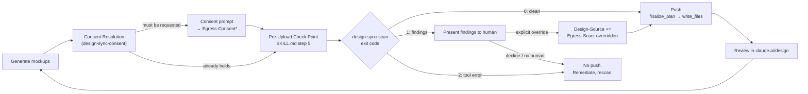

# Design: design-sync-scan

Impl-Review-Status: Pending
Feature Type: feature (a new runtime-neutral CLI check plus a targeted skill-text edit; small executable surface, no application code)

## Architecture Overview

Unlike `design-sync-consent`, this feature has a real executable artifact: a script pair that reads files and returns an exit code. The specification therefore has two layers of correctness — the script's own behaviour (verified by executing it against fixtures) and the skill text that wires it in (verified by document conformance, the same technique `design-sync-consent` used throughout). Both matter; a correct script wired incorrectly into `SKILL.md` fails the feature exactly as a broken script would.

The change has four edit surfaces:

| Surface | Files | Nature |
|---|---|---|
| **The scanner** | `plugins/sdd-bootstrap/scripts/design-sync-scan.sh`, `design-sync-scan.ps1` (both new) | the substantive artifact: three detection categories, a three-valued exit contract, a masked finding report |
| **The loop's check point** | `plugins/sdd-bootstrap/skills/design-sync-loop/SKILL.md` step 5 (`:128-135`) | from an explicit no-op to an active call; the `Design-Source consent record` section gains two fields |
| **Manual/Codex usage** | `plugins/sdd-bootstrap/skills/sdd-bootstrap-interviewer/references/claude-design-workflow.md` | documents standalone invocation ahead of the fallback it describes (REQ-008) |
| **Verification** | `tests/design-sync-scan.tests.{sh,ps1}`, registered in `tests/run-all.{sh,ps1}` | new suite; CI registration staged separately (R-OQ-8-style, see `infra-spec.md`) |

No protected file is a live edit target. `design-sync-loop/SKILL.md`, `claude-design-workflow.md`, and `tests/run-all.{sh,ps1}` are all absent from `PROTECTED_GATE_SUFFIXES` (`plugins/sdd-quality-loop/scripts/generated/guard_invariants.py:4`) — confirmed by direct read at authoring time, re-verified per `requirements.md` → Assumptions. This is a materially simpler deployment shape than `design-sync-consent`, which carried one certain protected-file staging round; this feature carries none, only the separately-staged, non-blocking CI-registration patch that feature also carried (`infra-spec.md`).

### Where this feature sits relative to `design-sync-consent`



This feature adds nothing to the diagram's left half (generation, consent) and nothing to its right half (push mechanics, review) — it fills in exactly the one node `design-sync-consent` deliberately left inert. That containment is the reason REQ-007's regression criteria (AC-026 through AC-028) exist: a change confined to one node should not be observable anywhere else in the loop's structure.

### Why the scan is a script, not more skill prose

`design-sync-consent` is entirely prose because a `SKILL.md` step has no mechanism to *enforce* anything — it can only tell an agent what to do, and an agent can fail to do it. This feature's whole purpose is to be a mechanical compensating control (`requirements.md`'s framing, and `design-sync-consent/security-spec.md`'s R1), so specifying it as more prose ("the agent should check for secrets before pushing") would not close the gap it exists to close — it would just add a second thing an agent could skip. A script with a real exit code, invoked at a point the loop's own text already commits to routing every upload through, is checkable in a way prose is not: `AC-027`'s no-bypass assertion can be run against the actual `SKILL.md` structure, and `AC-031`/`AC-032` can be run against the actual script output, in both cases without trusting an agent's self-report.

## Components

| Component | Status | Change |
|---|---|---|
| `plugins/sdd-bootstrap/scripts/design-sync-scan.sh` | **New** | placeholder + secret + PII scan over `*.html` under a required target-directory argument; three-valued exit contract |
| `plugins/sdd-bootstrap/scripts/design-sync-scan.ps1` | **New** | behavioural twin of the above |
| `design-sync-loop/SKILL.md` — Loop step 5 (`:128-135`) | Existing (activated) | no-op → invokes the scanner; states the exit-0/exit-1/exit-2 branches and the override procedure |
| — `Design-Source consent record` section | Existing (extended) | gains `Egress-Scan` / `Egress-Scan-At` field rows, additive per the extensibility rule already stated there |
| — everything else in `SKILL.md` | **Untouched** | steps 1-4, 6-7, `## Capability Detection`, `## Ensure design-system/`, `## Boundaries` are unedited (BL-001, BL-002, BL-003) |
| `claude-design-workflow.md` (or its referring section) | Existing (edited) | documents standalone scan usage ahead of the manual fallback (REQ-008) |
| `tests/design-sync-scan.tests.sh`, `.tests.ps1` | **New** | the assertions for REQ-001 through REQ-009 |
| `tests/run-all.sh`, `tests/run-all.ps1` | Existing (extended) | register the new suite; unprotected, agent-applicable |
| `.github/workflows/test.yml` | **Protected — separate staged patch** | CI registration, outside this decomposition (`infra-spec.md`) |
| `specs/workflow-state-registry.json` | Registration pending | one entry required (BL-005) |

## Layer Specifications

| Layer | Summary | Canonical Detail | Owner | Status |
|---|---|---|---|---|
| UX | N/A — no rendered surface. The human-perceivable output is a terminal/agent-session finding report and an override decision point. | [UX specification](ux-spec.md#scope-and-user-journeys) | — | N/A — no view, dialog, menu item or context action |
| Frontend | N/A — no browser, bundle, or build output. | [Frontend specification](frontend-spec.md#technology-stack) | — | N/A — shell, PowerShell, and Markdown only |
| Infrastructure | No new CI step inside this decomposition — registration is staged separately; no protected-file staging round at all (unlike `design-sync-consent`, which carried one). | [Infrastructure specification](infra-spec.md#deployment-topology) | maintainers | Drafted |
| Security | **Load-bearing.** This feature is a compensating control for a data-egress risk `design-sync-consent` recorded and did not close. | [Security specification](security-spec.md#trust-boundaries) | security | Drafted |

## Design System Compliance

**N/A — ds_profile: none.**

`sdd-forge` is a CLI/plugin repository with no UI and no project-level `design-system/` directory; it never invokes `design-sync-loop` on itself (`design-sync-consent/design.md` records the same fact). This feature adds a scanner *consumed by* that loop's specification; it is not itself a consumer of a design system.

## API & Contract Plan

### Script contract

```
design-sync-scan.sh <target-dir>
design-sync-scan.ps1 <target-dir>

  <target-dir>   required. Scanned recursively for *.html files,
                 including files in subdirectories (AC-002) -- the
                 extension test is case-insensitive (.HTML/.Html are
                 scanned; requirements.md AC-039, round 3), and any file
                 with a different extension is outside the scan entirely
                 (no finding, no block, even with matching content).
                 All three detection categories run in every invocation;
                 no flag selects a subset (AC-003).

Exit codes (precedence: a tool-error condition always yields 2, evaluated
before either detection outcome — a scan that does not complete is never 0
or 1, regardless of what it would have found):
  0   the scan COMPLETED and found zero matches in any category — caller
      may proceed to push
  1   the scan COMPLETED and found at least one match (AC-006) — caller must not
      push without an explicit, human-granted override recorded per
      "Design-Source scan record" below, and that override applies only
      to THIS scan's disclosed findings
  2   the scan DID NOT COMPLETE (bad/missing argument, nonexistent
      target-dir, an unreadable .html file; AC-007) — a tool-error outcome, not a
      detection outcome, so whether the payload contains anything is
      genuinely unknown. Blocking is unconditional here: unlike exit 1,
      exit 2 has NO override path, because an override is a decision
      about disclosed findings and exit 2 discloses none. A caller must
      not treat "blocks the push" as the only axis on which 1 and 2
      agree — 2's block cannot be lifted by a human decision at all;
      1's can, once, against exactly what it found.

Output, on exit 1 (illustrative shape; exact wording is an implementation
detail, not a locked literal):

  Design-Sync Scan FAILED (<N> finding(s)):
   - placeholder <path>:<line>: <matched marker, shown in full>
   - secret      <path>:<line>: [REDACTED]
   - PII         <path>:<line>: [REDACTED]
  Findings must be reviewed. Continuing past a FAILED scan requires an
  explicit human override, recorded in Design-Source as
  Egress-Scan: overridden.

Output, on exit 0:

  Design-Sync Scan passed (0 findings).
```

The script itself presumes no interactive human at its own invocation — it reads no stdin and prompts for nothing; its exit code plus its finding report are sufficient for a caller to gate on (AC-015). The human enters only at the *skill* layer, and only on exit 1.

Masking (AC-014) replaces the matched span of a `secret` or `PII` finding with a fixed token (`[REDACTED]`); it does not reveal a partial fragment (no "first 4 / last 4 characters" style preview), because a partial reveal of a real private key or a real token is still a disclosure, and this repository's own redaction precedent (`cross-model-verification-policy.md:272-283`) replaces rather than truncates. A `placeholder` finding shows the matched marker text in full, because a stub marker carries no sensitivity and the human needs to see exactly what triggered it.

### The two case-sensitivity groups, and why the split exists

`check-placeholders.sh:10-16` already states the rationale this feature reuses: ALL-CAPS stub markers (`TODO`, `FIXME`, `PLACEHOLDER`) are matched case-sensitively because their lowercase occurrences are ordinary prose (a docstring using the word "todo," a skill file discussing "placeholders"), while multi-word phrases (`lorem ipsum`, `coming soon`) are matched case-insensitively because they are unambiguous in any casing. The same reasoning transfers directly to the secret category: a fixed vendor prefix (`AKIA`, `ghp_`, `sk-`, `xox`) is exactly as case-fixed as `TODO` — the format defines the casing, so matching it case-sensitively avoids flagging incidental substring occurrences elsewhere — while a generic keyword like `api_key` or `password` appears in the wild under every plausible casing (`API_KEY`, `apiKey`, `Password`), so matching it case-insensitively is what makes the pattern useful at all.

### Detection pattern catalogue

**Placeholder** — reused verbatim from `check-placeholders.sh:18-19` (AC-009). Not restated here as a second copy of truth; implementation cites the source file directly rather than transcribing the regex into the scanner's own source, so the two never drift.

**Secret** — the named v1 set (AC-010). Six fixed-format prefixes (S1–S6, case-sensitive) plus one generic keyword-assignment shape (S7, case-insensitive) — **seven patterns total**, not eight; S7 is the seventh member of the same set, not an addition to it:

| ID | Pattern (illustrative ERE/`.NET` form) | Case | Rationale |
|---|---|---|---|
| S1 | `-----BEGIN [A-Z ]*PRIVATE KEY-----` | sensitive | a PEM private-key block header; the format is fixed, false positives are essentially impossible |
| S2 | `AKIA[0-9A-Z]{16}` | sensitive | AWS Access Key ID; the `AKIA` prefix plus fixed length is a distinctive, low-false-positive shape |
| S3 | `ghp_[A-Za-z0-9]{36}` | sensitive | GitHub personal access token (classic format) |
| S4 | `github_pat_[A-Za-z0-9_]{22,}` | sensitive | GitHub fine-grained personal access token |
| S5 | `sk-(proj-\|svcacct-)?[A-Za-z0-9_-]{20,}` | sensitive | OpenAI-style secret key prefix, **enumerating its known hyphenated sub-formats explicitly** — `sk-proj-` (project-scoped keys) and `sk-svcacct-` (service-account-scoped keys) alongside the bare `sk-` root, rather than relying on `sk-[A-Za-z0-9]{20,}` alone to happen to also match them by accident of character-class breadth. Also matches several other vendors that copied the bare `sk-` convention, which is treated as a feature (broader net) not a defect. The sub-format list is not exhaustive (OQ-1) — a vendor introducing a new `sk-<word>-` sub-format is a gap, not a defect, of this v1 set |
| S6 | `xox[baprs]-[A-Za-z0-9-]{10,}` | sensitive | Slack token family (`xoxb-`, `xoxa-`, `xoxp-`, `xoxr-`, `xoxs-`) |
| S7 | see dual-form block below | **insensitive** | generic keyword immediately followed by an assignment operator and a quoted value of plausible length; the value-length and quoting requirements are deliberate — `password:` with no value, or `password: ""`, does not match, which keeps a mockup's form-field labelling (`<label>Password</label>`, `<input type="password">`) from tripping the pattern, since neither is a keyword directly followed by `:`/`=` and a substantive quoted value |

Known limitation, stated rather than hidden: a `data-`-prefixed HTML attribute *name* such as `data-password="x"` still satisfies S7's shape (`password` followed by `=` and a quoted value) even though it is an attribute name, not a captured value. This is a plausible false positive on hand-authored mockup markup; `security-spec.md` records it as part of the residual pattern-matching gap rather than tuning the regex further at spec time, since narrowing it risks the opposite failure (missing a real inline credential written the same shape).

**PII** — exactly two patterns (AC-011):

| ID | Pattern (illustrative form) | Rationale |
|---|---|---|
| P1 | an email-shaped string (`[A-Za-z0-9._%+-]+@[A-Za-z0-9.-]+\.[A-Za-z]{2,}`) **excluding** matches whose domain is `example.com`/`.net`/`.org` (RFC 2606) or ends in `.test`/`.example`/`.invalid` (RFC 2606) or `.localhost` (RFC 6761) | RFC 2606 reserves `example.com`/`.net`/`.org` and the `.test`/`.example`/`.invalid` TLDs for documentation and placeholder use; RFC 6761 separately reserves `.localhost`. **`.edu` is deliberately absent from this list** — it is not reserved by either RFC, so excluding it would hide a real `.edu` address behind the same convention that legitimately hides `example.com`. Mockups conventionally use `user@example.com`-style addresses precisely because they are guaranteed non-real, and a scan that flags the convention every time trains operators to override reflexively — which defeats the point of a signal they are meant to read (`ux-spec.md`) |
| P2 | see dual-form block below | an E.164-shaped phone number: a leading `+`, a nonzero first digit, and 8–15 total digits, matching the E.164 length bound, **bounded on both sides** so it cannot match a substring of a longer digit run. Deliberately conservative — a bare local-format number with no `+` is not flagged, trading recall for a low false-positive rate on stylised UI numerals |

### S7 and P2 — dual-form specification (POSIX ERE vs `.NET` regex)

S7 and P2 are the two patterns in this catalogue that need a boundary or character-class construct whose portable expression differs by regex engine. Rather than write one form and hope it behaves identically under `grep -E` (POSIX ERE, `.sh`) and PowerShell's `.NET` regex (`.ps1`), each is specified **twice**, once per engine, and AC-038 requires both forms to classify one shared fixture corpus identically — the two forms are two implementations of one specification, not two different specifications.

| | POSIX ERE (`.sh`, via `grep -E` / `grep -Ei`) | `.NET` regex (`.ps1`) |
|---|---|---|
| **S7** (case-insensitive pass) | `(api[_-]?key\|secret\|token\|password)[[:space:]]*[:=][[:space:]]*['"][^'"[:space:]]{8,}['"]` | `(api[_-]?key\|secret\|token\|password)\s*[:=]\s*['"][^'"\s]{8,}['"]` |
| **P2** | `(^\|[^0-9])\+[1-9][0-9]{7,14}([^0-9]\|$)` | `(?<!\d)\+[1-9]\d{7,14}(?!\d)` |

Why the forms differ: POSIX ERE has no lookaround, so P2's boundary is expressed as a non-digit-or-anchor character class on both sides (which the matched span must then be trimmed back out of when reporting file:line, since the class itself is not part of the phone number); `.NET` regex supports zero-width lookbehind/lookahead directly, so P2's `.ps1` form expresses the same boundary without consuming a character. Both forms reject the same three negative shapes (Edge Case 8, new): a 7-digit run (one digit short of the minimum), a 16-digit run (one digit over the maximum — neither form finds a valid 8–15-digit substring inside it that is also correctly bounded), and a valid-length run immediately adjacent to one more digit on either side. `[[:space:]]` replaces `\s` in the POSIX form because POSIX ERE (unlike GNU grep's `\s` extension, which is not guaranteed present on every `grep` this repository's CI matrix might use) only reliably supports POSIX bracket-expression classes — the same portability reasoning Edge Case 5 already states for avoiding inline `(?i)`.

No pattern in this catalogue otherwise uses a `.NET`-only construct (inline `(?i)`, atomic groups) that has no direct POSIX ERE equivalent — Edge Case 5 in `requirements.md` names this restriction explicitly, and it is why the case-sensitive/insensitive split is structural (two separate pattern groups) rather than expressed as an inline flag. S1–S6 need no dual-form treatment: they are literal prefixes, character classes, and `{n}`/`{n,}` quantifiers with no boundary or lookaround construct, so their POSIX ERE and `.NET` spellings are already identical.

### `Design-Source` scan record — additive extension

Extends the field table `design-sync-loop/SKILL.md`'s "Design-Source consent record" section already carries (reproduced from `design-sync-consent/design.md:169-178` for the fields this feature does not touch):

| Field | Meaning | Value | Owner |
|---|---|---|---|
| `Egress-Consent`, `Egress-Consent-Scope`, `Egress-Consent-Subject`, `Egress-Destination`, `Egress-Consent-Expiry` | consent decision fields | unchanged | `design-sync-consent` (DS-29) — **untouched by this feature** |
| `Egress-Scan` | this scan's outcome (AC-022) | `clean` (no finding) or `overridden` (finding present, human explicitly approved) — both values are written, so a reader can tell "nothing found" from "found and excused" | **this feature** |
| `Egress-Scan-At` | when the scan that produced the `Egress-Scan` value ran (AC-023) | ISO-8601 timestamp, written for both `clean` and `overridden`, not only the exceptional one | **this feature** |

Two rules carried forward unchanged from the extensibility statement already in the skill (`design-sync-consent/design.md:180`): unknown fields are ignored by a reader, and absent optional fields do not make a record non-conforming. That is what lets this feature add two fields without touching the five it does not own, and what would let a later feature add more without invalidating a record this one writes.

`Egress-Scan` never records the fact of a *decline* (findings shown, no override given). A decline blocks the push and produces no record — recording a decline would imply the scope now has a standing "no" on file, which is exactly the carry-forward Edge Case 2/3 and AC-021 forbid; the record exists to say what was checked and, when relevant, why a human let it through, not to log every refusal.

### The loop's step 5, target shape

```
5. **Pre-upload check point.** Run design-sync-scan.sh (or .ps1) against
   specs/<feature>/mockups/.
   - Exit 0 (scan completed, clean): continue to 6. No prompt. Record
     Egress-Scan: clean and Egress-Scan-At.
   - Exit 1 (scan completed, finding(s)): present the report to the
     human. On an explicit override, record Egress-Scan: overridden and
     Egress-Scan-At, then continue to 6 -- that override authorizes
     nothing beyond THIS scan's disclosed findings; it is not a standing
     exemption (AC-021). Absent an explicit override, do not push;
     remediate the flagged mockups and re-enter this step. A decline
     here is a content-hygiene decision, distinct from Egress-Consent's
     decline or withdrawal (design-sync-consent AC-026/AC-028) -- it
     says nothing about whether egress to this destination is still
     permitted, only that this specific payload should not go out yet.
   - Exit 2 (scan did NOT complete -- tool error): do not push. This
     branch is unconditional and has NO override path -- an override is
     a decision about disclosed findings, and a tool error discloses
     none, so there is nothing for a human to approve. Report the
     failure to the operator as a tool failure, worded so it cannot be
     mistaken for a finding (e.g. "the scan could not run: <reason>",
     never "N finding(s)"). No Egress-Scan value is written for this
     branch -- writing one would misrepresent an unknown outcome as a
     checked one.
   Exit 1's block is liftable, once, by an explicit human decision about
   what that scan found. Exit 2's block is not liftable by any decision
   available at this step; the tool error must be resolved (the script
   must actually complete) before this step can be re-entered at all.
```

The step's target text also carries the boundary statement both artifacts must state (AC-018): this check point is **egress hygiene** — "may this content leave the repository" — not design-quality judgment. A finding blocks the payload; it says nothing about whether the mockup is good, and the skill text must not let the two be conflated.

## Data Plan

**No new storage mechanism is introduced, and no migration is required.** This section's earlier drafts stated "no persistence," which read as contradicting the very next paragraph — it did not mean the record has no durability; it meant this feature introduces no *new way of storing* anything. To be precise: the audit fields this feature adds (`Egress-Scan`, `Egress-Scan-At`) **do persist**, in the ordinary sense of "remain readable indefinitely" — they live in the git-tracked `Design-Source` section, exactly as `design-sync-consent`'s `Egress-Consent*` fields already do, and a git-tracked Markdown section is by construction permanent once committed. What this feature does *not* do is add a database, a cache, a new file format, a new directory, or any storage surface beyond that one already-existing, already-git-tracked section. The complete set of artifacts this feature writes or edits is the Components table.

One on-disk artifact gains fields, none gains a new shape:

| Artifact | Shape | Change |
|---|---|---|
| `Design-Source` section in `ux-spec.md` / `design.md` | free-form Markdown section, agent-written, git-tracked | gains `Egress-Scan` / `Egress-Scan-At`, additive (existing consent-only records remain readable, unchanged) |
| `specs/<feature>/mockups/*.html` | semantic HTML, git-tracked | **unchanged in shape.** This feature reads these files; it never writes to them. |

No migration and no backfill follow.

## Security Boundaries

The authoritative treatment is [`security-spec.md`](security-spec.md#trust-boundaries). This section records what the design commits to.

| Boundary | Trust posture | What the design commits to |
|---|---|---|
| **B1 — outbound to claude.ai/design** (unchanged from `design-sync-consent`) | External. | This feature adds no new egress; it narrows what reaches B1 by gating on the existing check point. |
| **B3 — the `Design-Source` record** (extended) | Agent-written; NOT trusted per `docs/THREAT-MODEL.md:12`; unguarded — same posture as `design-sync-consent`'s treatment. | The two new fields carry the same disclaimer already established: an audit trace, not an authorization anything enforces (mirrors AC-012 in `design-sync-consent`). |
| **B5 — the scan itself** (new) | The scanner runs locally, reads local files, and produces local output. It is a mechanical gate, not a trust source — its clean/finding verdict is only as good as its pattern coverage (`security-spec.md` Residual Risks). | The design does not claim the scan is comprehensive; `requirements.md` Non-goals and `security-spec.md` state the coverage bound explicitly. |

Authorization and data classification:

- **No protected file is written, live or staged, by this feature.** Unlike `design-sync-consent`, there is no human-copy round inside this decomposition. The single protected surface this feature touches at all is `.github/workflows/test.yml`, for CI registration, staged and non-blocking (`infra-spec.md`).
- **No `SDD_SUDO` interaction.** This feature neither reads nor requires sudo state.
- **The scan itself never transmits anything.** It is a read-only local operation on files already on disk; its only output is a local report and, on completion, two local record fields. No new call to `DesignSync` or any external service is introduced by this feature.

## Cross-Layer Dependencies

| From | To | Contract / Decision | REQ | AC | Verification |
|---|---|---|---|---|---|
| requirements.md | security-spec.md | this feature narrows, not closes, `design-sync-consent`'s R1 | REQ-001–REQ-006 | — | Residual Risks section |
| requirements.md | infra-spec.md | new suite registered in `run-all`; CI registration staged separately | REQ-010 | AC-035, AC-036 | TEST-053; TEST-054 (Deferred — see `acceptance-tests.md`'s Deferred section) |
| design.md | design-sync-loop/SKILL.md | the `Design-Source` field-table extension is additive, per the extensibility rule that document already states | REQ-006 | AC-024 | TEST-042 |
| design.md | tests/design-system-contract.tests.{sh,ps1} | this feature's `SKILL.md` edit introduces zero new failures against that suite's documented baseline (which already includes `design-sync-consent`'s TEST-039 as a known, designed-red row pending that feature's own separately-staged CI patch — this feature's edit does not need TEST-039 to turn green, only to stay exactly as red as it already documented itself to be) | REQ-007 | AC-028 | TEST-046 |

## ADR Change Log

None proposed. This feature activates a point `design-sync-consent`'s own ADR discussion (if one is later written there) already anticipates, and adds a bounded, reversible scanning script — it does not introduce a new architectural pattern, a new external dependency, or a new data-egress path. If `design-sync-consent` acquires an ADR, that ADR is the natural place to note this feature as the control it forecast; this feature does not need one of its own on that basis alone. Maintainers may reach a different conclusion; not decided here.

## Design Decisions

**Resolved here (design's own scope), each with the alternative it was chosen over:**

- **Exit code 2 for usage/argument errors, diverging from `check-placeholders.sh`'s exit-1 convention.** Rejected alternative: match `check-placeholders.sh` exactly for consistency. Rejected because this feature's three-valued contract gives exit 1 a specific caller-facing meaning ("here is what was found, and it is overridable") that a usage error does not satisfy; conflating the two would make a caller's exit-code branch show the wrong message on a broken invocation.
- **Exit 2 has no override path; exit 1's block is liftable and exit 2's is not.** Rejected alternative: treat exits 1 and 2 as symmetric "blocking" outcomes a human can act on identically, since both stop the push. Rejected because an override is definitionally a decision about disclosed findings, and a tool-error exit discloses none — there is nothing for a human to approve. Collapsing the two would let an operator (or an agent) "override" a scan that never actually ran, which defeats the entire fail-closed premise of REQ-002. AC-037 states this in the skill text explicitly, and design.md's step-5 target shape (above) writes the two branches with visibly different remedies: exit 1 resolves via an override or remediation; exit 2 resolves only by making the scan complete.
- **Secret and PII findings are masked in the report; placeholder findings are not.** Rejected alternative: mask nothing, on the grounds that the operator already has the file open. Rejected because the report itself — printed to a terminal, possibly captured in a CI log or an agent session transcript — is a disclosure surface distinct from the file, and a real secret should not be reproduced there even for a legitimate triage purpose.
- **The override does not carry forward across regeneration, even to a rescan with identical findings.** (Terminology note: this document reserves "persist"/"persistence" for the storage sense — the audit record's durability in git — and uses "carry forward" for this different question, whether an *authorization* keeps applying to new content. The two were conflated in an earlier draft; they answer unrelated questions and must not share a word.) Rejected alternative: let an override cover the remainder of the feature/session scope, mirroring `design-sync-consent`'s consent scope. Rejected deliberately: consent answers "may this destination receive this feature's mockups," which is legitimately durable within a scope; an override answers "is this specific payload's flagged content acceptable," which is a claim about content that changes every regeneration cycle (`SKILL.md` step 7's cycle). Letting the consent scope's durability carry over to a content-level decision would silently recreate the standing-exemption gap this feature exists to close.
- **RFC 2606 domain/TLD exclusion for the email pattern (P1), precisely bounded to what those RFCs actually reserve.** Rejected alternative: flag every email-shaped string unconditionally. Also rejected: a looser exclusion list that grew `.edu` alongside the RFC 2606 set on the (incorrect) assumption that `.edu` is similarly reserved for placeholder use — it is not, and an exclusion list that included it would suppress a real `.edu` address behind the same convention that legitimately hides `example.com`. The list is exactly `example.com`/`.net`/`.org` and `.test`/`.example`/`.invalid` (RFC 2606) plus `.localhost` (RFC 6761, cited separately since it is a different RFC), and mockups conventionally use `user@example.com`-style placeholders for exactly this reason — a scanner an operator learns to reflexively override loses its signal value, so the exclusion targets precisely the domains reserved for this purpose, not a broader allowlist that could hide a real address.
- **P2 is bounded on both sides, not just constrained by digit-count quantifiers.** Rejected alternative: rely on `{7,14}`'s length bound alone, on the assumption that a too-long or too-short digit run simply fails the quantifier. Rejected because a quantifier bound does not prevent a *substring match* inside a longer digit run — a 16-digit run contains valid-length 8–15-digit substrings unless the pattern also asserts there is no adjacent digit at either edge. Both the POSIX ERE and `.NET` forms (pattern catalogue, above) therefore add an explicit boundary, expressed differently per engine because POSIX ERE has no lookaround; AC-038 requires both forms to reject the same three negative shapes (7-digit, 16-digit, digit-adjacent) identically.
- **S5 enumerates known hyphenated sub-formats (`sk-proj-`, `sk-svcacct-`) explicitly, rather than trusting the bare `sk-[A-Za-z0-9_-]{20,}` character class to absorb them by accident.** Rejected alternative: leave S5 as a single bare-prefix pattern and rely on the character class's breadth to happen to also match sub-formatted keys. Rejected because relying on incidental character-class breadth is not the same as having verified the sub-format is covered — a sub-format using a character outside the assumed class (or a different minimum length) would silently fall through untested. Explicit enumeration makes the coverage claim checkable per sub-format (TEST-019, TEST-083) rather than assumed.
- **HTML-only scope for v1, no scanning of sibling non-HTML files under `mockups/`.** Rejected alternative: scan the whole directory tree regardless of extension. Rejected to match the issue's own stated scope ("の HTML") and to avoid scope creep into a general repository secret scanner, which is a materially larger, differently-owned effort (Non-goals).
- **The secret pattern set is a named, bounded v1 list (S1–S7), not an open-ended or configurable set.** Rejected alternative: leave the set extensible via a config file or environment variable from day one. Rejected as unnecessary complexity for a first version; OQ-1 in `requirements.md` records this as a legitimate future direction without committing to a mechanism now.

**Carried forward from `design-sync-consent`, unchanged by this feature:** the consent scope (feature ∧ session), its expiry and withdrawal rules, the push-failure rule, and the `Egress-Consent*` field shape (BL-002).

## Test Strategy

### Coverage table — every AC, every TEST

Requirement roll-up: **REQ-001** → AC-001–AC-004; **REQ-002** → AC-005–AC-008, **AC-037**; **REQ-003** → AC-009–AC-012, **AC-038**; **REQ-004** → AC-013–AC-016; **REQ-005** → AC-017–AC-019; **REQ-006** → AC-020–AC-025; **REQ-007** → AC-026–AC-028; **REQ-008** → AC-029, AC-030; **REQ-009** → AC-031–AC-033; **REQ-010** → AC-034–AC-036. AC-037 and AC-038 were added in a post-authoring adversarial-review round (below); they carry numbers continuing from the pre-round maximum (AC-036) rather than being interleaved into REQ-002's/REQ-003's original AC-005–AC-008/AC-009–AC-012 ranges, so every originally-numbered AC keeps its number — the same non-interleaving discipline `design-sync-consent/acceptance-tests.md` states for its own late-round TEST-041–050 additions. If an AC has no row in `acceptance-tests.md`'s Test Matrix or Deferred section, the plan is incomplete — the same discipline `design-sync-consent/design.md` states, restated because it is the check that matters, not the sentence.

### Adversarial-review round (post-authoring)

A round of adversarial review (Codex) found sixteen defects in the first-authored version of this feature's specification, resolved by five rulings the coordinator issued and applied throughout `requirements.md`, this document, `acceptance-tests.md`, and `security-spec.md`:

- **Ruling A — exit-code precision.** 0 requires the scan to have *completed* with zero matches, not merely "no pattern matched" (which a tool-error exit would vacuously satisfy under the original, imprecise iff). 2 is fail-closed **and non-overridable** — an override is a decision about disclosed findings, and exit 2 discloses none. Applied to AC-005–AC-008, the new AC-037, the Script contract block and the step-5 target shape above.
- **Ruling B — designed-red baselining.** Claims that "the existing suite passes" are imprecise where that suite already contains `design-sync-consent`'s TEST-039, a *designed* red pending a separately-staged CI patch outside this feature's control. Reworded to "zero new failures against the documented baseline." Applied to AC-028, TEST-046, the Cross-Layer Dependencies row above, and BL-003.
- **Ruling C — deferred, not blocking.** TEST-054 depends on a staged human patch this feature's tasks cannot apply (identical in kind to `design-sync-consent`'s own AC-024/TEST-039 situation). Moved out of `acceptance-tests.md`'s blocking Test Matrix into a dedicated Deferred section, so a red TEST-054 is legible as "not yet applicable" rather than "this feature's task decomposition failed."
- **Ruling D — pattern precision.** `example.edu` removed from P1's exclusion list (not RFC 2606 territory); P2 gains an explicit both-sides boundary and three named negative fixtures (7-digit, 16-digit, digit-adjacent); S5 enumerates its `sk-proj-`/`sk-svcacct-` sub-formats explicitly; S7 and P2 are each specified in a POSIX ERE form and a `.NET` form, with a parity requirement (AC-038) that both forms classify one shared corpus identically.
- **Ruling E — "persist" disambiguated.** The Data Plan's opening line previously said "no persistence" one sentence before describing a persistent (git-tracked) record — a genuine self-contradiction. "Persist"/"persistence" is now reserved for the storage-durability sense throughout this document; the unrelated question of whether an override's *authority* extends to a later scan uses "carry forward" instead. Applied at the Data Plan's opening, and everywhere else "persistence" previously described the override-scope rule.

The sixteen individual findings, and which of AC-005–AC-008/AC-030/AC-034/AC-037/AC-038 or which TEST row each resolves, are itemised in `acceptance-tests.md`'s Notes section rather than duplicated here.

Full AC→TEST mapping is `acceptance-tests.md`'s Test Matrix; it is not duplicated here to avoid a second copy of truth that can drift from the first.

### How the assertions are written

- **The script suite is executable, not document-conformance.** `tests/design-sync-scan.tests.{sh,ps1}` runs the actual scripts against `mktemp`-created fixture files and asserts on exit codes and report content, in the style of `tests/check-placeholders.tests.sh` (ok/fail counters, trapped cleanup) rather than in the style of `design-sync-consent`'s pure-text assertions.
- **The `SKILL.md` wiring is document conformance**, in the style `design-sync-consent` established: order is asserted structurally (parse the numbered list, compare positions), not by presence (TEST-035, mirroring `design-sync-consent`'s TEST-010/TEST-014 technique).
- **Cross-runtime parity is its own test category, distinct from "each runtime passes its own suite."** AC-031/AC-032 (TEST-049, TEST-050) run *both* `design-sync-scan.sh` and `design-sync-scan.ps1` against the *same* fixture corpus and diff their verdicts, which is a materially stronger claim than each runtime independently passing its own assertions. This category did not exist in `design-sync-consent`, which had no executable code to compare.
- **The cross-runtime parity tests are environment-conditional** (AGENTS.md "Author-time sweeps", item 5): they require both `bash` and `pwsh` on the same host to run the comparison. Where only one is present, the comparison is SKIPped with a stated reason, and this is named explicitly in the implementation report rather than left to read as an unrelated gap — the newly-reachable-branch declaration this repository already requires for environment-gated suites.
- **The case-sensitivity sweep applies at full strength** (item 1), unlike `design-sync-consent`, which had no `.sh`→`.ps1` port to sweep. TEST-051 is the sweep's own row; the mis-cased negative fixtures it requires are per case-sensitive pattern group (placeholder cs group, secret cs group), not a single blanket fixture.
- **The negative assertions in AC-009's verbatim-reuse check must not itself embed the reused literal contiguously** where doing so would make the test suite a false-positive target of the very placeholder scan it is testing (AGENTS.md item 2) — concretely, a fixture string containing `TODO` is fine (it is data, not the suite's own source describing itself), but the suite's own comments/messages should not casually spell a banned phrase contiguously if doing so is avoidable without loss of clarity.

## Deployment & CI Plan

No service, no artifact, no build. Details in [`infra-spec.md`](infra-spec.md#deployment-topology).

Two operational facts belong here because they change task sequencing:

1. **No protected-file staging round is inside this plan.** `design-sync-loop/SKILL.md` and `claude-design-workflow.md` are both unprotected and agent-editable directly.
2. **Stack is `shell`** (POSIX shell, PowerShell, Markdown), so `lint` / `typecheck` / `build` are waivable with a reason per `risk-gate-matrix.md`'s Stack descriptor table. No `dist/` bundle is involved.

## Global Constraints

- The pre-upload check point is not duplicated or relocated (BL-001).
- `design-sync-consent`'s consent model and fields are unmodified (BL-002).
- `tests/design-system-contract.tests.{sh,ps1}` introduces zero new failures against its documented baseline, which already includes `design-sync-consent`'s TEST-039 as a designed red (BL-003).
- `.github/workflows/test.yml` is not touched by this feature's tasks; CI registration is a separately staged patch (BL-004).
- `specs/workflow-state-registry.json` needs one entry for this feature (BL-005).
- No version literal outside `scripts/bump-version.sh` changes.

## Assumptions

Carried from `requirements.md` → Assumptions; not restated in full here to avoid drift between two copies. The load-bearing one for this document specifically: `design-sync-loop/SKILL.md` step 5's current text (quoted in the API & Contract Plan's diagram and target-shape block above) is read at authoring time from the live file on this branch and must be re-read at implementation start.

## Open Questions

Carried from `requirements.md` → Open Questions (OQ-1 through OQ-5). None blocks implementation. Restated briefly here because impl review reads this file:

- **OQ-1** (secret pattern set extension) and **OQ-2** (per-finding override granularity) are both deliberately deferred v1-scope calls, hedged by this document's own Design Decisions recording the v1 choice and its rejected alternative.
- **OQ-3** (content-derived audit identifier) is hedged by the explicit Non-goal against a machine-checkable consent/audit object.
- **OQ-4** (threat-model entry) and **OQ-5** (CI-patch batching with `design-sync-consent`'s own pending patch) are both maintainer-owned sequencing/documentation questions that touch no criterion in this document.

## Risks

- **Pattern matching cannot catch what it does not recognise.** This is the central, honestly-stated limitation, not a defect: a novel secret format, PII in an unenumerated shape, or a confidential business fact with no lexical signature (an unreleased product name, `design-sync-consent/security-spec.md` E2) passes through undetected. `security-spec.md` records this as the feature's principal residual risk, in the same spirit `design-sync-consent/security-spec.md` recorded R4's redaction asymmetry.
- **The override is unguarded and agent-recordable**, at the same trust posture as `design-sync-consent`'s `Egress-Consent*` fields. An agent could write `Egress-Scan: overridden` without a human having genuinely reviewed the findings; nothing here counts, hashes, or guards the line. Mitigated only by honest labelling (mirrors `design-sync-consent`'s R3), not by enforcement.
- **False-positive friction on legitimate content is a real, recurring cost**, not a one-time onboarding cost, because Edge Case 3's no-carry-forward rule means a genuinely correct "Contact: support@realcompany.com" or a settings-page "API Key" field re-triggers on every regeneration. The RFC 2606 exclusion and masking reduce this for the common case (placeholder emails, sensitive-value exposure) without eliminating it for the residual case (real content that happens to match).
- **This feature narrows Residual Risk R1; it does not close it.** Recorded so a later reader does not conclude, from this feature's existence alone, that the egress-hygiene gap `design-sync-consent` opened is fully mitigated. `security-spec.md` states the narrowing precisely.
