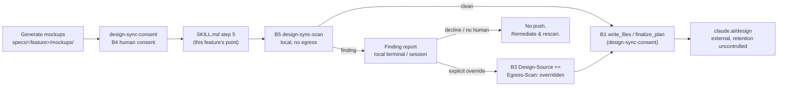

# Security Specification: design-sync-scan

This document is load-bearing, not a formality. Unlike a feature that opens or widens a data-egress path, this feature's entire content is a **mechanical control that reduces what reaches an existing one**: `design-sync-consent` (DS-29) demoted local human review from mandatory to optional and named the resulting gap as Residual Risk R1 — *"Demoting local review removes the only step at which a human necessarily sees the payload before it leaves... This feature adds no compensating mechanical control; #139 is that control."* This document states what the control catches, what it does not, under whose authority its one bypass operates, and what remains uncontrolled afterwards.

## What Leaves The Machine

This feature adds **no new outbound call and no new destination**. It sits entirely on the local side of `design-sync-consent`'s boundary B1 (`write_files` / `finalize_plan` → claude.ai/design) and narrows what is allowed to reach it. The egress inventory itself — E1 through E8 — is unchanged from `specs/design-sync-consent/security-spec.md`'s "What Leaves The Machine" table and is not reproduced here to avoid a second copy of truth; this feature's effect on that inventory is stated below instead.

| # | This feature's operation | Leaves the machine? | Basis |
|---|---|---|---|
| F1 | Reading `specs/<feature>/mockups/*.html` to scan it | **No.** Local filesystem read only. | `design.md`'s Data Plan: "This feature reads these files; it never writes to them." |
| F2 | Printing the finding report to a terminal or agent session | **No**, but see the note below — the report is a *new local surface*, not a new destination. | `design.md`'s API & Contract Plan |
| F3 | Writing `Egress-Scan` / `Egress-Scan-At` to the layer file's `Design-Source` section | **No.** Git-tracked locally, same as the five existing `Egress-Consent*` fields it sits beside. | `design.md`'s Data Plan |
| F4 | The gate's effect on E1–E5 (the mockup content itself) | **Reduces** what reaches B1: a payload with a detected finding does not reach `write_files` without an explicit override. | REQ-002, REQ-004 |

**The report (F2) is a disclosure surface even though it is not an egress path**, and this is the one place this feature could introduce a *new* leak while closing an old one. A finding report that reproduced a real secret's value in full would expose that secret on a surface the operator did not choose — a terminal's scrollback, a captured CI log, an agent session transcript that may itself be reviewed, stored, or (in a cross-model verification flow) sent to another model. This is why AC-014 requires the secret and PII categories to be masked in the report while the placeholder category is not: a stub marker carries no sensitivity, and masking it would only make the report harder to act on for no security benefit.

### What does not change

- **B1's consent gate is untouched.** `Egress-Consent`, its scope (feature ∧ session), its expiry, its withdrawal, and the push-failure rule are all `design-sync-consent`'s and remain exactly as that feature specified them (BL-002). This feature's gate is a second, independent check the payload must also pass — not a replacement for consent, and not consulted by it.
- **B2 (inbound `get_file`) is untouched.** Named here, as `design-sync-consent/security-spec.md` names it, so its absence from the change set is a decision, not an oversight.
- **The pull direction (`create_project`, `list_projects`, `list_files`) remains ungated**, exactly as `design-sync-consent` left it (that feature's Residual Risk R6, unchanged). This feature does not touch it and does not claim to.

## Under Whose Consent

This feature does not introduce a consent decision in `design-sync-consent`'s sense — it introduces a **content-hygiene gate** that operates independently of, and after, consent resolution in the Loop's step order.

| Question | Answer, and its basis |
|---|---|
| Who decides whether the scan runs? | Nobody decides — it is mechanical and unconditional at step 5 for every upload path (AC-026, AC-027). Unlike consent, there is no branch in which the scan is skipped by agreement. |
| Who decides whether a finding blocks the push? | The scan itself, mechanically, via its exit code (REQ-002). This is not a human decision. |
| Who decides whether an override past a finding is granted? | **A human, explicitly**, per invocation (AC-020). There is no automatic override and no setting that grants one in advance — unlike `design-sync-consent`'s consent, which *is* meant to be granted once and reused, this feature's override is deliberately designed not to be reusable (Edge Case 2/3, `design.md`'s Design Decisions). |
| Is the override enforced, or only recorded? | **Only recorded.** `Egress-Scan: overridden` is written by the same class of actor — an agent, following skill prose — that writes `Egress-Consent: granted`, and it carries the identical trust caveat (B3, below). Nothing here checks that a human genuinely reviewed the findings before the record was written. |
| What happens to a finding no pattern in this feature recognises? | **Nothing.** It reaches `write_files` exactly as it would without this feature. The gate's coverage is bounded by its pattern catalogue (`design.md`'s API & Contract Plan), not by the actual sensitivity of the content. |

## What This Feature Narrows, Precisely

`design-sync-consent/security-spec.md`'s "What The Operator Gives Up" table named six items (L1–L6) the operator loses under per-feature consent. This feature restores a bounded slice of exactly one of them.

| # | `design-sync-consent`'s framing | This feature's effect |
|---|---|---|
| L1 | "Per-payload review... the first upload of a feature may carry content no human has read — and so may every later one." | **Narrowed, not restored.** A human still need not read the mockup itself before it uploads. What changes: a payload matching this feature's pattern catalogue cannot upload *silently* — it stops at step 5 and requires an explicit override, which is itself a form of human attention, even though it is attention directed at a finding list rather than the mockup's substance. A clean scan still uploads with zero human eyes on the content, exactly as under `design-sync-consent` alone. |

No other item in `design-sync-consent`'s L1–L6 (per-payload refusal, consent to determinate bytes, bounded blast radius, destination binding, non-outliving-the-moment consent) is touched by this feature; all remain exactly as that feature left them.

## Trust Boundaries

| Boundary | Source | Destination | Assets | Validation | AuthN/AuthZ | REQ | AC |
|---|---|---|---|---|---|---|---|
| B5 (new) | `specs/<feature>/mockups/*.html` on local disk | the scanner's own process (local) | E1–E5 (mockup content, read-only, not egressed by B5 itself) | the three-category pattern catalogue (`design.md`) | none — mechanical, no human required to run it | REQ-001–REQ-003 | AC-001–AC-012 |
| B5 → B1 (new, a gate on the existing boundary) | scanner exit code | the push decision at `SKILL.md` step 5/6 | pass/fail signal only, no payload | exit-code contract (REQ-002); an explicit human override on a finding (REQ-006) | human, for the override only; none for a clean pass | REQ-004–REQ-007 | AC-013–AC-028 |
| B1, B2, B3, B4 | unchanged | unchanged | unchanged | unchanged | unchanged | — | `design-sync-consent`'s own criteria, unaffected |

### B5, in detail — a gate whose coverage is bounded, stated plainly

B5 is mechanical and unconditional in the sense that it always runs; it is not mechanical in the sense of being complete. It recognises three lexically-defined categories via pattern matching (`design.md`'s catalogue: `check-placeholders.sh`'s reused markers, seven named secret-format prefixes plus one generic keyword-assignment shape, and two conservative PII shapes). Anything outside those shapes — a confidential fact with no distinguishing lexical signature, a secret in a format this catalogue does not enumerate, PII in a format neither pattern covers — passes through unrecognised, exactly as it would without this feature. `security-spec.md`'s Residual Risks section states this as the feature's central limitation rather than implying, by the presence of a scan, that the payload is now safe.

### The override record, B3 extended — the same finding this document's sibling already made

`docs/THREAT-MODEL.md:12` places agent self-reports under *NOT Trusted*. `design-sync-consent/security-spec.md`'s B3 treatment already established that `Design-Source` is an unguarded, agent-writable, free-form section, and that its `Egress-Consent*` fields are an audit trace, not an authorization anything enforces. `Egress-Scan` and `Egress-Scan-At` are written by the same actor, into the same section, under the same absence of a schema, a validator, or a guard. Nothing here changes that posture — this feature does not attempt to guard the new fields any more tightly than the existing ones are guarded, because doing so selectively would itself be a claim ("this class of record is more trustworthy than that one") this repository's threat model does not support. The three honest responses `design-sync-consent/security-spec.md` named for its own record — guard it, scope it, or state plainly that it is an audit trace — apply here identically; this feature takes the third and the second together: it is stated as an audit trace (this section), and it is scoped so it cannot silently apply to content it was never shown (REQ-006's no-persistence rule, Edge Case 2/3).

### Comparison with the panelist path, extended

`design-sync-consent/security-spec.md` already compares the design-sync egress path against `cross-model-verification-policy.md`'s panelist path and records the asymmetry as Residual Risk R4. This feature narrows that asymmetry by exactly one row, no further:

| Control | panelist path | design-sync path, before this feature | design-sync path, after this feature |
|---|---|---|---|
| Pre-send content scan | `.env`, key material, absolute paths, private URLs — scanned and replaced (`cross-model-verification-policy.md:272-283`) | none | **placeholder, secret-shaped, and PII-shaped patterns — scanned and blocking, pending override** |
| Redaction before send | as above | none | **none.** This feature blocks or requires an override; it does not redact and resend a cleaned payload. A finding stops the upload entirely — remediation is a human/agent editing the mockup, not an automated strip-and-continue. |
| Record of what was sent | `input_digest`, 64-hex SHA-256 (`:281-290`) | free-form `Design-Source` prose | **unchanged** — `Egress-Scan`/`Egress-Scan-At` record the scan's outcome and timing, not a content-addressed digest of what was actually sent (`requirements.md` Non-goals; OQ-3) |
| Enforcement | fail-closed: invalid consent ⇒ no panelist contacted | an instruction in a `SKILL.md` | **still an instruction in a `SKILL.md`**, now backed by a real exit code a caller *can* check mechanically — a stronger position than a pure document-conformance control, but the enforcement still lives in the agent choosing to act on that exit code, not in a gate external to the agent |

The asymmetry with the panelist path is smaller than before this feature and still real. It is recorded as **Residual Risk R4** (carried forward, narrowed) rather than closed, because closing the redaction and machine-checkable-record gaps is a larger change than this issue requests (`requirements.md` Non-goals).

## STRIDE Analysis

At least two rows per boundary this feature introduces or touches.

| Boundary | Threat | STRIDE | Abuse case | Mitigation in this feature | Verification | REQ | AC |
|---|---|---|---|---|---|---|---|
| B5 | The scanner's own report becomes a new disclosure surface | **Information Disclosure** | A genuine AWS key is found and printed in full to a terminal that is later screen-shared, or to a CI log that is retained longer than the secret's rotation window | Secret and PII findings are masked in the report; only the placeholder category is shown in full → **R1 (this document)** | TEST-027, TEST-028 | REQ-004 | AC-014 |
| B5 | A finding's category is not disclosed, so the human cannot triage | **Information Disclosure** (of a different kind — under-disclosure) | A report says "3 findings" with no indication which are placeholders (low stakes) and which are secrets (high stakes), and the human overrides without reading closely because everything looks the same | Every finding is labelled by category | TEST-025 | REQ-003 | AC-012 |
| B5 | The pattern catalogue misses a real secret or a real PII string in an unenumerated shape | **Information Disclosure** | A vendor token format not in S1–S7, or PII in a non-Western phone format, passes through unrecognised and reaches B1 | **Not mitigated.** Recorded as the feature's principal residual risk → **R2** | — | — | out of scope by design |
| B1←B5 (the gate) | An upload path bypasses the check point | **Tampering (with the control)** | A branch of the Loop calls `write_files` without passing through step 5, making the scan bypassable by construction | Every upload path is required to pass the one named point, asserted structurally | TEST-045 | REQ-007 | AC-027 |
| B5's override | A false-positive override silently becomes standing, applying to content it was never shown | **Elevation of Privilege** (of a decision) | A regenerated mockup set with new, different findings is pushed without a fresh presentation, because a prior override on the same feature/session is treated as still covering it | The override is scoped to one scan result, with no persistence across regeneration, verified for identical findings too | TEST-037, TEST-038 | REQ-006 | AC-021 |
| B5's override record | A finding is overridden without a human ever having seen the report | **Spoofing** | An agent writes `Egress-Scan: overridden` and proceeds; nothing counts, hashes, or guards the line, exactly as `design-sync-consent`'s `Egress-Consent: granted` is unguarded | **Not mitigated.** The record is characterised as an audit trace, not an authorization (this document, "B3, in detail") → **R3** | — | REQ-006 | — |
| B5 | The check point presumes an interactive human, breaking a future automated/`standing`-mode caller | **Denial of Service** (to the workflow) | A future caller with no human present (mirrors `design-sync-consent`'s OQ-9 concern for its own check point) cannot proceed past a finding because the block presumes someone will be asked | The script itself performs no interactive prompt and completes deterministically from arguments and the filesystem; the *presentation* and *override* are the caller's responsibility, stated as such | TEST-030 | REQ-004 | AC-015 |
| B5 | False positives on legitimate content create pressure to weaken or disable the gate | **Denial of Service** (to the control, via operator fatigue) | Recurring, correctly-formatted business content (a real support email, a settings-page "API Key" label) triggers on every regeneration under the no-persistence rule, and an operator under deadline pressure starts overriding without reading | RFC 2606 domain exclusion (P1) and value-length/quoting bounds (S7) reduce the common false-positive cases; the residual cost is accepted and stated, not hidden → **R4** | TEST-021, TEST-024 | REQ-003 | AC-010, AC-011 |

## Authorization

- **No protected enforcement-chain file is a live edit target.** `design-sync-loop/SKILL.md`, `claude-design-workflow.md` (or its referring section), and `tests/run-all.{sh,ps1}` are confirmed absent from `PROTECTED_GATE_SUFFIXES` (`plugins/sdd-quality-loop/scripts/generated/guard_invariants.py:4`). `.github/workflows/test.yml` is on that list; its CI registration is a separately staged, human-applied patch, outside this decomposition (`infra-spec.md`). **Re-verify per `requirements.md` → Assumptions before relying on either claim.**
- **The guard's Bash-command matcher is broader than its write-path matcher.** A read-only command whose text merely names a protected path can be denied — observed first-hand during this feature's authoring (grepping `.github/workflows/test.yml` by name via a shell command was denied; the file had to be read with a path-based tool instead). Implementers and reviewers should restructure such commands rather than work around the guard, following the precedent `design-sync-consent/security-spec.md` and `epic-136-phase4-docs/investigation.md:168` already recorded for the same behaviour.
- **No `SDD_SUDO` interaction.** This feature neither reads, creates, nor requires sudo state.
- **No approval-field surface.** This feature writes nothing to `tasks.md` approval fields, WFI status fields, or evidence bundles.

## Data Classification and Protection

| Entity | Classification | At rest | In transit | Retention | Deletion | Access log | REQ | AC |
|---|---|---|---|---|---|---|---|---|
| `specs/<feature>/mockups/*.html` (read by this feature) | Confidential by default — unchanged classification from `design-sync-consent/security-spec.md` | git-tracked; no `.gitignore` rule | **not transmitted by this feature** — read-only local scan | as `design-sync-consent` states | not specified | none at any destination; local git history | REQ-001 | AC-001–AC-004 |
| The finding report (F2) | **Sensitive when it contains an unmasked placeholder marker; the secret/PII categories are masked specifically so this row does not need a higher classification for those** | not persisted by the script itself; whatever the caller (terminal, agent session, CI log) retains | local only — not sent anywhere by this feature | governed by the caller's own logging/retention, outside this feature's control | not specified | whatever the caller's own surface logs | REQ-004 | AC-014 |
| `Egress-Scan` / `Egress-Scan-At` (`Design-Source`) | Internal; non-secret — same classification as the five existing `Egress-Consent*` fields | git-tracked layer file | never leaves | permanent (git history) | not specified | git history | REQ-006 | AC-022, AC-023 |
| `design-sync-scan.sh` / `.ps1` themselves | Internal, non-secret — plugin source | git-tracked | shipped with the plugin | permanent | n/a | git history | REQ-001 | AC-001 |

**No secret is handled by this feature in the sense of being read, generated, or transported as a credential.** The feature's whole subject is *detecting* secret-shaped strings inside content that might carry them, and specifically declining to reproduce a detected value anywhere in its own output (AC-014). That is a materially different claim from "this feature possesses no secret" — a genuine secret, if present in a mockup, is read into the scanner's process memory during the scan (as any scanner must), never written to a new location, and its matched span never re-emitted by this feature's own output.

## Security Tests

The mapping from boundary to executable or document-conformance check.

| Boundary | Threat | Test | What would be missed without it |
|---|---|---|---|
| B5 | Information Disclosure (report re-exposes a value) | TEST-027, TEST-028 | a masking implementation that redacts placeholder findings but forgets secret or PII findings, or vice versa |
| B5 | Information Disclosure (missing category label) | TEST-025 | a report that aggregates a count without saying what kind of thing was found |
| B1←B5 | Tampering (control bypass) | TEST-045 | an upload path that reaches `write_files` without passing the scan — which would make this whole feature decorative |
| B5's override | Elevation of Privilege (standing override) | TEST-037, TEST-038 | an override that silently covers a differently-flagged regeneration, recreating the exact standing-exemption gap this feature exists to prevent |
| B5's override record | Spoofing / false assurance | (not independently tested — inherited from `design-sync-consent`'s TEST-018-equivalent treatment of the same class of field) | a skill that presents an unguarded agent-written line as an enforced authorization |
| B5 | DoS via presumed interactivity | TEST-030 | a script that blocks on stdin, breaking any caller that cannot supply an interactive human at the script's own invocation |
| B5 | DoS via operator fatigue (false positives) | TEST-021, TEST-024 | a pattern set with no false-positive mitigation, which in practice trains operators to override without reading |
| Authorization | Protected-file write | (none required — no protected file is a live target; see Authorization above) | — |

## Residual Risks

Recorded because they survive this feature, not because they are acceptable.

- **R1 — The finding report is a new local disclosure surface.** Mitigated by masking the secret and PII categories (AC-014); not eliminated — a masked report is still a record that *something* sensitive-shaped exists at a specific file and line, which is itself information, and the placeholder category's full-text disclosure is deliberately unmitigated because it is not sensitive.
- **R2 — Pattern coverage is bounded, and the gap is the feature's central limitation.** A novel secret format, PII in an unenumerated shape, or a confidential fact with no lexical signature (an unreleased product name — `design-sync-consent/security-spec.md` E2's own example) passes through undetected. This is stated as the honest bound of what a lexical pattern-matching gate can do, not a defect to be engineered away at spec time; `requirements.md`'s OQ-1 records extending the pattern set as a legitimate, non-blocking future direction.
- **R3 — The override record is unguarded and agent-writable**, at the identical trust posture as `design-sync-consent`'s `Egress-Consent*` fields. Mitigated only by honest labelling and by scope (no persistence across regeneration), not by enforcement.
- **R4 — The egress-path asymmetry with the panelist path is narrowed, not closed.** No redaction-and-resend exists on this path; a finding blocks rather than being cleaned. No machine-checkable, content-addressed record of what was actually sent exists here, unlike the panelist path's `input_digest`. Closing either gap is a larger change than this issue requests (`requirements.md` Non-goals; carried forward from `design-sync-consent`'s R4).
- **R5 — False-positive friction is a recurring, not a one-time, cost**, because the no-persistence rule (REQ-006) means genuinely correct content matching a pattern re-triggers on every regeneration. The RFC 2606 exclusion and S7's value-length bound reduce the common cases; they do not eliminate the residual one, and sustained friction is itself a pressure toward the DoS-via-fatigue abuse case in the STRIDE table.
- **R6 — This feature narrows `design-sync-consent`'s Residual Risk R1; it does not close it.** A clean scan still uploads mockup content no human has read (`design-sync-consent/security-spec.md` L1, "What This Feature Narrows, Precisely" above). Recorded so a later reader does not conclude, from this feature's existence, that the demotion of local review is now fully compensated for.
- **R7 — `docs/THREAT-MODEL.md` does not know boundary B5 exists**, for the same reason it does not yet know B1–B4 exist (`design-sync-consent/security-spec.md`'s R7, INV-020, unresolved as of that feature). A control inventory that omits a live boundary invites the reader to conclude it was assessed. `requirements.md` OQ-4.

## Open Questions

- security: **OQ-1** (from `requirements.md`) — should the secret pattern set be extended beyond S1–S7 in a later revision? Non-blocking; the enumerated set is a stated v1 baseline (R2).
- product: **OQ-2** — should the override support per-finding granularity rather than all-or-nothing? Non-blocking; `design.md`'s Design Decisions records the all-or-nothing choice and its rationale.
- security: **OQ-3** — should the `Design-Source` scan record carry a content-derived identifier (a hash of the finding set), narrowing R4 further? Non-blocking; deliberately out of scope here (Non-goals).
- maintainers: **OQ-4** — does `docs/THREAT-MODEL.md` gain an entry for boundary B5, given it is the compensating control for `design-sync-consent`'s own unresolved threat-model gap (R7)? Non-blocking; mirrors `design-sync-consent`'s own unresolved OQ-10.
