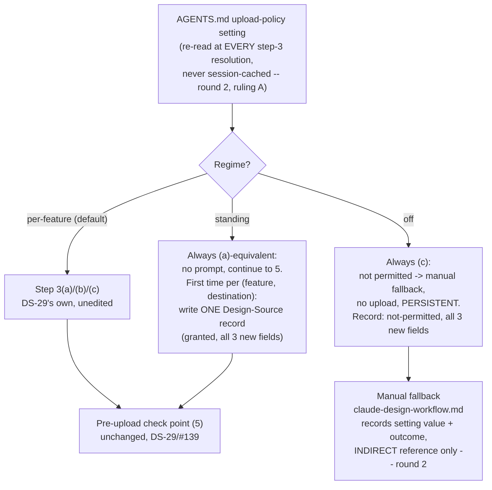

# Design: design-sync-standing-consent

Impl-Review-Status: Pending
Feature Type: feature (project-level configuration for an existing internal skill; no application code)

**Revision note (round 2).** A Codex adversarial review found one Critical finding and fourteen other findings against round 1 of this document (and its sibling `requirements.md` / `acceptance-tests.md`). The coordinator's rulings are incorporated directly below, each marked **(round 2)** at the point it changes round-1 content, rather than tracked as a separate addendum — several of the findings changed what round 1's own text specified, not only how it would be tested.

## Architecture Overview

Like its predecessor DS-29, this feature has no executable code path. `design-sync-loop` is a `SKILL.md`; `AGENTS.md` is a Markdown file agents read for instructions; `claude-design-workflow.md` is a reference document. The "implementation" is text, and correctness is established by document-conformance assertions (`acceptance-tests.md`). This bounds every decision below exactly as it bounded DS-29's: nothing here can enforce anything at runtime, only specify it precisely enough that an agent following the instructions behaves as described.

The change has three edit surfaces, all unprotected (`requirements.md` → Assumptions):

| Surface | File | Nature |
|---|---|---|
| **The setting** | `AGENTS.md` | new `## Project Settings` section; introduces the convention, not an extension of one |
| **The loop** | `plugins/sdd-bootstrap/skills/design-sync-loop/SKILL.md` | step 3 gains an outer branch selector reading the setting; the `Design-Source` record table gains three fields |
| **The fallback** | `plugins/sdd-bootstrap/skills/sdd-bootstrap-interviewer/references/claude-design-workflow.md` | one recording statement, referring to the setting only **indirectly** — never by its literal key name (REQ-008, round 2 Critical fix) |
| **Verification** | `tests/design-sync-standing-consent.tests.{sh,ps1}`, registered in `tests/run-all.{sh,ps1}` | this feature's own assertions; CI registration deferred as non-blocking verification (REQ-010) |

Unlike DS-29, no file here is a member of `PROTECTED_GATE_SUFFIXES` (`guard_invariants.py:4`), so there is no human-copy staging round anywhere in this decomposition.

### The central structural decision: wrap, don't rewrite

DS-29 already built the thing this feature needs — a single named step (`design-sync-loop/SKILL.md` step 3) with a three-outcome space, `{must be requested, already holds, not permitted}` (`specs/design-sync-consent/design.md`, AC-019). This feature's only structural choice is *how* to attach a project-level setting to that step without touching what happens once a regime is chosen.



The alternative considered and rejected: rewrite step 3(a)/(b)/(c) itself so that its own text branches internally on the setting. Cheaper to describe in one pass, but it fails REQ-005/AC-015 — DS-29's step 3 content (scope, destination binding, decline transience, withdrawal, push-failure handling) is exactly what `tests/design-system-contract.tests.sh`'s TEST-001 through TEST-051 assert against today, and rewriting it in place would force every one of those assertions to be re-derived rather than merely re-verified. Wrapping the step in an outer selector, and leaving the DS-29 branches as the literal content of the `per-feature` regime, is what makes REQ-009's regression claim (zero new failures against a documented baseline, round 2 ruling E) true by construction rather than by careful rewriting.

A second, smaller choice: the three new record fields (`Egress-Consent-Party`, `Egress-Consent-At`, `Ds-Upload-Consent-Setting`) are added to the **record table**, a section shared by every regime, rather than duplicated inside each of the three new/old branches. This is what lets an ordinary `per-feature` grant — and, as the round-2 review found round 1 had failed to make explicit for `off`, an `off`-driven not-permitted outcome, and a `per-feature` mid-session withdrawal — all carry the same three fields going forward (`requirements.md` REQ-006/AC-029) without step 3/4's own DS-29 text needing to say so explicitly. The record's shape, not the branch's prose, is what determines what gets written; round 1's `off` branch text under-used this by restating only one of the three fields inline, which read as though `off` intentionally got a smaller field set than `standing` — it did not, and round 2's target text below fixes this.

## Components

| Component | Status | Change |
|---|---|---|
| `AGENTS.md` — new `## Project Settings` section | New | one section, one row table, placed after `## Rules` (`:119-256`, the file's last existing section) so it does not renumber or displace any existing section |
| `design-sync-loop/SKILL.md:66-72` (Loop intro) | Existing (edited) | one clause noting step 3 now reads the project setting, re-read at every resolution |
| — step 3 (`:87-100`) | Existing (restructured) | outer selector added; DS-29's (a)/(b)/(c) content becomes the `per-feature` regime's literal text, unedited; `standing` and `off` regimes added beside it, each writing all three new record fields |
| — `Design-Source` consent record (`:160-206`) | Existing (edited) | field table (`:167-173`) gains three rows; the extensibility paragraph (`:175-181`) is updated to say the fields are now populated, not only promised, on every record-producing occasion (`requirements.md` AC-029) |
| — everything else in `SKILL.md` | **Untouched** | Capability Detection (`:22-30`), `## Ensure design-system/` (`:32-64`), steps 1/2/4/5/6/7 content (`:74-86`, `:101-153`), Finalize (`:155-158`), `## Boundaries` (`:207-226`) — all DS-29 text, unmodified |
| `claude-design-workflow.md` | Existing (edited) | one bullet added under `## Boundaries` (`:9-17`), referring to the project's upload-policy setting **indirectly** — never by its literal key `ds_upload_consent`, which contains the substring "consent" (REQ-008, round 2 Critical fix) |
| `tests/design-sync-standing-consent.tests.sh` / `.ps1` | New | this feature's own assertions |
| `tests/run-all.sh`, `tests/run-all.ps1` | Existing (extended) | register the new suite; unprotected, agent-applicable |
| `.github/workflows/test.yml` | **Protected — separate staged patch** | CI registration, presented as deferred, non-blocking verification (REQ-010/AC-028, round 2 ruling E) |
| `specs/workflow-state-registry.json` | Registered by this authoring session | `{"feature": "design-sync-standing-consent", "profile": "full"}` |

## Layer Specifications

| Layer | Summary | Canonical Detail | Owner | Status |
|---|---|---|---|---|
| UX | N/A — no rendered surface, and this feature *reduces* the one human-perceivable surface DS-29 introduced (the consent prompt no longer appears under `standing`/`off`). | [UX specification](ux-spec.md#scope-and-user-journeys) | — | N/A |
| Frontend | N/A — no browser, bundle, or build output. | [Frontend specification](frontend-spec.md#technology-stack) | — | N/A |
| Infrastructure | No new CI step inside this decomposition; one staged human-copy patch for `.github/workflows/test.yml`, bundleable with DS-29's own still-outstanding one. | [Infrastructure specification](infra-spec.md#deployment-topology) | maintainers | Drafted |
| Security | **Load-bearing.** This feature adds a project-wide dial that can either compound or eliminate DS-29's own egress control, and places that dial in an unguarded file. | [Security specification](security-spec.md#trust-boundaries) | security | Drafted |

## Design System Compliance

**N/A — ds_profile: none**, for the same reason DS-29 recorded: `sdd-forge` has no project-level `design-system/` directory and never invokes `design-sync-loop` on itself. This feature edits the *specification of* the loop and its governing setting; it produces no mockup and consumes no design-system contract.

## API & Contract Plan

### The setting's target shape (`AGENTS.md`, new `## Project Settings` section)

```
## Project Settings

Project-level configuration keys agents must honor. An absent key, or an
absent section entirely, uses the stated default. Both absences are
independently tested (requirements.md AC-003). A present key whose value is
not exactly one of the listed lowercase literals -- a typo, a case variant
such as `Standing`, or an unknown value -- also uses the stated default,
by exact case-sensitive matching (round 3, ruling F / requirements.md
AC-031): never `standing`, never `off`.

| Key | Values | Default | Meaning |
|---|---|---|---|
| `ds_upload_consent` | `standing` \| `per-feature` \| `off` | `per-feature` | Governs `design-sync-loop`'s egress behaviour for uploads to claude.ai/design (SKILL.md step 3), identically on every host, re-read at every resolution of that step (never cached per session -- round 2, ruling A). `per-feature`: DS-29's shipped behaviour -- one confirmation per feature and session. `standing`: skip the per-feature confirmation; write one audit record to `Design-Source` per feature-and-destination, the first time, as `granted` (round 2, ruling B). `off`: forbid the upload on every host; step 3 always resolves to its "not permitted" outcome and the loop takes the manual fallback. |
```

This is the first key in the section and the section's first use, so the table's own header row carries the whole convention (`Key` / `Values` / `Default` / `Meaning`) rather than a separate prose explanation of the convention — a later setting added by a future feature follows the same table.

### The loop's target shape (`design-sync-loop/SKILL.md`, step 3)

Placeholders marked `⟨OQ-n⟩` are this document's own open questions (`requirements.md` → Open Questions), not DS-29's — none of them blocks implementation. OQ-1 and OQ-3, which round 1 left as placeholders here, are resolved in round 2 and no longer appear as placeholders below.

```
3. **Resolve egress consent.** Read the project's `ds_upload_consent` setting
   (AGENTS.md -> Project Settings; absent, or present with a value that is
   not exactly one of the three lowercase literals -> per-feature; matching
   is exact and case-sensitive -- round 3, ruling F) EVERY TIME this
   step is resolved -- never a value cached from an earlier resolution in
   the same session (round 2, ruling A / requirements.md AC-020). Three
   regimes:

   - **per-feature** (default). DS-29's own step, unedited -- one named step
     with exactly three outcomes:
     a. Consent already holds for this feature AND this session -> continue
        to 5 with no prompt. [...DS-29 text, verbatim, unmodified...]
     b. Consent has not been obtained for this scope -> go to 4.
     c. Egress is not permitted -> manual fallback, no upload attempt,
        record the outcome, persistent for the scope. [...DS-29 text...]

   - **standing**. Never produces outcome (b). Treat consent as already
     holding -- continue to 5 with no prompt -- and, the first time this
     feature-and-destination pair is reached under standing (round 2,
     ruling B: scoped by (feature, destination), not feature alone -- no
     existing Design-Source record for this feature names THIS destination
     and carries Ds-Upload-Consent-Setting: standing), write one record
     now, with ALL of:
       Egress-Consent: granted
       Egress-Consent-Party: <names the setting, never a fabricated
         per-occurrence identity -- no human answered a prompt for this
         occurrence, so the record must not claim one did (<OQ-2>)>
       Egress-Consent-At: <ISO-8601 timestamp>
       Ds-Upload-Consent-Setting: standing
     A DIFFERENT destination, later, for the same feature, still under
     standing, is a fresh first occurrence for that (feature, destination)
     pair and gets its own one-time write (requirements.md AC-030) -- it is
     not silently covered by the earlier record. Every later occurrence for
     the SAME (feature, destination) pair finds that record already present
     and writes nothing further.

   - **off**. Always resolves to outcome (c): egress is not permitted. Take
     the manual fallback, make no upload attempt, and write a record with
     ALL of:
       Egress-Consent: not-permitted
       Egress-Consent-Party: <names the setting, never a fabricated
         per-occurrence identity -- off has no live human either: nobody is
         ever asked (<OQ-2>)>
       Egress-Consent-At: <ISO-8601 timestamp>
       Ds-Upload-Consent-Setting: off
     -- persistently, for as long as the setting reads off. This is NOT the
     transient per-attempt decline DS-29's own step 4 already defines; it
     does not lapse on the next attempt, and it applies on every host
     (REQ-002), including one without the DesignSync tool today.
     (Round 2, ruling C: round 1's own text here wrote only
     Egress-Consent: not-permitted, Ds-Upload-Consent-Setting: off,
     omitting Egress-Consent-Party and Egress-Consent-At -- corrected
     above; see requirements.md AC-029.)

   A per-feature mid-session WITHDRAWAL (DS-29's own unedited AC-028 path)
   also writes all three new fields on its Egress-Consent: withdrawn record
   -- named explicitly because it is the one record-producing occasion
   neither the issue text nor round 1 of this document mentioned
   (requirements.md AC-029, branch 3).

   Whichever regime or occasion produces the write, Ds-Upload-Consent-Setting
   names the regime in force at the time of the write -- including an
   ordinary per-feature grant, which now also carries
   Ds-Upload-Consent-Setting: per-feature, and Egress-Consent-Party naming
   the human who answered step 4 in that case.
```

Two properties are load-bearing and easy to lose in editing:

- **The `per-feature` branch's own text is DS-29's, byte-for-byte.** This is what makes REQ-005/AC-015 true by construction — an implementer must copy, not paraphrase, DS-29's three outcomes into the new indentation level.
- **`standing`'s first-occurrence test reads the record, not a separate flag, and is scoped by (feature, destination) — not feature alone (round 2, ruling B).** There is no new boolean state anywhere else — "has this (feature, destination) pair already been granted once under standing" is answered by the presence of `Ds-Upload-Consent-Setting: standing` naming that destination in the feature's own `Design-Source`, which is also how AC-021 keeps a stale record from ever being read as authoritative for a *different* current setting: the check is narrow (this exact field, this exact value, this exact destination), not "does any record exist for this feature."

### `Design-Source` consent record — the three new rows

```
| Field                       | Meaning                            | Value |
|------------------------------|-------------------------------------|-------|
| Egress-Consent-Party         | who or what produced the grant      | the human who answered step 4, when per-feature; a named reference to the upload-policy setting itself, never a fabricated identity, when standing OR off -- neither has a live per-occurrence human (round 2: broadened from standing alone) (<OQ-2>: exact string not fixed here) |
| Egress-Consent-At             | when the record was written         | ISO-8601 timestamp |
| Ds-Upload-Consent-Setting     | the setting in force at write time  | standing / per-feature / off |
```

Appended after DS-29's five existing rows (`:169-173`), inside the same table, not a second table — this is what AC-016's per-field-name check reads, and what AC-018's eight-branch regression check confirms did not disturb the five rows above them.

**All three fields are populated on every record-producing occasion (round 2, ruling C; `requirements.md` AC-029), not only on `standing`'s write.** Four occasions exist: a `standing` grant, an ordinary `per-feature` grant, a `per-feature` mid-session withdrawal, and an `off`-driven not-permitted outcome. Round 1's own text satisfied this for `standing` and for the ordinary `per-feature` grant, but under-specified it for `off` (only `Ds-Upload-Consent-Setting` was shown) and did not mention the withdrawal occasion at all; both are corrected in "The loop's target shape" above.

The extensibility paragraph immediately below DS-29's table (`:175-181`) already states: "That is what lets DS-31 / issue #140 add fields... later without invalidating a record written here." This feature's edit to that paragraph is the smallest possible: change the forward-looking "lets... add fields later" to a statement that they have been added, on every occasion this skill's behaviour produces a write, and that a DS-29-era record (missing all three) remains conforming — the promise exercised, not a new promise made.

### The fallback's target shape (`claude-design-workflow.md`, `## Boundaries`)

**Critical finding, round 2 (Codex adversarial review).** Round 1's proposed bullet for this file wrote the literal setting key `` `ds_upload_consent` ``. `tests/design-system-contract.tests.sh`'s `TEST-021` asserts this file contains **no case-insensitive occurrence of the substring "consent" anywhere** — and the key name itself contains that substring (`ds_upload_` + `CONSENT`), so round 1's own draft was a guaranteed regression of a DS-29 invariant, independent of anything else the sentence said. **Ruling:** the key name is fixed by issue #140 and is not renamed; instead this file refers to the setting only **indirectly**, never spelling out its key. This is why the bullet below says "the upload-policy setting defined in `AGENTS.md`'s Project Settings section" rather than naming `ds_upload_consent`.

One new bullet, appended after the existing five (`:9-17` — no existing text is removed):

```
- This workflow does not decide whether an upload may occur at all -- that
  is the upload-policy setting defined in AGENTS.md's Project Settings
  section (this document intentionally does not name the setting's key, so
  a future edit here can never reintroduce the one substring this file's
  own regression test forbids -- see the note above). When this document is
  the path actually taken -- because the tool is unavailable, authentication
  failed, or the project's upload-policy setting forbids the upload
  outright -- record that setting's value and its audit outcome in the
  layer file's Design-Source section, alongside the marker already recorded
  there, so the trail names which policy governed, regardless of which path
  reached this document.
```

Checked against the constraint discovered during this feature's own drafting, and re-verified after the round-2 fix: the bullet above contains no case-insensitive occurrence of the substring "consent" (REQ-008/AC-024) and never writes the literal key `ds_upload_consent` anywhere in the file (REQ-008/AC-022) — "authorization" appears nowhere in this version either, which round 1 had used; "upload-policy setting," "outcome," and "policy" carry the same meaning without the one word, and without the one identifier, DS-29's own `TEST-021` forbids in this file.

## Data Plan

**No new storage mechanism, no migration (round 2, ruling D — corrected from round 1's "no persistence," which contradicted the paragraph that followed it).** Round 1's own wording ("No data model, no persistence, no migration") was inconsistent with itself: the very next sentence described the `Design-Source` record table as gaining three fields that are written and read back — that *is* persistence, just not a *new* mechanism. Restated accurately: the three new fields persist exactly where DS-29's existing five already do — in the git-tracked layer file — and this feature introduces no new file, no new store, and no new format.

Two on-disk artifacts change in shape:

| Artifact | Shape | Change |
|---|---|---|
| `AGENTS.md` | prose Markdown with `##` sections | gains one new section and one new configuration-key convention; no existing section is edited |
| `Design-Source` section in `ux-spec.md` / `design.md` | free-form Markdown section, agent-written, git-tracked (DS-29 shape) | gains three named fields, populated on every record-producing occasion (`requirements.md` AC-029): `standing` grant, `per-feature` grant, `per-feature` withdrawal, `off` not-permitted. DS-29-era records without them remain conforming (AC-017). No new persistence mechanism — the same git-tracked layer file DS-29 already writes to. |

`claude-design-workflow.md` gains one bullet of prose; it is documentation, not a data artifact.

## Security Boundaries

The authoritative treatment is [`security-spec.md`](security-spec.md#trust-boundaries). Recorded here are the boundaries this design had to respect.

| Boundary | Trust posture | What the design commits to |
|---|---|---|
| **B1 — outbound to claude.ai/design** (unchanged from DS-29) | External; retention uncontrolled. | Unaffected by this feature's edit surface — this feature changes only *whether/when* a human is asked before B1 is used, never what crosses it. |
| **B5 — the `ds_upload_consent` setting itself, in `AGENTS.md`** (new) | **Unguarded.** `AGENTS.md` is not in `PROTECTED_GATE_SUFFIXES`; an agent can write it exactly as it can write any other prose file. | The design does not add a guard (Non-goals) — it requires the setting's *effect* to be auditable (REQ-006/007) so a reviewer reading `Design-Source` can at least see which regime produced a given record, even though nothing stopped that regime from being chosen by whoever last edited `AGENTS.md`. |
| **B3 — the `Design-Source` consent record** (DS-29, extended) | Agent-written; NOT trusted (`docs/THREAT-MODEL.md:12`); still unguarded. | The three new fields make the record *more* informative about provenance without making it *more* authoritative — REQ-007/AC-021 is the explicit statement that a record's own historical setting value never overrides the live one, which is the same "audit trace, not authorization" posture DS-29 established for the record as a whole (`specs/design-sync-consent/security-spec.md`, B3), extended to cover the setting too. |

## Cross-Layer Dependencies

| From | To | Contract / Decision | REQ | AC | Verification |
|---|---|---|---|---|---|
| requirements.md | security-spec.md | `AGENTS.md`'s `ds_upload_consent` is unguarded; this is the feature's principal residual risk, not fixed here | REQ-001 | AC-002 | TEST-002 |
| requirements.md | design-sync-consent (DS-29) | this feature's `per-feature` regime is DS-29's own step 3(a)/(b)/(c), wrapped, never rewritten | REQ-005 | AC-015 | TEST-019…TEST-025, and DS-29's own TEST-001…TEST-051 |
| design.md | (issue #139 / DS-30) | the pre-upload check point continues to sit between consent resolution and push in every branch that produces an upload attempt; `off` produces no attempt for it to see | REQ-004 (Non-goals) | — | none owned here; carried as DS-29's OQ-9 |
| design.md | infra-spec.md | this feature's suite is registered in `run-all`, unprotected; CI registration deferred, non-blocking, bundleable with DS-29's own | REQ-010 | AC-027, AC-028 | TEST-053, and the Deferred section for AC-028 |
| design.md | claude-design-workflow.md | the fallback refers to the setting only indirectly; never writes the literal key (round 2 Critical fix) | REQ-008 | AC-022, AC-024 | TEST-046, TEST-050 |

## ADR Change Log

| ADR | Decision | Status | Layer Impact | Supersedes | Date |
|---|---|---|---|---|---|
| _proposed, number TBD_ | A project-level setting (`ds_upload_consent`) can suspend or replace the per-feature egress consent DS-29 established, stored in an unguarded file | Proposed | Security | none | — |

Whether this warrants an ADR is a maintainer call, not decided here — the same posture DS-29 took for its own, structurally smaller change. The argument for is stronger here than it was for DS-29: this feature is the one that makes an unguarded configuration file capable of silently disabling a security control DS-29 built for the opposite purpose. **Number re-verification** (`AGENTS.md` "Author-time sweeps" item 3): re-list `docs/adr/` at drafting time; do not consume a number on the strength of this table (same instruction DS-29 carries, and the same duplicate-number caution at `0002`/`0003`/`0004` still applies).

## Design Decisions

**Resolved here (design's own scope):**

- **Wrap step 3 with an outer selector; do not rewrite its content.** Rationale in Architecture Overview. Chosen so DS-29's own 51-row test suite requires no re-derivation, only re-verification.
- **The three new record fields live in the shared table, not duplicated per regime.** Lets an ordinary `per-feature` grant, a `per-feature` withdrawal, and an `off` outcome all carry `Ds-Upload-Consent-Setting` (and the other two fields) without touching step 3/4's DS-29 text.
- **`standing`'s "first occurrence" test reads the record's own new field, not a separate flag, scoped by (feature, destination).** No new state is introduced anywhere else in the system; this is also what makes AC-021 (a stale record never overrides the live setting) enforceable by the same mechanism that decides when to write in the first place.
- **The fallback document's addition never writes the setting's literal key name (round 2, Critical fix).** "Upload-policy setting," "outcome," and "policy" carry the meaning without the identifier `ds_upload_consent`, which contains "consent" and would otherwise unconditionally regress DS-29's own `TEST-021`.
- **The setting is re-read at every resolution of step 3 (round 2, ruling A).** Not cached once per session — a same-session `AGENTS.md` edit takes effect on the next resolution.
- **`standing`'s scope is (feature, destination), mirroring DS-29's own destination binding (round 2, ruling B).** A new destination is a fresh first occurrence and gets its own record.
- **The three new fields are required on all four record-producing occasions, stated as their own criterion (round 2, ruling C, AC-029).** Not left to be correctly inferred per-branch, which round 1's own `off` text failed to do.

**Given by the task authorizing this document, not re-derived:** the setting's location (`AGENTS.md` → new `## Project Settings` section), its three-valued domain, `standing`'s and `off`'s semantics, the three new field names, and the requirement that `claude-design-workflow.md` also reflect `standing`/`off`. This document's own contribution is turning each into checkable requirements and acceptance criteria, and finding the constraints (host-neutrality's "no present-tense claim on a tool-absent host," the identifier-substring conflict, the field-table-not-branch-text placement, the destination-scoping of "once") that make them each precisely satisfiable.

**Carried to Open Questions, not decided here:** OQ-2 (`Egress-Consent-Party`'s exact value, now for both `standing` and `off`), OQ-4 (threat-model entry), OQ-5 (whether the two staged CI patches are bundled). OQ-1 and OQ-3 are resolved in round 2 (see below); none of the remaining three blocks implementation.

## Test Strategy

### Coverage table — every AC, every TEST

Requirement roll-up: **REQ-001** → AC-001, AC-002, AC-003, AC-004; **REQ-002** → AC-005, AC-006; **REQ-003** → AC-007, AC-008, AC-009, AC-030, AC-010; **REQ-004** → AC-011, AC-012, AC-013, AC-014; **REQ-005** → AC-015; **REQ-006** → AC-016, AC-017, AC-018, AC-019, AC-029; **REQ-007** → AC-020, AC-021; **REQ-008** → AC-022, AC-023, AC-024; **REQ-009** → AC-025, AC-026; **REQ-010** → AC-027, AC-028.

Note the interleaved numbering: `AC-030` sits under `REQ-003` and `AC-029` sits under `REQ-006`, both higher-numbered than criteria that follow them in the document — this is round 2's append-only convention (`requirements.md` → Overview), matching DS-29's own precedent for its round-2 additions.

| AC | TEST | Delivered by |
|---|---|---|
| AC-001 | TEST-001 | the Project Settings table's `standing \| per-feature \| off` cell |
| AC-002 | TEST-002 | the `## Project Settings` heading plus the `ds_upload_consent` key |
| AC-003 | TEST-003, TEST-004 | section-absent branch; section-present-key-absent branch (round 2, split) |
| AC-004 | TEST-005 | the key's `Meaning` cell, checked for absence of a host-name conditional |
| AC-005 | TEST-006 | the `off` cell's "on every host" phrasing |
| AC-006 | TEST-007 | step 3's outer-selector text, checked for absence of a tool-presence conditional |
| AC-007 | TEST-008 | the `standing` regime's "never produces... (b)" clause |
| AC-008 | TEST-009 | the `standing` regime's write-destination clause, naming the layer file's `Design-Source` section specifically (round 2, sharpened) |
| AC-009 | TEST-010 | the `standing` regime's first-occurrence test, scoped by (feature, destination) (round 2, sharpened) |
| AC-030 | TEST-011 | the `standing` regime's fresh-write-on-new-destination clause (round 2, new — resolves OQ-3) |
| AC-010 | TEST-012 | the `standing` regime's `Egress-Consent: granted` clause |
| AC-011 | TEST-013 | the `off` regime's "always resolves to (c)" clause |
| AC-012 | TEST-014, TEST-015, TEST-016 | fallback-routing + no-upload (combined); the outcome record is written; the `Ds-Upload-Consent-Setting: off` marker specifically (round 2, split) |
| AC-013 | TEST-017 | the `off` regime's "persistently... does not lapse" clause, distinguished from DS-29's transient decline |
| AC-014 | TEST-018 | the `off` regime's "every host" clause (cross-ref TEST-006) |
| AC-015 | TEST-019, TEST-020, TEST-021, TEST-022, TEST-023, TEST-024, TEST-025 | step 3(a); step 3(b); step 3(c); step 4; step 5; step 6; step 7 — each unmodified, checked separately (round 2, split) |
| AC-016 | TEST-026, TEST-027, TEST-028 | `Egress-Consent-Party`; `Egress-Consent-At`; `Ds-Upload-Consent-Setting` — each enumerated separately (round 2, split) |
| AC-017 | TEST-029 | the extensibility paragraph's updated statement |
| AC-018 | TEST-030, TEST-031, TEST-032, TEST-033, TEST-034, TEST-035, TEST-036, TEST-037 | the five old field names, and the three old domain values — each checked separately (round 2, split into eight) |
| AC-019 | TEST-038, TEST-039 | non-fabrication for `standing`'s Party; non-fabrication for `off`'s Party (round 2, broadened and split) |
| AC-029 | TEST-040, TEST-041, TEST-042, TEST-043 | all three fields present on: a `standing` grant; a `per-feature` grant; a `per-feature` withdrawal; an `off` outcome (round 2, new — resolves ruling C) |
| AC-020 | TEST-044 | step 3's opening sentence, checked as an executable oracle (this resolution vs. the previous resolution) (round 2, sharpened — resolves OQ-1) |
| AC-021 | TEST-045 | the record-table paragraph's "never overrides the currently configured setting" statement |
| AC-022 | TEST-046, TEST-047 | the indirect-reference phrasing, and the literal-key ban specifically (round 2, split — Critical fix) |
| AC-023 | TEST-048, TEST-049 | the existing no-upload statement, plus no new upload-enabling language anywhere; the file otherwise byte-identical outside the one bullet (round 2, split) |
| AC-024 | TEST-050 | negative: no case-insensitive "consent" substring anywhere in the file |
| AC-025 | TEST-051 | zero new failures vs. a documented baseline run of `tests/design-system-contract.tests.{sh,ps1}`; TEST-010/015/018/026/040 named as the specifically-exposed rows (round 2, baseline-relative wording) |
| AC-026 | TEST-052 | `tests/design-system-contract.tests.sh`'s own `TEST-021`, re-verified from this feature's suite, covering both the general sweep and the literal-key ban |
| AC-027 | TEST-053 | the new suite's registration lines in `tests/run-all.sh` / `.ps1` |
| AC-028 | TEST-054 (Deferred) | staged CI patch; presented in `acceptance-tests.md`'s dedicated "Deferred (non-blocking verification)" section, not the main pass/fail matrix (round 2, ruling E) |

### How the assertions are written

- **The `per-feature` regression (AC-015) is byte-comparison-shaped, not vocabulary-shaped, and is now checked per span rather than as one combined claim (round 2, finding 9).** Step 3(a), 3(b), 3(c), step 4, step 5, step 6, and step 7 each get their own assertion, because DS-29's own suite verifies each through a different mechanism and this feature's edit — an outer branch inserted immediately before step 3(a) — is exactly the shape of change that can silently shift one span's relative position without touching its text.
- **Field-name and domain-value regressions (AC-016, AC-018) are checked one literal per row, not chained (round 2, findings 10–11).** A chained `grep -F -A -A -A` reports pass/fail as one bit; a reviewer investigating a red row should not have to re-derive which of eight literals was the one that moved.
- **The negative assertions (AC-024, "no 'consent' substring"; AC-022, "no literal `ds_upload_consent` identifier") must not embed their own banned literal**, per `AGENTS.md` "Author-time sweeps" item 2 — assembled at runtime from non-contiguous parts, in both `.sh` and `.ps1` sources, exactly as DS-29's own `TEST-033`–`TEST-036` already do for their banned phrases. **This now applies to two distinct banned strings** — the word "consent" and the identifier "ds_upload_consent" — checked by two related but separately-justified rows (TEST-050, TEST-046).
- **AC-025 and AC-026 are baseline-relative regression rows against an external suite, not duplicated logic, and not an unqualified "exits 0" claim (round 2, ruling E).** The cheapest and most honest verification is to invoke DS-29's own `tests/design-system-contract.tests.sh` (and `.ps1`) against the tree both before and after this feature's edit and assert no row flips from green to red — rather than re-implementing fifty-plus of its checks inside this feature's own suite, or claiming a clean exit that DS-29's own designed-red `TEST-039` would falsify regardless of this feature's own correctness.
- **Dual-runtime parity, with documented carve-outs only** (mirrors DS-29 BL-008). Where an ASCII-only `.ps1` cannot carry a literal the `.sh` twin asserts, the reason is stated where the asymmetry is created.
- **Case-sensitivity sweep applicability.** No `.sh` → `.ps1` port happens here (a new suite is authored in both runtimes directly, not translated); the sweep therefore applies narrowly to any `-match` / `Select-String` site whose `.sh` counterpart compares case-sensitively, and must still be performed with a mis-cased negative fixture per layer before the change is reported Implementation Complete.

### The verification surface, again

The natural home for this feature's own criteria is a new file, not DS-29's existing `DS-006` block — this feature's assertions read three files DS-29's own suite either does not read at all (`AGENTS.md`) or reads for unrelated blocks (`design-sync-loop/SKILL.md`, `claude-design-workflow.md`), and mixing them into DS-29's numbering would force every future reader of `tests/design-system-contract.tests.sh` to hold two features' acceptance criteria in mind to understand one file. `tests/run-all.{sh,ps1}` registration is unprotected and agent-applicable (AC-027); CI registration is the one piece of this feature that remains staged, adopting DS-29's own still-outstanding resolution rather than re-deriving it (AC-028), and is presented in `acceptance-tests.md` as deferred, non-blocking verification rather than inside the pass/fail Test Matrix (round 2, ruling E) — so a reviewer scanning the main matrix does not mistake a designed-red row for an authoring defect. Until a human applies that patch, the deferred row stays red against the live tree by the same designed fail-closed behaviour as DS-29's own `TEST-039` — not a defect.

**Newly-reachable branch declaration** (`AGENTS.md` "Author-time sweeps" item 5) does not apply here in DS-29's own strong sense — this is a *new* suite, not an existing SKIPped branch being newly reached — but the same discipline applies to the bundling question in OQ-5: whichever human applies the staged CI patch should exercise both suites (DS-29's and this feature's) in the same CI run they register, rather than assuming DS-29's own patch, if applied first, already covers this feature's new file.

## Deployment & CI Plan

No service, no artifact, no build. Details in [`infra-spec.md`](infra-spec.md#deployment-topology).

Two operational facts change task sequencing:

1. **Zero human-copy rounds are inside this plan.** A contrast with DS-29's one mandatory round — every file this feature edits live is unprotected.
2. **Stack is `shell`** (Markdown plus shell/PowerShell assertions), so `lint` / `typecheck` / `build` are waivable with a reason per `risk-gate-matrix.md`'s Stack descriptor table, exactly as DS-29's own plan states.

## Global Constraints

- DS-29's egress gate, and its own internal rules for the `per-feature` regime, are not rewritten (BL-001).
- DS-29's five `Design-Source` field names and `Egress-Consent`'s three-valued domain are unchanged (BL-002).
- `claude-design-workflow.md` keeps its zero-upload property and its no-"consent"-substring invariant, and never writes the setting's literal key name (BL-003, round 2 Critical fix).
- No protected file is touched, live or staged (BL-004).
- `specs/workflow-state-registry.json` gains one entry for this feature, added by this authoring session (BL-005).
- `AGENTS.md`'s `Active Spec Directories` list needs `specs/design-sync-standing-consent/` appended — recorded, not performed, by this authoring session (BL-006).

## Assumptions

- Every `file:line` here is re-verified at implementation start (WFI-011).
- Protected-file membership is shared, git-tracked state this branch does not own; re-verify per `requirements.md` → Assumptions before relying on it, at spec-review time and again at implementation start.
- DS-29 is shipped and live (`requirements.md` → Assumptions); this design edits its output, not a specification of it.
- `DesignSync` tool semantics remain outside this repository; this feature adds no new claim about any tool call.

## Open Questions

Restated in the template's per-question form. Two of round 1's five are resolved in round 2; three remain, all non-blocking (`requirements.md` → Open Questions).

### OQ-1: re-read granularity — **Resolved (round 2, ruling A)**

Round 1 left this to the implementer. The coordinator's ruling: the setting is re-read at **every** resolution of step 3, never cached across resolutions within a session. A mid-session `AGENTS.md` edit takes effect on the next resolution, not only in a later session. Checked by AC-020 as an executable oracle (this resolution's reading versus the previous resolution's), not the round-1 hedge.

### OQ-2: `Egress-Consent-Party`'s value for `standing` or `off` — Open (broadened)

AC-019 fixes only that the value must not fabricate a per-occurrence identity, now for **both** `standing` and `off` (round 2 — `off` has the identical no-live-human property round 1 only stated for `standing`). The exact string — naming the setting, a generic placeholder, or another honest phrasing — is a product decision this document declines to make, in the manner of DS-29's own OQ-7 for `Egress-Consent-Subject`.

### OQ-3: does a destination change under `standing` re-trigger a fresh record — **Resolved (round 2, ruling B)**

Round 1 left this open. The coordinator's ruling: yes, scoped to (feature, destination), mirroring DS-29's own `AC-027`. A new destination is a fresh first occurrence (AC-030) and gets its own one-time write; AC-009's own first-occurrence test is scoped accordingly.

### OQ-4: threat-model entry — Open

Carried from DS-29's own still-open OQ-10. This feature raises the stakes (a project-wide dial, not a per-feature record) without being the one that closes the gap; `security-spec.md` names the risk either way.

### OQ-5: are the two staged CI patches bundled — Open

DS-29's own `.github/workflows/test.yml` registration and this feature's are both staged, human-applied, and touch the same protected file. Whether a human applies them together or separately does not affect either feature's acceptance criteria.

## Risks

- **The specification can only make the repository *say* the right thing.** Identical bound to DS-29's own (`specs/design-sync-consent/design.md` → Risks): nothing here prevents an agent from misreading the setting or mis-writing a record. The difference from DS-29 is that this feature's failure mode is larger in scope — a misread setting affects every feature in the project, not one feature's one scope.
- **`AGENTS.md` is unguarded, and this feature is what makes that consequential for egress.** Fully treated in `security-spec.md` as the principal residual risk. Not mitigated here beyond making the setting's effect auditable after the fact (REQ-006/007) — the choice to configure `standing` or `off` is not gated by anything this repository's enforcement chain currently checks.
- **`standing`'s and `off`'s audit records cannot name a live, per-occurrence human**, because none exists at the point either is written (REQ-003/REQ-004, AC-019). This is a genuine, stated reduction in what the record can honestly claim relative to a `per-feature` grant — not a defect in this feature, but a property of what `standing` and `off` are.
- **Two files DS-29 shipped without expecting a second editor now have one.** `design-sync-loop/SKILL.md`'s step 3 and record table, and `claude-design-workflow.md` in full, are edited here for the first time since DS-29 shipped them; REQ-009's regression obligation exists because DS-29's own suite is the only thing that would catch a restructuring accident, and it must actually be run, not assumed compatible — round 1's own draft (the Critical finding) is itself the proof this risk is real, not hypothetical.
