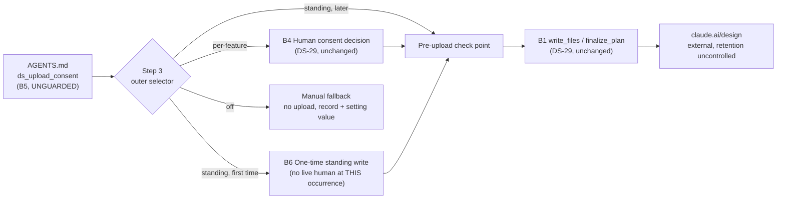

# Security Specification: design-sync-standing-consent

This document is load-bearing, not a formality — more so than its predecessor. DS-29 relaxed an egress control from per-upload to per-feature-and-session and was careful to keep the new unit bounded (`specs/design-sync-consent/security-spec.md`, R2, "retired"). This feature adds a project-level dial that can either compound that relaxation indefinitely (`standing`) or reverse it outright (`off`) — and places the dial in a file nothing in this repository's enforcement chain protects. The document states, in order: what leaves the machine (unchanged from DS-29), under whose consent (now three regimes), what the operator forfeits beyond what DS-29 already forfeited, and — the finding this document exists to surface — what protects the dial itself.

## What Leaves The Machine

**Unchanged from DS-29.** This feature does not add, remove, or alter any outbound call, payload, or destination — it changes only *whether and when* a human is asked before the payload DS-29 already inventoried (E1–E8, `specs/design-sync-consent/security-spec.md`) leaves. That inventory is incorporated by reference and not restated here; the only two items worth calling out specifically are:

- **E2 (the substantive item, per DS-29): the mockup is a pure function of the specification.** This remains true under every regime this feature adds. `standing` does not change *what* a mockup contains — it changes only whether a human looked at the category of thing being sent before the first instance of it left. `off` does not reduce what a mockup *would* contain — it prevents the mockup from being sent at all.
- **E6 (`finalize_plan`'s payload, still unknown, DS-29 OQ-6) is unaffected.** This feature adds no new claim about it, positive or negative.

**One thing that does not leave the machine, worth stating because this feature is new enough to raise the question: the `ds_upload_consent` setting itself is never transmitted anywhere.** It governs a local decision (whether to prompt) and a local record (what gets written to `Design-Source`); it has no network effect of its own.

## Under Whose Consent

DS-29's table (`specs/design-sync-consent/security-spec.md`), extended by regime:

| Regime | Who decides | Basis |
|---|---|---|
| `per-feature` (default) | The human operator, once per feature-and-session — DS-29's own model, unchanged. | `design-sync-loop/SKILL.md` step 3(a)/(b)/(c), byte-identical to DS-29's shipped text (`requirements.md` AC-015). |
| `standing` | **Nobody, at the point of any individual upload.** The human decision was made once — whenever `ds_upload_consent: standing` was written into `AGENTS.md` — and every subsequent feature's first upload inherits that decision without any further act of consent, from anyone, ever. | This feature's own step-3 outer branch (`design.md` → "The loop's target shape"). |
| `off` | **Nobody is asked, and nobody can grant.** The setting itself is the standing refusal; there is no step at which a human overrides it for one upload. | Same. |

**The sharpest fact in this document follows directly from that table's middle row: under `standing`, the entity that "decides" is whoever last edited `AGENTS.md`, and this repository does not distinguish that entity from an ordinary prose contributor.** Compare to DS-29's own consent decision, which at least required a live human to answer a specific prompt for a specific feature; `standing`'s decision is made once, generically, for every feature that will ever exist in the project, by whoever happened to write three words into a settings table.

| Question | Answer, and its basis |
|---|---|
| Is the operator who benefits from (or is exposed by) a `standing`-driven upload the same person who configured `standing`? | **Not established, and not establishable from this repository.** They may be different people, different sessions, days or months apart. DS-29's own R-OQ-5 ("is the operator entitled to release the content") already left this unenforced for the per-feature case; `standing` removes even the per-upload *assertion* DS-29's disclosure required (`specs/design-sync-consent/requirements.md` AC-029 element (f)) — there is no prompt at which to assert anything, for any upload after the first. |
| Who is authorized to write `ds_upload_consent: standing` or `off` into `AGENTS.md`? | **Not gated by anything in this repository.** `AGENTS.md` is not a member of `PROTECTED_GATE_SUFFIXES` (`guard_invariants.py:4`); an agent can write it in the ordinary course of unrelated work, exactly as it can write any other prose file. Whatever review process a team applies to pull requests is the only backstop, and it is outside this repository's own SDD enforcement chain (`Authorization`, below). |

## What The Operator Gives Up, Beyond DS-29's Own Forfeits

DS-29 already catalogued six forfeits (L1–L6, `specs/design-sync-consent/security-spec.md`). This feature adds three more, none of which DS-29's own review could have anticipated, because none of them existed until a project-level dial did.

| # | Held under DS-29's `per-feature` | After `standing` | Why it matters |
|---|---|---|---|
| M1 | **One bounded moment of live attention per feature.** DS-29's whole design (`specs/design-sync-consent/design.md`, "The central structural decision") exists to preserve exactly this — L1's replacement for full per-payload review. | That moment is optional at the **project's** discretion, not the operator's, per invocation. An operator working under `standing` has no occasion, ever, to be the one who decides whether *this* feature's mockups should leave. | This is not a new instance of L1 (unreviewed content can egress) — it is L1 with its one remaining mitigation (a human decided to accept the category, once, recently, for this specific feature) removed. |
| M2 | **A blast radius bounded to one feature.** DS-29's R-OQ-1 chose feature ∧ session specifically to prevent one grant from authorizing more than that. | **A single act — configuring the project setting once — authorizes every future feature's first upload, indefinitely**, until someone changes the setting back. | This is the scope DS-29's own security review spent its effort closing (R2, "retired"), rebuilt here as an explicit, opt-in, project-wide default rather than an accidental per-record one. |
| M3 | **A record whose provenance is at least "a live human answered a prompt for this feature."** Weak (DS-29's own B3 finding: the record is agent-written and unguarded), but real. | **A record whose provenance is "the project setting said so," with no live human anywhere in its causal chain for that specific occurrence.** `Egress-Consent-Party` for a `standing` write cannot honestly name a person (`requirements.md` AC-019) — the honest thing to write is closer to "nobody," and this feature requires the record to say something in that neighbourhood rather than invent a name. | A weak provenance chain is still a chain. `standing`'s provenance chain for any *individual* upload terminates at a settings-table edit that may be days, weeks, or months old, made by someone who was never asked about — and may never learn about — the specific feature whose content just left. |

Not given up under any regime: the DS-29 baseline itself (`per-feature` is unedited, REQ-005), the manual fallback's zero-egress property (REQ-008), and the non-blocking invariant.

## Trust Boundaries

| Boundary | Source | Destination | Assets | Validation | AuthN/AuthZ | REQ | AC |
|---|---|---|---|---|---|---|---|
| B1 | operator's machine | claude.ai/design | DS-29's E1–E6, unchanged | unchanged from DS-29 | unchanged from DS-29 — see B5 for what newly governs whether B1 is reached at all | — | out of scope, unchanged |
| B4 | human | the loop | the consent decision (`per-feature` only) | DS-29's disclosure, unedited | the operator, per DS-29's own unresolved OQ-5 | REQ-005 | AC-015 |
| **B5 (new)** | whoever last edited `AGENTS.md` | every future invocation of `design-sync-loop` in the project | the `ds_upload_consent` value itself | **none — `AGENTS.md` is not schema-validated, not gated, and not a member of `PROTECTED_GATE_SUFFIXES`** | **none** | REQ-001, REQ-002 | AC-001–AC-006 |
| **B6 (new)** | the `standing` regime's first-occurrence write | `Design-Source` | one `granted` record with no live per-occurrence human behind it | the non-fabrication rule (AC-019) — a documentation constraint, not an enforcement mechanism | none | REQ-003, REQ-006 | AC-007–AC-010, AC-016–AC-019 |

B2 (inbound `get_file`) and B3 (the `Design-Source` record's own general untrustedness) are DS-29's and are unaffected; not restated.

### B5, in detail — the finding this document exists to surface

DS-29's own B3 finding was that `Design-Source` — an agent-writable, unguarded record — quietly became a standing authorization the moment consent stopped being per-upload. DS-29 answered that by scoping the record's *authority* tightly (feature ∧ session) so a stale record could never, by itself, authorize a future upload (`security-spec.md` B3, "That branch did not happen").

This feature reopens exactly that question, one layer up, and this time the answer is different. `ds_upload_consent` is not scoped to a feature or a session — it is a **project-wide** default that governs every future invocation of `design-sync-loop`, for as long as it reads `standing` or `off`. And unlike `Design-Source`, which DS-29 at least required to be *characterised* as an audit trace rather than an authorization (AC-012), this feature's own dial has no equivalent disclaimer to attach, because the dial is not a record of a past decision — it is the decision, prospectively, for every future occurrence.

Three honest responses existed here too, in the shape DS-29 named for `Design-Source`: guard the file, scope the setting so a single edit cannot authorize an unbounded future, or state clearly what the setting is and is not. This feature takes none of the first two — guarding `AGENTS.md` is out of scope (Non-goals), and the setting's whole *purpose*, per the issue, is to be unbounded within a project (that is what distinguishes it from DS-29's already-bounded per-feature consent). What this feature does take is the third, partially: REQ-006/REQ-007 make the setting's effect auditable after the fact (every record it produces names the regime in force when it was written), and REQ-002/AC-004's host-neutrality requirement at least keeps the setting's own meaning from silently forking across runtimes. Neither closes B5; both make its consequences legible to a later reader, which is not the same thing.

### The unresolved comparison this feature does not close

DS-29's own security-spec.md recorded, as Residual Risk R4, the asymmetry between the design-sync egress path and the cross-model panelist path (`cross-model-verification-policy.md`), which redacts, digests, and fails closed on a machine-readable consent object. This feature widens that asymmetry rather than narrowing it: the panelist path has no equivalent of a project-wide "skip the check for everything, forever, by default" setting, and if it ever grew one, it would presumably still gate the setting's own configuration behind the sudo-signature mechanism that already protects that path's consent object (`cross-model-verification-policy.md:88-89`, `:108`). `ds_upload_consent` has no analogous gate. Recorded here as an open comparison, not resolved — closing it is a larger change than either DS-29 or this feature asks for.

## STRIDE Analysis

At least two rows per boundary, per the template. Rows for B1/B4 that are unchanged from DS-29 are not repeated; see `specs/design-sync-consent/security-spec.md` for the full inherited set.

| Boundary | Threat | STRIDE | Abuse case | Mitigation in this feature | Verification | REQ | AC |
|---|---|---|---|---|---|---|---|
| B5 | An agent, in the course of ordinary unrelated work, writes `ds_upload_consent: standing` into `AGENTS.md` with no human having reviewed that specific change as a security decision | **Elevation of Privilege** | A refactor commit that also "cleans up" `AGENTS.md` quietly adds the key; the next feature's first upload proceeds unreviewed | **Not mitigated.** Recorded as the principal residual risk (R1, below); adding a guard is out of scope. | — | REQ-001 | **Non-goals** |
| B5 | The setting's meaning forks silently by host, so an operator on one host believes `off` protects them while another host interprets it differently | **Tampering** (with the control's own definition) | A future edit adds a Codex-specific carve-out to `off`'s definition without updating the Claude Code reading, or vice versa | Host-neutral definition required in one place, checked for absence of a host-name conditional | TEST-004, TEST-006 | REQ-002 | AC-004, AC-006 |
| B5 | A stale `standing`-era record is misread as continuing to authorize uploads after the project later switches to `off` | **Elevation of Privilege** (of a record) | An implementation checks "does any granted record exist for this feature" rather than "does the *current* setting say off"; an old record silently keeps uploading | The setting is read live; a record's own historical value never overrides it | TEST-020, TEST-021 | REQ-007 | AC-020, AC-021 |
| B6 | A `standing` write fabricates a specific human's identity in `Egress-Consent-Party`, implying a live review that did not occur | **Repudiation / Spoofing** | An implementation writes `Egress-Consent-Party: <the operator running this session>` for an occurrence no operator was actually asked about | The record must name the mechanism (the setting), not invent a person | TEST-019 | REQ-006 | AC-019 |
| B6 | `standing`'s "write once" rule is implemented as "once per session" rather than "once per feature under standing," silently restoring per-session friction under a different name, or — the opposite failure — is implemented as "once ever, project-wide," silently sharing one record across unrelated features | **Tampering** (with the scope's own definition) | Either misreading defeats the issue's own stated behaviour without any test noticing, if the test only checks "a record exists" | The first-occurrence test is tied to a specific, checkable field-and-value, not to the word "once" | TEST-009 | REQ-003 | AC-009 |
| B1/fallback | `off`-driven forbiddance is implemented as a per-attempt decline rather than a persistent one, so a second attempt in the same session bypasses it | **Elevation of Privilege** | An operator retries an upload after being told "not permitted" once, and the retry succeeds because the implementation treated the first refusal as spent | The forbiddance is explicitly stated as persistent, distinguished from a transient decline | TEST-013 | REQ-004 | AC-013 |
| fallback | The fallback's new recording statement (REQ-008) is written using the word "consent," breaking DS-29's own regression guard and reopening whatever risk that guard was defending against | **Tampering** (with an existing control's own test) | An implementer paraphrases loosely and reintroduces the word while adding the required content | The bullet's exact wording is checked to avoid the literal substring | TEST-024, TEST-026 | REQ-008 | AC-024, AC-026 |

## Authorization

- **No protected-file interaction.** This feature touches nothing in `PROTECTED_GATE_SUFFIXES` live or staged, a contrast with DS-29 stated explicitly in `infra-spec.md`. The one protected file this feature's own task plan eventually touches, `.github/workflows/test.yml`, is out-of-decomposition (staged, non-blocking).
- **`AGENTS.md` itself has no approval-field surface.** Unlike `tasks.md`'s `Approval: Approved`, which a hook-guard counter defends against any net increase, nothing in this repository counts, hashes, or gates changes to `AGENTS.md`'s content. Ordinary source-control review (if a team practices it) is the only backstop, and it is external to this repository's own SDD enforcement chain — this document does not assume it happens.
- **No `SDD_SUDO` interaction.** This feature neither reads, creates, nor requires sudo state.
- **No secret is read, written, or transported by this feature.** As with DS-29, the *path this feature governs* may carry confidential product material (B1, unchanged) — that is not the same claim as this feature itself handling a secret, and it does not.

## Data Classification and Protection

| Entity | Classification | At rest | In transit | Retention | Deletion | Access log | REQ | AC |
|---|---|---|---|---|---|---|---|---|
| `AGENTS.md`'s `ds_upload_consent` value | Internal; non-secret; **security-relevant configuration with no dedicated protection** | git-tracked, in the repository's root instructions file | never leaves the repository itself | permanent (git history) until edited again | not specified | git history (ordinary commits, not a guarded log) | REQ-001 | AC-001–AC-004 |
| The three new `Design-Source` fields | Internal; non-secret | git-tracked layer file, same as DS-29's five existing fields | never leaves | permanent (git history) | not specified | git history | REQ-006 | AC-016–AC-019 |
| Mockup content itself (E1–E5) | **Unchanged from DS-29** — confidential by default | unchanged | unchanged | unchanged | unchanged | unchanged | — | out of scope |

**No secret is handled by this feature**, in the identical sense DS-29 stated: what may be confidential is the payload this feature does not touch the content of; this feature governs only whether and when a human is asked before that payload moves.

## Security Tests

| Boundary | Threat | Test | What would be missed without it |
|---|---|---|---|
| B5 | Elevation of Privilege via an unreviewed `AGENTS.md` edit | — | **Nothing in this feature's own suite catches this** — it is the principal residual risk, not a tested boundary. Recorded here so the absence is visible as a decision, not an oversight. |
| B5 | Silent host fork in the setting's own meaning | TEST-004, TEST-006 | A definition that reads host-neutral in `AGENTS.md` but is implemented with a hidden host-specific carve-out in `SKILL.md` |
| B5→step 3 | A stale record overriding the live setting | TEST-020, TEST-021 | A `standing`-era grant silently continuing to authorize uploads after a later switch to `off` |
| B6 | Fabricated identity in `standing`'s audit record | TEST-019 | A record that implies a live human reviewed an occurrence nobody was asked about |
| B6 | `standing`'s "once" scoped incorrectly | TEST-009 | Silent restoration of per-session friction, or silent project-wide record sharing across unrelated features |
| B1/fallback | `off` treated as transient rather than persistent | TEST-013 | A retry bypassing a forbiddance the operator was told already applied |
| fallback | Reintroduction of the word "consent" into `claude-design-workflow.md` | TEST-024, TEST-026 | Breaking DS-29's own `TEST-021` invariant, silently, the first time anyone edits that file again |
| all of DS-29's edited surfaces | Regression of any DS-29 invariant this feature's edit shape could disturb | TEST-025 | Damage to DS-29's own fifty-one-row suite going unnoticed because this feature's own suite never actually runs it |

TEST-025 and the (absent) B5 row are the two that matter most, for opposite reasons: TEST-025 is what stops this feature from quietly breaking a control that already existed; the absent B5 test is what makes clear that this feature knowingly ships a control that was never mechanically defended in the first place.

## Residual Risks

- **R1 — `AGENTS.md`'s `ds_upload_consent` key is unguarded, and this feature is what makes that consequential for egress.** The principal risk of this document. Nothing in this repository's enforcement chain requires a human, specifically, to be the one who sets `standing` or `off`; an agent can write either value in the ordinary course of unrelated work. Mitigated only by making the setting's effect auditable after the fact (REQ-006/007), which is documentation, not enforcement — the same posture DS-29 took for `Design-Source` itself (its own R3), now extended to the thing that governs `Design-Source`.
- **R2 — `standing`'s blast radius is, by design, the entire project, indefinitely.** Not a defect — it is what the issue asks for, for organisations whose claude.ai use is already approved — but it is the precise blast radius DS-29's own R-OQ-1 decision was written to prevent for a single consent record. This feature reconstructs it deliberately, at the project level. See M1/M2 above.
- **R3 — `standing`'s audit record has no live provenance for any individual occurrence.** `Egress-Consent-Party` cannot honestly name a person for a `standing` write (AC-019); the record is evidence that the *setting* produced an upload, never evidence that anyone reviewed *this* one. See M3.
- **R4 — the egress asymmetry DS-29 recorded (its own R4) widens, not narrows.** The panelist path's machine-readable, sudo-gated consent object has no analogue here, and this feature adds a project-wide bypass with no equivalent gate on the other path. Closing this gap is a larger change than either feature requests.
- **R5 — `off`'s forbiddance is unobservable on a tool-absent host today, which could read as untested.** REQ-002/Edge Case 4 states this is expected, not a defect — the forbiddance becomes load-bearing only once such a host gains `DesignSync`. Recorded because "this only matters later" risks being read as "this doesn't matter."
- **R6 — DS-29's own CI-registration gap (its R-OQ-8 part (c)) remains unclosed, and this feature adds a second, parallel instance of the same gap.** Both `tests/design-system-contract.tests.{sh,ps1}` and this feature's own new suite run locally under `run-all` but not in CI, until a human applies one or two staged patches to the same protected file (`infra-spec.md`, OQ-5).

## Open Questions

- product/security: **OQ-2** — `Egress-Consent-Party`'s exact value for a `standing` write. Determines how legible R3 is to a later human auditor. Non-blocking; AC-019 fixes only the non-fabrication rule.
- product/security: **OQ-3** — does a destination change under `standing` re-trigger a fresh audit record? Affects how completely R2's blast radius is documented after the fact. Non-blocking.
- maintainers: **OQ-4** — does `docs/THREAT-MODEL.md` gain a design-sync egress boundary, now naming R1 specifically? Carried from DS-29's own still-open OQ-10, doubly relevant here. Non-blocking.
