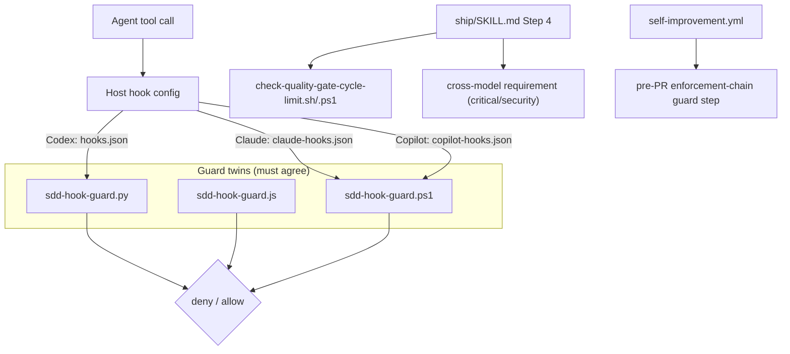

# Design: epic-136-phase1-guards

Impl-Review-Status: Passed
Feature Type: security hardening / workflow enforcement (mixed fix + feat)

## Technical Summary

Six independent enforcement-chain hardening changes, each mapped to one issue
and one commit. Three touch enforcement-chain files protected by R-10
(`sdd-hook-guard.ps1`, `sdd-hook-guard.py`, `sdd-hook-guard.js`,
`ship/SKILL.md`, `hooks/claude-hooks.json`) and follow the human-copy
procedure; the rest (new scripts, new tests, the CI workflow) are
agent-editable. The guiding principle is that every safety boundary is
enforced by a deterministic script with a test, never by prose or by a single
runtime's implementation.

## Architecture

## Components

| Component | Responsibility | Technology | New/Existing | Protected? |
|---|---|---|---|---|
| `sdd-hook-guard.ps1` | port R-10 protected-write denial + Impl-Review forgery check | Windows PowerShell | existing, corrected | yes (human-copy) |
| `sdd-hook-guard.py` | working-directory-aware write-target resolution | Python 3 | existing, corrected | yes (human-copy) |
| `sdd-hook-guard.js` | same working-directory fix (parity) | Node.js | existing, corrected | yes (human-copy) |
| `check-quality-gate-cycle-limit.sh` / `.ps1` | deterministic cycle-limit decision | Bash / PowerShell | new | no |
| `ship/SKILL.md` | call cycle-limit script; require cross-model for critical | Markdown skill | existing, corrected | yes (human-copy) |
| `hooks/claude-hooks.json` | route Bash to guard | JSON | existing, corrected | yes (human-copy) |
| `self-improvement.yml` | minimized permissions + pre-PR guard step | GitHub Actions YAML | existing, corrected | no |
| new test files | RED-first + parity coverage | Bash / PowerShell | new | no |

## Layer Specifications

| Layer | Summary | Canonical Detail | Owner | Status |
|---|---|---|---|---|
| UX | N/A — no change: no GUI or user-facing surface | [UX specification](ux-spec.md#scope-and-user-journeys) | maintainers | N/A |
| Frontend | N/A — no change: shell/PowerShell/JS/YAML only | [Frontend specification](frontend-spec.md#technology-stack) | maintainers | N/A |
| Infrastructure | CI workflow permission change + new guard step; no topology change | [Infrastructure specification](infra-spec.md#deployment-topology) | maintainers | Planned |
| Security | closes Windows enforcement gap, cwd-bypass, Bash matcher gap; minimizes CI permissions | [Security specification](security-spec.md#trust-boundaries) | maintainers | Planned |

## Design System Compliance

N/A — ds_profile: none. Not a UI application; no mockup provided; optional
visualization skipped.

## Cross-Layer Dependencies

| From | To | Contract / Decision | REQ | AC | Verification |
|---|---|---|---|---|---|
| requirements.md | security-spec.md | three guard twins must produce identical decisions | REQ-001, REQ-002, REQ-006 | AC-001..005, AC-012, AC-013 | TEST-001, TEST-004, TEST-005, TEST-012, TEST-013 |
| requirements.md | infra-spec.md | CI permission minimization + deterministic pre-PR guard | REQ-005 | AC-010, AC-011 | TEST-010, TEST-011 |
| security-spec.md | infra-spec.md | enforcement-chain diff must fail the automated PR path | REQ-005 | AC-011 | TEST-011 |

## ADR Change Log

No new ADR. These are corrections and enforcement moves within the existing
architecture and public-contract surface; no API, data model, or architecture
boundary changes. The REQ-004 cross-model requirement and REQ-005 pre-PR guard
are workflow policy inside the existing gate framework, recorded here and in
`ship/SKILL.md` rather than as an architecture decision.

## Data Plan

Data Entities: none. All inputs are process-local hook payloads, gate report
filenames, tasks.md fields, and CI diff listings.

Existing Data Affected: none persisted. `reports/quality-gate/` is read
(counted) but not written by the cycle-limit script.

Migration Strategy: none.

## API / Contract Plan

No change to the SDD_SUDO token format, hook decision protocol (stderr +
exit-code / copilot-JSON), review-loop contract schemas, or the cross-model
verdict schema. The new cycle-limit script defines a small internal contract:
input = task ID (argument) + repository root (cwd or argument); output =
`continue` on stdout with exit 0, or `Escalate-Human` on stdout with a
non-zero exit. REQ-004 adds two optional per-task tasks.md fields:
`Security-Sensitive:` (boolean trigger) and `Cross-Model-Waiver:` (skip
decision, honored only when co-located with a human `Approval: Approved` mark
naming a second distinct approver — otherwise inert). Both are human-set and
additive; existing consumers ignore unknown fields. A `Risk: critical` or
`Security-Sensitive: true` task is ineligible for the lite track: the lite
gate rejects it with a diagnostic directing the human to the full track, so
cross-model stays unconditional for those tasks and the lite track keeps no
cross-model step.

## Test Strategy

1. REQ-002 is RED-first: TEST-004 must be shown failing against the
   unmodified `.py`/`.js` guard (the `cd && rm` bypass passing) and the
   failing output recorded in the implementation report before the fix lands.
2. The `.ps1` port (REQ-001) is validated by a new PowerShell parity suite
   plus shared fixtures asserting decision equality with `.py`/`.js` across
   every protected-suffix class, the Impl-Review forgery case, and the
   read-only short-circuit, plus a byte-level ASCII/no-BOM check on the
   modified `sdd-hook-guard.ps1` (AC-015).
3. The cycle-limit script (REQ-003) is table-tested at 0/1/2/3+ reports, with
   a prefix-collision case (`T-001` vs `T-0010`) and an absent-directory case.
4. Cross-model requirement (REQ-004) and cycle-limit delegation (REQ-003 in
   `ship/SKILL.md`) are verified by document-conformance assertions plus a
   workflow walk-through in the implementation report: the critical/
   security-sensitive trigger, the human-gated `Cross-Model-Waiver:` (inert
   without a co-located human `Approval: Approved` second-approver mark,
   AC-008), and the lite-gate rejection of critical/security-sensitive tasks
   toward the full track (AC-016).
5. CI hardening (REQ-005) is verified by asserting the permissions block and
   by driving the new guard step against a compliant diff fixture, a violating
   diff fixture, and an empty created-ref (no-PR) fixture that must pass
   vacuously (AC-011, AC-014).
6. Bash matcher (REQ-006) is verified by driving the guard with
   Claude-shaped Bash payloads (write-target denied, read-only allowed) and a
   cross-runtime parity check against Codex/Copilot decisions.
7. Full suite: `bash tests/run-all.sh`, plus `pwsh ./tests/validate-repository.ps1`
   and the new PowerShell suites on a host with PowerShell available (CI
   provides pwsh on all three OSes).

## Security Boundaries

| Trust Boundary | Auth/Authz Mechanism | Data Classification | OWASP Concerns |
|---|---|---|---|
| B1: agent tool call to guard decision | R-10 protected table, cwd-aware write-target analysis, forgery checks across three twins; deny by default | internal source/config | Broken Access Control, Injection (heuristic) |
| B2: automated CI session to created PR | minimized permissions + deterministic protected-surface diff guard | public repo content | Broken Access Control, Security Misconfiguration |
| B3: staged human-copy artifacts to live chain | human-only copy + SHA-256 manifest | internal source | Integrity / Supply Chain |

Detailed controls: [Security specification](security-spec.md#trust-boundaries).

## External Integrations

| Integration | Boundary | Contract / Version | Failure Behavior |
|---|---|---|---|
| `anthropics/claude-code-action` (pinned `558b1d6cab4085c7753fe402c10bef0fbb92ac7a`, v1.0.165) | B2: weekly self-improvement CI session | Consumes `claude_code_oauth_token` (a `secrets` value) to run the agent session; `id-token: write` is only needed if the pinned release performs an OIDC token exchange (GitHub Actions OIDC: a JWT with `aud`/`sub` claims minted for cloud federation). REQ-005/AC-010 resolve necessity by inspecting the pinned release's `action.yml` and documented inputs for any OIDC/`getIDToken` use; the pinned SHA is the single source of truth. | If the pinned action requires OIDC and `id-token: write` is removed, the run fails fast at the action step (missing-permission error) — a loud, non-silent failure surfaced as a failed workflow, not a bypass. If instead the action does not use OIDC, removing the permission is a no-op. If the action is unavailable/unresolvable during a run (registry outage, yanked SHA), the `actions/checkout`-then-action step errors and the job fails; the deterministic pre-PR guard step (REQ-005) never runs, so no PR is produced — fail-closed. The permission decision is verified once against the pinned SHA and re-verified only when that SHA is bumped. |
| GitHub Actions `GITHUB_TOKEN` | B2: session → repository (PR/branch) | Scoped by the workflow `permissions:` block, minimized under REQ-005; used by the post-session guard step to enumerate created refs. | A missing scope makes the guard step's `gh`/API call fail, failing the run (fail-closed) rather than admitting an unguarded PR. |

The self-improvement session's only third-party runtime dependency is the
pinned action above; the guard scripts and cycle-limit script add no external
dependency (standard-library only).

## Deployment / CI Plan

No runtime deployment. `self-improvement.yml` changes its `permissions:` block
and gains a post-session guard step. New tests join `tests/run-all.sh` and the
existing 3-OS `test.yml` matrix. Rollback for any single item is a reviewed
revert of that item's commit; the human-copy items additionally require
re-copying the prior version and re-running the named suite. The
`claude-code-action` OIDC dependency (see External Integrations) is verified
against the pinned SHA before `id-token: write` is removed and re-verified only
on a SHA bump.

## Constraint Compliance

| Requirement Constraint | Design Response |
|---|---|
| `.ps1` ASCII-only (PS 5.1) | port uses ASCII punctuation only; verified by the parity suite run and a byte check |
| protected files not agent-writable | staged under `human-copy/` with a SHA-256 manifest; human copies |
| 1 issue = 1 commit | six tasks, one per issue, each self-contained with its tests |
| no prose-only safety boundary | cycle limit and cross-model requirement become script/document-checked |
| version bump via `scripts/bump-version.sh` only | release step (if any) delegated to the human per epic policy |

## Assumptions

The dispatcher preference order is unchanged and the `.ps1` twin is a live
fallback on Windows without python3/node. `PROTECTED_GATE_SUFFIXES` is the
authoritative protected list. The pinned `claude-code-action` version
determines whether `id-token: write` is required.

## Open Questions

None. Owner: maintainers. Blocks Implementation: no. The two decisions the
issues left open (REQ-004 waiver mechanism, REQ-005 guard placement) are fixed
in requirements.md and reflected here.

## Risks

Principal risk is a `.ps1` port that diverges from `.py`/`.js` in a corner the
parity fixtures do not exercise; mitigation is per-suffix-class fixtures and a
decision-equality assertion rather than spot checks. Secondary risk is
over-aggressive working-directory tracking causing false denials; the
read-only corpus constrains it.
