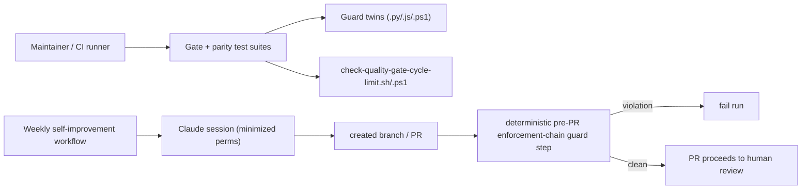

# Infrastructure Specification: epic-136-phase1-guards

Local script/test work plus one GitHub Actions workflow change. No cloud
service, deployment target, IaC resource, network route, or data store
changes beyond the weekly self-improvement workflow's permission block and a
new deterministic guard step.

## Deployment Topology

## CI/CD Sequence

The existing `test.yml` 3-OS matrix runs the new suites alongside the current
ones. `self-improvement.yml` changes in two ways: (1) its `permissions:` block
drops any permission the run does not use (`id-token: write` removed unless the
pinned `claude-code-action` version documents an OIDC requirement); (2) a new
post-session step enumerates the branches/PRs the run created and fails the
workflow if any diff touches an enforcement-chain surface
(`plugins/**/scripts/*guard*`, `plugins/**/scripts/kill-switch.*`,
`plugins/**/scripts/check-*`, `plugins/**/hooks/*.json`, `reports/**`,
`docs/workflow-improvements/**`, `.github/workflows/**`, protected SKILL.md
files). A focused test failure or a guard-step failure is the rollback signal.

## Environments

| Environment | URL | Auth | Trigger | Classification | Promotion Rule |
|---|---|---|---|---|---|
| local | repository checkout | none / test-only fixtures | test command | internal fixtures | test green |
| CI matrix | N/A network for tests | GITHUB_TOKEN (scoped) | push / PR | synthetic fixtures | all required checks green |
| self-improvement | N/A | CLAUDE_CODE_OAUTH_TOKEN + minimized GITHUB perms | weekly cron / dispatch | public repo content | pre-PR guard passes + human review |

## Infrastructure as Code, Scaling, SLOs, and Residency

N/A — no change: no deployed service. The only IaC-like artifact is the
GitHub Actions YAML, whose change is the permission minimization and the
guard step.

## Observability

| Logs | Traces | Metrics | Alert | Owner | Runbook |
|---|---|---|---|---|---|
| test output and guard-step diff listing without secrets | N/A | pass/fail per suite and per guard step | CI failure | maintainers | rerun the failing suite; inspect the guard-step diff list |

## Cost Estimate

N/A — no change beyond existing runner minutes; the guard step is a short diff
enumeration.

## Rollback

Per-item reviewed revert. For human-copy items, re-copy the prior file version
and re-run the named suite. For the workflow change, revert the YAML; keep any
open security finding tracked rather than weakening a check to regain a pass.

## Open Questions

None. Owner: maintainers; non-blocking.
