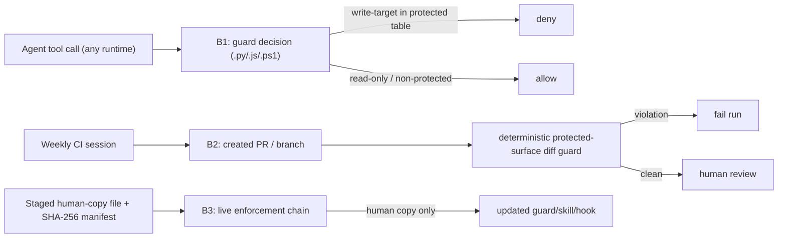

# Security Specification: epic-136-phase1-guards

This batch closes three enforcement-chain gaps and minimizes CI privilege. No
credential value, test key, or exploit payload belongs in source, logs, or
persisted evidence. Test fixtures are synthetic and process-scoped.

## Trust Boundaries



| Boundary | Source | Destination | Assets | Validation | AuthN/AuthZ | REQ | AC |
|---|---|---|---|---|---|---|---|
| B1 | agent tool payload | guard decision | gate scripts, hook config, critical tests, design.md status | protected-suffix table, cwd-aware write-target resolution, Impl-Review forgery check, read-only short-circuit | deny by default; never bypassed by sudo | REQ-001, REQ-002, REQ-006 | AC-001..005, AC-012, AC-013 |
| B2 | automated CI session | created PR/branch | public repository content | minimized permissions + deterministic protected-surface diff | fail on violation | REQ-005 | AC-010, AC-011 |
| B3 | staged human-copy artifact | live enforcement-chain file | internal source | SHA-256 manifest; human-only copy | human authority | REQ-001, REQ-002, REQ-006 | AC-001, AC-004, AC-012 |

## STRIDE Analysis

| Boundary | Threat | STRIDE | Abuse Case | Mitigation | Verification | REQ | AC |
|---|---|---|---|---|---|---|---|
| B1 | Windows fallback lets an agent overwrite a gate script | Tampering / Elevation of Privilege | python3/node absent, `.ps1` fallback has no R-10 table | port R-10 denial and forgery check to `.ps1` with decision parity | TEST-001, TEST-002, TEST-003 | REQ-001 | AC-001, AC-002, AC-003 |
| B1 | cwd change evades write-target comparison | Tampering / Elevation of Privilege | `cd <dir> && rm <basename>` resolves target below the protected prefix | track `cd`/`pushd` transitions and compare resolved absolute targets | TEST-004, TEST-005 | REQ-002 | AC-004, AC-005 |
| B1 | Bash write to a protected file is never guarded under Claude Code | Tampering / Elevation of Privilege | `claude-hooks.json` matcher omits Bash | extend matcher to route Bash to the guard; fail-closed on unclassifiable payloads | TEST-012, TEST-013 | REQ-006 | AC-012, AC-013 |
| B2 | automation modifies its own enforcement chain in a PR | Tampering / Elevation of Privilege | weekly session edits a guard or hook and opens a PR | deterministic diff guard fails the run on enforcement-chain changes | TEST-011 | REQ-005 | AC-011 |
| B2 | excess workflow privilege | Elevation of Privilege | unused `id-token: write` broadens attack surface | remove unused permission or justify against pinned action | TEST-010 | REQ-005 | AC-010 |
| gate | infinite quality-gate loop / silent cross-model skip | Denial of Service / Repudiation | prose-only cycle count miscounted; `--verify` forgotten on critical task | deterministic cycle-limit script; cross-model required for critical/security or explicit waiver | TEST-006, TEST-008 | REQ-003, REQ-004 | AC-006, AC-008 |

## Authentication Flow

```mermaid
sequenceDiagram
  participant AG as Agent
  participant HK as Host hook config
  participant GD as Guard twin
  AG->>HK: tool call (Edit/Write/Bash/apply_patch)
  HK->>GD: payload (Claude routes Bash after REQ-006)
  GD->>GD: resolve write target across cwd transitions; check protected table
  alt write target protected or forgery/ malformed
    GD-->>AG: deny (exit non-zero / copilot deny)
  else read-only or non-protected
    GD-->>AG: allow
  end
```

## Authorization

| Actor / Role | Resource | Action | Decision Point | Default | Denial Evidence | REQ | AC |
|---|---|---|---|---|---|---|---|
| agent | enforcement-chain files | write / delete | guard (three twins) | deny | non-zero exit / copilot deny JSON | REQ-001, REQ-002, REQ-006 | AC-001, AC-004, AC-012 |
| agent | design.md Impl-Review-Status | increment to Passed | guard forgery check | deny without PASS verdict | non-zero exit | REQ-001 | AC-002 |
| automated CI session | its own enforcement chain | modify via PR | pre-PR guard step | fail run on violation | failed workflow + diff listing | REQ-005 | AC-011 |
| human | waiver field, task approval, human-copy | set / copy | manual | n/a | audit mark in tasks.md / commit | REQ-004 | AC-008, AC-009 |

## Data Classification and Protection

| Entity | Classification | At Rest | In Transit | Retention | Deletion | Access Log | REQ | AC |
|---|---|---|---|---|---|---|---|---|
| enforcement-chain source | internal integrity-critical | repository | local only | repo lifetime | reviewed revert | git history | REQ-001, REQ-002, REQ-006 | AC-001, AC-004, AC-012 |
| gate report filenames | internal | `reports/quality-gate/` | local only | repo lifetime | n/a (counted, not written) | git history | REQ-003 | AC-006 |
| test fixtures | synthetic internal | temporary directory | local only | test lifetime | trap cleanup | test result only | REQ-002, REQ-006 | AC-004, AC-012 |
| workflow GITHUB token | restricted | Actions runtime only | GitHub API | run lifetime | run end | never logged | REQ-005 | AC-010 |

## OWASP Mapping

| OWASP Risk | Exposure | Control | Verification | Owner |
|---|---|---|---|---|
| Broken Access Control | Windows fallback / cwd bypass / Bash matcher gap / self-modifying CI | port R-10, cwd-aware resolution, matcher extension, pre-PR guard | TEST-001, TEST-004, TEST-011, TEST-012 | maintainers |
| Security Misconfiguration | excess `id-token: write` | permission minimization | TEST-010 | maintainers |
| Injection | Bash-command heuristic evasion | best-effort denial; documented non-goal for `python3 -c`/`node -e` | TEST-004, TEST-012 | maintainers |
| Cryptographic Failures | out of scope (no crypto change in this batch) | n/a | n/a | maintainers |

## Secrets Management

No secret is added or logged. The self-improvement workflow continues to use
`CLAUDE_CODE_OAUTH_TOKEN` and the scoped `GITHUB_TOKEN`; this batch reduces the
token's permissions and never prints it. The pre-PR guard step lists changed
paths only, never file contents that could carry secrets. Test suites use no
real credentials and make no network call.

## PowerShell Parity Note

The `.ps1` R-10 port mirrors the `.py`/`.js` semantics: the same protected
suffix set, the same write-verb detection, the same read-only short-circuit,
and the same Impl-Review-Status forgery denial. It is ASCII-only for Windows
PowerShell 5.1 (BOM-less sources parse as ANSI). TEST-001 through TEST-003
assert decision equality against the `.py`/`.js` twins rather than checking
the `.ps1` output in isolation.

## SBOM and Supply Chain

No dependency is added. The staged human-copy artifacts carry a SHA-256
manifest so the human can verify integrity before copying into the live
enforcement chain (B3).

## Security Tests

| Test | Boundary | Attack / Control | Expected Result | Evidence | AC |
|---|---|---|---|---|---|
| TEST-001 | B1 | `.ps1` protected-write denial parity | denied; matches `.py`/`.js` | `tests/guard-r10-port.tests.ps1` + fixtures | AC-001 |
| TEST-002 | B1 | `.ps1` Impl-Review forgery | denied without PASS verdict | `.ps1` guard integration test | AC-002 |
| TEST-003 | B1 | `.ps1` read-only short-circuit | allowed | `.ps1` guard regression test | AC-003 |
| TEST-004 | B1 | cwd-based write-target bypass (RED-first) | denied after fix; RED recorded | `tests/guard-cwd-bypass.tests.sh` | AC-004 |
| TEST-005 | B1 | existing corpus + parity after fix | unchanged decisions | existing + new guard suites | AC-005 |
| TEST-006 | gate | cycle-limit counting | continue for 0/1/2, Escalate-Human for 3+ | `tests/quality-gate-cycle-limit.tests.sh` | AC-006 |
| TEST-008 | gate | critical task without `--verify` | cross-model runs or blocks with diagnostic | ship-skill conformance + walk-through | AC-008 |
| TEST-010 | B2 | workflow permission minimization | `id-token: write` absent or justified | `tests/self-improvement-guard.tests.sh` | AC-010 |
| TEST-011 | B2 | enforcement-chain diff in automated PR | run fails on violation, passes on clean | guard-step fixture test | AC-011 |
| TEST-012 | B1 | Bash write vs read under Claude matcher | write denied, read allowed | `tests/claude-bash-matcher.tests.sh` | AC-012 |
| TEST-013 | B1 | malformed payload + cross-runtime parity | denied; runtimes agree | parity corpus | AC-013 |
| TEST-014 | B2 | no branch/PR created by the session | guard step passes vacuously | empty created-ref fixture | AC-014 |
| TEST-015 | B1 | `.ps1` ASCII/no-BOM encoding | non-ASCII byte or BOM fails the check | `tests/guard-ps1-ascii.tests.sh` | AC-015 |
| TEST-016 | gate | lite gate rejects a critical/security-sensitive task | rejected with a diagnostic toward the full track | lite-gate conformance | AC-016 |

## Open Questions

None. Owner: maintainers; non-blocking.
