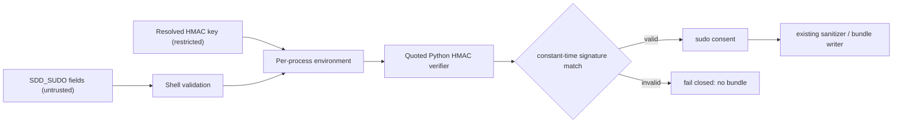

# Design: epic-136-phase1-rce

Impl-Review-Status: Passed
Feature Type: bugfix / local shell security boundary

## Technical Summary

Replace unquoted-heredoc interpolation in the shell SDD_SUDO HMAC verifier
with a quoted Python program. The shell exports the already parsed values only
for that process; Python obtains them with `os.environ`, constructs the
canonical message, computes HMAC-SHA256, and prints only `ok` or `fail`.
Neither the token nor the key is executable Python source.

## Architecture

## Components

| Component | Responsibility | Technology | New/Existing |
|---|---|---|---|
| `prepare-panelist-input.sh` | parse token, validate consent, invoke verifier | Bash | existing, corrected |
| Python HMAC helper | compute and compare HMAC from environment data | Python 3 standard library | existing inline helper, corrected |
| `prepare-panelist.tests.sh` | isolated real-signature and hostile-input regression tests | Bash + Python 3 | existing, expanded |
| `prepare-panelist-input.ps1` | equivalent .NET HMAC behavior | Windows PowerShell | existing, parity-checked |

## Layer Specifications

| Layer | Summary | Canonical Detail | Owner | Status |
|---|---|---|---|---|
| UX | N/A — no change: no GUI or user-facing shell entry point | [UX specification](ux-spec.md#scope-and-user-journeys) | maintainers | N/A |
| Frontend | N/A — no change: Bash/PowerShell CLI only | [Frontend specification](frontend-spec.md#technology-stack) | maintainers | N/A |
| Infrastructure | local test and CI execution only; no topology change | [Infrastructure specification](infra-spec.md#deployment-topology) | maintainers | Planned |
| Security | removes code injection at the SDD_SUDO-to-Python boundary | [Security specification](security-spec.md#trust-boundaries) | maintainers | Planned |

## Design System Compliance

N/A — ds_profile: none. This is not a UI application and no mockup was
provided; optional visualization is skipped.

## Cross-Layer Dependencies

| From | To | Contract / Decision | REQ | AC | Verification |
|---|---|---|---|---|---|
| requirements.md | security-spec.md | HMAC operands cross as data only | REQ-001, REQ-003 | AC-001, AC-004 | TEST-001, TEST-004 |
| requirements.md | infra-spec.md | local fixture tests require no network or real secret | REQ-004 | AC-005 | TEST-005 |
| security-spec.md | infra-spec.md | rejection occurs before bundle creation or panelist send | REQ-002, REQ-003 | AC-003, AC-004 | TEST-003, TEST-004 |

## ADR Change Log

No ADR. This is an internal implementation correction with no public contract,
architecture, or data-model change.

## Data Plan

Data Entities: none. SDD_SUDO fields and the HMAC key are process-local inputs.

Existing Data Affected: no persisted application data.

Migration Strategy: none.

## API / Contract Plan

The token format, canonical message order, exit codes, consent labels, and
output bundle contract remain unchanged. The only internal contract change is
that Python reads named environment values instead of generated source text.

## Test Strategy

Write TEST-002 through TEST-004 before changing the verifier:

1. Sign a fixture token with a test-only key and assert SDD_SUDO consent
   produces a bundle in both shell and PowerShell suites.
2. Change a signed field without resigning and assert denial with no bundle in
   both suites.
3. Generate correctly signed fixtures with, in turn, an invalid nonce, expired
   or overlong TTL, and wrong repository binding; each must be denied with no
   bundle in both suites.
4. Supply triple-quote/backslash Python-looking operands and assert a sentinel
   file is absent, no code is executed, and invalid consent remains denied.
5. `tests/prepare-panelist.tests.ps1` is the PowerShell evidence target. Its
   .NET HMACSHA256 byte-array implementation is documented in
   `security-spec.md#secrets-management`, including UTF-8 conversion of the
   key and canonical message and the prohibition on token-derived executable
   source. The test proves real-HMAC acceptance and tampered-field denial;
   then run the repository gate suite appropriate to the changed script.

## Security Boundaries

| Trust Boundary | Auth/Authz Mechanism | Data Classification | OWASP Concerns |
|---|---|---|---|
| B1: token/key to Python HMAC helper | HMAC-SHA256 plus nonce, TTL, and repository binding | restricted key; untrusted token | Injection, Cryptographic Failures |
| B2: consent decision to bundle generation | default deny until all B1 checks pass | internal sanitized bundle | Broken Access Control, Information Disclosure |

Detailed controls: [Security specification](security-spec.md#trust-boundaries).

## Deployment / CI Plan

No deployment change. The focused shell test is executed locally and by the
existing test workflow; it uses temporary fixtures, no network, and no real
credential. See [Infrastructure specification](infra-spec.md#deployment-topology).

## Constraint Compliance

| Requirement Constraint | Design Response |
|---|---|
| No attacker-controlled source construction | quoted heredoc plus `os.environ` data reads |
| Preserve valid existing consent | retain canonical message order and HMAC comparison |
| Fail closed | only exact `ok` selects `consent_kind=sudo` |
| No secret exposure | no diagnostic logs include operand values or keys |

## Assumptions

The Python standard library remains available where real HMAC SDD_SUDO consent
is supported. Existing Cross-Model flag consent remains unaffected.

## Open Questions

None. Owner: maintainers. Blocks Implementation: no.

## Risks

The principal risk is an encoding or message-order mismatch. The real-HMAC
positive fixture and altered-field rejection fixture must pass before the
implementation can be marked complete.
