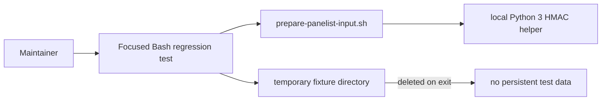

# Infrastructure Specification: epic-136-phase1-rce

This is local-only script and test work. No cloud service, deployment target,
infrastructure-as-code resource, network route, or data store changes.

## Deployment Topology

## CI/CD Sequence

The existing test workflow runs `tests/prepare-panelist.tests.sh` and
`tests/prepare-panelist.tests.ps1`. This change adds no job and must not invoke
panelists or make a network request. A focused test failure is the rollback
signal; reverting the single shell fix restores the previous release behavior
while the security issue remains tracked.

## Environments

| Environment | URL | Auth | Trigger | Classification | Promotion Rule |
|---|---|---|---|---|---|
| local | repository checkout | test-only HMAC key in process environment | focused test command | restricted fixture only | test green |
| CI | N/A network | no external credential | existing test workflow | synthetic fixture only | all required checks green |
| production | N/A | N/A | N/A | N/A | N/A |

## Infrastructure as Code, Scaling, SLOs, and Residency

N/A — no change: no service is deployed and no persisted data is created. The
fixed verifier is bounded by a handful of token strings and a SHA-256 digest.

## Observability

| Logs | Traces | Metrics | Alert | Owner | Runbook |
|---|---|---|---|---|---|
| focused test output without key/token values | N/A | pass/fail count | CI failure | maintainers | rerun TEST-002 to TEST-004 |

## Cost Estimate

N/A — no change: standard local interpreter execution only.

## Rollback

If TEST-002 or TEST-003 fails after implementation, do not deploy or release.
Restore the previous implementation only through a reviewed revert and keep the
security finding open; do not weaken signature validation to regain a pass.

## Open Questions

None. Owner: maintainers; non-blocking.
