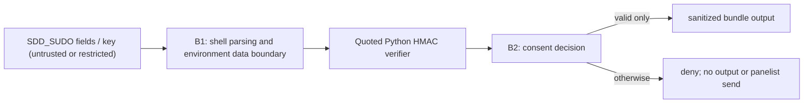

# Security Specification: epic-136-phase1-rce

This specification corrects an injection vulnerability at a local consent
boundary. No credential value, test key, or exploit payload belongs in source,
logs, or persisted evidence.

## Trust Boundaries



| Boundary | Source | Destination | Assets | Validation | AuthN/AuthZ | REQ | AC |
|---|---|---|---|---|---|---|---|
| B1 | SDD_SUDO fields and resolved key | Python helper | restricted key; untrusted strings | quoted heredoc, named environment reads, canonical HMAC input | HMAC, nonce, TTL, repo binding | REQ-001, REQ-002, REQ-003 | AC-001, AC-002, AC-004 |
| B2 | HMAC result | bundle writer / panelist path | internal sanitized review content | exact `ok` result only; otherwise exit 1 | default deny | REQ-002, REQ-003 | AC-003, AC-004 |

## STRIDE Analysis

| Boundary | Threat | STRIDE | Abuse Case | Mitigation | Verification | REQ | AC |
|---|---|---|---|---|---|---|---|
| B1 | token alters Python source | Tampering / Elevation of Privilege | triple quote terminates a heredoc literal and executes a payload | quoted heredoc and `os.environ` prevent token-to-source interpolation | TEST-001, TEST-004 | REQ-001, REQ-003 | AC-001, AC-004 |
| B1 | altered signed field accepted | Spoofing / Tampering | issuer, nonce, repo, or epoch changes after signature generation | recompute canonical HMAC and compare with `hmac.compare_digest` | TEST-003 | REQ-002 | AC-003 |
| B2 | unauthorized external-send path | Elevation of Privilege | invalid token selects sudo consent and creates a bundle | consent remains empty unless every validation succeeds | TEST-003, TEST-004 | REQ-002, REQ-003 | AC-003, AC-004 |
| B2 | key/token disclosure | Information Disclosure | diagnostic or output contains HMAC operand values | output is only `ok`/`fail`; tests inspect no bundle on denial | TEST-002 through TEST-004 | REQ-003, REQ-004 | AC-002 through AC-005 |

## Authentication Flow

```mermaid
sequenceDiagram
  participant O as Operator token
  participant S as Shell script
  participant P as Python HMAC helper
  O->>S: SDD_SUDO and locally resolved key
  S->>S: nonce, TTL, repository checks
  S->>P: named environment values; quoted program
  P-->>S: ok or fail
  alt ok and all shell checks pass
    S-->>O: sanitized bundle
  else invalid
    S-->>O: consent denied; no bundle
  end
```

## Authorization

| Actor / Role | Resource | Action | Decision Point | Default | Denial Evidence | REQ | AC |
|---|---|---|---|---|---|---|---|
| operator token | cross-model bundle creation | request sudo consent | shell consent gate | deny | exit 1 and no output file | REQ-002 | AC-003 |
| attacker-controlled token data | Python interpreter | execute content | quoted Python heredoc | deny as code; process as data only | absent sentinel and failed invalid token | REQ-001, REQ-003 | AC-001, AC-004 |

## Data Classification and Protection

| Entity | Classification | At Rest | In Transit | Retention | Deletion | Access Log | REQ | AC |
|---|---|---|---|---|---|---|---|---|
| HMAC key | restricted | existing environment/local key source only | local process environment only | process lifetime | shell exit | never logged | REQ-001, REQ-003 | AC-001, AC-004 |
| SDD_SUDO fields | untrusted security input | existing token file | local process only | process lifetime | shell exit | values never logged | REQ-002, REQ-003 | AC-002 through AC-004 |
| test fixtures | synthetic internal | temporary directory | local only | test lifetime | trap cleanup | test result only | REQ-004 | AC-005 |

## OWASP Mapping

| OWASP Risk | Exposure | Control | Verification | Owner |
|---|---|---|---|---|
| Injection | unquoted Python heredoc | quoted heredoc and environment data boundary | TEST-001, TEST-004 | maintainers |
| Cryptographic Failures | token signature verification | canonical HMAC-SHA256 plus constant-time compare | TEST-002, TEST-003 | maintainers |
| Broken Access Control | SDD_SUDO consent path | default-deny gate before bundle creation | TEST-003, TEST-004 | maintainers |
| Security Misconfiguration | test bypass confused with real verifier | separate real-HMAC coverage from skip-signature scaffolding | TEST-002, TEST-005 | maintainers |

## Secrets Management

The HMAC key continues to originate only from the existing environment variable
or local key-file resolution. It is not hardcoded, emitted, copied into an
output bundle, or placed in test fixtures outside a temporary process-scoped
environment. Test keys are synthetic and are removed with the fixture.

The PowerShell implementation applies the same data-boundary rule without a
heredoc: it reads token fields as PowerShell strings, converts the resolved key
and canonical message to UTF-8 byte arrays with
`[System.Text.Encoding]::UTF8.GetBytes`, and passes those arrays to
`[System.Security.Cryptography.HMACSHA256]`. It never constructs executable
PowerShell or Python source from a key or token field. TEST-005 proves a
test-only valid signature is accepted and a subsequently altered signed field
is denied without creating a bundle.

## SBOM and Supply Chain

No dependency is added. Python modules are standard library modules; the
existing shell and PowerShell runtimes remain the supply-chain boundary.

## Security Tests

| Test | Boundary | Attack / Control | Expected Result | Evidence | AC |
|---|---|---|---|---|---|
| TEST-001 | B1 | source-construction regression | all operands read from environment by quoted program | focused source/behavior test | AC-001 |
| TEST-002 | B1/B2 | valid real-HMAC token | consent succeeds and normal bundle is created | `tests/prepare-panelist.tests.sh` | AC-002 |
| TEST-003 | B1/B2 | one signed-field tamper | token is denied and bundle is absent | `tests/prepare-panelist.tests.sh` | AC-003 |
| TEST-004 | B1/B2 | triple quote and backslash hostile operands | no sentinel, no execution, no unauthorized bundle | `tests/prepare-panelist.tests.sh` | AC-004 |
| TEST-005 | B1/B2 | PowerShell real-HMAC and tampered-token path | valid fixture creates a bundle; tampered fixture is denied without one | `tests/prepare-panelist.tests.ps1` | AC-005 |
| TEST-006 | B1/B2 | independently invalid nonce, TTL, and repository binding with valid HMAC | every case is denied without a bundle in both runtimes | `tests/prepare-panelist.tests.{sh,ps1}` | AC-006 |
| TEST-007 | B1/B2 | fixture isolation and no-network regression | test-only key and temporary files only; no panelist call | `tests/prepare-panelist.tests.{sh,ps1}` | AC-007 |

## Open Questions

None. Owner: maintainers; non-blocking.
