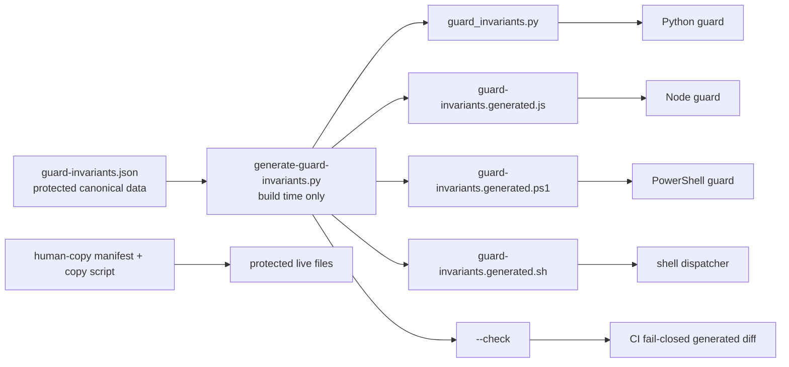

# Design: epic-136-phase2-gates

Impl-Review-Status: Passed
Feature Type: enforcement-chain security and workflow hardening

## Technical Summary

Phase 2 retains fail-closed defaults while narrowing only proven read-only
false positives. It introduces a PS5.1-compatible full-scan HMAC comparator,
a single PowerShell evidence-path validator, deterministic lite risk
escalation, and build-time generated guard-invariant modules. All live
enforcement-chain modifications are staged first and applied only by the
human-copy verifier.

## Architecture



Canonical data is a schema-versioned JSON document containing only values that
must agree across runtimes: protected suffixes, protected plugin suffixes,
shell classification arrays/regular-expression sources, the fixed HMAC hex
length, and the exact human-copy target inventory. It does not contain
executable policy or a secret. The Python generator validates schema and types,
renders four native-language modules in a fixed order and newline convention,
and supports write mode and non-mutating `--check` mode. Runtime code
imports/sources generated modules; it never opens or parses the JSON data file.

### Native module loading contract

The generated targets and loading path are fixed, legal language identifiers:

| Runtime | Generated target | Load rule | Required exports |
|---|---|---|---|
| Python | `scripts/generated/guard_invariants.py` | `importlib.util.spec_from_file_location` over `Path(__file__).resolve().parent / "generated" / "guard_invariants.py"`; never normal `import` | `SCHEMA_VERSION`, `PROTECTED_GATE_SUFFIXES`, `PROTECTED_GATE_PLUGIN_JSON_SUFFIXES`, shell arrays/regex sources, `SUDO_SIGNATURE_HEX_LENGTH`, `PHASE2_HUMAN_COPY_TARGETS` |
| Node | `scripts/generated/guard-invariants.generated.js` | `require(path.join(__dirname, "generated", "guard-invariants.generated.js"))`; no CWD resolution | frozen object with the same uppercase keys |
| PowerShell | `scripts/generated/guard-invariants.generated.ps1` | dot-source exactly from `$PSScriptRoot/generated`; no `$PWD` resolution | `$GuardInvariants` ordered dictionary with the same keys |
| POSIX dispatcher | `scripts/generated/guard-invariants.generated.sh` | source exactly from `$dir/generated` before dispatch; no `PATH` resolution | `GUARD_INVARIANTS_SCHEMA_VERSION=1` and `GUARD_INVARIANTS_SOURCE_SHA256`; this dispatcher has no guard-decision constants |

Python, Node, and PowerShell export exactly these uppercase keys:
`SCHEMA_VERSION`, `PROTECTED_GATE_SUFFIXES`,
`PROTECTED_GATE_PLUGIN_JSON_SUFFIXES`, `SHELL_COMPOUND_RE`,
`SHELL_WRITE_ARG_CMDS`, `SHELL_WRITE_DEST_CMDS`, `SHELL_PS_WRITE_CMDS`,
`SHELL_INDIRECT_CMDS`, `SHELL_UNSAFE_TOKEN_CHARS`,
`SHELL_REDIRECT_TOKEN_RE`, `SHELL_FD_DUP_RE`, `SHELL_CD_CMDS`,
`SHELL_SUDO_WRITE_RE`, `SHELL_READ_ONLY_START_RE`,
`SUDO_SIGNATURE_HEX_LENGTH`, and `PHASE2_HUMAN_COPY_TARGETS`. Every loader
validates schema version and required keys/types before a guard decision.
The fixed script-directory module being missing, unreadable, or wrong-version
produces the existing fail-closed guard decision. A same-name module shadowed
from CWD or `PYTHONPATH` is not loaded and must not change the normal shared
corpus decision made from the fixed script-directory module. “Poisoned” in
TEST-012 means that ignored shadowing case. Runtime modules are not
independently digested at every guard
invocation; R-10 protection plus CI generated-diff verification supplies that
integrity boundary. TEST-012 runs guards from a different CWD with a poisoned
same-name module and checks that canonical JSON is absent from runtime
file-open/parse paths.

## Components

| Component | Responsibility | Technology | New/Existing |
|---|---|---|---|
| Guard tokenizer changes | Classify read-only escapes/redirects without relaxing protected writes | Python, Node, PowerShell | Existing |
| PS HMAC helper | Validate fixed 64-hex then XOR all 32 bytes | Windows PowerShell 5.1 APIs | Existing |
| Evidence path helper | One structured validation result used at three contract fields | PowerShell | Existing |
| Risk-upgrade checker | Return no-match or named trigger deterministically | sh and PowerShell | New |
| Risk policy reference | Exact trigger and exclusion language | Markdown | New |
| Canonical invariants + generator | Render native constant modules, verify no stale output | JSON + Python | New |
| Human-copy runner | Anchor the repository with Windows handles, no-follow open and hash every fixed source, prepare verified same-parent temporaries, and atomically replace listed entries | PowerShell 5.1 + embedded C#/.NET P/Invoke | New |
| CI generated-diff step | Run generator `--check` before tests | GitHub Actions | Existing |

## Layer Specifications

| Layer | Summary | Canonical Detail | Owner | Status |
|---|---|---|---|---|
| UX | N/A - no rendered or interactive surface | [UX specification](ux-spec.md#scope-and-user-journeys) | maintainers | N/A |
| Frontend | N/A - no browser/frontend bundle | [Frontend specification](frontend-spec.md#technology-stack) | maintainers | N/A |
| Infrastructure | CI runs generated-diff and runtime suites | [Infrastructure specification](infra-spec.md#ci-cd-sequence) | maintainers | Planned |
| Security | Guard invariants, HMAC compare, and policy escalation | [Security specification](security-spec.md#trust-boundaries) | maintainers | Planned |

## Design System Compliance

N/A - ds_profile: none.

## Cross-Layer Dependencies

| From | To | Contract / Decision | REQ | AC | Verification |
|---|---|---|---|---|---|
| requirements.md | security-spec.md | Read-only classification must preserve protected-write denial | REQ-001 | AC-001, AC-002 | TEST-001, TEST-002 |
| requirements.md | security-spec.md | 64-hex shape check then 32-byte XOR full scan | REQ-002 | AC-003, AC-004 | TEST-003, TEST-004 |
| requirements.md | infra-spec.md | Generator check compares all native outputs without writing | REQ-005 | AC-010, AC-011 | TEST-010, TEST-011 |
| security-spec.md | infra-spec.md | Generated source and generator remain protected and copied by human procedure | REQ-005 | AC-012, AC-013 | TEST-012, TEST-013 |
| requirements.md | security-spec.md | Risk policy overrides `--lite` before track selection | REQ-004 | AC-007..009 | TEST-007..009 |

## ADR Change Log

| ADR | Decision | Status | Layer Impact | Supersedes | Date |
|---|---|---|---|---|---|
| [ADR 0011](../../docs/adr/0011-phase2-handle-relative-protected-copy.md) | Use a PS5.1-compatible embedded native helper for root-handle-relative, no-follow source reads and destination-parent-relative atomic publication; reject path-based copy fallback | Accepted | security, infrastructure | None | 2026-07-14 |

## Data Plan

Data Entities: `guard-invariants.json` only; it is static integrity-critical
configuration, not runtime data.

Existing Data Affected: duplicated guard constant arrays and regex sources.

Migration Strategy: add canonical source and generated modules, replace live
runtime declarations through human-copy, then require CI `--check`. No stored
user data migration exists.

The canonical schema uses `schema_version: 1` and has required fields
`schema_version` (integer), `protected_gate_suffixes` (non-empty unique array
of normalized repository-relative strings), `protected_gate_plugin_json_suffixes`
(unique string array), `shell` (object containing named unique string arrays
and regex-source strings), `sudo_signature_hex_length` (integer exactly 64),
and `phase2_human_copy_targets` (the exact inventory in requirements.md).
Unknown versions, duplicate paths, non-string array members, missing fields,
wrong types, or an illegal generated target cause generator failure. Rendering
uses UTF-8 LF-only text, a stable field order, sorted object keys, canonical
array order, and a generated-from schema/source header. The PS output is
ASCII/no-BOM. The protected suffix list includes every inventory target,
including `test.yml`, risk policy/checkers, canonical source, generator,
outputs, and the immutable human-copy script so the mechanism protects itself
after deployment.

`shell` has these required v1 keys; missing, additional, or wrongly typed keys
fail generation. Array order is preserved in every native export and each regex
is rendered with the current case-sensitive source semantics (no generated
flag may broaden it):

| Canonical key | Type | Native export identifier |
|---|---|---|
| `compound_re` | string regex source | `SHELL_COMPOUND_RE` |
| `write_arg_cmds` | unique string array | `SHELL_WRITE_ARG_CMDS` |
| `write_dest_cmds` | unique string array | `SHELL_WRITE_DEST_CMDS` |
| `ps_write_cmds` | unique string array | `SHELL_PS_WRITE_CMDS` |
| `indirect_cmds` | unique string array | `SHELL_INDIRECT_CMDS` |
| `unsafe_token_chars` | unique one-character string array | `SHELL_UNSAFE_TOKEN_CHARS` |
| `redirect_token_re` | string regex source | `SHELL_REDIRECT_TOKEN_RE` |
| `fd_dup_re` | string regex source | `SHELL_FD_DUP_RE` |
| `cd_cmds` | unique string array | `SHELL_CD_CMDS` |
| `sudo_write_re` | string regex source | `SHELL_SUDO_WRITE_RE` |
| `read_only_start_re` | string regex source | `SHELL_READ_ONLY_START_RE` |

### Human-copy integrity contract

The human-run copy script is itself an immutable R-10 target. It has two
deliberately different modes so a staged candidate never becomes the authority
that selects protected files.

- `-Bootstrap` embeds the literal Phase 2 inventory from requirements.md in
  the runner candidate. It accepts a staged canonical file only when its
  `phase2_human_copy_targets` array is exactly equal, in the same order, to
  that embedded inventory. It verifies the manifest against that fixed set,
  then copies the complete batch. An inventory expansion is not an update: it
  requires a new reviewed specification and a newly inspected bootstrap
  runner.
- Normal update mode derives the target list and source-to-target binding only
  from the already-installed, R-10 protected canonical file at
  `<repo-root>/plugins/sdd-quality-loop/references/guard-invariants.json`.
  This is build-time tooling, not a guard runtime path. A staged canonical
  file may be syntax-validated and hash-checked, but cannot
  add, omit, reorder, or remap any copied target. The staged list must exactly
  equal the live generated list. If that live module is missing or invalid,
  the runner refuses to copy.

For every fixed inventory target `T`, the one and only permitted staged source
is `specs/epic-136-phase2-gates/human-copy/<T>` and the one and only live
target is repository-relative `<T>`. `MANIFEST.sha256` is a disposable,
human-reviewed batch input and is never copied to a live target or added to the
R-10 target inventory. It uses exactly one GNU-style line per target,
`<lowercase-64-hex><two spaces><T>`; that digest is calculated over the staged
source bytes at the canonical staged path, never over the live target or an
arbitrary staging map. The runner normalizes every source and target against
the repository root, rejects an absolute path, `..` escape, duplicate,
non-inventory target, source-to-target mismatch, or any symbolic link/reparse
point in a staged source, target, or traversed target parent. It requires exact
set equality: one SHA-256 entry for each and only each fixed inventory target.
It verifies all staged hashes and containment/link conditions before copying
any file; a validation or preparation failure leaves live targets untouched.

The runner supports only Windows PowerShell 5.1 Full Language mode on a local
drive whose filesystem passes the native capability preflight (minimum reviewed
filesystem: NTFS). It compiles one ASCII, C# 5-compatible embedded helper named
`AnchoredCopySession`; failure to compile or load the required native APIs is a
pre-replacement denial. The helper opens the volume/repository directory and
walks every repository-relative path one segment at a time with `NtCreateFile`,
`OBJECT_ATTRIBUTES.RootDirectory`, and `FILE_OPEN_REPARSE_POINT`. Each opened
component is verified with `GetFileInformationByHandleEx` and held without
delete sharing until installation ends. Canonical JSON and `MANIFEST.sha256`
are decoded only from bytes read through those anchored, no-follow handles.

All fixed staged source leaves are opened as regular non-reparse files, hashed
through their open streams, and retained without write/delete sharing. The
copy phase rewinds and reads those same handles; it never reopens a source path
and never uses path-based `Get-FileHash` or `[IO.File]::Copy`. Only after every
source digest has passed may missing destination directories be created one
segment at a time relative to a verified parent handle. Existing destination
parents are held without delete sharing, and an existing destination leaf is
opened no-follow and rejected if it is a directory or reparse point.

For every target, the helper creates an unpredictable, exclusive temporary leaf
in the same held destination parent, copies from the held source, flushes it,
and re-hashes the temporary handle. All 18 temporaries must pass before the
first live name changes. Publishing uses
`SetFileInformationByHandle(FileRenameInfo)` with the held parent handle as
`FILE_RENAME_INFO.RootDirectory`, a single-segment target leaf, and
`ReplaceIfExists=true`. This replaces the directory entry without following a
target symlink or hard-link alias. Temporary handles are deleted on failure.
Each rename is atomic but the ordered 18-file batch is not transactional: a
rename-time OS error may leave a deterministic installed prefix, which is
reported fail-closed and recovered only with a reviewed full rollback batch.
After all renames, the script reopens and hashes every live leaf relative to
its held parent, then runs generator `--check` and the named focused suites.
TEST-013 instruments only an isolated runner copy to fail after a fixed rename
index. It records every old digest first, asserts the exact new-prefix/old-
suffix state and exit 2, then supplies the recorded old bytes as a complete
reviewed rollback batch and requires all old digests plus post-install checks.

### Protected-suffix preservation

Generation begins from the complete existing R-10 suffix baseline below and
adds the Phase 2 inventory as a set union. A generated result that omits any
baseline path, adds duplicate normalized paths, or lacks any Phase 2 target
fails generation and `--check`; no Phase 2 change may weaken an existing
protected path.

```text
plugins/sdd-quality-loop/scripts/sdd-hook-guard.js
plugins/sdd-quality-loop/scripts/sdd-hook-guard.py
plugins/sdd-quality-loop/scripts/sdd-hook-guard.ps1
plugins/sdd-quality-loop/scripts/sdd-hook-guard.sh
plugins/sdd-quality-loop/scripts/kill-switch.js
plugins/sdd-quality-loop/scripts/kill-switch.sh
plugins/sdd-quality-loop/scripts/kill-switch.ps1
plugins/sdd-quality-loop/hooks/claude-hooks.json
plugins/sdd-quality-loop/hooks/hooks.json
plugins/sdd-quality-loop/hooks/copilot-hooks.json
plugins/sdd-quality-loop/scripts/check-contract.sh
plugins/sdd-quality-loop/scripts/check-contract.ps1
plugins/sdd-quality-loop/scripts/check-contract.py
plugins/sdd-quality-loop/scripts/check-evidence-bundle.sh
plugins/sdd-quality-loop/scripts/check-evidence-bundle.ps1
plugins/sdd-quality-loop/scripts/check-evidence-bundle.py
plugins/sdd-quality-loop/scripts/validate_path.py
.claude/settings.json
.claude/settings.local.json
tests/gates.tests.sh
tests/eval.tests.sh
tests/guard-parity.tests.sh
tests/constant-parity.tests.sh
plugins/sdd-review-loop/agents/impl-reviewer-a.md
plugins/sdd-review-loop/agents/impl-reviewer-b.md
plugins/sdd-review-loop/agents/task-reviewer-a.md
plugins/sdd-review-loop/agents/task-reviewer-b.md
plugins/sdd-review-loop/skills/impl-review-loop/SKILL.md
plugins/sdd-review-loop/skills/task-review-loop/SKILL.md
plugins/sdd-ship/skills/ship/SKILL.md
```

### Risk-policy lexical implementation contract

Both checkers must use exactly this ASCII lexical grammar before applying the
requirements.md trigger matrix. Decode UTF-8; invalid UTF-8 or NUL is
`risk-upgrade: input unavailable` (exit 2). Keep valid non-ASCII text intact:
only ASCII `A..Z` is lowercased, and only ASCII CRLF/CR, space, tab, and LF are
normalized (CRLF/CR becomes LF; an ASCII space/tab/LF run becomes one ASCII
space for multiword matching). The grammar considers every non-ASCII code
point a boundary, but it does not itself cause escalation or an unavailable
result. A token boundary is start/end or a character outside `[a-z0-9_]`:
hyphen and a non-ASCII character are boundaries; underscore is not. Before
matching, replace only bounded normalized phrases `design token` and `design
tokens` with spaces; this never suppresses any separate trigger. Consequently
`token-value`, `design-token`, and `token値` match; `token_value` does not;
valid Japanese-only ordinary text remains `lite-eligible`; and malformed
UTF-8/NUL fails closed. TEST-007 has these fixtures and requires identical
sh/PowerShell stdout and exit status.

## API / Contract Plan

This feature adds, changes, deprecates, and removes no network endpoint, RPC,
webhook, message/event schema, or browser/service API. It has no API-versioning
or client-compatibility impact; every contract below is repository-local.

- `Test-SudoSignatureConstantTime(expectedHex, suppliedHex)` is an internal PS
  boolean helper. Inputs are exactly 64 hex characters; it decodes 32 bytes and
  accumulates `xor` across all indexes before returning equality.
- `Test-EvidencePath -FieldName -Evidence -RepoRoot` returns an object with
  `IsValid`, `ResolvedPath`, and `Failure`. Callers retain their existing
  field-specific error output.
- `check-risk-upgrade.{sh,ps1}` implements the exact source, normalization,
  trigger order, exit codes, and diagnostics in
  [requirements.md](requirements.md#risk-upgrade-policy-contract). Ship treats
  exit 10 as full-track precedence, including `--lite`, and exit 2 as a
  fail-closed full-required stop.
- `generate-guard-invariants.py [--check]` is build-time only. Write mode
  rewrites generated files atomically; `--check` never writes and returns
  non-zero on any difference.
- Embedded `AnchoredCopySession` accepts only normalized single-segment walks
  below one opened repository root. Its contract comprises `NtCreateFile`
  relative opens with `FILE_OPEN_REPARSE_POINT`, handle-attribute validation,
  held-source SHA-256/copy, same-parent temporary preparation, and
  `SetFileInformationByHandle(FileRenameInfo)` publication. Native errors,
  unsupported capabilities, or cleanup failures return a runner error before
  post-install verification; no path-based copy fallback exists.

## Test Strategy

Use TDD for every task. First capture a focused failing false-denial, direct
comparison, duplicate validator, unsafe lite selection, or stale-output case;
then implement the smallest parity-preserving change. Each high-risk report
records the required preflight field/counterpart/mismatch-test checklist.

- Cross-runtime fixture suites exercise legal read-only forms and write/ambiguous
  negative controls.
- The PS comparator suite mutates the first, middle, and final byte and has a
  static helper-body oracle requiring exactly 32 iterations, `Substring` plus
  `[Convert]::ToByte` decoding, XOR accumulation, no `FromHexString`, no
  `return`/`break`/short-circuit in the loop, and final decision only after the
  loop.
- Contract fixtures first capture complete pre-refactor stdout/stderr plus exit
  codes for every field x absolute/traversal/unresolvable/missing case in a
  reviewed golden fixture; refactored output compares exactly after LF line-end
  normalization for host portability.
- Risk checker sh/PS parity tests cover exact positive and exclusion phrases,
  ASCII normalization/boundary adversaries, and malformed Unicode input; ship
  document/workflow conformance proves forced full selection.
- Generator tests run write, check, stale/missing output, malformed/type/
  version failures, R-10 baseline preservation, no-runtime-JSON-read,
  poisoned-loader, and human-copy inventory cases. The human-copy suite proves
  that a bootstrap staged canonical expansion is rejected before copying and
  that normal mode derives the identical list from live protected canonical
  data. CI uses `--check` before guard suites on every PR.
- Human-copy static tests reject a path-based copy/hash implementation and bind
  the exact no-follow/root-handle/atomic-rename API surface. Dynamic fixtures
  prove canonical/manifest anchored reads, source and destination-parent
  substitution resistance, hard-link-alias preservation, prepared-temp digest
  verification and cleanup, no live replacement after a preparation failure,
  exact prefix state plus complete rollback after an injected rename failure,
  and fail-closed behavior when native capability checks are unavailable.

## Security Boundaries

| Trust Boundary | Auth/Authz Mechanism | Data Classification | OWASP Concerns |
|---|---|---|---|
| Shell command to guard | R-10 target resolution; ambiguity denies | Integrity-critical | Broken access control, injection |
| Signed sudo token to PS guard | 64-hex validation plus XOR full scan | Restricted credential | Cryptographic failures |
| Canonical data to live guard | Human SHA-256 verification through held no-follow source handles; destination-parent-relative atomic entry replacement; CI generator diff | Integrity-critical | Supply-chain and filesystem-namespace tampering |
| Lite request to workflow track | Deterministic exact-match escalation | Internal task metadata | Security misconfiguration |

## Deployment / CI Plan

The repository has no service deployment. The test workflow invokes the
generator `--check` before guard suites. Any stale native output, malformed
canonical source, or failed focused test blocks the PR. Human copy is required
locally before the protected files can be committed; its manifest is validated
again in the test suite.

## Constraint Compliance

| Requirement Constraint | Design Response |
|---|---|
| REQ-001 cross-runtime equality and ambiguous/write denial | All three guard twins consume generated shared invariants, run the same positive/negative corpus, and preserve denial for unquoted boundary-changing escapes, unclosed quotes, unresolved redirects, ambiguity, and protected writes. |
| PowerShell 5.1 lacks `FixedTimeEquals` | Validate 64-hex then decode and XOR all bytes manually. |
| REQ-002 malformed or unequal HMAC must fail closed without token disclosure | The helper validates shape before decode, scans all 32 decoded bytes, returns only a boolean, and diagnostics never include the signature or expected HMAC. |
| REQ-003 evidence diagnostics and exit behavior are byte-equivalent | A single structured helper is exercised against reviewed per-field/per-case golden stdout, stderr, and status fixtures after LF normalization, including POSIX, Windows/UNC, traversal, unresolvable, and missing-file failures. |
| `--lite` must not bypass escalation | Risk check runs before all flag/profile track rules. |
| REQ-004 deterministic local lexical policy | Both runtime checkers use ordered ASCII-case-insensitive triggers, normalize CRLF/CR to LF, reject NUL and invalid UTF-8 with exit 2, emit ordered trigger IDs, and never retrieve remote issue data. |
| No runtime canonical JSON loading | Each guard receives a generated native module only. |
| REQ-005 deterministic generation and fail-closed drift | The versioned canonical schema renders stable UTF-8/LF native modules for four runtimes; `--check` is read-only and CI fails on any byte difference or invalid canonical input. |
| Protected files cannot be agent-edited | Stage exact copies plus manifest and a human-run, root-handle-relative no-follow copy script. |
| REQ-005 runner capability floor | Before replacement, require Windows PowerShell 5.1 Full Language mode, `Add-Type` and required native APIs, a local accepted filesystem with NTFS as the reviewed minimum, and a regular non-reparse repository root. |
| REQ-005 namespace and hard-link safety | Anchor canonical, manifest, and every source below a held root handle; hash and copy each source through the same handle; hold destination parents; prepare and verify all temporaries; publish with parent-handle-relative atomic rename so an outside hard-link alias is not overwritten. |
| REQ-005 partial-install recovery | Fixture-only fixed-index injection must produce exactly the candidate prefix plus recorded previous suffix with exit 2; a reviewed complete rollback restores every pre-install digest and post-install verification passes. |
| One issue per commit | Five task commits map one-to-one to #117/#118/#119/#121/#122. |

## Assumptions

- Human-accepted repository constraint (2026-07-14): existing
  `constant-parity.tests.sh` remains an R-10-protected regression suite, so new
  feature coverage is placed in unprotected focused suites. If that protection
  state or suite becomes unavailable, Phase 2 verification fails closed and no
  alternate agent edit of the protected suite is authorized.
- Generated files are committed source artifacts, never release-time outputs.
- The reviewed runner host is Windows PowerShell 5.1 Full Language mode on a
  local NTFS volume. Constrained Language mode, missing `Add-Type`/native APIs,
  UNC paths, or an unaccepted filesystem fail before the first replacement.

## Open Questions

None. The human selected the anchored no-follow design on 2026-07-14.

## Risks

See [security-spec.md](security-spec.md#stride-analysis). The highest risks are
accidentally admitting a protected write or allowing a hand-modified generated
module; both have explicit negative tests and fail-closed CI checks. The copy
runner additionally risks native-structure/layout defects, hard-link content
overwrite, and namespace substitution; held safe handles, atomic entry rename,
and Windows-specific adversarial tests are mandatory. Atomicity is per target,
not across all 18 replacements.
