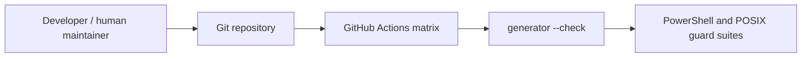

# Infrastructure Specification: epic-136-phase2-gates

## Deployment Topology



This is repository-local tooling. There is no deployed service, region, public
network, persistent database, or production runtime.

## CI/CD Sequence

```mermaid
sequenceDiagram
  actor D as Developer
  participant H as Human copy verifier
  participant G as Generator
  participant CI as CI matrix
  D->>H: Stage protected candidates + manifest
  H->>G: Copy verified candidates; generate native modules
  D->>CI: Push PR
  CI->>G: generate-guard-invariants.py --check
  CI->>CI: Run scripts, guard, and policy suites
  CI-->>D: Pass or fail closed
```

## Environments

| Environment | URL | Auth | Trigger | Classification | Promotion Rule |
|---|---|---|---|---|---|
| local | local Windows drive; reviewed minimum NTFS repository worktree | human filesystem authority; Windows PowerShell 5.1 Full Language mode | human runs anchored copy/generator/tests | internal integrity-critical | native capability preflight, manifest, prepared-temp verification, and focused suites pass |
| CI | GitHub Actions checkout | read-only workflow token | push/PR/merge group | internal integrity-critical | `--check` and suites pass |
| production | N/A | N/A | N/A | N/A | no deployment |

## Infrastructure as Code

N/A - no cloud resource is created. The existing `test.yml` workflow gains a
deterministic check-only generator step.

## Scaling Strategy

N/A - scripts process a fixed small manifest and constant arrays. Generator
runtime is bounded by repository-local files and does not call a service.

## Service Level Objectives

N/A - no online service exists. The operative correctness target is that CI
blocks a stale generated artifact before merge (AC-011).

## Data Residency and Retention

| Entity | Residency | Retention | Backup | Deletion Verification | REQ | AC |
|---|---|---|---|---|---|---|
| canonical invariants / generated modules | git repository | repository lifetime | git history | reviewed revert | REQ-005 | AC-010..013 |
| test fixtures | temporary test directory | test lifetime | none | trap/finally cleanup | REQ-001..005 | AC-001..012 |

## Observability

| Logs | Traces | Metrics | Alert | Owner | Runbook |
|---|---|---|---|---|---|
| CI command output only; never tokens | N/A | generated-diff count / test exit | PR check failure | maintainers | human-copy script usage emitted by task |

## Cost Estimate

No new hosted cost. The standard CI job adds a local generator comparison and
focused test time only.

## Rollback

If a verified human-copied protected artifact regresses, a maintainer restores
the prior version from git, regenerates from the prior canonical source, and
runs TEST-001..013 before reverting the related commit. A generated diff or
manifest mismatch blocks further promotion. The runner prepares and verifies
the complete batch before publication, but the 18 atomic entry replacements do
not form one filesystem transaction; a rename-time failure is recovered by a
reviewed complete rollback batch, never by an unverified partial copy.

## Open Questions

None.
