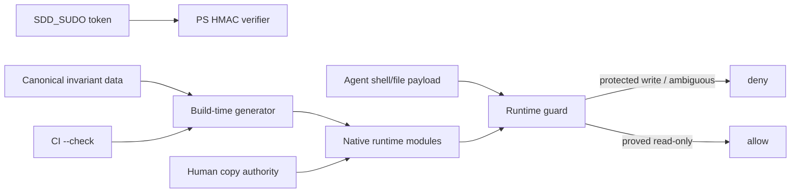

# Security Specification: epic-136-phase2-gates

## Trust Boundaries

| Boundary | Source | Destination | Assets | Validation | AuthN/AuthZ | REQ | AC |
|---|---|---|---|---|---|---|---|
| B1 | shell/file payload | guard decision | protected sources and hook config | strict classifier; ambiguity/write denies | R-10, never sudo-bypassable | REQ-001, REQ-005 | AC-001, AC-002, AC-012 |
| B2 | signed token | PowerShell sudo verifier | temporary HMAC capability | 64-hex shape then full XOR scan | HMAC key, repo/TTL checks | REQ-002 | AC-003, AC-004 |
| B3 | canonical source | generated modules and CI workflow | shared invariants, generated-diff enforcement, protected-copy namespace | schema validation, deterministic render, exact target inventory, anchored no-follow reads, held-source hashing, parent-handle-relative atomic replace, CI diff | human copy and R-10 protection | REQ-005 | AC-010..013 |
| B4 | lite input/task metadata | track selection | review requirements | exact risk trigger/exclusion policy | full track precedence | REQ-004 | AC-007..009 |

## STRIDE Analysis

| Boundary | Threat | STRIDE | Abuse Case | Mitigation | Verification | REQ | AC |
|---|---|---|---|---|---|---|---|
| B1 | legitimate inspection denied | Denial of Service | escaped regex or stderr redirect causes a false reject | permit only conclusively read-only forms; retain write/ambiguity denial | TEST-001, TEST-002 | REQ-001 | AC-001, AC-002 |
| B1 | relaxed parser enables protected write | Tampering / EoP | redirection or copy target is mistaken for a read | target-aware negative corpus across all runtimes | TEST-002, TEST-012 | REQ-001, REQ-005 | AC-002, AC-012 |
| B2 | early signature comparison leaks mismatch position | Information Disclosure | attacker measures variable comparison duration | fixed shape and all-byte XOR accumulator | TEST-003, TEST-004 | REQ-002 | AC-003, AC-004 |
| B3 | one twin, copy runner, risk checker, or CI check is weakened or stale | Tampering | hand edit changes one language or removes generated-diff enforcement | canonical schema, generated modules, protected exact target inventory (including `test.yml`), protected generator, CI `--check` | TEST-010..013 | REQ-005 | AC-010..013 |
| B3 | source or destination namespace is substituted after validation | Tampering / EoP | a path-based copy follows a late junction, symlink, reparse point, or renamed parent | one-segment `NtCreateFile` walks from a held repository handle, no-follow attribute checks, and non-delete-sharing source/parent handles retained through publication | TEST-013 | REQ-005 | AC-013 |
| B3 | path overwrite modifies an out-of-inventory hard-link alias | Tampering / EoP | overwriting the destination file content changes every hard-link name | verified same-parent temporary plus `FileRenameInfo` entry replacement; outside alias remains unchanged | TEST-013 | REQ-005 | AC-013 |
| B4 | risky work avoids full SDD | Security Misconfiguration | `--lite` bypasses auth/secret/API review | risk match wins before flags and missing full artifacts fail | TEST-007..009 | REQ-004 | AC-007..009 |
| contract | inconsistent path validation | Tampering | one evidence field admits an escaping path | one structured helper with field-specific messages | TEST-005, TEST-006 | REQ-003 | AC-005, AC-006 |

## Authentication Flow

`SDD_SUDO` is not changed. The PowerShell verifier resolves the existing key,
verifies required fields, nonce, repo, issued/expires bounds, and exactly 64
hex signature characters. Only after shape validation does it convert both
hex strings to 32-byte arrays, XOR every pair without an early return, and
accept only aggregate zero. Invalid data returns inactive without logging a
key, signature, canonical string, or byte position.

## Authorization

| Actor / Role | Resource | Action | Decision Point | Default | Denial Evidence | REQ | AC |
|---|---|---|---|---|---|---|---|
| agent | protected file | write/delete | all guard twins | deny | exit 2 / Copilot deny | REQ-001, REQ-005 | AC-002, AC-012 |
| agent | protected file | provably read-only inspect | all guard twins | allow | exit 0 | REQ-001 | AC-001 |
| token holder | task approval during valid sudo | bypass only existing approval guard | PS sudo verifier | inactive on any invalid token | inactive result | REQ-002 | AC-003 |
| lite requester | risky feature | select lite | lite-spec / ship policy | full required | named trigger diagnostic | REQ-004 | AC-007..009 |
| human maintainer | protected candidate | copy into live tree | anchored manifest verifier | deny hash, omission, duplicate, non-inventory target, root escape, link/reparse point, hard-link-following overwrite, namespace substitution, unsupported native capability, or unverified temporary | script non-zero before replacement; rename-time error reports possible deterministic prefix | REQ-005 | AC-013 |

## Data Classification and Protection

| Entity | Classification | At Rest | In Transit | Retention | Deletion | Access Log | REQ | AC |
|---|---|---|---|---|---|---|---|---|
| canonical guard invariants | integrity-critical internal | git + R-10 guard | local only | repo lifetime | reviewed revert | git history | REQ-005 | AC-010..013 |
| generated native module and CI guard step | integrity-critical internal | git + R-10 guard | local only | repo lifetime | regenerate/revert | CI log hash/diff only | REQ-005 | AC-010..013 |
| sudo HMAC key/token | restricted ephemeral | existing user key location / local flag | local process only | token TTL | expiration/removal | never log value | REQ-002 | AC-003, AC-004 |
| evidence paths | internal metadata | verification contract | local only | repo lifetime | normal review | failure text only | REQ-003 | AC-005, AC-006 |

## OWASP Mapping

| OWASP Risk | Exposure | Control | Verification | Owner |
|---|---|---|---|---|
| Broken Access Control | protected writes and lite bypass | R-10 classifiers, forced full track | TEST-002, TEST-007..009 | maintainers |
| Cryptographic Failures | variable-time PS comparison | 64-hex plus full XOR scan | TEST-003, TEST-004 | maintainers |
| Security Misconfiguration | constants drifting by runtime | generated artifacts and CI diff | TEST-010..012 | maintainers |
| Path Traversal | duplicated evidence validation | one root-constrained helper | TEST-005, TEST-006 | maintainers |

## Secrets Management

No secret is added. Test HMAC keys are synthetic, process-local fixtures. Test
logs assert decisions and exit codes only; they do not record a real sudo key,
token, complete signature, or canonical HMAC payload.

## SBOM and Supply Chain

No external dependency is added. The generator uses Python standard library
modules, and the PS5.1 runner compiles an embedded ASCII C# 5 helper with
`Add-Type` against .NET Framework and Windows native APIs.
The source-to-generated provenance is enforced by schema validation, committed
outputs, `--check` in CI, and a SHA-256 manifest for human copy. Generated
files never fetch remote content.

## Security Tests

| Test | Boundary | Attack / Control | Expected Result | Evidence | AC |
|---|---|---|---|---|---|
| TEST-001 | B1 | escaped regex / stderr read-only forms | allowed in all twins | focused guard suite | AC-001 |
| TEST-002 | B1 | protected redirect/copy/remove/ambiguous command | denied in all twins | focused guard suite | AC-002 |
| TEST-003 | B2 | valid and first/middle/last-byte changed HMAC | only valid token active | PS focused suite | AC-003 |
| TEST-004 | B2 | source compatibility audit | no direct string comparator or unavailable API | static suite | AC-004 |
| TEST-005 | contract | unsafe paths in three evidence fields | field-specific rejection | scripts.tests.ps1 | AC-005 |
| TEST-007..009 | B4 | exact risk and exclusions, `--lite` bypass | full or fail closed | risk policy suites | AC-007..009 |
| TEST-010..013 | B3 | generation, stale output, runtime imports, anchored-copy tamper including hard-link, late namespace substitution, injected rename failure, and complete rollback | deterministic reject/pass with no outside-alias modification and exact prefix/recovery digests | generator/copy suites | AC-010..013 |

## Open Questions

None. The human selected the anchored no-follow copy architecture on
2026-07-14.
