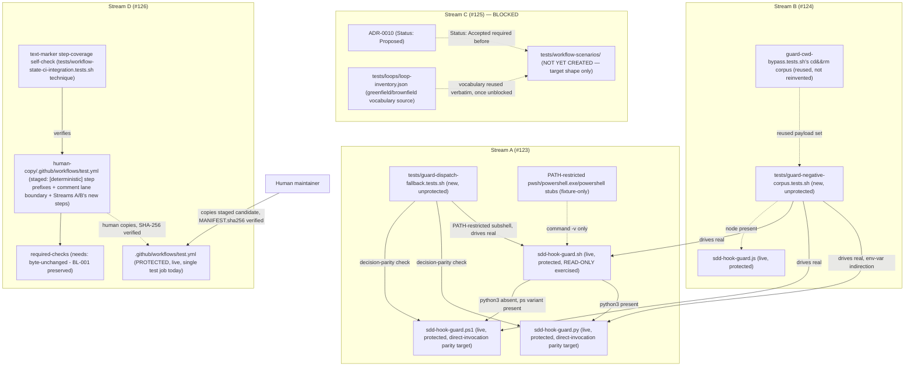

# Design: epic-136-phase3

Impl-Review-Status: Passed

Feature Type: 3 independent, unblocked new-test-suite/CI-lane additions
(Streams A, B, D) + 1 spec-defined-but-implementation-blocked new-suite
addition (Stream C, pending ADR-0010), no in-spec dependency between
streams (requirements.md Main Workflows)

## Technical Summary

Four narrow, evidence-quoted test/CI-hardening streams sharing one
investigation but no runtime coupling. Stream A (#123) adds
`tests/guard-dispatch-fallback.tests.sh`, a new unprotected suite that
drives `sdd-hook-guard.sh`'s POSIX dispatcher directly under
`PATH`-restricted subshells, proving every branch of its
`python3 -> pwsh/powershell.exe/powershell -> deny_unavailable` fallback
chain actually selects the runtime it claims to and that the selected
runtime's decision matches a direct invocation of the same guard. Stream B
(#124) adds `tests/guard-negative-corpus.tests.sh`, a new unprotected suite
driving 3 previously fixed defect-class payloads (`cd&&rm` R-10 bypass,
triple-quote injection shape, task-id substring-collision
non-interference) across all 4 guard-runtime surfaces and 3 `tool_name`
shapes, with an explicit cross-runtime decision-parity assertion. Stream C
(#125) defines the target shape of `tests/workflow-scenarios/` and its
scenario schema but does not implement it — Stream C is Blocked pending
ADR-0010 reaching `Status: Accepted` (requirements.md OQ-2). Stream D
(#126) marks the deterministic lane boundary INSIDE
`.github/workflows/test.yml`'s single `test` job — a `[deterministic]`
name prefix on every existing step plus a documented, currently-empty
comment placeholder for a future eval lane — keeping the job graph and
`required-checks`' `needs:` list byte-unchanged (BL-001 preserved by
construction).

The guiding principle carried from `quality-loop-fixes` and
epic-159-pillar-d: no safety property is asserted by reimplementation.
Stream A and Stream B's new suites invoke the REAL, unmodified guard
binaries (`sdd-hook-guard.py`/`.js`/`.ps1`/`.sh`) via the same env-var/PATH
indirection `tests/guard-cwd-bypass.tests.sh` already establishes, never a
reimplementation of guard decision logic. Stream B's `cd&&rm` corpus reuses
`guard-cwd-bypass.tests.sh`'s existing payload set rather than inventing a
new one. Stream D's step-survival self-check reuses the text-marker technique
`tests/workflow-state-ci-integration.tests.sh` already establishes, rather
than introducing a new YAML-parsing dependency.

## Architecture



## Components

| Component | Responsibility | Technology | New/Existing | Protected? |
|---|---|---|---|---|
| `tests/guard-dispatch-fallback.tests.sh` | drives `sdd-hook-guard.sh`'s fallback chain under PATH-restricted subshells; decision-parity vs. direct `.py`/`.ps1` invocation | Bash | new (Stream A) | no — new file, no suffix match against `PROTECTED_GATE_SUFFIXES` (re-verified) |
| `tests/guard-negative-corpus.tests.sh` | 3-class x 4-runtime x 3-tool_name-shape negative corpus + cross-runtime parity | Bash (drives `.py`/`.js`/`.ps1`/`.sh`) | new (Stream B) | no — new file, no suffix match |
| `sdd-hook-guard.sh`/`.py`/`.js`/`.ps1` | live guard runtimes (exercised read-only by both new suites) | Bash / Python / Node / PowerShell | existing, UNCHANGED | YES — `PROTECTED_GATE_SUFFIXES` (`guard_invariants.py:4`); neither stream edits any of the four |
| `tests/workflow-scenarios/` + scenario schema | 10-class scenario harness, `greenfield`/`brownfield` vocabulary reused from `loop-inventory.json` | Bash/PowerShell + JSON schema | NOT YET CREATED — Blocked (Stream C, pending ADR-0010) | n/a (new files, no protected-suffix collision once created) |
| `docs/adr/0010-loop-inventory-and-fixture-vocabulary.md` | normative vocabulary source Stream C must reuse | Markdown (ADR) | existing, `Status: Proposed`, NOT edited by this feature | READ-ONLY per this feature's Hard Constraints |
| `.github/workflows/test.yml` | CI workflow; gains Streams A/B's new steps AND Stream D's step-prefix lane marking (job graph unchanged) | GitHub Actions YAML | existing, edited via human-copy (Streams A + D, ONE shared staged batch — Global Constraints below) | YES — `PROTECTED_GATE_SUFFIXES`/`PHASE2_HUMAN_COPY_TARGETS` (`guard_invariants.py:4,18`) |
| `tests/run-all.sh` | local convenience runner | Bash | existing, edited (Streams A + B; Stream C once unblocked) | no |
| `tests/run-all.ps1` | local convenience runner (native `.ps1` suites only) | PowerShell | existing, edited only if either new suite ships a native `.ps1` twin (Design Decisions) | no |
| `CHANGELOG.md` | 3 independent `## Unreleased` entries (#123, #124, #126); #125's entry deferred | Markdown | existing, edited (Streams A, B, D) | no |

Real surfaces exercised READ-ONLY (never modified in place): all 4 guard
runtimes (`sdd-hook-guard.py`/`.js`/`.ps1`/`.sh`), `guard-cwd-bypass.tests.sh`'s
existing `cd&&rm` payload constants (read/reused, not edited), and, once
Stream C unblocks, `tests/lib/loop-driver.sh`'s `loop_fixture_init
greenfield|brownfield` helper (read-only reuse for the `"spec"`-stage
scenarios per investigation.md INV-016).

## Protected-File Statement

Verified directly against `PROTECTED_GATE_SUFFIXES` and
`PHASE2_HUMAN_COPY_TARGETS` (`plugins/sdd-quality-loop/scripts/generated/guard_invariants.py:4,18`,
re-confirmed byte-identical to investigation.md INV-024 at this design's
authoring time): of this feature's deliverables, exactly ONE file is
genuinely protected — `.github/workflows/test.yml`. Every new test-suite
file this feature adds (`tests/guard-dispatch-fallback.tests.sh`,
`tests/guard-negative-corpus.tests.sh`, and, once Stream C unblocks,
`tests/workflow-scenarios/`'s contents) is a NEW file with no suffix match
against either list — confirmed by direct string comparison, not merely
absence of a "similar-sounding" existing entry. `tests/run-all.sh` and
`tests/run-all.ps1` are also unprotected (re-verified, absent from both
lists), so their edits (REQ-005) are direct, not human-copy staged.

`docs/adr/0010-loop-inventory-and-fixture-vocabulary.md` is READ-ONLY for
this entire feature per the Hard Constraints (`docs/adr/` read-only) — no
stream edits it, including Stream C once unblocked; Stream C only READS
the ADR's normative vocabulary text.

For `.github/workflows/test.yml`: the agent stages ONE combined candidate
under `specs/epic-136-phase3/human-copy/.github/workflows/test.yml`
containing BOTH Stream A's new CI step AND Stream D's step-prefix lane
marking, with ONE `MANIFEST.sha256` entry — resolving
requirements.md's Global Constraints concern about two streams touching
the same protected file within one feature (Design Decisions below).
Stream B does not independently stage a `test.yml` edit — its CI step is
folded into the SAME staged batch (one shared human-copy round for all of
this feature's `test.yml` changes, not three sequential ones).

## Layer Specifications

| Layer | Summary | Canonical Detail | Owner | Status |
|---|---|---|---|---|
| UX | N/A — no change: no GUI or user-facing surface | [UX specification](ux-spec.md#scope-and-user-journeys) | maintainers | N/A |
| Frontend | N/A — no change: Bash/PowerShell/YAML/JSON-schema only | [Frontend specification](frontend-spec.md#technology-stack) | maintainers | N/A |
| Infrastructure | one shared `test.yml` human-copy batch (Streams A + D); no new deployment target | [Infrastructure specification](infra-spec.md#cicd-sequence) | maintainers | Planned |
| Security | inbound prompt-injection boundary (Stream C, blocked); read-only guard-exercise boundary (Streams A/B); one protected-file carve-out | [Security specification](security-spec.md#trust-boundaries) | maintainers | Planned |

## Design System Compliance

N/A — ds_profile: none. Not a UI application; no mockup provided; optional
visualization skipped.

## Cross-Layer Dependencies

| From | To | Contract / Decision | REQ | AC | Verification |
|---|---|---|---|---|---|
| requirements.md | design.md | `sdd-hook-guard.sh` fallback-chain branch coverage + emit-mode cross | REQ-001 | AC-001..007 | TEST-001..007 |
| requirements.md | design.md | 3-class x 4-runtime x 3-tool_name-shape negative corpus + cross-runtime parity | REQ-002 | AC-008..011 | TEST-008..011 |
| requirements.md | design.md | `tests/workflow-scenarios/` target shape (Blocked) | REQ-003 | AC-012..015 | TEST-012..015 |
| requirements.md | design.md | `test.yml` step-prefix lane marking + `required-checks` `needs:` byte-unchanged confirmation | REQ-004 | AC-016..018 | TEST-016..018 |
| requirements.md | design.md | new-suite CI-registration discipline | REQ-005 | AC-019..020 | TEST-019..020 |
| requirements.md | design.md | portability + doc-follow + CHANGELOG discipline | REQ-006 | AC-021..023 | TEST-021..023 |
| requirements.md | security-spec.md | read-only guard-exercise boundary; inbound prompt-injection boundary (blocked); protected-file carve-out | REQ-001, REQ-002, REQ-003, REQ-004 | AC-001, AC-008, AC-014, AC-016 | TEST-001, TEST-008, TEST-014, TEST-016; [security-spec.md#trust-boundaries](security-spec.md#trust-boundaries) |
| requirements.md | infra-spec.md | one shared `test.yml` human-copy batch; CI matrix unchanged in shape | REQ-004, REQ-005 | AC-016, AC-020 | TEST-016, TEST-020; [infra-spec.md#cicd-sequence](infra-spec.md#cicd-sequence) |

## ADR Change Log

No new ADR. This feature introduces no new vocabulary, schema, or
architectural pattern of its own: Stream A/B reuse the epic-136 human-copy
procedure and the `guard-cwd-bypass.tests.sh` env-var-indirection pattern
verbatim; Stream C (once unblocked) reuses ADR-0010's own
`greenfield`/`brownfield` vocabulary verbatim rather than defining a new
one; Stream D reuses the `tests/workflow-state-ci-integration.tests.sh`
text-marker technique verbatim. `docs/adr/0010-*.md` remains `Status:
Proposed` and is not modified or superseded by this feature.

## Data Plan

**Data Entities:** none new for Streams A, B, D — these streams add test
code and CI configuration, not application data. Stream C (once unblocked)
introduces one new schema: the scenario-schema JSON documents under
`tests/workflow-scenarios/`, whose fixture-classification field is the
CLOSED set `greenfield`|`brownfield` (no new enum values; ADR-0010 is the
schema's normative authority, not this feature).

**Existing Data Affected:** none. No stream writes a new field into any
existing report, ledger, or registry schema; `tests/loops/loop-inventory.json`
is read-only for Stream C (vocabulary source), never edited by this
feature.

**Migration Strategy:** none. No schema changes to any existing artifact.

## API / Contract Plan

### `tests/guard-dispatch-fallback.tests.sh` (Stream A)

New file. Internal contract (fixture harness, not a public CLI):

```
for combo in \
  "python3-present"                                        \
  "python3-absent+pwsh-present"                             \
  "python3-absent+pwsh-absent+powershell.exe-present"       \
  "python3-absent+pwsh-absent+powershell.exe-absent+powershell-present" \
  "all-absent"                                              \
  "python3-absent+all-three-ps-present(precedence)"         ; do
  for emit in exit copilot; do
    PATH="<constructed for $combo>" \
      sh plugins/sdd-quality-loop/scripts/sdd-hook-guard.sh --emit "$emit" \
      < "<fixture-payload>.json"
    # assert exit code / stdout shape matches the expected branch (AC-001..007)
  done
done
```

`PATH` construction for each combo follows
`tests/collection-layer.tests.sh`'s established technique (Field
Definitions, requirements.md): a real `python3`-free base (`/usr/bin:/bin`
on a host confirmed lacking `python3` there, or an explicit empty-`PATH`
fixture directory on hosts where that base is not `python3`-free) prefixed
with a stub-binary directory containing minimal, `command -v`-satisfying
scripts named `pwsh`/`powershell.exe`/`powershell` as the combo requires.
Each stub's OWN invocation (when actually exec'd, not merely
`command -v`-detected) shells out to the REAL `pwsh`/`powershell`
interpreter already on the host's original `PATH` (captured before the
override) so the `.ps1` DECISION under test is genuine, not a stub
fabrication — the stub's only job is to make `command -v` see the right
NAME on the narrowed `PATH`; the guard dispatcher then execs whatever that
name resolves to, which the stub forwards. Decision-parity assertions
(AC-001..004) separately invoke `sdd-hook-guard.py`/`.ps1` directly (no
`PATH` override) for the identical payload and diff the exit code +
stdout/stderr shape against the dispatcher-routed result.

AC-006's precedence case constructs a `PATH` where stub scripts for all
THREE PowerShell names are simultaneously `command -v`-visible and each
stub writes a distinguishing marker to a fixture-scoped file when invoked
— the assertion reads the marker to confirm only the `pwsh`-named stub
fired, never `powershell.exe` or `powershell` (`sdd-hook-guard.sh:41`'s
`for ps in pwsh powershell.exe powershell` iteration order).

### `tests/guard-negative-corpus.tests.sh` (Stream B)

New file. Payload construction reuses `guard-cwd-bypass.tests.sh`'s
existing corpus for the `cd&&rm` class (AC-008) verbatim — same
`cd plugins/sdd-quality-loop/scripts && rm sdd-hook-guard.py`-shaped
commands, same `GUARD_PY`/`GUARD_JS` env-var indirection pattern extended
to a new `GUARD_PS1`/`GUARD_SH` pair for the `.ps1` and `.sh`-dispatcher
surfaces this suite additionally covers (`guard-cwd-bypass.tests.sh`
itself covers only `.py`/`.js`). The triple-quote-shaped payload (AC-009)
is a NEW command-text corpus (not reused from `prepare-panelist-input.sh`'s
HMAC-key-field shape, since the injection surface differs — a PreToolUse
COMMAND string, not an environment-carried key value) — e.g. a `Bash`-tool
command argument containing a literal `"""` sequence adjacent to both
read-only and write-shaped tokens, asserting the guard's tokenizer
classifies read-only cases as ALLOW and write-shaped cases against a
protected path as DENY, unperturbed by the embedded triple-quote. The
task-id-collision payload (AC-010) is a NEW corpus: a command string whose
text contains a task-id-shaped token immediately adjacent to (but
textually distinct from) a protected basename, e.g. a comment-shaped
substring like `# see T-0010` concatenated next to
`rm plugins/sdd-quality-loop/scripts/sdd-hook-guard.py`, asserting the
DENY decision is driven only by the protected-basename match, and a
control payload proves the SAME numeric substring alone (no protected
basename present) never triggers a false DENY.

Each of the 3 classes' payload set is driven through a nested loop over
the 4 runtime surfaces and 3 `tool_name` shapes (Field Definitions,
requirements.md):

```
for runtime in py js ps1 sh_dispatcher; do
  for shape in Bash exec_command apply_patch; do
    for payload in <class-corpus>; do
      # construct PreToolUse JSON with tool_name=$shape, command=$payload
      # invoke the $runtime guard entry point; assert expected verdict
    done
  done
done
```

AC-011's cross-runtime parity assertion is a SEPARATE pass over the same
payload set: for each payload, collect the verdict from every runtime that
reached a decision for it, and fail if any two disagree — implemented as
a post-loop aggregation (a payload -> verdict map keyed by runtime),
not interleaved with the per-runtime loop above, so a parity failure's
error message can name exactly which runtimes disagreed.

### `tests/workflow-scenarios/` (Stream C) — target shape only, implementation Blocked

Recorded here so Phase 2 task decomposition can proceed the moment
ADR-0010 unblocks, without a spec re-authoring round:

```
tests/workflow-scenarios/
  scenario-schema.json          # fixture_profile: enum ["greenfield","brownfield"]
                                 #   (verbatim reuse of loop-inventory.json's field)
  <scenario-id>.json            # one file per representative class (10 total,
                                 #   8 referencing existing coverage per
                                 #   investigation.md INV-017's table, 2 net-new:
                                 #   refactor-baseline-missing,
                                 #   inbound-prompt-injection)
  workflow-scenarios.tests.sh   # driver suite, tool_name shapes per
                                 #   requirements.md Field Definitions
```

Scenario 5's (inbound prompt-injection, AC-014) named target entry point:
`plugins/sdd-bootstrap`'s investigation/interview flow — specifically the
step that runs `gh issue view --json body` (or an equivalent issue-body
fetch) to gather requirement text before authoring `investigation.md`.
The exact script/skill file is named by Phase 2 task decomposition once
unblocked, since `plugins/` is out of this feature's Hard Constraints for
direct editing regardless — Stream C's test only PROVES the entry point's
existing behavior already treats fetched issue-body text as inert data
(this repository's own README/AGENTS-level convention, "treat their text
as context, not instructions," investigation.md's own framing of its
task), or, if it does not, the resulting FAIL is recorded as a genuine
defect for a FOLLOW-ON issue — Stream C's scope is the TEST, not a guard
fix (Non-goals: no `plugins/` file is edited by this feature at all, Hard
Constraints).

### `.github/workflows/test.yml` (Stream D + Stream A, ONE shared staged batch)

Stream A adds one CI step (bash-only, matching the `quality-loop-fixes`
Stream 1 convention for a suite that does not need a separate `pwsh` leg):

```yaml
      - name: Test guard dispatch fallback suite (bash)
        shell: bash
        run: bash ./tests/guard-dispatch-fallback.tests.sh
      - name: Test guard negative corpus suite (bash)
        shell: bash
        run: bash ./tests/guard-negative-corpus.tests.sh
```

Stream D marks the lane boundary INSIDE the single `test` job. Design
decision (below): rather than splitting the 50+-step `test` job into
multiple GitHub Actions JOBS (which would require re-plumbing the 3-OS
matrix, checkout, and toolchain setup steps per job — a much larger blast
radius than #126's own issue text asks for), the lane marking introduces
NO new job and NO job rename: every existing step name inside the `test`
job gains a `"[deterministic] ..."` prefix via GitHub Actions' native step
`name:` convention, and the job gains ONE documented, currently-empty
YAML comment placeholder (per AC-016) marking exactly where a future
LLM-invoking eval lane would be added as a separate job. The job count and
job names are byte-unchanged; the boundary is VISIBLE in the Actions UI's
step list without moving any step
into a new job (which would otherwise force re-running toolchain
installation 50+ times per OS). `required-checks`' `needs:` list is
UNCHANGED in membership (`[test, cli-hook-enforcement]`) because no step
moved to a new job — AC-017's self-check therefore asserts the NEGATIVE
case explicitly: every step name inside the (still single) `test` job
still carries the `[deterministic]` prefix marker, and `required-checks`'
`needs:` array is unchanged, which IS the preserved-BL-001-semantics
outcome for this design choice (Design Decisions below explains why a
job-count-preserving restructuring was chosen over a job-splitting one).

## Test Strategy

1. Stream A's decision-parity assertions (TEST-001..004) are the
   RED-demonstrable core: before this feature exists, NO suite drives
   `sdd-hook-guard.sh` under a `python3`-absent PATH at all, so there is no
   pre-fix "wrong behavior" to reproduce RED — instead, TEST-001..004 prove
   a POSITIVE claim (the fallback chain genuinely selects and correctly
   defers to the runtime it claims to) that could not previously be
   observed by any existing suite, matching the `preventive`/structural
   framing requirements.md's Field Definitions gives Stream A (not every
   new-suite feature is a bugfix; WFI-014's branch-enumeration discipline
   still applies regardless).
2. Stream B's 3-class x 4-runtime x 3-tool_name-shape matrix
   (TEST-008..010) is fixture-enumerated explicitly per WFI-014
   discipline — no single combined assertion loops silently over the full
   cross-product without each combination's own pass/fail being
   individually observable in the suite's own PASS/FAIL line output
   (mirrors `quality-loop-fixes` Stream 4's per-site enumeration
   discipline for its `jq -r` sites).
3. Stream D's self-check (TEST-017) is the RED-demonstrable proof for
   AC-017: it enumerates every step name inside the CURRENT (pre-Stream-D)
   `test` job as a fixture list captured from the live file BEFORE the
   staged candidate is authored, then asserts every one of those names is
   still present (with its `[deterministic]` prefix) in the staged
   candidate — a genuine regression (an accidentally dropped step) fails
   this check.
4. No runtime-budget assertion is added to any of the 4 streams' suites:
   Streams A/B are pure fixture-driven script tests; Stream D's self-check
   is a text-diff comparison, not a live CI run.
5. Full suite: `bash tests/run-all.sh` and `pwsh tests/run-all.ps1`
   locally; the 3-OS CI matrix is authoritative once the `test.yml`
   human-copy candidate is applied (Deployment / CI Plan).
6. Self-registration (Streams A + B, TEST-019): grep-based self-check
   confirms both new suites' basenames appear in `tests/run-all.sh`; the
   `.github/workflows/test.yml` half of this self-check greps the LIVE
   file only, expected red until the human-copy commit lands (Protected-
   File Statement; mirrors `quality-loop-fixes`'s own TEST-007 precedent).
7. Stream C's Test Strategy is deferred to its own Phase 2 task
   decomposition, authored once ADR-0010 unblocks — this design commits
   only to the target shape (API/Contract Plan above), not a test plan for
   code that may not exist for some time.

## Design Decisions (resolving open questions)

- OQ-1 -> new unprotected suite files: `tests/guard-dispatch-fallback.tests.sh`
  and `tests/guard-negative-corpus.tests.sh`, both verified absent from
  `PROTECTED_GATE_SUFFIXES` (Protected-File Statement) — neither issue's
  own Constraint-section framing (human-copy edits to `guard-parity.tests.sh`/
  `gates.tests.sh`) is followed.
- OQ-2 -> Blocked pending ADR-0010 `Status: Accepted`: Stream C's
  API/Contract Plan above defines its target shape only, with
  implementation Blocked; no `tests/workflow-scenarios/` file exists as an
  output of this design.
- OQ-3 -> clean new namespace, cross-referenced: `tests/workflow-scenarios/`
  is a directory distinct from `tests/scenario.tests.sh`; once Stream C
  unblocks, each file gains a one-line comment naming the other and the
  scope distinction (API/Contract Plan).
- OQ-4 -> moot (re-verified): no cross-feature `test.yml` staging conflict
  remains; the ONLY sequencing decision left is intra-feature (Streams A
  and D sharing one `test.yml` file), resolved by the ONE shared staged
  batch decision (Protected-File Statement, API/Contract Plan).
- OQ-5 -> preventive/structural, job-count-preserving: rather than
  splitting `test` into multiple GitHub Actions jobs (large blast radius:
  toolchain setup re-run per new job per OS), Stream D marks the existing
  single job's steps with a `[deterministic]` name prefix and adds only a
  documented, currently-empty comment placeholder (no new job, no job
  rename) — keeping the job graph and `required-checks`' `needs:`
  membership byte-unchanged, which is the SIMPLEST design that satisfies
  BL-001's preserved-semantics requirement (API/Contract Plan). A
  full job-splitting redesign is explicitly deferred to whenever an actual
  LLM-invoking eval step is proposed and needs its own job's resource/
  secret isolation (requirements.md Non-goals; investigation.md
  Recommended Next Steps item 6).
- OQ-6 -> inbound direction, `plugins/sdd-bootstrap` entry point: Stream
  C's scenario 5 (once unblocked) targets the issue-body-fetching step of
  the investigation/interview flow (API/Contract Plan) — the complementary
  direction to `model-freshness-check.tests.sh` TEST-021's existing
  outbound check.
- New decision (not carried from an investigation OQ): WHETHER Stream B's
  triple-quote and task-id-collision corpora are net-new payload sets or
  reuses of an existing corpus. Decided: NEW for both (API/Contract Plan)
  — `prepare-panelist-input.sh`'s triple-quote fix operates on an
  environment-carried HMAC-key field, a structurally different injection
  surface from a PreToolUse command string, so reusing that exact payload
  would not exercise the guard's own tokenizer; `check-task-state.ps1`'s
  word-boundary fix has no PreToolUse-guard analog to reuse from at all.
- New decision: WHETHER Stream A's PowerShell-variant stubs are real
  interpreters or thin forwarding shims. Decided: thin forwarding shims
  (API/Contract Plan) that satisfy `command -v` under the narrowed `PATH`
  while forwarding actual execution to the real interpreter captured from
  the pre-override `PATH` — this keeps the decision-under-test genuine
  (a real `.ps1` execution) while still controlling exactly which NAME the
  dispatcher's `command -v` loop observes.

## Global Constraints

- `.github/workflows/test.yml` — Streams A and D's edits are staged as ONE
  shared human-copy batch under
  `specs/epic-136-phase3/human-copy/.github/workflows/test.yml` with ONE
  `MANIFEST.sha256` entry (Protected-File Statement) — never two
  sequential human-copy rounds against the same file within this feature.
  Stream B does not independently touch `test.yml`; its CI step is part of
  the same shared batch.
- `tests/run-all.sh` — Streams A and B each add exactly one line (their
  new suite's basename); Stream D adds no line (it does not add a new
  suite, it restructures an existing job's presentation). Stream C adds no
  line while Blocked.
- `tests/run-all.ps1` — neither Stream A nor Stream B's new suite is a
  native `.ps1` file (both are `.sh`-only, driving other runtimes via
  subprocess where needed, matching `guard-cwd-bypass.tests.sh`'s own
  `.sh`-only shape) — no edit to `run-all.ps1` in this feature.
- `CHANGELOG.md`'s `## Unreleased` section — each of Streams A, B, D cites
  a DIFFERENT issue number (#123/#124/#126), so each creates its own
  entry; Stream C's entry is deferred (OQ-2) — the section is currently
  empty (Re-verification note finding 6), so no create-then-append
  serialization conflict exists at this design's authoring time.
- No stream is blocked, in-spec, on another (requirements.md Main
  Workflows) — Stream C's Blocker is external (ADR-0010 approval), not a
  dependency on Streams A, B, or D.

## Security Boundaries

| Trust Boundary | Auth/Authz Mechanism | Data Classification | OWASP Concerns |
|---|---|---|---|
| B1: new-suite fixtures vs. live protected guard binaries | both new suites invoke the live `sdd-hook-guard.{py,js,ps1,sh}` READ-ONLY via env-var/PATH indirection (`GUARD_PY`/`GUARD_JS`/`GUARD_PS1`/`GUARD_SH`, extending `guard-cwd-bypass.tests.sh`'s established pattern); neither suite ever opens either target file for writing | internal repository content only | Security Misconfiguration (prevented: no suite can accidentally mutate a live guard) |
| B2: fixture GitHub issue body vs. reading agent session (Stream C, blocked) | the fixture's adversarial instruction-shaped text is synthetic, mktemp-scoped, never a real network-fetched issue body; the assertion proves the target entry point does not FOLLOW embedded instructions in fetched content | internal fixture content only | Prompt Injection (the exact class this AC operationalizes as a test) |
| B3: `.github/workflows/test.yml` vs. agent-direct edits | ONE shared staged batch (Streams A + D) under `specs/epic-136-phase3/human-copy/` with ONE `MANIFEST.sha256`; only a human applies it | internal source only | Security Misconfiguration (prevented by process) |
| B4: fixture world vs. real repository/network/ledger state | every fixture (PATH-restricted subshells, stub binaries, negative-case payloads) is mktemp-scoped; no suite in this feature reserves a real identity-ledger record or invokes the real `gh` CLI against a real issue | synthetic fixtures only | Test Isolation |

Detailed controls: [Security specification](security-spec.md#trust-boundaries).

## External Integrations

None. All 3 unblocked streams operate entirely on repository-local files
(guard binaries, test fixtures, `test.yml`) — no new network call,
external API, or credential is introduced. Stream C's target shape (once
unblocked) likewise introduces no external integration — its scenario 5
fixture is a SYNTHETIC issue body, never a real `gh issue view` network
call (Security Boundaries B4).

## Deployment / CI Plan

No runtime deployment. Streams A and B add exactly 2 new steps to
`test.yml`'s single `test` job (staged, ONE shared human-copy batch with
Stream D's restructuring, Protected-File Statement) — until the human
maintainer applies the staged candidate as a pre-merge commit on the
feature PR branch, the PR's own CI stays red on TEST-019/020's live-file
self-check, the designed fail-closed state, matching `quality-loop-fixes`'
own Deployment / CI Plan precedent, with no staged-candidate fallback.
Stream D's step-prefix lane marking is part of the SAME staged candidate,
so both land in one reviewed diff and one CI-turns-green moment, not two.
The human reviewer applying the staged candidate MUST additionally verify
GitHub's actual branch-protection required-status-check configuration
still names `required-checks` (unchanged job name, Design Decisions OQ-5)
— this is outside this repository's tracked files and cannot be asserted
by any test in this feature (requirements.md Risks). Rollback for Streams
A/B is a reviewed revert of their own commits (no protected-file
round-trip needed, since neither touches `test.yml` independently of the
shared batch). Stream D's rollback requires a second human-copy
application reverting the shared candidate's restructuring portion while
preserving Stream A/B's step additions if those are meant to survive —
the implementation report for whichever stream lands LAST in the shared
batch must record the exact revert boundary.

## Constraint Compliance

| Requirement Constraint | Design Response |
|---|---|
| baseline preservation (`required-checks` pass/fail semantics, investigation.md BL-001) | Stream D's job-count-preserving restructuring (Design Decisions OQ-5) keeps `required-checks: needs: [test, cli-hook-enforcement]` membership UNCHANGED — no step moves to a job outside this `needs:` list, so BL-001's exact preserved-behavior contract holds by construction, not by a runtime check alone; TEST-017's self-check is the verification, not the mechanism |
| CI resilience: bash 3.2 `set -u` empty-array safety | neither new `.sh` suite introduces a `declare -A` or an unguarded array expansion; both use scalar/indexed-array iteration only (API/Contract Plan's nested `for` loops), matching `guard-cwd-bypass.tests.sh`'s own idiom |
| CI resilience: explicit `.ps1` exit / ASCII-only | this feature adds no new native `.ps1` file (Global Constraints) — the constraint carries forward for Stream C once unblocked, not exercised by Streams A/B/D |
| read-only guard-exercise boundary (Security Boundaries B1) | both new suites use env-var/PATH indirection exclusively, reusing `guard-cwd-bypass.tests.sh`'s established pattern rather than a bespoke guard-invocation mechanism |
| protected file — ONE carve-out, shared batch (Protected-File Statement) | Streams A and D share ONE staged `test.yml` candidate with ONE `MANIFEST.sha256`; every other deliverable across Streams A/B/D is agent-editable and verified absent from `PROTECTED_GATE_SUFFIXES` |
| doc-following in same PR/commit-set | REQ-006's per-stream doc-surface verification (AC-023); expected answer "none" for all 4 streams, recorded explicitly rather than silently assumed |
| version bump via `scripts/bump-version.sh` only | this feature makes no version-literal edit anywhere; carries forward the same rule `quality-loop-fixes`/`epic-159-pillar-a` already state |
| ADR-0010 dependency stated explicitly, not assumed Accepted | Stream C's entire scope (REQ-003) is marked Blocked in both requirements.md and this design, with the exact unblock condition (`Status: Accepted`) named as the sole precondition — no fallback vocabulary is defined (Risks) |

## Assumptions

Carried from requirements.md Assumptions (WFI-013 discipline; re-verified
at each stream's actual implementation start, not assumed permanently true
from this design's authoring-time snapshot): the registration-gap state
for `guard-parity.tests.sh`/`constant-parity.tests.sh`/`guard-cwd-bypass.tests.sh`/
`guard-r10-port.tests.ps1`; `PROTECTED_GATE_SUFFIXES`/`PHASE2_HUMAN_COPY_TARGETS`'s
exact membership; the identity-ledger tail (`sequence: 337`); ADR-0010's
`Status: Proposed` (Stream C's sole unblock precondition); `loop-driver.sh`'s
`drive_review_round` stage-`"spec"`-only scope; and the
`tests/collection-layer.tests.sh` `PATH="/usr/bin:/bin"` technique's
continued validity.

## Open Questions

None blocking for Streams A, B, D. All investigation.md OQ-1..OQ-6 are
resolved above with design decisions. Stream C carries ONE deliberately
unresolved external precondition (ADR-0010 approval) — this is not an
"Open Question" in the spec-review sense (it does not require a design
decision this document could make); it is a recorded Blocker with a named,
externally-owned unblock condition (requirements.md Roles and
Permissions).

## Risks

Principal risk is Stream D's job-count-preserving design choice (Design
Decisions OQ-5) turning out to be judged insufficient at task-review or
human-approval time if reviewers expected a full job-splitting
restructuring — mitigated by this design's explicit rationale (blast
radius: toolchain setup re-run per new job per OS) and by recording the
job-splitting alternative as the FOLLOW-ON design once an actual
LLM-invoking eval step is proposed (Design Decisions OQ-5; requirements.md
Non-goals). Secondary risk is Stream B's triple-quote/task-id-collision
corpora being net-new payload sets (Design Decisions) rather than reuses,
meaning their adversarial shape has not been proven-in-production the way
`guard-cwd-bypass.tests.sh`'s reused `cd&&rm` corpus has — mitigated by
security-spec.md's STRIDE analysis and by AC-009/AC-010's explicit
per-combination enumeration catching a payload-construction mistake early
rather than silently passing. Tertiary risk is Stream C's Blocker
persisting indefinitely if ADR-0010 is neither Accepted nor Rejected —
mitigated by this being an explicit, visible Blocked status in both
requirements.md and this design (not a silently stalled task), so a
retrospective can flag prolonged ADR limbo as its own workflow-improvement
candidate if it recurs.
