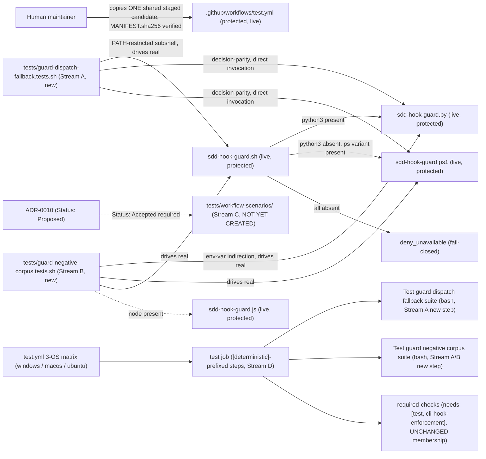

# Infrastructure Specification: epic-136-phase3

3 unblocked new-test-suite/CI-lane-restructuring streams + 1
implementation-Blocked target shape. No cloud service, deployment target,
IaC resource, network route, or data store is added or changed. The only
infrastructure-facing edit across the 3 unblocked streams is
`.github/workflows/test.yml`, staged as ONE shared human-copy batch
covering Stream A's 2 new CI steps and Stream D's job-graph restructuring
(design.md Protected-File Statement) — never two sequential human-copy
rounds against the same protected file within this feature.

## Deployment Topology



## CI/CD Sequence

`.github/workflows/test.yml`'s existing 3-OS matrix (`windows-latest`,
`macos-latest`, `ubuntu-latest`, `test.yml:18`) and existing step-pairing
pattern are unchanged in SHAPE by this feature — Stream D deliberately
avoids splitting the single `test` job into multiple jobs (design.md
Design Decisions, OQ-5), so no toolchain-setup step is re-run per new job
per OS. Streams A and B together add exactly 2 new steps to the existing
`test` job, each now carrying the `[deterministic]` name prefix Stream D's
restructuring applies to every step in that job:

```yaml
      - name: "[deterministic] Test guard dispatch fallback suite (bash)"
        shell: bash
        run: bash ./tests/guard-dispatch-fallback.tests.sh
      - name: "[deterministic] Test guard negative corpus suite (bash)"
        shell: bash
        run: bash ./tests/guard-negative-corpus.tests.sh
```

Because `.github/workflows/test.yml` is itself an enforcement-chain
protected file
(`plugins/sdd-quality-loop/scripts/generated/guard_invariants.py:4`,
design.md Protected-File Statement), BOTH streams' edits are staged as ONE
combined candidate under
`specs/epic-136-phase3/human-copy/.github/workflows/test.yml` with ONE
`MANIFEST.sha256`, following `epic-136-phase2-gates/tasks.md:16-25`'s
established Human-Copy Procedure verbatim. The human maintainer applies
the shared candidate as one pre-merge commit on the feature PR branch:
until it lands, the PR's own CI stays red on TEST-019/020's live-file
self-check — the designed fail-closed state, with no staged-candidate
fallback.

`tests/run-all.ps1` receives NO new entry for either suite (design.md
Global Constraints) — neither `tests/guard-dispatch-fallback.tests.sh` nor
`tests/guard-negative-corpus.tests.sh` ships a native `.ps1` twin; both
drive `.ps1`/`.js` targets via subprocess/PATH indirection from a
`.sh`-only driver, matching `guard-cwd-bypass.tests.sh`'s and
`guard-r10-port.tests.ps1`'s own established shapes for this class of
cross-runtime suite.

Determinism lane (Stream D, #126): the `[deterministic]` step-name prefix
applied across the `test` job's existing steps is the visible artifact of
this restructuring — no step moves to a new job, so `required-checks`'
`needs: [test, cli-hook-enforcement]` membership is UNCHANGED (BL-001
preserved by construction, design.md Constraint Compliance). When a real
LLM-invoking eval step is eventually proposed, it lands in a genuinely
separate job outside this `needs:` list, following the isolation pattern
`self-improvement.yml` already establishes (investigation.md INV-021) —
this feature does not itself add that job, only the naming boundary that
makes the future split's target obvious.

## Runtime Dependencies

| Dependency | Used by | Absence behavior |
|---|---|---|
| bash | both new suites; `tests/run-all.sh` | already an established repository-wide precondition; GitHub-hosted runners ship bash by default |
| python3 | `tests/guard-dispatch-fallback.tests.sh`'s control case (AC-001) and decision-parity checks | already a hard dependency of `sdd-hook-guard.sh`'s own `.py` branch (unchanged); the suite's OTHER cases deliberately construct a `python3`-absent `PATH`, so absence is exercised on purpose, not merely tolerated |
| pwsh / powershell.exe / powershell (at least one, or stubbed) | `tests/guard-dispatch-fallback.tests.sh`'s fallback-branch cases (AC-002..006) | the suite provides thin forwarding stubs (design.md API/Contract Plan) so a host lacking a real PowerShell variant can still exercise `command -v`-level branch selection; the underlying DECISION parity check (AC-002..004) requires a real interpreter reachable from the pre-override `PATH` and SKIPs with a named reason if none is available, mirroring `guard-parity.tests.sh`'s SKIP convention |
| node | `tests/guard-negative-corpus.tests.sh`'s `.js`-runtime sub-cases | already a hard dependency of `sdd-hook-guard.js` (unchanged); absence SKIPs only the `.js` sub-cases of AC-008/009/010, not the whole suite |
| git | human-copy staging verification (Streams A + D's shared carve-out) | already a repository dependency |

No new services, containers, or package installations of any kind.

## Environments

| Environment | URL | Auth | Trigger | Classification | Promotion Rule |
|---|---|---|---|---|---|
| local | repository checkout | none / synthetic fixtures | `bash tests/run-all.sh` | internal fixtures only | both new suites green |
| CI matrix (`test.yml`) | no network use by either new suite beyond checkout | scoped `GITHUB_TOKEN` (unchanged) | push / PR / merge_group | synthetic fixtures | all required checks green on 3 OSes, once the shared human-copied `test.yml` candidate (Streams A + D) is live |

## Runtime Budget

No stream's suite requires a runtime-budget assertion (design.md Test
Strategy item 4): both new suites are pure fixture-driven function/script
testing — no live network call, no subprocess-loop-driving beyond what
`guard-cwd-bypass.tests.sh` and `guard-parity.tests.sh` already do for a
comparable class of guard-invocation suite.

## Infrastructure as Code, Scaling, SLOs, and Residency

N/A — no change: no deployed service. The only IaC-like artifact touched is
`.github/workflows/test.yml` (existing, protected — 2 new steps plus a
step-name-prefix restructuring, one shared human-copy batch, Streams A +
D only).

## Observability

| Logs | Traces | Metrics | Alert | Owner | Runbook |
|---|---|---|---|---|---|
| each new suite's own stdout/stderr (per-combination PASS/FAIL lines, acceptance-tests.md Notes); GitHub Actions job status for the `test` job (unchanged mechanism, 2 new `[deterministic]`-prefixed steps) | N/A | pass/fail per suite per OS per lane (`test.yml`, unchanged mechanism) | none new — this feature adds no new alerting surface; a cross-runtime decision-parity FAIL (AC-011) names the disagreeing runtimes directly in its own output, no separate alert channel needed | maintainers | re-run the affected suite locally (`bash tests/guard-dispatch-fallback.tests.sh` / `bash tests/guard-negative-corpus.tests.sh`) against a fresh fixture if a CI failure needs reproduction |

## Rollback

Streams A and B: reviewed revert of their own commits removes the 2 new
test files; because their CI-step registration is part of the SHARED
`test.yml` human-copy batch with Stream D, a revert of the LIVE
`test.yml`'s registration lines requires a second human-copy application
(staging a candidate with Stream A/B's 2 lines removed) — the same
human-in-the-loop mechanism that added them, never a direct agent revert
of the live protected file. Stream D: reverting its job-graph
restructuring similarly requires a second human-copy application removing
the `[deterministic]` prefixes and any boundary-marker addition; if
Streams A/B's step lines are meant to survive a Stream D revert, the
implementation report for whichever stream lands LAST in the shared batch
must record the exact revert boundary (design.md Deployment / CI Plan).
Stream C has no rollback surface — this feature does not create any of its
files (implementation Blocked).

## Open Questions

None. Owner: maintainers; non-blocking.
