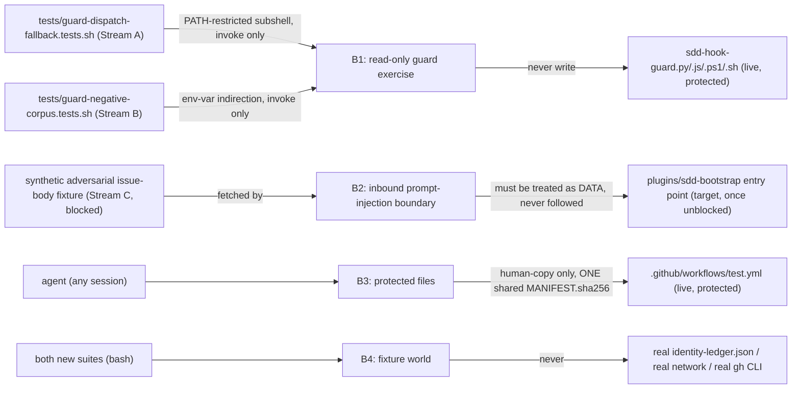

# Security Specification: epic-136-phase3

Impact assessment is required for this feature class: Streams A and B both
construct adversarial-shaped payloads (fallback-chain PATH manipulation;
`cd&&rm` bypass, triple-quote injection, task-id-collision command
strings) and drive them against the LIVE, protected guard binaries — a
class of test whose own fixtures could, if implemented naively, become an
actual exploitation vector (a fixture that genuinely executes an injected
payload rather than merely proving the guard denies it) rather than a
verification of one. Stream C's target shape (blocked) defines an INBOUND
prompt-injection test whose own fixture is, by design, adversarial
instruction-shaped text — the exact class of content this repository's own
operating rules require treating as data, not instructions. Stream D
changes CI job-graph structure in a way that must not, even incidentally,
narrow `required-checks`' coverage.

## Trust Boundaries

| Boundary | Source | Destination | Assets | Validation | AuthN/AuthZ | REQ | AC |
|---|---|---|---|---|---|---|---|
| B1 | `tests/guard-dispatch-fallback.tests.sh`, `tests/guard-negative-corpus.tests.sh` | live `sdd-hook-guard.{py,js,ps1,sh}` | guard-decision integrity | both new suites invoke the live guards via env-var/PATH indirection (`GUARD_PY`/`GUARD_JS`/`GUARD_PS1`/`GUARD_SH`, extending `guard-cwd-bypass.tests.sh`'s established pattern) and NEVER open either target file for writing; every adversarial payload is asserted to be DENIED or correctly classified, never actually let through to a real filesystem mutation outside the fixture's own `mktemp` sandbox | filesystem read-only for the guard targets; write access confined to `mktemp`-scoped fixture directories | REQ-001, REQ-002 | AC-001..011 |
| B2 | synthetic fixture GitHub issue body (Stream C, blocked) | the named `plugins/sdd-bootstrap` entry point | agent-session instruction-following integrity | the fixture's adversarial instruction-shaped text (mirroring `model-freshness-check.tests.sh:423`'s existing corpus) is proven NOT followed/executed by the reading agent session — a genuine positive result requires the target entry point already treats fetched content as data; a FAIL is a real defect for a follow-on issue, not a defect in this test | no real network fetch; the fixture text never reaches a real GitHub issue | REQ-003 | AC-014 (Blocked) |
| B3 | any agent session | `.github/workflows/test.yml` (live, protected) | enforcement-chain integrity; `required-checks` gate coverage | ONE shared staged candidate under `specs/epic-136-phase3/human-copy/` + ONE `MANIFEST.sha256` covering both Stream A's new steps and Stream D's restructuring; only a human applies it, as one pre-merge commit on the feature PR branch | `PROTECTED_GATE_SUFFIXES`/`PHASE2_HUMAN_COPY_TARGETS` (`guard_invariants.py:4,18`) + human review | REQ-004, REQ-005 | AC-016, AC-020 |
| B4 | both new suites (all fixtures) | fixture filesystem / stub binaries | synthetic PATH-restricted subshells, PowerShell forwarding stubs, negative-case payloads | mktemp-scoped; no suite in this feature reserves a real identity-ledger record, invokes the real `gh` CLI, or makes a live network call | filesystem/PATH isolation | REQ-001, REQ-002 | AC-001..011 |

## STRIDE Analysis

| Boundary | Threat | STRIDE | Abuse Case | Mitigation | Verification | REQ | AC |
|---|---|---|---|---|---|---|---|
| B1 | Stream A's PowerShell forwarding stubs (design.md API/Contract Plan) are implemented naively such that the stub itself, rather than merely forwarding to a real interpreter, executes attacker-shaped content from the fixture payload | Tampering / Elevation of Privilege | a stub script written to "just run the payload" instead of "forward to the real `pwsh`/`powershell` binary by name" could itself become an unintended code-execution surface inside the test harness | the stub's ONLY job is `command -v`-visibility plus a fixed forward-to-real-interpreter invocation (design.md API/Contract Plan); it never interprets or evaluates the PreToolUse payload content itself — that parsing happens only inside the REAL `sdd-hook-guard.ps1` the stub forwards to | code review + TEST-002..004 (decision-parity assertions would themselves fail if a stub's forwarding were broken, since the parity check compares against a genuinely independent direct invocation) | REQ-001 | AC-002..004 |
| B1 | Stream B's triple-quote-shaped and task-id-collision corpora, if constructed carelessly, could contain a payload that a HOST shell (not the guard under test) partially interprets during the test harness's own fixture-construction step, before the guard ever sees it | Tampering | a test author writes `payload="... \`rm -rf /tmp/x\` ..."` unquoted in the harness's own shell code, letting the HOST shell execute a fragment of the adversarial corpus during fixture setup rather than merely passing it as inert JSON payload text to the guard | every payload is constructed as a quoted heredoc or a `jq`-built JSON value (never raw shell interpolation of the adversarial string), following the SAME quoted-heredoc discipline `prepare-panelist-input.sh:225`'s `<<'PYEOF'` fix already established for an analogous problem (investigation.md INV-008) | code review (payload-construction site inspection) + TEST-009 (a payload-construction bug would manifest as a spurious harness crash or an unexpected sentinel file, not a clean PASS/FAIL) | REQ-002 | AC-009 |
| B2 | a naive implementation of Stream C's scenario-5 fixture (once unblocked) actually invokes a REAL `gh issue view` against a real, attacker-controlled issue, rather than a synthetic fixture | Information Disclosure / Tampering | a scenario fixture that fetches live network content could pull in a genuinely time-varying or attacker-updated issue body, making the test's own defect-detection nondeterministic and, if the fetch's output is ever echoed to CI logs, a potential injection vector into the LOG stream itself | Stream C's target shape (design.md API/Contract Plan) requires a SYNTHETIC, mktemp-scoped fixture issue body; no real network call — this is a Non-goal boundary this feature records even though Stream C's own implementation is Blocked here, so the eventual Phase-2 task decomposition inherits the constraint | code review at Stream-C implementation time (deferred; recorded here so the constraint is not lost) | REQ-003 | AC-014 (Blocked) |
| B3 | an implementer, aware `.github/workflows/test.yml` is protected but unaware Streams A and D share ONE staged batch (design.md Global Constraints), stages two SEPARATE human-copy candidates against the same file, causing the second to silently overwrite the first's un-reviewed diff | Elevation of Privilege / Tampering | Stream A's candidate is staged and partially reviewed; Stream D's candidate is staged independently against the ORIGINAL live file (not against Stream A's staged diff), and applying both out of order loses one stream's edit | design.md's Protected-File Statement mandates ONE shared candidate with ONE `MANIFEST.sha256` for both streams; `sdd-hook-guard.py`'s PreToolUse enforcement independently denies any direct live-file write regardless (defense in depth) | TEST-016/017 (staged-candidate content review) + hook-guard enforcement | REQ-004, REQ-005 | AC-016, AC-020 |
| B4 | a new suite's fixture accidentally reserves a REAL record against `reports/review-context/identity-ledger.json` (currently `sequence: 337`) or invokes the real `gh` CLI, instead of a fixture-scoped copy/synthetic payload | Denial of Service (to shared ledger) / Information Disclosure | a fixture author copies an existing pattern that DOES touch the real ledger (from an unrelated suite) without noticing this feature's own suites have no legitimate reason to reserve a ledger record at all | neither `tests/guard-dispatch-fallback.tests.sh` nor `tests/guard-negative-corpus.tests.sh` has any code path that calls `validate-review-context-set.sh --reserve`; code review confirms this at implementation time | code review (fixture-path assertion) | REQ-001, REQ-002 | AC-001..011 |

## Authorization

| Actor / Role | Resource | Action | Decision Point | Default | Denial Evidence | REQ | AC |
|---|---|---|---|---|---|---|---|
| `tests/guard-dispatch-fallback.tests.sh` | `sdd-hook-guard.{py,ps1,sh}` | read/invoke | B1, read-only exercise | allow (read/invoke only) | n/a — no write path exists in this suite | REQ-001 | AC-001..007 |
| `tests/guard-negative-corpus.tests.sh` | `sdd-hook-guard.{py,js,ps1,sh}` | read/invoke | B1, read-only exercise | allow (read/invoke only) | n/a — no write path exists in this suite | REQ-002 | AC-008..011 |
| any agent session | `sdd-hook-guard.py`, `sdd-hook-guard.js`, `sdd-hook-guard.ps1`, `sdd-hook-guard.sh` | write | `PROTECTED_GATE_SUFFIXES` (hook guard) | deny — this feature never attempts a write to any of the four | `sdd-hook-guard.py` PreToolUse denial (not exercised in normal operation, since no stream attempts this write) | n/a | n/a |
| any agent session | `.github/workflows/test.yml` (live) | write | `PROTECTED_GATE_SUFFIXES`/`PHASE2_HUMAN_COPY_TARGETS` (hook guard) | deny (ONE shared human-copy staging required) | `sdd-hook-guard.py` PreToolUse denial; staged-candidate + shared `MANIFEST.sha256` is the only path forward | REQ-004, REQ-005 | AC-016, AC-020 |
| task implementer | `tests/guard-dispatch-fallback.tests.sh`, `tests/guard-negative-corpus.tests.sh`, `tests/run-all.sh` | write | design constraint (neither file, nor `run-all.sh`, is protected, re-verified) | allow | n/a | REQ-001, REQ-002, REQ-005 | AC-001, AC-008, AC-019 |
| task implementer | `tests/workflow-scenarios/` (Stream C) | write | Blocked pending ADR-0010 `Status: Accepted` | deny (process gate, not a technical guard denial — the file does not yet exist to be written) | this spec's own Blocked status (requirements.md OQ-2) | REQ-003 | AC-012..015 |

## Data Classification and Protection

| Entity | Classification | At Rest | In Transit | Retention | Deletion | Access Log | REQ | AC |
|---|---|---|---|---|---|---|---|---|
| PATH-restricted subshell fixtures, PowerShell forwarding stubs (Stream A) | internal, synthetic test fixtures | `mktemp`-scoped, never committed | n/a (local subprocess only) | test-run lifetime | automatic (`trap ... EXIT`, mirroring existing suites' convention) | n/a | REQ-001 | AC-001..007 |
| negative-case payload corpus (Stream B: `cd&&rm`, triple-quote, task-id-collision) | internal, synthetic adversarial test fixtures, committed as literal test-source strings | repository (`tests/guard-negative-corpus.tests.sh` source) | n/a (local read only) | repo lifetime | reviewed revert | git history | REQ-002 | AC-008..010 |
| staged `.github/workflows/test.yml` candidate + `MANIFEST.sha256` (`specs/epic-136-phase3/human-copy/`) | internal, committed staging artifact | repository (staging path, not the live protected target) | local only | until a human applies the shared candidate (AC-016) | reviewed revert | git history | REQ-004, REQ-005 | AC-016, AC-020 |
| synthetic adversarial issue-body fixture (Stream C, blocked, once created) | internal, synthetic test fixture — NEVER a real fetched issue body | `mktemp`-scoped | n/a (no real network fetch, by design) | test-run lifetime | automatic | n/a | REQ-003 | AC-014 (Blocked) |

No secret, token, or credential appears anywhere in fixtures, source, or
evidence produced by any stream in this feature. None reads or writes
`SDD_EVIDENCE_KEY`, `SDD_SUDO_KEY`, or any `.env`-class credential — none
of the 3 unblocked streams' new code paths touch the consent-gate or
sanitization logic any existing script already owns.

## OWASP Mapping

| OWASP Risk | Exposure | Control | Verification | Owner |
|---|---|---|---|---|
| Injection (test-harness self-injection) | Stream B's adversarial payload corpus being partially interpreted by the harness's OWN shell during fixture construction, before reaching the guard under test | quoted-heredoc / `jq`-built JSON payload construction discipline, never raw shell interpolation of adversarial strings | code review + TEST-009 | maintainers |
| Prompt Injection | Stream C's scenario-5 inbound direction (once unblocked): an attacker-controlled issue body's embedded instructions being followed by the reading agent | synthetic fixture proves the target `plugins/sdd-bootstrap` entry point treats fetched content as inert data; a FAIL is escalated as a follow-on defect, not silently accepted | TEST-014 (Blocked, deferred) | maintainers |
| Security Misconfiguration | Streams A/D's shared `test.yml` human-copy batch being split into two uncoordinated staging rounds, risking one overwriting the other's un-applied diff | ONE shared candidate + ONE `MANIFEST.sha256` mandated by design.md; `sdd-hook-guard.py` PreToolUse enforcement as defense in depth | TEST-016/017 + hook-guard denial | maintainers |
| Broken Access Control (guard bypass via test harness) | either new suite accidentally granting itself write access to a live protected guard binary through a poorly scoped env-var indirection | `GUARD_PY`/`GUARD_JS`/`GUARD_PS1`/`GUARD_SH` env vars are read-only invocation-target selectors, never write targets; reused verbatim from `guard-cwd-bypass.tests.sh`'s already-reviewed pattern | code review + TEST-001..011 | maintainers |
| Denial of Service (shared ledger) | a new suite's fixture colliding with the real identity ledger's tail | neither new suite has any code path reserving a real ledger record (Authorization table) | code review | maintainers |

## Secrets Management

No secret is added, read, or logged by any stream in this feature. None
reads a `.env` file or any `SDD_SUDO_KEY`/`SDD_EVIDENCE_KEY`-class
credential. Stream A/B's fixtures operate entirely on synthetic PreToolUse
payload JSON and PATH-scoped stub binaries; Stream D's restructuring
touches only step names and job-dependency metadata inside `test.yml`, not
any secret-bearing `env:`/`secrets:` block the file already carries.

## Security Tests

| Test | Boundary | Attack / Control | Expected Result | Evidence | AC |
|---|---|---|---|---|---|
| TEST-002..004 | B1 | PowerShell forwarding stub correctness (real-interpreter delegation, not payload self-execution) | dispatcher-routed decision matches direct-invocation decision for the identical payload on every branch | `tests/guard-dispatch-fallback.tests.sh` | AC-002..004 |
| TEST-008..010 | B1 | 3-class adversarial corpus (cd&&rm, triple-quote, task-id-collision) driven against all 4 live guard runtimes | every combination denied/classified per its class's expected verdict; no combination silently passes by accident (WFI-014 per-combination enumeration) | `tests/guard-negative-corpus.tests.sh` | AC-008..010 |
| TEST-011 | B1 | cross-runtime decision-parity aggregation over every payload in TEST-008..010 | no two runtimes disagree on any payload's verdict | `tests/guard-negative-corpus.tests.sh` | AC-011 |
| TEST-016, TEST-017 | B3 | staged `.github/workflows/test.yml` candidate (shared batch) vs. the live (unmodified) protected file; step-name-coverage self-check | staged candidate's SHA-256 matches `MANIFEST.sha256`; live file confirmed unmodified by the agent at staging time; every pre-restructuring step name traced into the post-restructuring candidate | `specs/epic-136-phase3/human-copy/` + review-time diff | AC-016, AC-017 |

## Open Questions

None security-blocking for Streams A, B, D. Stream C's B2 boundary
(inbound prompt-injection) is fully specified as a Non-goal-scoped
constraint here even though its implementation is Blocked — see
requirements.md Open Questions for the full OQ-1..OQ-6 resolution list.
