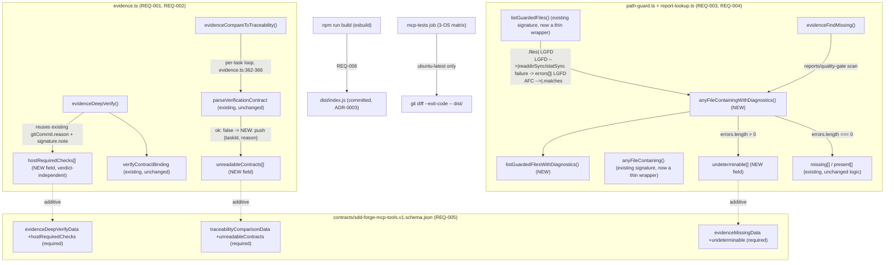

# Design: epic-136-phase4-mcp

Impl-Review-Status: Pending

Feature Type: api-only (additive MCP tool-response-contract change; no
frontend/UI; monorepo-nested TypeScript package `mcp/sdd-forge-mcp`)

## Technical Summary

Two independent, additive changes to `sdd-forge-mcp`'s existing read-only
tool surface, sharing one theme: make "could not read/verify" explicit and
distinguishable from "genuinely nothing here." REQ-001/002 (issue #131) add
`unreadableContracts` to `evidenceCompareToTraceability`'s response
(resolving the confirmed A-5 inconsistency with `evidenceDeepVerify`'s own
`mismatch`-reporting behavior for the identical condition, investigation.md
INV-001..003) and add a top-level `hostRequiredChecks` array to
`evidenceDeepVerify`'s response, re-surfacing its already-existing but
two-levels-nested signature/git-ancestry host-deferral caveats (INV-005).
REQ-003/004 (issue #132) add `listGuardedFilesWithDiagnostics` to
`path-guard.ts` (a new function; the existing `listGuardedFiles` becomes a
thin, behavior-preserving wrapper over it) and thread that diagnostic
capability through to `evidenceFindMissing`'s one directly-affected response
field, `undeterminable`. All 4 changes are additive to
`contracts/sdd-forge-mcp-tools.v1.schema.json` — the schema stays `v1`, no
tool is added/removed/renamed, and no existing field's meaning changes.

The guiding principle carried from `evidence-deep-verify`: no new field
invents a computation that duplicates or drifts from an existing one.
`hostRequiredChecks`' 2 entries reuse the ALREADY-COMPUTED
`gitCommit.reason`/`signature.note` strings verbatim; `unreadableContracts`
reuses the ALREADY-COMPUTED `parseVerificationContract` error message
verbatim; `undeterminable` reuses the ALREADY-COMPUTED
`listGuardedFilesWithDiagnostics` error list. Nothing in this feature adds a
new verification, a new cryptographic check, or a new allowlist/denylist
rule.

## Architecture



- No new MCP tool, no new tool name, no new zod input schema — all 4
  affected tools (`evidence_compare_to_traceability`, `evidence_deep_verify`,
  `evidence_find_missing`) keep their exact existing `{ feature, taskId? }`
  input contract.
- No new subprocess, no new network call, no new write path — every change
  is a pure-function addition inside the existing read-only, no-exec MCP
  boundary (security-spec.md).

## Components

| Component | Responsibility | Technology | New/Existing | Protected? |
|---|---|---|---|---|
| `mcp/sdd-forge-mcp/src/tools/evidence.ts` | `evidenceCompareToTraceability` gains `unreadableContracts`; `evidenceDeepVerify` gains `hostRequiredChecks`; `evidenceFindMissing` gains `undeterminable` (via `report-lookup.ts`'s new function) | TypeScript | Existing (extended) | no — absent from `PROTECTED_GATE_SUFFIXES` (investigation.md INV-018) |
| `mcp/sdd-forge-mcp/src/path-guard.ts` | new `listGuardedFilesWithDiagnostics`; existing `listGuardedFiles` refactored to a thin wrapper (byte-identical behavior, AC-006) | TypeScript | Existing (extended) | no |
| `mcp/sdd-forge-mcp/src/parsers/report-lookup.ts` | new `anyFileContainingWithDiagnostics`; existing `anyFileContaining` refactored to a thin wrapper | TypeScript | Existing (extended) | no |
| `mcp/sdd-forge-mcp/src/parsers/quality-report.ts`, `.../review-ticket.ts` | UNCHANGED — continue calling `listGuardedFiles` exactly as today (Non-goals; requirements.md AC-006) | TypeScript | Existing, untouched | no |
| `contracts/sdd-forge-mcp-tools.v1.schema.json` | `traceabilityComparisonData`/`evidenceDeepVerifyData`/`evidenceMissingData` each gain one new `required` property | JSON Schema | Existing (extended, additive) | no — `.github/workflows/test.yml` is the only protected entry anywhere near this feature's file set, and this feature does not touch it |
| `mcp/sdd-forge-mcp/dist/index.js` | rebuilt bundle (ADR-0003) | esbuild output | Existing (regenerated) | no |
| `mcp/sdd-forge-mcp/tests/evidence/evidence.test.ts`, `tests/tools/*`, and 1 new fixture for `listGuardedFilesWithDiagnostics` (design decision: co-located in `tests/path-security/`, matching that directory's existing scope) | golden/regression/contract-conformance coverage for all 4 new fields | node:test + ajv | Existing (extended) + 1 new file | no |
| `USERGUIDE.md`, `CHANGELOG.md` | doc-follow (3 tool rows) + 2 `## Unreleased` entries | Markdown | Existing (extended) | no |

Real surfaces exercised READ-ONLY, never modified in place: path-guard's
own `ALLOWLISTED_DIRECTORIES`/`DENYLISTED_BASENAMES` rules (BL-006, source
unchanged); `parseVerificationContract`'s existing failure taxonomy
(investigation.md INV-013, reused verbatim, not reimplemented).

## Protected-File Statement

Verified directly against `PROTECTED_GATE_SUFFIXES`
(`plugins/sdd-quality-loop/scripts/generated/guard-invariants.generated.js:5`,
re-confirmed byte-identical to investigation.md INV-018 at this design's
authoring time): every one of this feature's target files is a NEW or
existing UNPROTECTED file — `mcp/sdd-forge-mcp/src/tools/evidence.ts`,
`mcp/sdd-forge-mcp/src/path-guard.ts`,
`mcp/sdd-forge-mcp/src/parsers/report-lookup.ts`,
`mcp/sdd-forge-mcp/tests/*`, `mcp/sdd-forge-mcp/dist/index.js`,
`contracts/sdd-forge-mcp-tools.v1.schema.json` — none matches any
`PROTECTED_GATE_SUFFIXES` entry (the list's `tests/`-prefixed entries name
files at the repository-root `tests/` directory, a different path than
`mcp/sdd-forge-mcp/tests/`, confirmed no collision). This feature adds no
CI step and does not touch `.github/workflows/test.yml` at all, so its one
genuinely protected neighbor is entirely out of scope here. No human-copy
staging is used anywhere in this feature (requirements.md Roles and
Permissions, AC-015).

## Layer Specifications

| Layer | Summary | Canonical Detail | Owner | Status |
|---|---|---|---|---|
| UX | N/A — no change: no GUI or user-facing surface, consumer is an MCP client only | [UX specification](ux-spec.md) | maintainers | N/A |
| Frontend | N/A — no change: TypeScript/JSON-Schema-only backend package | [Frontend specification](frontend-spec.md) | maintainers | N/A |
| Infrastructure | no new deployment target; `dist/index.js` rebuild + existing dist-parity CI | [Infrastructure specification](infra-spec.md#cicd-sequence) | maintainers | Planned |
| Security | read-only/no-exec boundary preserved; no new signature/ancestry verification; no allowlist/denylist change | [Security specification](security-spec.md#trust-boundaries) | maintainers | Planned |

## Design System Compliance

N/A — ds_profile: none. Not a UI application; no mockup provided; optional
visualization skipped.

## Cross-Layer Dependencies

| From | To | Contract / Decision | REQ | AC | Verification |
|---|---|---|---|---|---|
| requirements.md | design.md (API/Contract Plan) | `unreadableContracts` field shape + per-task loop wiring | REQ-001 | AC-001, AC-002 | TEST-001, TEST-002 |
| requirements.md | design.md (API/Contract Plan) | `hostRequiredChecks` field shape, verdict-independence | REQ-002 | AC-003, AC-004 | TEST-003, TEST-004 |
| requirements.md | design.md (API/Contract Plan) | `listGuardedFilesWithDiagnostics` shape + wrapper preservation | REQ-003 | AC-005, AC-006 | TEST-005, TEST-006 |
| requirements.md | design.md (API/Contract Plan) | `undeterminable` field shape + `evidenceFindMissing` wiring | REQ-004 | AC-007, AC-008 | TEST-007, TEST-008 |
| requirements.md | contracts/sdd-forge-mcp-tools.v1.schema.json | 3 additive `required` field changes, `additionalProperties: false` preserved | REQ-005 | AC-009 | TEST-009 |
| requirements.md | infra-spec.md | dist rebuild + existing `mcp-tests` job, no new CI step | REQ-006 | AC-010 | TEST-010; [infra-spec.md#cicd-sequence](infra-spec.md#cicd-sequence) |
| requirements.md | design.md (Test Strategy) | new regression test closing investigation.md INV-004's gap; existing suites updated | REQ-007 | AC-011, AC-012 | TEST-011, TEST-012 |
| requirements.md | design.md | doc-follow (USERGUIDE.md, CHANGELOG.md) | REQ-008 | AC-013, AC-014 | TEST-013, TEST-014 |
| requirements.md | security-spec.md | read-only/no-exec boundary; no allowlist/denylist change; no signing-key read path | REQ-002, REQ-003 | AC-003, AC-005 | TEST-003, TEST-005; [security-spec.md#trust-boundaries](security-spec.md#trust-boundaries) |

## ADR Change Log

No new ADR. This feature introduces no new architectural pattern, no new
cryptographic decision, and no new vocabulary — it re-surfaces
already-computed values (`gitCommit.reason`, `signature.note`,
`parseVerificationContract`'s error message) through new, purely additive
response fields. `docs/adr/0008-evidence-deep-verify-no-signature-crypto.md`
and `docs/adr/0009-evidence-deep-verify-match-host-canonical-formulas.md`
remain `Status: Proposed` (investigation.md INV-016) and are neither
modified nor superseded by this feature — `hostRequiredChecks` restates,
rather than re-decides, the boundary those two ADRs already establish for
the already-shipped `evidence_deep_verify` implementation.
`docs/adr/0003-mcp-dist-bundle-distribution.md`'s dist-commit-and-CI-parity
policy is followed unchanged (Deployment / CI Plan below).

## Data Plan

**Data Entities:** none new — this feature adds response FIELDS to 3
existing, already-modeled tool outputs
(`TraceabilityComparisonData`/`EvidenceDeepVerifyData`/`EvidenceMissingData`,
all already defined in `mcp/sdd-forge-mcp/src/tools/evidence.ts`), plus one
new plain data shape (`GuardedListError`) in `path-guard.ts`. No new
persistent artifact, report, or ledger entry is introduced.

**Existing Data Affected:** none read differently. Every new field is
computed from data ALREADY read by the existing code path
(`parseVerificationContract`'s result, `gitCommit`/`signature`'s already-
computed sub-objects, `readdirSync`/`statSync`'s already-attempted calls) —
no new file is opened, no existing file is read a second time or with
different arguments.

**Migration Strategy:** none. No schema changes to any artifact OUTSIDE
`contracts/sdd-forge-mcp-tools.v1.schema.json`; that file's own 3 changes
are additive (new `required` properties on existing `$defs` entries), the
schema stays `v1` (Constraint Compliance below explains why a `required`,
not `optional`, property is still treated as backward-compatible in this
monorepo-nested-package context).

## API / Contract Plan

### `evidence_compare_to_traceability` (REQ-001)

New TypeScript shape (`mcp/sdd-forge-mcp/src/tools/evidence.ts`):

```ts
export interface UnreadableContract {
  taskId: string;
  reason: string;
}

export interface TraceabilityComparisonData {
  kind: "traceability-comparison";
  feature: string;
  matches: number;
  mismatches: TraceabilityMismatch[];
  unreadableContracts: UnreadableContract[];   // NEW
}
```

Wiring, inside the existing per-task loop (`evidence.ts:361-378`):

```ts
const unreadableContracts: UnreadableContract[] = [];
for (const taskId of knownTaskIds) {
  const contractResult = parseVerificationContract(root, feature, taskId);
  if (!contractResult.ok) {
    unreadableContracts.push({ taskId, reason: contractResult.error.message });
    continue; // no readable contract for this task -- nothing to cross-check
  }
  for (const check of contractResult.data.checks) {
    // unchanged
  }
}
```

`totalChecks`/`mismatches` are computed EXACTLY as before — the `continue`
still skips this task's `requirementIds` checks; only a NEW, additional
push into `unreadableContracts` is introduced. The response's
`ok({ ..., matches: totalChecks - mismatches.length, mismatches,
unreadableContracts })` gains the one new field.

### `evidence_deep_verify` (REQ-002)

```ts
export type HostRequiredCheckId = "git-commit-ancestry" | "signature-verification";

export interface HostRequiredCheck {
  check: HostRequiredCheckId;
  verified: false;
  note: string;
}

export interface EvidenceDeepVerifyData {
  kind: "evidence-deep-verify";
  feature: string;
  taskId: string;
  verdict: "pass" | "fail";
  artifacts: ArtifactVerifyResult[];
  invariants: DeepVerifyInvariants;
  signature: DeepVerifySignature;
  hostRequiredChecks: HostRequiredCheck[];   // NEW, always length 2
  failures: string[];
}
```

Computed once, from values ALREADY produced earlier in `evidenceDeepVerify`
(`evidence.ts:704-783`) — `gitCommit` (from `verifyGitCommit(bundle)`) and
`signature` (from `echoSignature(bundle)`) are both already local variables
before the function's final `ok({...})` call:

```ts
const hostRequiredChecks: HostRequiredCheck[] = [
  { check: "git-commit-ancestry", verified: false, note: gitCommit.reason },
  { check: "signature-verification", verified: false, note: signature.note },
];
```

`verdict`'s formula (`evidence.ts:777`,
`failures.length === 0 ? "pass" : "fail"`) and the `failures[]`-building loop
(`:746-771`) are BYTE-UNCHANGED — `hostRequiredChecks` is appended to the
final `ok({...})` object only, never consulted by the verdict computation.

**Schema description** (the new field's normative text, carrying issue
#131's requested policy statement — REQ-002/OQ-4):

> "Checks this tool cannot verify in-process (git commit ancestry, evidence
> bundle signature) — always exactly 2 entries, always `verified: false`.
> Promoted from the nested `invariants.gitCommit`/`signature` fields (both
> unchanged, still present) to make the host-deferred boundary visible at
> the top level. Policy: for `risk: critical` tasks, BOTH checks MUST be
> separately confirmed via host-side verification (a real git ancestry
> check and a real signature verification) before this bundle's evidence is
> treated as fully trustworthy for a Done transition. This MCP tool does
> NOT enforce that policy — it is read-only and performs no signature
> verification or git subprocess call (ADR-0008) — enforcement is a
> host-script/release-gate responsibility outside this tool. Never affects
> `verdict`."

### `path-guard.ts`: `listGuardedFilesWithDiagnostics` (REQ-003)

```ts
export interface GuardedListError {
  path: string;
  reason: string;
}

export interface GuardedListResult {
  files: string[];
  errors: GuardedListError[];
}

export function listGuardedFilesWithDiagnostics(
  root: SddRoot,
  relDir: string,
): GuardedListResult {
  const guardResult = resolveGuardedDirectory(root, relDir);
  if (!guardResult.ok) {
    return { files: [], errors: [{ path: relDir, reason: guardResult.error.message }] };
  }

  const files: string[] = [];
  const errors: GuardedListError[] = [];
  const walk = (absDir: string, relPrefix: string): void => {
    let entries: string[];
    try {
      entries = readdirSync(absDir);
    } catch (error) {
      errors.push({ path: relPrefix, reason: errorMessage(error) });
      return;
    }
    for (const entry of entries) {
      const absEntryPath = join(absDir, entry);
      const relEntryPath = relPrefix.length > 0 ? `${relPrefix}/${entry}` : entry;
      let stats: ReturnType<typeof statSync>;
      try {
        stats = statSync(absEntryPath);
      } catch (error) {
        errors.push({ path: relEntryPath, reason: errorMessage(error) });
        continue;
      }
      if (stats.isDirectory()) {
        walk(absEntryPath, relEntryPath);
      } else if (stats.isFile()) {
        files.push(relEntryPath);
      }
    }
  };

  walk(guardResult.data.resolvedPath, relDir.replace(/\/+$/, ""));
  return { files, errors };
}

/** Existing signature, existing behavior, byte-identical — now a thin wrapper. */
export function listGuardedFiles(root: SddRoot, relDir: string): string[] {
  return listGuardedFilesWithDiagnostics(root, relDir).files;
}
```

`errorMessage(error: unknown): string` is a small new private helper
(`error instanceof Error ? error.message : String(error)`) — the ONLY
genuinely new logic in this function; every other line is the EXISTING
`listGuardedFiles` walk, unindented and left otherwise untouched, with 2
`catch {}` blocks changed to `catch (error) { errors.push(...) }` (no
behavior change to the walk's own control flow: still `return`s past a
top-level `readdirSync` failure, still `continue`s past a per-entry
`statSync` failure — REQ-003 adds visibility, not a stricter walk, per
requirements.md Edge Cases).

### `report-lookup.ts`: `anyFileContainingWithDiagnostics` (REQ-004)

```ts
export interface DirectoryReadError {
  path: string;
  reason: string;
}

export function anyFileContainingWithDiagnostics(
  root: SddRoot,
  relDir: string,
  pattern: string,
): { matches: string[]; errors: DirectoryReadError[] } {
  const wordBoundary = new RegExp(`(^|[^A-Za-z0-9_-])${escapeRegExp(pattern)}([^A-Za-z0-9_-]|$)`);
  const { files, errors } = listGuardedFilesWithDiagnostics(root, relDir);
  const matches: string[] = [];
  for (const relFilePath of files) {
    const read = guardedRead(root, relFilePath);
    if (read.ok && wordBoundary.test(read.data.contents)) {
      matches.push(relFilePath);
    }
  }
  return { matches, errors };
}

/** Existing signature, existing behavior, byte-identical — now a thin wrapper. */
export function anyFileContaining(root: SddRoot, relDir: string, pattern: string): string[] {
  return anyFileContainingWithDiagnostics(root, relDir, pattern).matches;
}
```

`hasAnyFileMentioning`/`hasQualityGateVerdictPass` (`report-lookup.ts:43-57`)
are UNCHANGED — they keep calling the existing `anyFileContaining` wrapper.
`quality-report.ts`/`review-ticket.ts` are UNCHANGED (Non-goals; they keep
calling `listGuardedFiles` directly, never
`listGuardedFilesWithDiagnostics`).

### `evidence_find_missing` (REQ-004)

```ts
export interface EvidenceMissingData {
  kind: "evidence-missing";
  feature: string;
  taskId: string;
  required: string[];
  present: string[];
  missing: string[];
  undeterminable: string[];   // NEW
}
```

Wiring, replacing `evidence.ts:217-222`'s existing quality-gate block:

```ts
const undeterminable: string[] = [];
const qgScan = anyFileContainingWithDiagnostics(root, reportsDir, taskId);
if (qgScan.errors.length > 0) {
  undeterminable.push(QUALITY_GATE_REPORT_REQUIREMENT);
} else if (qgScan.matches.length > 0 && hasQualityGateVerdictPass(root, reportsDir, taskId)) {
  present.push(QUALITY_GATE_REPORT_REQUIREMENT);
} else {
  missing.push(QUALITY_GATE_REPORT_REQUIREMENT);
}
```

The `evidence-bundle`/`verification-contract` requirement checks
(`evidence.ts:205-215`, `guardedExists`-based single-file checks) are
UNCHANGED — `undeterminable` only ever gains an entry from the
directory-scan-based `quality-gate-report-pass` requirement, since the other
2 requirements are single-file existence checks with no directory-listing
step to fail ambiguously (requirements.md Field Definitions: today,
`undeterminable`'s vocabulary has exactly one possible member; the field's
shape is intentionally the same generic `string[]` as `required`, so a
FUTURE directory-scan-based requirement would not need its own new field).

### `contracts/sdd-forge-mcp-tools.v1.schema.json` (REQ-005)

3 additive diffs, each adding one `required` property to an existing
`$defs` entry (`additionalProperties: false` unchanged on every one):

```diff
   "traceabilityComparisonData": {
     ...
-    "required": ["kind", "feature", "matches", "mismatches"],
+    "required": ["kind", "feature", "matches", "mismatches", "unreadableContracts"],
     "properties": {
       ...
       "mismatches": { ... },
+      "unreadableContracts": {
+        "type": "array",
+        "items": {
+          "type": "object",
+          "additionalProperties": false,
+          "required": ["taskId", "reason"],
+          "properties": {
+            "taskId": { "$ref": "#/$defs/taskId" },
+            "reason": { "type": "string" }
+          }
+        }
+      }
     }
   }
```

```diff
   "evidenceDeepVerifyData": {
     ...
-    "required": ["kind", "feature", "taskId", "verdict", "artifacts", "invariants", "signature", "failures"],
+    "required": ["kind", "feature", "taskId", "verdict", "artifacts", "invariants", "signature", "hostRequiredChecks", "failures"],
     "properties": {
       ...
       "signature": { ... },
+      "hostRequiredChecks": {
+        "type": "array",
+        "items": {
+          "type": "object",
+          "additionalProperties": false,
+          "required": ["check", "verified", "note"],
+          "properties": {
+            "check": { "enum": ["git-commit-ancestry", "signature-verification"] },
+            "verified": { "const": false },
+            "note": { "type": "string" }
+          }
+        }
+      },
       "failures": { ... }
     }
   }
```

```diff
   "evidenceMissingData": {
     ...
-    "required": ["kind", "feature", "taskId", "required", "present", "missing"],
+    "required": ["kind", "feature", "taskId", "required", "present", "missing", "undeterminable"],
     "properties": {
       ...
       "missing": { "type": "array", "items": { "type": "string" } },
+      "undeterminable": { "type": "array", "items": { "type": "string" } }
     }
   }
```

`$id` (`https://sdd-forge.dev/contracts/sdd-forge-mcp-tools.v1.schema.json`)
and `$schema` are unchanged — the contract stays `v1`.

## Test Strategy

1. TEST-001/TEST-011 (the same fixture, satisfying both REQ-001's forward
   field assertion and REQ-007's coverage-gap closure): a synthetic feature
   with 2+ Done tasks in `tasks.md`, one with a valid `T-NNN.contract.json`
   and one with NO contract file at all (or a deliberately malformed one).
   Assert `unreadableContracts` names exactly the second task with the
   `parseVerificationContract` error message, and that `matches`/
   `mismatches` reflect only the first task's checks — closing
   investigation.md INV-004's previously-uncovered branch.
2. TEST-003/TEST-004: reuse the EXISTING `evidence_deep_verify` golden/
   synthetic fixtures already present in `tests/tools/` (a pass-verdict real
   bundle, a deliberately-tampered fail-verdict bundle) — no new bundle
   fixture is needed, only a new assertion appended to each existing test
   case, confirming `hostRequiredChecks`' shape and that `verdict` is
   unaffected.
3. TEST-005/TEST-006: a NEW file
   (`mcp/sdd-forge-mcp/tests/path-security/list-guarded-files-diagnostics.test.ts`,
   matching that directory's existing scope, `tests/path-security/denylist.test.ts` /
   `traversal-and-symlink.test.ts`) drives `listGuardedFilesWithDiagnostics`
   directly against 3 mktemp-scoped fixtures (empty-but-readable directory;
   a `relDir` outside the allowlist; a directory containing an entry that
   fails `statSync`, e.g. a dangling symlink target where the host permits
   constructing one) — reusing `tests/path-security/traversal-and-symlink.test.ts`'s
   own established symlink-fixture technique rather than inventing a new
   one. TEST-006 additionally re-runs every existing fixture from
   `report-lookup.ts`/`quality-report.ts`/`review-ticket.ts`'s OWN test
   suites through `listGuardedFilesWithDiagnostics(...).files` and diffs
   against `listGuardedFiles(...)`'s output for byte-identity.
4. TEST-007/TEST-008: extend the EXISTING `evidence_find_missing` test block
   (`evidence.test.ts:212-333`) with one new fixture (a task whose
   `reports/quality-gate` directory is deliberately made unlistable — e.g. a
   denylisted-basename collision or a removed directory referenced via a
   raw `resolveGuardedDirectory` failure path) asserting `undeterminable`,
   and re-running the EXISTING "no verification artifacts" fixture
   (`evidence.test.ts:275`) unmodified to confirm `undeterminable` stays
   `[]` there.
5. TEST-009: extend
   `mcp/sdd-forge-mcp/tests/tools/deep-verify-contract-conformance.test.ts`'s
   established pattern (real ajv `getEnvelopeValidator()`, `strict: true`)
   to also cover `evidence_compare_to_traceability` and
   `evidence_find_missing`'s ok responses (today that suite covers only
   `evidence_deep_verify` plus the shared error envelopes, per its own
   header doc, investigation.md INV-019) — this feature's own 3 changed
   shapes are exercised by the SAME real-parser harness, not a new one.
6. No runtime-budget assertion is added: every new test is pure
   fixture-driven function/unit testing, comparable in cost to the existing
   suites in the same directories.
7. Full suite: `npm test` inside `mcp/sdd-forge-mcp` locally; the 3-OS
   `mcp-tests` CI job is authoritative (Deployment / CI Plan).

## Design Decisions (resolving open questions)

- OQ-1 -> single field `unreadableContracts` on `traceabilityComparisonData`
  (API/Contract Plan above), not two overlapping fields
  (`skippedContracts`+`unreadableContracts`) for the identical task set —
  issue #131's own text floats both names without committing to one; this
  design picks ONE to avoid the DRY violation two arrays describing the
  same set would create, and to avoid forcing every future consumer to
  reconcile which of two fields is authoritative. Placed as a new field on
  the v1 schema (task brief's option (A)) rather than folded into
  `mismatches` (option (B) — would change `mismatches`' existing counting
  semantics, directly conflicting with BL-004's own stated risk) or unified
  into `crossBindings` (option (C) — `crossBindings` belongs to
  `evidenceDeepVerifyData`, a structurally different response shape this
  tool's schema entry does not share).
- OQ-1 (sub-decision, within option (A)) -> `unreadableContracts` is a
  `required` field, not `optional`. BL-004 names the exact risk this
  decision addresses: an existing consumer may already judge
  `evidenceCompareToTraceability`'s output by `mismatches.length` alone. An
  `optional` field could be silently absent from an old cached response
  shape and never observed; a `required` field forces every schema-strict
  validation (AC-009) to notice the new field exists, even if a specific
  consumer chooses not to read it. Since implementation and schema are a
  single monorepo-nested package deployed atomically (never independently
  versioned against external clients), a `required` field is not a breaking
  change for THIS project the way it would be for a public, independently
  versioned API.
- OQ-2 -> new function + thin wrapper (API/Contract Plan): `listGuardedFilesWithDiagnostics`
  is genuinely new; `listGuardedFiles` keeps its EXACT existing signature
  and becomes a 1-line wrapper. A flag argument (option (B)) was rejected
  because it would force every one of the 3 existing call sites to either
  pass an explicit `false`/default value forever, or be silently upgraded
  to diagnostics-returning behavior they never asked for and are not typed
  to handle (`string[]` vs. `{files, errors}` are not interchangeable
  return types) — a wrapper function achieves the same compatibility goal
  with zero risk of an accidental caller-side type mismatch.
- OQ-3 -> separate field, never mixed into `missing` (API/Contract Plan,
  `evidence_find_missing` section): `undeterminable` is populated ONLY when
  the directory scan itself failed; `missing` keeps its EXACT existing
  meaning ("the scan succeeded and found nothing"). This is the more
  conservative of the task brief's own two framings and directly closes
  investigation.md INV-009's named ambiguity.
- OQ-4 -> documentation-only policy, verdict-independent (API/Contract Plan,
  `evidence_deep_verify` schema description): the "critical tasks require
  host-side verification" policy is stated as SCHEMA TEXT, not new
  enforcement code. Two reasons this design does not add enforcement: (1)
  `evidence_deep_verify` is read-only/no-exec by ADR-0008 — it has no
  mechanism to "require" anything of a caller, only to report; (2) making
  `hostRequiredChecks` influence `verdict` would violate BL-005 (`verdict`
  is currently driven by a closed, fully-enumerated set of inputs) for a
  concern (signature/ancestry) that is BY DEFINITION never checked
  in-process — a verdict that could fail on an input the tool itself never
  verifies would be actively misleading, the opposite of this feature's own
  goal.
- New decision (not carried from an investigation OQ): WHERE the new
  `listGuardedFilesWithDiagnostics` test file lives. Decided:
  `tests/path-security/list-guarded-files-diagnostics.test.ts` — that
  directory already owns `path-guard.ts`'s own allowlist/denylist/traversal
  test coverage (`denylist.test.ts`, `traversal-and-symlink.test.ts`); a new
  diagnostics-focused sibling file keeps ownership co-located rather than
  splitting `path-guard.ts` coverage across directories.
- New decision: whether `quality-report.ts`/`review-ticket.ts` should ALSO
  be wired through `listGuardedFilesWithDiagnostics` in this feature.
  Decided: NO (Non-goals; investigation.md's own new Open Question) —
  `qualityGateSummaryData`/`reviewTicketsData` are separately
  `additionalProperties: false` and, by pre-existing design
  (`core.ts:222`,`:242-243`), already drop even PER-FILE parse failures at
  the tool level; wiring directory-level diagnostics through those two
  tools would require its own schema migration for shapes neither issue
  #131 nor #132's acceptance criteria names, and is recorded as a follow-on
  issue candidate instead.

## Global Constraints

- `contracts/sdd-forge-mcp-tools.v1.schema.json` — all 3 diffs land in ONE
  commit/PR alongside their corresponding TypeScript interface changes
  (never a schema-only or implementation-only partial land) — enforced by
  AC-009's ajv conformance tests, which fail immediately if either side
  drifts from the other.
- `mcp/sdd-forge-mcp/dist/index.js` — rebuilt (`npm run build`) and
  committed in the SAME commit as any `src/` change (REQ-006; ADR-0003) —
  never a separate follow-up commit, since CI's dist-parity step would fail
  red between the two.
- No task in this feature is blocked, in-spec, on another — REQ-001/002
  (issue #131) and REQ-003/004 (issue #132) touch disjoint functions in the
  same file (`evidence.ts`) plus 2 files `evidence.ts` does not otherwise
  touch (`path-guard.ts`, `report-lookup.ts`); Phase 2 task decomposition
  may sequence them in either order or in parallel.
- `USERGUIDE.md`'s 3 affected rows (`:96,98,99`) are edited directly — not
  human-copy staged (`USERGUIDE.md` is not `PROTECTED_GATE_SUFFIXES`-listed,
  investigation.md INV-018/AC-015).

## Security Boundaries

| Trust Boundary | Auth/Authz Mechanism | Data Classification | OWASP Concerns |
|---|---|---|---|
| B1: new `reason`/`note` strings vs. secret material | every new string is EITHER an existing path-guard/JSON-parse error message (already reviewed, already produced by the pre-existing code path) OR a verbatim reuse of an already-computed, already-non-secret `gitCommit.reason`/`signature.note` string — no new code path reads `SDD_EVIDENCE_KEY`/`SDD_EVIDENCE_KEY_FILE`/`~/.sdd/evidence-key` | internal repository paths and parse-error text only | Information Disclosure (mitigated: no new read path, no secret-bearing source) |
| B2: `listGuardedFilesWithDiagnostics` vs. the filesystem | read-only (`readdirSync`/`statSync` only); `ALLOWLISTED_DIRECTORIES`/`DENYLISTED_BASENAMES` unchanged (BL-006) | internal repository content only | Broken Access Control (mitigated: identical allowlist/denylist enforcement to the existing `listGuardedFiles`, no new bypass surface) |
| B3: `hostRequiredChecks`' policy text vs. actual enforcement | the field is advisory metadata only; `evidence_deep_verify` remains read-only/no-exec (ADR-0008); no verdict-gating logic reads this field | internal, non-secret | Security Misconfiguration (mitigated: no false sense of enforcement — the schema description explicitly states the tool does not enforce the policy it documents) |

Details: [Security specification](security-spec.md#trust-boundaries).

## External Integrations

None. Every change operates entirely on repository-local files already
read by the existing implementation — no new network call, external API, or
credential.

## Deployment / CI Plan

No runtime deployment. This feature adds NO new CI step and touches NO
protected file — the existing `mcp-tests` job
(`.github/workflows/test.yml:385-432`, 3-OS matrix: `npm ci` -> `tsc
--noEmit` -> `npm test`, `ubuntu-latest`-only dist-parity + `npm audit`)
exercises this feature's changes without modification. Every `src/` change
in this feature is accompanied, in the SAME commit, by a regenerated
`dist/index.js` (`npm run build`, ADR-0003) — until that commit lands, the
`ubuntu-latest` leg's `git diff --exit-code -- dist/` step would fail red,
the designed fail-closed state (mirroring `evidence-deep-verify`'s own
established Deployment/CI Plan precedent). Rollback: since the contract
change is purely additive (3 new `required` fields, no removed/renamed
field, no removed tool), a single reviewed revert of this feature's commit
returns both the schema and the implementation to their pre-feature state
together — no partial-revert hazard, since schema and implementation always
land in the same commit (Global Constraints).

## Constraint Compliance

| Requirement Constraint | Design Response |
|---|---|
| baseline preservation (BL-001..BL-006, requirements.md Constraints) | every new field is additive and computed alongside, never in place of, an existing computation; `verdict` (BL-005), `listGuardedFiles`'s signature (BL-003), and the allowlist/denylist (BL-006) are all byte-unchanged; TEST-004/TEST-006 are the direct regression proofs |
| read-only / no-exec (`evidence_deep_verify`, `evidence_compare_to_traceability`, `listGuardedFilesWithDiagnostics`) | no new `fs` write API, no `child_process`/`exec`/`spawn`, no new network call anywhere in this feature's diff |
| additive v1 contract (REQ-005) | 3 `required` property additions, each with `additionalProperties: false` preserved on every new nested object; `$id`/`$schema` unchanged |
| host-deferred signature/ancestry boundary (ADR-0008) | `hostRequiredChecks` reuses, never recomputes, the existing `verified: false` values; no new crypto or git subprocess call is added |
| doc-following in same PR/commit-set | REQ-008's `USERGUIDE.md`/`CHANGELOG.md` updates (AC-013/AC-014) |
| version bump via `scripts/bump-version.sh` only | this feature makes no version-literal edit anywhere |
| protected-file avoidance | design.md Protected-File Statement — zero `PROTECTED_GATE_SUFFIXES` matches among this feature's target files, re-verified at AC-015 |

## Assumptions

Carried from requirements.md Assumptions (WFI-013 discipline; re-verified at
implementation start, not assumed permanently true from this design's
authoring-time snapshot): `PROTECTED_GATE_SUFFIXES`'s exact membership;
`ADR-0008`/`ADR-0009`'s `Status: Proposed` (non-blocking for this
purely-additive feature); `CHANGELOG.md`'s currently-empty `## Unreleased`
section; the `mcp-tests` CI job's current 3-OS/dist-parity shape.

## Open Questions

None blocking. All 4 of requirements.md's OQ-1..OQ-4 are resolved above
with concrete field shapes and rationale. investigation.md's own new Open
Question (widening scope to `list_review_tickets`/`get_quality_gate_summary`)
is resolved here as a Non-goal / follow-on issue candidate, not a decision
this design defers.

## Risks

Principal risk is the 3-shape-simultaneous schema change (Global
Constraints) landing with one shape's TypeScript interface out of sync with
its schema diff — mitigated by AC-009's ajv conformance tests being a hard
Done condition for every one of REQ-001/002/003/004, not a final
housekeeping pass. Secondary risk is `hostRequiredChecks`' verbatim string
reuse silently drifting if `gitCommit.reason`/`signature.note`'s own wording
changes in a future, unrelated edit without a corresponding
`hostRequiredChecks` test update — mitigated by TEST-003 asserting
`hostRequiredChecks[].note` against the SAME fixture's `invariants.gitCommit.reason`/
`signature.note` values directly (equality assertion, not a hand-copied
literal), so any future drift in the underlying string is caught
automatically rather than requiring a maintainer to remember the
duplication exists. Tertiary risk is the deferred
`list_review_tickets`/`get_quality_gate_summary` follow-on (Design
Decisions) never actually being filed as an issue once this feature ships —
mitigated by requiring the implementation report to name it explicitly
(mirroring `epic-136-phase3`'s own discipline of recording deferred scope
decisions in the implementation report rather than only in the spec).
