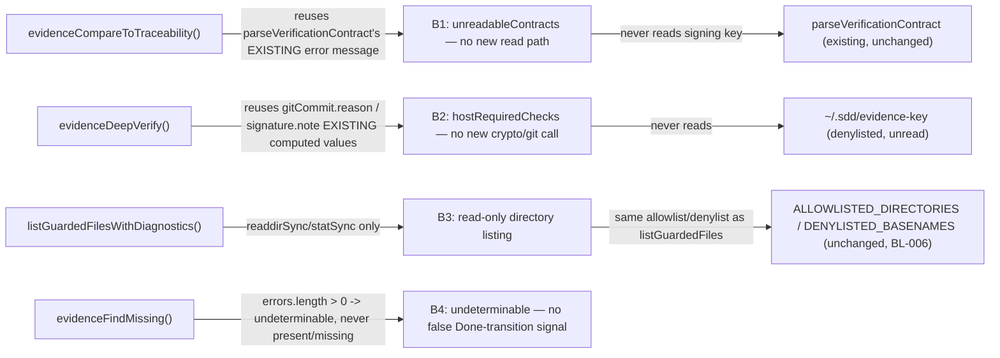

# Security Specification: epic-136-phase4-mcp

Impact assessment is required for this feature class: it touches
`evidence.ts` (which already carries a hard no-signature-read /
no-signature-verify boundary, ADR-0008) and `path-guard.ts` (the single
choke point for every filesystem read `sdd-forge-mcp` performs,
security-spec.md B2 in this repository's own MCP baseline). The primary
security-relevant risk this feature must avoid is scope creep: adding a new
diagnostic field must not, even incidentally, introduce a new read path, a
new write path, a new signature/ancestry verification claim, or a change to
the allowlist/denylist rules `path-guard.ts` already enforces.

## Trust Boundaries

| Boundary | Source | Destination | Assets | Validation | AuthN/AuthZ | REQ | AC |
|---|---|---|---|---|---|---|---|
| B1 | `evidenceCompareToTraceability`'s per-task loop | `unreadableContracts[]` response field | task-contract read-failure reason text | `reason` is the VERBATIM, already-produced `parseVerificationContract` error message (`Result.error.message`) — no new file is opened, no new error-message construction that could leak additional detail | read-only, allowlist-bounded (`path-guard.ts`, unchanged) | REQ-001 | AC-001, AC-002 |
| B2 | `evidenceDeepVerify`'s already-computed `gitCommit`/`signature` locals | `hostRequiredChecks[]` response field | host-deferral explanatory text | `note` is a VERBATIM reuse of `gitCommit.reason`/`signature.note`, both already produced by pre-existing, already-reviewed code with no signing-key read (path-guard's `isDenylisted`/`evidenceKeyPath`, unchanged) | no new crypto call, no new git subprocess | REQ-002 | AC-003, AC-004 |
| B3 | `listGuardedFilesWithDiagnostics` | `errors[]` response field (via `GuardedListError`) | filesystem read-failure reason text (`readdirSync`/`statSync` error messages) | read-only (`readdirSync`/`statSync` only, identical call sites to the existing `listGuardedFiles`); `ALLOWLISTED_DIRECTORIES`/`DENYLISTED_BASENAMES` unchanged — a guard-denial's `errors[]` entry is the SAME `resolveGuardedDirectory` error message already produced today, now surfaced instead of discarded | filesystem read-only; write access confined to whatever the caller's own environment already permits (this feature adds no write) | REQ-003 | AC-005, AC-006 |
| B4 | `evidenceFindMissing`'s `reports/quality-gate` scan | `undeterminable[]` response field | Done-transition-requirement classification integrity | a directory-scan failure is NEVER folded into `missing` (which a caller could read as "task incomplete") — it is isolated to `undeterminable`, preventing a false negative Done-transition signal caused purely by an environment/permissions problem | read-only | REQ-004 | AC-007, AC-008 |

## STRIDE Analysis

| Boundary | Threat | STRIDE | Abuse Case | Mitigation | Verification | REQ | AC |
|---|---|---|---|---|---|---|---|
| B1 | `unreadableContracts[].reason` is implemented by hand-constructing a NEW error string (rather than reusing `parseVerificationContract`'s existing one) that inadvertently includes more path/environment detail than the existing, already-reviewed error messages do | Information Disclosure | a careless implementation interpolates an absolute path or additional filesystem detail into a new error string, when the existing `Result.error.message` convention already keeps messages repo-relative and non-sensitive | design.md's API/Contract Plan mandates VERBATIM reuse of `contractResult.error.message` — no new string template | code review + TEST-001 (asserts `reason` equals the underlying `parseVerificationContract` error message exactly) | REQ-001 | AC-001 |
| B2 | `hostRequiredChecks`' schema description or `note` text is worded in a way that could be misread as "this tool DOES verify these" rather than "this tool explicitly does NOT verify these" | Spoofing (of assurance) | a consumer (human or agent) sees `hostRequiredChecks` present in a `pass`-verdict response and assumes signature/ancestry were checked, when they were not | every entry's `verified` field is `const: false` in the schema (machine-checkable, not just a prose claim); the schema description explicitly states the tool does NOT enforce or verify these; `verdict`'s formula is provably independent of this field (AC-004) | TEST-003/TEST-004 (schema conformance + verdict-independence regression) | REQ-002 | AC-003, AC-004 |
| B3 | `listGuardedFilesWithDiagnostics`'s new `errors[]` path is implemented such that a caught `readdirSync`/`statSync` error's message leaks an absolute filesystem path outside the intended repo-relative convention, or such that the new function accidentally widens the allowlist (e.g. by catching and swallowing a denylist check instead of a genuine I/O error) | Information Disclosure / Elevation of Privilege | a naive refactor moves the `isAllowlisted`/`isDenylisted` checks inside the new `try`/`catch`, causing a denylist rejection to be silently reinterpreted as a mere I/O error rather than a hard deny | design.md's API/Contract Plan keeps `resolveGuardedDirectory`'s allowlist/denylist check OUTSIDE and BEFORE the new `errors`-collecting `try`/`catch` blocks, byte-identical position to the existing `listGuardedFiles`; `errors[].reason` is the raw `Error.message` from `readdirSync`/`statSync`, which Node.js's own `fs` errors already render as repo-relative-ish paths under normal operation, consistent with every other path-guard error message in this codebase | code review + TEST-005 (guard-validation-failure sub-case is asserted BEFORE any walk begins, proving the denylist/allowlist check still short-circuits first) + TEST-006 (byte-identity regression against every existing caller's fixtures, which would catch an accidental allowlist widening) | REQ-003 | AC-005, AC-006 |
| B4 | `evidenceFindMissing`'s new `undeterminable` branch is implemented such that a GENUINE `missing` case (no report ever produced) is misclassified as `undeterminable` (or vice versa), silently weakening the existing Done-evidence gate `check-task-state.sh`'s `validateDoneEvidence` mirrors | Tampering (of a Done-transition safety signal) | an implementation bug causes every quality-gate-report check to report `undeterminable` regardless of whether the directory was genuinely scannable, masking real missing-evidence cases behind a permanently "cannot determine" status that a downstream consumer might treat as non-blocking | `undeterminable` is populated ONLY from `anyFileContainingWithDiagnostics`'s `errors.length > 0` branch — the pre-existing, already-tested "empty directory, successfully scanned" fixture (`evidence.test.ts:275`) is re-run UNMODIFIED and must still classify as `missing` (AC-008), directly proving the two branches remain distinct | TEST-007 (positive: scan-failure -> `undeterminable`) + TEST-008 (negative regression: scan-success-but-empty -> `missing`, unchanged) | REQ-004 | AC-007, AC-008 |

## Authorization

| Actor / Role | Resource | Action | Decision Point | Default | Denial Evidence | REQ | AC |
|---|---|---|---|---|---|---|---|
| `evidence_compare_to_traceability` / `evidence_deep_verify` / `evidence_find_missing` (MCP tool, any client) | `specs/<feature>/verification/*.contract.json`, `reports/quality-gate/*` | read | `path-guard.ts` allowlist/denylist (unchanged) | allow (read-only, allowlist-bounded) | existing `Result` error envelope (`not-found`/`path-denied`/`cannot-parse`), now additionally surfaced via `unreadableContracts`/`undeterminable` instead of silently dropped | REQ-001, REQ-004 | AC-001, AC-007 |
| any agent session | `~/.sdd/evidence-key`, `SDD_EVIDENCE_KEY`/`SDD_EVIDENCE_KEY_FILE` | read | `path-guard.ts` denylist (`isDenylisted`/`evidenceKeyPath`, unchanged) | deny | this feature adds no new code path that could reach the key; `hostRequiredChecks` reuses only already-computed, already-non-secret strings | n/a (no new path) | n/a |
| task implementer | `mcp/sdd-forge-mcp/src/tools/evidence.ts`, `src/path-guard.ts`, `src/parsers/report-lookup.ts`, `mcp/sdd-forge-mcp/tests/*`, `mcp/sdd-forge-mcp/dist/index.js`, `contracts/sdd-forge-mcp-tools.v1.schema.json` | write | design constraint (none is `PROTECTED_GATE_SUFFIXES`-listed, re-verified) | allow | n/a | REQ-001..006 | AC-001..010, AC-015 |
| any agent session | `.github/workflows/test.yml` | write | `PROTECTED_GATE_SUFFIXES` (hook guard) | deny — this feature never attempts a write here (no new CI step, infra-spec.md CI/CD Sequence) | `sdd-hook-guard.py` PreToolUse denial (not exercised in normal operation, since no task in this feature attempts this write) | n/a | n/a |

## Data Classification and Protection

| Entity | Classification | At Rest | In Transit | Retention | Deletion | Access Log | REQ | AC |
|---|---|---|---|---|---|---|---|---|
| `unreadableContracts[].reason`, `undeterminable`, `GuardedListError.reason` | internal, repo-relative error-message text (no PII/secret) | not persisted — computed per tool call | MCP stdio response only | call lifetime | n/a (not stored) | n/a | REQ-001, REQ-003, REQ-004 | AC-001, AC-005, AC-007 |
| `hostRequiredChecks[].note` | internal, non-secret (verbatim reuse of existing `gitCommit.reason`/`signature.note`) | not persisted — computed per tool call | MCP stdio response only | call lifetime | n/a | n/a | REQ-002 | AC-003 |
| updated `contracts/sdd-forge-mcp-tools.v1.schema.json` | internal, committed schema (public within the repository, not secret) | repository | local only | repo lifetime | reviewed revert | git history | REQ-005 | AC-009 |

No secret, token, or credential appears anywhere in fixtures, source, or
response fields produced by this feature. None reads or writes
`SDD_EVIDENCE_KEY`, `SDD_SUDO_KEY`, or any `.env`-class credential — none of
this feature's new code paths touch the consent-gate, key-material read
path, or sanitization logic any existing script already owns.

## OWASP Mapping

| OWASP Risk | Exposure | Control | Verification | Owner |
|---|---|---|---|---|
| Information Disclosure (new error-message surfacing) | `unreadableContracts`/`undeterminable`/`errors[]` now surface previously-silent failure text | every new string is a VERBATIM reuse of an already-existing, already-reviewed error message (never a new template) | code review + TEST-001, TEST-005 | maintainers |
| Security Misconfiguration (false sense of enforcement) | `hostRequiredChecks`' documented policy could be misread as enforced | `verified: const false` machine-checkable in schema; verdict-independence proven by regression test | TEST-003, TEST-004 | maintainers |
| Broken Access Control (guard bypass via the new diagnostics path) | `listGuardedFilesWithDiagnostics` accidentally reordering or weakening the allowlist/denylist check relative to the existing `listGuardedFiles` | allowlist/denylist check stays OUTSIDE and BEFORE the new error-collecting `try`/`catch` (design.md API/Contract Plan); byte-identity regression against every existing caller | TEST-005, TEST-006 | maintainers |
| Tampering (Done-transition safety signal) | `undeterminable` misclassifying a genuine `missing` case, weakening the existing Done-evidence gate | `missing`'s pre-existing "empty, successfully scanned" fixture re-run unmodified, proving no reclassification of that case | TEST-008 | maintainers |

## Secrets Management

No secret is added, read, or logged by this feature. None reads a `.env`
file or any `SDD_SUDO_KEY`/`SDD_EVIDENCE_KEY`-class credential. Every new
field's content is either a repo-relative path/error-message string or a
verbatim reuse of an already-non-secret computed value (Data Classification
above).

## Security Tests

| Test | Boundary | Attack / Control | Expected Result | Evidence | AC |
|---|---|---|---|---|---|
| TEST-001 | B1 | `reason` text equality against the underlying `parseVerificationContract` error message (no new string construction) | `unreadableContracts[].reason` matches `contractResult.error.message` exactly, byte-for-byte | `mcp/sdd-forge-mcp/tests/evidence/evidence.test.ts` | AC-001 |
| TEST-003, TEST-004 | B2 | `hostRequiredChecks`' `verified: false` schema conformance + verdict-independence regression | schema validation passes only with `verified: false`; `verdict` unchanged across pass/fail fixtures with `hostRequiredChecks` varying only in `note` text | `mcp/sdd-forge-mcp/tests/tools/*` | AC-003, AC-004 |
| TEST-005 | B3 | guard-validation-failure sub-case fires BEFORE any `readdirSync` walk begins (allowlist/denylist check ordering) | `errors` contains the guard-denial reason; `files` is `[]`; no walk-level `readdirSync` call is attempted for a `relDir` that never passes the allowlist check | `mcp/sdd-forge-mcp/tests/path-security/list-guarded-files-diagnostics.test.ts` (new) | AC-005 |
| TEST-006 | B3 | byte-identity regression across every existing `listGuardedFiles` caller's existing fixtures | `listGuardedFiles(...)` output unchanged for every pre-existing fixture in `report-lookup.ts`/`quality-report.ts`/`review-ticket.ts`'s own suites | same new file + existing suites, unmodified | AC-006 |
| TEST-008 | B4 | negative regression: a genuinely empty, successfully-scanned `reports/quality-gate` still classifies as `missing`, never `undeterminable` | existing fixture `evidence.test.ts:275` passes unmodified; `undeterminable` asserted `[]` | `mcp/sdd-forge-mcp/tests/evidence/evidence.test.ts` | AC-008 |

## Open Questions

None security-blocking. investigation.md's own new Open Question (whether
`list_review_tickets`/`get_quality_gate_summary` should ALSO gain
diagnostic surfacing) carries no unresolved security implication for the
feature AS SCOPED here — see requirements.md Non-goals / design.md Design
Decisions for the scope resolution.
