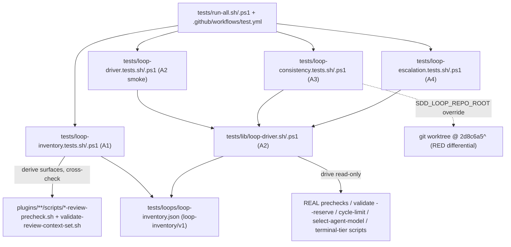

# Design: epic-159-pillar-a

Impl-Review-Status: Pending
Feature Type: deterministic test infrastructure (loop-cap consistency harness)

## Technical Summary

Four additive test-infrastructure deliverables in strict dependency order
A1 → A2 → {A3, A4}: a machine-readable loop inventory with a
registration-forcing suite (A1), a shared source-style loop driver that
exercises the REAL prechecks and the REAL authorization validator on
mktemp-isolated fixtures (A2), a loop-consistency suite that regression-locks
the 2d8c6a5 impl-review round>1 fix with a recorded RED differential (A3),
and a quality-gate escalation leg plus template⇔gate parity extension (A4).
The guiding principle mirrors epic-136-phase1-guards: no safety property is
asserted by reimplementation — the harness drives the real enforcement
binaries and proves its own ability to turn red.

## Architecture



## Components

| Component | Responsibility | Technology | New/Existing | Protected? |
|---|---|---|---|---|
| `tests/loops/loop-inventory.json` | single registry of loop state machines (`loop-inventory/v1`) | JSON | new | no |
| `tests/loop-inventory.tests.sh` / `.ps1` | registration forcing, cap-drift lock, vocabulary lock, self-registration grep | Bash / PowerShell | new | no |
| `tests/lib/loop-driver.sh` / `.ps1` | `loop_fixture_init`, `drive_review_round`, `assert_artifacts_schema`, `assert_terminal` (source-style, INV-008/INV-009) | Bash / PowerShell | new | no |
| `tests/loop-driver.tests.sh` / `.ps1` | A2 smoke: spec-review rounds 1→3 + fixture/negative self-checks | Bash / PowerShell | new | no |
| `tests/loop-consistency.tests.sh` / `.ps1` | spec/impl/task/domain rounds 1→3, bidirectional invariant, RED differential leg | Bash / PowerShell | new | no |
| `tests/loop-escalation.tests.sh` / `.ps1` | cycle-limit → escalation → terminal-tier → resume chain; parity extension | Bash / PowerShell | new | no |
| `tests/run-all.sh` / `.ps1` | suite registration | Bash / PowerShell | existing, edited | no (verified) |
| `.github/workflows/test.yml` | CI wiring (3-OS, bash+pwsh lanes) | GitHub Actions YAML | existing, edited | no (verified) |

Real gate surfaces exercised READ-ONLY (never modified):
`plugins/sdd-review-loop/scripts/{spec,impl,task,domain}-review-precheck.sh`
(+ existing `.ps1` twins where present),
`plugins/sdd-quality-loop/scripts/validate-review-context-set.sh`/`.ps1`,
`plugins/sdd-quality-loop/scripts/check-quality-gate-cycle-limit.sh`/`.ps1`,
`plugins/sdd-implementation/scripts/select-agent-model.sh`/`.ps1`,
`plugins/sdd-implementation/scripts/check-terminal-tier-resume.sh`/`.ps1`,
`contracts/terminal-tier-blocked-state.schema.json`,
`plugins/sdd-implementation/templates/implementation-report.template.md`.

## Protected-File Statement

No protected-gate-file modification is needed anywhere in this feature. All
deliverables are new files under `tests/`, plus registration edits to
`tests/run-all.sh`, `tests/run-all.ps1`, and `.github/workflows/test.yml` —
none of which appear in `_PROTECTED_GATE_SUFFIXES`
(`sdd-hook-guard.py:886-927`; the only protected `tests/` entries are
`gates.tests.sh`, `eval.tests.sh`, `guard-parity.tests.sh`,
`constant-parity.tests.sh`, which this feature does not touch). Rule stated
for completeness: IF any wiring were ever to require touching a protected
file, the epic-136 human-copy procedure applies — the agent stages the full
corrected file under `specs/epic-159-pillar-a/human-copy/` with a SHA-256
manifest, and only the human copies it into place.

## Layer Specifications

| Layer | Summary | Canonical Detail | Owner | Status |
|---|---|---|---|---|
| UX | N/A — no change: no GUI or user-facing surface | [UX specification](ux-spec.md#scope-and-user-journeys) | maintainers | N/A |
| Frontend | N/A — no change: shell/PowerShell/JSON test infrastructure only | [Frontend specification](frontend-spec.md#technology-stack) | maintainers | N/A |
| Infrastructure | CI suite registration on the existing 3-OS matrix; deterministic lane | [Infrastructure specification](infra-spec.md#cicd-sequence) | maintainers | Planned |
| Security | fixture isolation, non-decreasing gate guarantee, hook-guard payload constraints | [Security specification](security-spec.md#trust-boundaries) | maintainers | Planned |

## Design System Compliance

N/A — ds_profile: none. Not a UI application; no mockup provided; optional
visualization skipped.

## Cross-Layer Dependencies

| From | To | Contract / Decision | REQ | AC | Verification |
|---|---|---|---|---|---|
| requirements.md | design.md | `loop-inventory/v1` schema is the single loop registry; `cap_source` axis | REQ-001 | AC-001..003 | TEST-001..003 |
| design.md | #125 (future) | `fixture_profiles` vocabulary `greenfield`/`brownfield` is canonical (ADR-0010) | REQ-001 | AC-003 | TEST-003 |
| requirements.md | security-spec.md | fixtures never at real repo paths; no gate weakened; no guard-triggering command lines | REQ-002..004 | AC-005 | TEST-005 + security tests |
| requirements.md | infra-spec.md | 3-OS × bash/pwsh wiring, deterministic lane, runtime deps | REQ-005 | AC-004, AC-014 | TEST-004, TEST-014 |

## ADR Change Log

New ADR: `docs/adr/0010-loop-inventory-and-fixture-vocabulary.md` — the
machine-readable loop inventory as the single registry of loop state
machines, the `greenfield`/`brownfield` fixture-profile vocabulary that #125
must adopt, and the `cap_source` axis for skill-instruction-enforced caps.
Status Proposed pending human approval alongside this spec.

## Data Plan

Data Entities: one committed JSON artifact (`tests/loops/loop-inventory.json`)
and mktemp-scoped synthetic fixtures (specs tree, one-entry workflow-state
registry, identity-ledger chain, reviewer artifacts, gate reports). Nothing
persisted outside the repository file and test-lifetime temp directories.

Existing Data Affected: none. Real `reports/`, `specs/`, and
`specs/workflow-state-registry.json` are never written by the harness.

Migration Strategy: none.

## API / Contract Plan

### loop-inventory/v1 (new, canonical)

```json
{
  "schema": "loop-inventory/v1",
  "loops": [
    {
      "id": "spec-review",
      "kind": "dual-reviewer",
      "cap": { "type": "round", "value": 3 },
      "cap_source": "script",
      "driver_scripts": ["plugins/sdd-review-loop/scripts/spec-review-precheck.sh"],
      "cross_gates": ["plugins/sdd-quality-loop/scripts/validate-review-context-set.sh"],
      "artifact_schemas": ["spec-review-precheck/v1", "spec-review-integrated-verdict/v1", "spec-review-contract/v1"],
      "terminal": { "state": "BLOCKED", "condition": "round-3 Minor-only merges to PASS; Major/Critical -> BLOCKED" },
      "fixture_profiles": ["greenfield", "brownfield"]
    }
  ]
}
```

Field rules:

- `id`: unique slug. Initial entries (eight): `spec-review`, `impl-review`,
  `task-review`, `domain-review`, `quality-gate`, `terminal-tier` (INV-001)
  plus `wfi-audit`, `hitl-diagnosis` (INV-004).
- `kind`: `dual-reviewer` | `evaluator-escalation` | `resume-gate` |
  `audit-cycle` | `hitl`.
- `cap`: `{ "type": "round" | "gate-report-count" | "audit-attempt" |
  "hitl-attempt" | "recurrence", "value": <int|null> }` (`null` for
  terminal-tier's non-numeric strong-recurrence cap).
- `cap_source`: `script` (drift-checked by grep against `driver_scripts`
  sources — OQ-1 design decision) | `skill-instruction` (enforced by
  skill/prompt text; `driver_scripts: []`; exempt from the grep check,
  still registration-forced). wfi-audit cap = 3 audit attempts,
  hitl-diagnosis cap = 5 (INV-004).
- `driver_scripts` / `cross_gates`: repo-relative paths; every
  `plugins/**/scripts/*-review-precheck.sh` must appear in exactly one
  entry's `driver_scripts` (INV-002).
- `artifact_schemas`: schema-identifier strings the loop's artifacts declare
  (INV-001 table).
- `terminal`: `{ "state": "PASS" | "BLOCKED" | "Escalate-Human",
  "condition": <free text> }`; `assert_terminal` compares `state` only.
- `fixture_profiles`: non-empty subset of `["greenfield", "brownfield"]`
  (closed vocabulary; ADR-0010; #125 contract).

### tests/lib/loop-driver contract (sourced, not executed)

- `loop_fixture_init <profile> <feature>` — `greenfield`: builds
  `$LOOP_FIXTURE_ROOT` via `mktemp -d` with `trap` cleanup;
  `brownfield`: copies the seed directory named by `$LOOP_FIXTURE_SEED`
  (canonical seed is A6/#146 scope; A2 tests use a minimal synthetic seed).
  Both synthesize `specs/<feature>/` artifacts, a one-object
  `specs/workflow-state-registry.json` entry
  `{"feature": <slug>, "profile": "full"}` (INV-007), and an
  identity-ledger genesis chain computed with the canonical formula
  `sha256(sequence|stage|role|run_id|host_session_id|previous_record_sha256)`
  — ported verbatim from `validate-review-context-set.sh:245` semantics
  (INV-005/INV-006), never reinvented (ADR-0009 pattern).
- `drive_review_round <stage> <attempt> <round> <verdict>` — (1) runs the
  REAL `<stage>-review-precheck.sh`; (2) composes the round manifest
  exclusively by listing the round-(N-1) artifact directory (hand-written
  paths prohibited; the function asserts every manifest entry exists on
  disk); (3) runs the REAL `validate-review-context-set.sh --reserve`;
  (4) emits reviewer-a/b outputs, contract, and integrated verdict following
  the `write_contract()` seed from `tests/spec-review-loop.tests.sh:39-99`
  (INV-008).
- `assert_artifacts_schema <dir>` — `jq -e` structural checks keyed by the
  inventory's `artifact_schemas` strings.
- `assert_terminal <loop-id> <observed-state>` — reads `terminal.state`
  from the inventory via jq and compares; also asserts exit 0 of the
  terminal-producing step.
- Environment: `SDD_LOOP_REPO_ROOT` (default: repo root resolved from the
  sourcing test's path) selects which checkout's REAL scripts are driven —
  this is the RED-differential hook. `LOOP_INVENTORY_PATH` (default:
  `tests/loops/loop-inventory.json`) enables the negative self-checks to
  target mutated temp copies without touching the committed file.

### A4 parity-extension placement (decision)

The template⇔gate parity EXTENSION lives as new assertions inside
`tests/loop-escalation.tests.sh`/`.ps1`, NOT as edits to
`tests/template-validator-parity.tests.sh`. Justification: (a) the existing
suite pins parser rules two-way (template rendering vs replicated validator
rules) and is registered as its own CI step — its 10 checks stay untouched
and authoritative; (b) the A4 assertions are end-to-end different in kind:
the rendered template is placed into a loop-driver fixture and pushed through
the REAL `validate-review-context-set.sh` quality:sdd-evaluator path
(INV-014/INV-015), reusing the escalation fixture; (c) keeping the 1-issue =
1-suite mapping avoids churn in a green suite and keeps A4 self-contained.
The A4 suite references the existing suite by name in a comment to prevent
future duplication (INV-016).

## Test Strategy

1. Every suite is red-demonstrable. TEST-001/002/007/010/012 embed negative
   self-checks: the verification function is re-run against a mutated
   mktemp copy (inventory entry removed, cap altered, artifact
   schema-broken, manifest entry unauthorized, `- Task ID:` line deleted)
   and MUST fail; the self-check passing is part of the green run.
2. RED differential procedure (AC-009, one-time recorded evidence):
   (1) `git worktree add "$(mktemp -d)/pre-fix" 2d8c6a5^` — an isolated
   worktree, never a checkout of the shared tree; (2) run
   `SDD_LOOP_REPO_ROOT=<worktree> bash tests/loop-consistency.tests.sh
   --leg impl-round-2`; (3) expect non-zero exit — the pre-fix
   `validate-review-context-set.sh` rejects impl-reviewer-a's
   previous-round `integrated-summary.json` manifest entry (INV-011);
   (4) capture the failing output into the owning task's implementation
   report as RED evidence; (5) unset the override, re-run, expect green at
   HEAD; (6) `git worktree remove`. CI runs only the HEAD-green legs; the
   differential is not a per-CI step.
3. Escalation-leg table tests: 0/1/2/3 gate reports; prefix-collision task
   IDs (`T-001` vs `T-0010`); absent `reports/quality-gate/` directory = 0.
4. Degradation paths are tested positively: python3 removed via restricted
   PATH must surface `deterministic-runtime-unavailable` (INV-017) as a
   named SKIP; pwsh domain leg SKIPs naming #147.
5. Full suite: `bash tests/run-all.sh` and `pwsh tests/run-all.ps1` locally;
   the 3-OS CI matrix is authoritative (INV-020).

## Design Decisions (resolving open questions)

- OQ-1 → `cap_source` field (`script` | `skill-instruction`), so
  skill-instruction-enforced caps (wfi-audit Audit-Attempt ≥ 3, hitl 5) are
  registered and inventoried without demanding nonexistent driver scripts
  and without exempting them from registration forcing (INV-004).
- OQ-2 / #125 vocabulary contract → `fixture_profiles` is the closed
  vocabulary `greenfield` | `brownfield`, orthogonal to the `lite`/`full`
  registry profile (INV-019). ADR-0010 records that #125's scenario schema
  must reference these exact identifiers; any extension of the vocabulary
  is an ADR-0010 revision, not an ad-hoc addition.
- OQ-3 → domain-review in scope for A3; pwsh leg degrades explicitly until
  A7/#147 delivers `domain-review-precheck.ps1`.
- OQ-4 → terminal-tier resume in scope for A4 as its first direct driver.
- OQ-5 → kept open; the task-review leg encodes HEAD-observable behavior
  only, and the owning A3 task performs the code inspection of
  `task-review-precheck.sh:219-222` cross-stage semantics and records the
  finding (human-verify item).

## Dependency Order and Task Shape

A1 (inventory + forcing suite) → A2 (driver + smoke) → A3 and A4 in
parallel (both consume the driver and the inventory). One issue = one task =
one commit, mirroring the epic-136 convention. A3 and A4 do not share
fixtures at runtime (each suite owns its mktemp root) so parallel
implementation cannot collide.

## Security Boundaries

| Trust Boundary | Auth/Authz Mechanism | Data Classification | OWASP Concerns |
|---|---|---|---|
| B1: fixture world vs real repository | mktemp isolation + explicit fixture-root-outside-repo assertion; trap cleanup | synthetic fixtures | Broken Access Control (prevented) |
| B2: harness vs real gate semantics | REAL binaries driven read-only; no reimplementation; non-decreasing guarantee (no gate file modified) | internal source | Integrity |
| B3: test payloads vs hook-guard command-line analysis | protected basenames + write verbs confined to script-file interiors; no sdd-sudo; no approval strings | internal source | Injection (avoided by construction) |

Detailed controls: [Security specification](security-spec.md#trust-boundaries).

## External Integrations

None. No network calls, no new services, no third-party actions. Runtime
dependencies (bash, pwsh, jq, python3-with-degradation) are those the
repository already requires; see infra-spec.md.

## Deployment / CI Plan

No runtime deployment. Four suites join `tests/run-all.sh`/`.ps1` and
`.github/workflows/test.yml` on the existing 3-OS matrix; placement is the
deterministic lane (no LLM invocation anywhere in the harness — #126 lane
separation note in infra-spec.md). Rollback for any single item is a
reviewed revert of that item's commit; because nothing protected is touched,
no human-copy re-copy step exists in the rollback path.

## Constraint Compliance

| Requirement Constraint | Design Response |
|---|---|
| no protected file modified | all deliverables new `tests/` files + unprotected registration files (verified above) |
| `.sh`/`.ps1` twin pairs mandatory | every new script/suite is authored as a twin; crlf-parity / constant-parity cover them |
| cross-host (Claude Code / Codex) | host-neutral twins + CI matrix (INV-021); degradations explicit and recorded |
| no false green | REAL binaries only; manifests from real outputs; negative self-checks in every suite |
| doc-following in same PR | REQ-006 surface list; CHANGELOG Unreleased entries per issue |
| version bump via `scripts/bump-version.sh` only | release step delegated to the human per epic policy |

## Assumptions

`2d8c6a5` stays in mainline ancestry (verified at spec time on
feature/epic-159-pillar-a). `check-quality-gate-cycle-limit.sh`/`.ps1`,
`select-agent-model.sh`/`.ps1`, and `check-terminal-tier-resume.sh`/`.ps1`
remain at their current paths (`plugins/sdd-quality-loop/scripts/` and
`plugins/sdd-implementation/scripts/` respectively — verified, correcting
the INV-001 table's terminal-tier driver path, which actually lives under
`plugins/sdd-implementation/scripts/`). The `write_contract()` fixture shape
in `tests/spec-review-loop.tests.sh:39-99` remains the canonical 5-JSON set.

## Open Questions

- OQ-5 (carried from requirements.md, non-blocking): intended cross-stage
  semantics of `task-review-precheck.sh:219-222` (`require_persisted_pass`
  reading impl-review artifacts for stage "impl"). Owner: maintainers +
  the A3 implementing task. Resolution path: code inspection during
  implementation of the task-review leg; finding recorded in that task's
  implementation report; the leg asserts only HEAD-observable behavior
  until then. Blocks Implementation: no.

## Risks

Principal risk is a fixture that satisfies the real validators for the wrong
reason (false green); mitigation is composing manifests solely from real
outputs plus per-suite negative self-checks. Secondary risk is CI runtime
growth from multi-round driving; mitigation is one fixture per suite reused
across legs and a measured runtime recorded at implementation (infra-spec).
Tertiary risk is vocabulary divergence with #125; mitigation is ADR-0010 as
the single contract plus the closed-vocabulary check in TEST-003.
