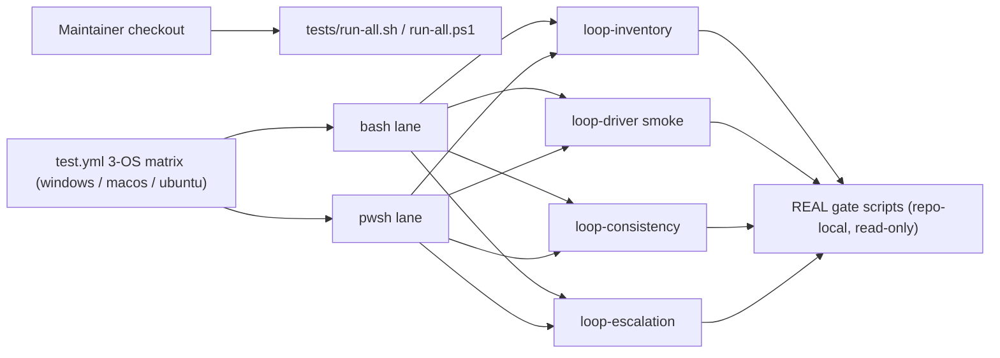

# Infrastructure Specification: epic-159-pillar-a

Local test-infrastructure work plus CI suite registration. No cloud service,
deployment target, IaC resource, network route, or data store is added or
changed. The only infrastructure-facing edits are the suite arrays in
`tests/run-all.sh` / `tests/run-all.ps1` and the suite steps in
`.github/workflows/test.yml` — none of which are protected-gate files
(verified in design.md's Protected-File Statement).

## Deployment Topology

## CI/CD Sequence

Per INV-020, `.github/workflows/test.yml` runs a 3-OS matrix
(`windows-latest`, `macos-latest`, `ubuntu-latest`); pwsh steps invoke `.ps1`
suites directly (lines 32, 79-110 pattern) and bash steps run with
tee-to-log (lines 122-203 pattern), with POSIX-conditional guards where
needed (lines 117, 150 precedent). The four new `.sh` suites join the
`tests/run-all.sh` bash array (48 entries at HEAD, lines 7-62); the `.ps1`
twins follow the pwsh registration precedent (`run-all.sh:64-71`,
guard-r10-port pattern) and the direct test.yml pwsh steps (the
`template-validator-parity` twin registration at `test.yml:65-69` is the
closest precedent).

Determinism lane (#126 note): every suite in this feature is fully
deterministic — no LLM invocation, no network, fixed fixtures. When #126
lands the deterministic/LLM CI lane separation, all four suites belong to
the deterministic lane unchanged; until then they run in the standard matrix.

The RED differential against `2d8c6a5^` is NOT a CI step: it is a one-time
evidence procedure executed during implementation (design.md Test Strategy
item 2) using a disposable `git worktree`, recorded in the implementation
report.

## Runtime Dependencies

| Dependency | Used by | Absence behavior |
|---|---|---|
| bash | all `.sh` suites, run-all | lane unavailable (CI always provides it) |
| pwsh (PowerShell 7) | all `.ps1` twins | recorded SKIP, matching the run-all.sh guard-r10-port precedent |
| jq | inventory checks, `assert_artifacts_schema`, manifest assertions | suite fails fast with a named diagnostic (jq is already required by existing suites) |
| python3 | indirectly via `select-agent-model.sh` / `check-terminal-tier-resume.sh` | explicit `deterministic-runtime-unavailable` degradation surfaced as a named SKIP (INV-017; AC-013) — never silent |
| git (worktree) | RED differential only (one-time, local) | procedure cannot run; not a CI dependency |

No new services, containers, package installations, or network access.

## Environments

| Environment | URL | Auth | Trigger | Classification | Promotion Rule |
|---|---|---|---|---|---|
| local | repository checkout | none / synthetic fixtures | `bash tests/run-all.sh` / `pwsh tests/run-all.ps1` | internal fixtures | suites green |
| CI matrix | no network use by suites | scoped GITHUB_TOKEN (unchanged) | push / PR | synthetic fixtures | all required checks green on 3 OSes |

## Runtime Budget

Risk flagged in requirements.md (suite runtime cost). Controls: one mktemp
fixture per suite reused across legs; rounds driven only to their caps
(≤ 3 rounds per dual-reviewer leg, ≤ 3 reports for the cycle-limit table);
no sleeps or polling. The implementing tasks record measured wall-clock per
suite per OS in their implementation reports; if any single suite exceeds
the median runtime of the existing run-all entries by more than an order of
magnitude, the implementer must split or slim the fixture before Done.

## Infrastructure as Code, Scaling, SLOs, and Residency

N/A — no change: no deployed service. The only IaC-like artifact is
`test.yml`, whose change is limited to registering the new suite steps.

## Observability

| Logs | Traces | Metrics | Alert | Owner | Runbook |
|---|---|---|---|---|---|
| suite output with counter-based ok/FAIL lines and named SKIP-with-reason for degradations | N/A | pass/fail per suite per OS per lane | CI failure | maintainers | rerun the failing suite locally; for inventory reds, reconcile `tests/loops/loop-inventory.json` with the driver source in one reviewed diff |

## Rollback

Per-item reviewed revert (one issue = one commit). No human-copy step exists
in the rollback path because nothing protected is touched. Deregistering a
suite from run-all/test.yml without deleting it is forbidden by the
self-registration check (TEST-004) — rollback removes suite and registration
together.

## Open Questions

None. Owner: maintainers; non-blocking.
