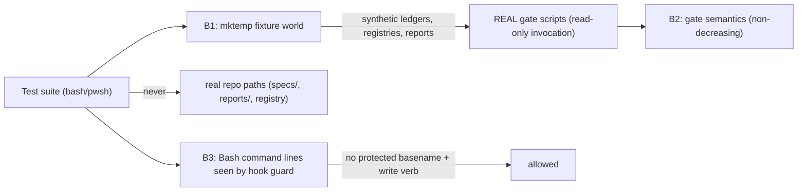

# Security Specification: epic-159-pillar-a

Impact assessment is ALWAYS required for this feature class: the harness
deliberately exercises the repository's enforcement chain (prechecks,
authorization validator, cycle limit, terminal-tier gates) with synthetic
fixtures. A harness that leaks fixture state into real paths, weakens a real
gate, or teaches an agent-forgeable approval pattern would damage the very
chain it verifies. No credential value, secret, or exploit payload belongs in
fixtures, source, logs, or persisted evidence.

## Trust Boundaries

| Boundary | Source | Destination | Assets | Validation | AuthN/AuthZ | REQ | AC |
|---|---|---|---|---|---|---|---|
| B1 | test suites | fixture filesystem | synthetic ledgers, registries, specs, reports | `mktemp -d` + `trap` cleanup (INV-009); explicit assertion that `$LOOP_FIXTURE_ROOT` is outside the repository working tree; real repo paths never written | filesystem isolation | REQ-002 | AC-005 |
| B2 | harness | real gate semantics | precheck/validator/cycle-limit/terminal-tier scripts | scripts invoked READ-ONLY; zero gate files modified; a failing gate fails the test — the harness never adjusts a gate to pass | non-decreasing guarantee | REQ-001..004 | AC-001..013 |
| B3 | test payloads | hook-guard command-line analysis | Bash command lines executed by suites | protected basenames + write verbs stay inside script files, never on Bash tool command lines (epic-136 lesson: the guard's basename fallback, `sdd-hook-guard.py:936-945`, fails closed on such lines even for temp paths) | guard compatibility by construction | REQ-002..004 | AC-005, AC-011 |

## STRIDE Analysis

| Boundary | Threat | STRIDE | Abuse Case | Mitigation | Verification | REQ | AC |
|---|---|---|---|---|---|---|---|
| B1 | fixture ledger/registry written at a real repo path | Tampering | a fixture `specs/workflow-state-registry.json` lands in the working tree and corrupts real workflow state | mktemp-only roots; fixture-root-outside-repo assertion; trap cleanup | TEST-005 | REQ-002 | AC-005 |
| B2 | harness reimplements gate logic and drifts (false green) | Spoofing (of gate semantics) | a lookalike validator accepts what the real gate rejects | REAL binaries only; manifests composed from real outputs; negative self-checks in every suite | TEST-001/002/007/010/012 | REQ-001..004 | AC-001, AC-002, AC-007, AC-010, AC-012 |
| B2 | suite "fix" weakens a real gate to get green | Tampering / Elevation of Privilege | contributor edits a precheck so the harness passes | non-goal + protected-file statement in design.md; gates protected by R-10 remain agent-unwritable; drift test turns red on cap narrowing | TEST-002 | REQ-001 | AC-002 |
| B3 | suite command line triggers or trains guard bypass | Elevation of Privilege | a Bash line pairing a protected basename with a write verb is normalized as "test noise" | constraint: such patterns confined to script-file interiors; fixture filenames never reuse protected basenames | code review + suite convention check | REQ-002..004 | AC-005 |
| B1/B2 | synthetic human-approval record teaches a forgeable pattern | Repudiation / Spoofing | terminal-tier resume fixture's approval record gets copied to a real `reports/` path | approval-record fixtures exist only under `$LOOP_FIXTURE_ROOT`; the suite never writes approval strings to real paths and never invokes sdd-sudo | TEST-011 | REQ-004 | AC-011 |
| B2 | escalation leg silently passes when python3 is absent | Repudiation | missing runtime read as success | scripts fail closed with `deterministic-runtime-unavailable` (INV-017); suite converts it to a named, recorded SKIP | TEST-013 | REQ-004 | AC-013 |

## Authorization

| Actor / Role | Resource | Action | Decision Point | Default | Denial Evidence | REQ | AC |
|---|---|---|---|---|---|---|---|
| test suite | real gate scripts | invoke (read-only) | filesystem + guard | allow | n/a | REQ-001..004 | AC-001..013 |
| test suite | real repo state (`specs/`, `reports/`, registry, protected files) | write | design constraint + R-10 guard for protected subset | deny (never attempted) | guard non-zero exit if attempted | REQ-002 | AC-005 |
| test suite | sdd-sudo / approval strings on real paths | invoke / write | design constraint | never | code review + B3 convention | REQ-004 | AC-011 |
| human maintainer | RED-differential evidence, OQ-5 finding | review / approve | PR review | n/a | n/a | REQ-003 | AC-009 |

## Data Classification and Protection

| Entity | Classification | At Rest | In Transit | Retention | Deletion | Access Log | REQ | AC |
|---|---|---|---|---|---|---|---|---|
| `tests/loops/loop-inventory.json` | internal integrity-relevant | repository | local only | repo lifetime | reviewed revert | git history | REQ-001 | AC-001 |
| synthetic fixtures (ledgers, registries, reports, approval records) | synthetic internal | mktemp directory | local only | test lifetime | trap cleanup | test output only | REQ-002..004 | AC-005, AC-011 |
| RED-differential evidence | internal | implementation report | local only | repo lifetime | n/a | git history | REQ-003 | AC-009 |

No secret, token, credential, or real approval identity appears anywhere in
fixtures or evidence. Ledger fixture fields (`run_id`, `host_session_id`)
use obviously-synthetic constant values.

## OWASP Mapping

| OWASP Risk | Exposure | Control | Verification | Owner |
|---|---|---|---|---|
| Broken Access Control | fixture writes escaping isolation | mktemp + outside-repo assertion | TEST-005 | maintainers |
| Security Misconfiguration | suites registered but silently skipped | self-registration grep + named SKIP-with-reason convention | TEST-004, TEST-015 | maintainers |
| Integrity / Supply Chain | inventory or harness drifting from real gates | bidirectional drift lock; REAL-binary invocation | TEST-002, TEST-010 | maintainers |
| Injection | guard-triggering command lines | B3 convention (basenames+write verbs inside scripts only) | code review | maintainers |

## Secrets Management

No secret is added, read, or logged. Suites make no network call and read no
`.env`. The identity-ledger hash chain uses SHA-256 over synthetic canonical
strings only — no HMAC keys, no signatures (consistent with ADR-0008's
no-signature-crypto boundary).

## Security Tests

| Test | Boundary | Attack / Control | Expected Result | Evidence | AC |
|---|---|---|---|---|---|
| TEST-005 | B1 | fixture root placement + real-path write prevention | fixture root outside repo; no repo path written | `tests/loop-driver.tests.sh` | AC-005 |
| TEST-002 | B2 | cap narrowed in driver source or inventory | red on either-side drift | `tests/loop-inventory.tests.sh` | AC-002 |
| TEST-010 | B2 | downstream requires what upstream refuses | red on synthetic violation | `tests/loop-consistency.tests.sh` | AC-010 |
| TEST-011 | B1/B2 | resume without human approval record | `check-terminal-tier-resume.sh` denies; fixture-only approval record permits | `tests/loop-escalation.tests.sh` | AC-011 |
| TEST-013 | B2 | python3 absent | `deterministic-runtime-unavailable` surfaced as named SKIP | `tests/loop-escalation.tests.sh` | AC-013 |
| TEST-012 | B2 | template drifts from evaluator gate | red when `- Task ID:` line removed | `tests/loop-escalation.tests.sh` | AC-012 |

## Open Questions

None security-blocking. OQ-5 (cross-stage precheck semantics) is tracked in
requirements.md/design.md as a human-verify item; its security relevance is
nil because the leg asserts only HEAD-observable behavior. Owner:
maintainers; non-blocking.
