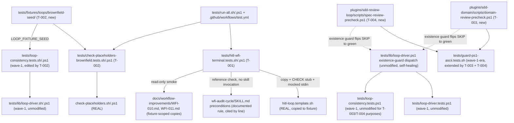

# Design: epic-159-pillar-a2

Impl-Review-Status: Draft
Feature Type: deterministic test infrastructure + two precheck script ports (Pillar A completion)

## Technical Summary

Four additive deliverables, independent of each other except for the shared
files two of them touch (T-001/#145 ⟂ T-002/#146 ⟂ {T-003/#147 ⟂ T-004/#174},
INV-033, INV-034): a new suite locking the terminal behavior of the two
skill-instruction-enforced loops (T-001), the canonical brownfield fixture
seed plus an executable lock on the `check-placeholders` brownfield
restriction (T-002), and full-parity `.ps1` ports of `domain-review-precheck.sh`
(T-003) and `spec-review-precheck.sh` (T-004). The guiding principle is
unchanged from wave-1: no safety property is asserted by reimplementation —
where a real script exists (`check-placeholders.sh`, the review prechecks
via the loop driver), the harness drives it read-only; where none exists
(the WFI-audit skill), the suite pins the documented rule as a small,
line-cited reference check rather than pretending to drive the skill.

T-003 and T-004 are unusually low-risk relative to wave-1's suites: the
self-healing dispatch that will pick up both new files already exists at
HEAD (`tests/lib/loop-driver.ps1:204-230,538-551,1083-1092`), so their
acceptance signal is largely externally observable (SKIP count decreasing
in existing CI output) rather than newly authored assertion logic.

## Architecture



## Components

| Component | Responsibility | Technology | New/Existing | Protected? |
|---|---|---|---|---|
| `tests/hitl-wfi-terminal.tests.sh` / `.ps1` | HITL cap-5 terminal behavior (real script); WFI-audit Audit-Attempt≥3 terminal behavior (reference check); gh-non-invocation self-check | Bash / PowerShell | new | no |
| `tests/fixtures/loops/brownfield-seed/` | canonical brownfield seed: NotImplementedError base class, unrelated TODO, bootstrap-complete tasks.md | mixed (Python/text fixtures + Markdown) | new | no |
| `tests/check-placeholders-brownfield.tests.sh` / `.ps1` | changed-files-only PASS / full-directory FAIL lock against the seed | Bash / PowerShell | new | no |
| `tests/loop-consistency.tests.sh` / `.ps1` | +brownfield-profile leg on TEST-008 | Bash / PowerShell | existing, edited (T-002) | no (verified) |
| `plugins/sdd-domain/scripts/domain-review-precheck.ps1` | full-parity `.ps1` port of `domain-review-precheck.sh` | PowerShell | new | no |
| `plugins/sdd-review-loop/scripts/spec-review-precheck.ps1` | full-parity `.ps1` port of `spec-review-precheck.sh` | PowerShell | new | no |
| `tests/guard-ps1-ascii.tests.sh` | +2 target-list entries (domain/spec precheck `.ps1`) | Bash | existing, edited (T-003, T-004) | no (verified) |
| `tests/run-all.sh` / `.ps1` | suite registration (T-001, T-002 suites) | Bash / PowerShell | existing, edited | no (verified) |
| `.github/workflows/test.yml` | CI wiring (3-OS, bash+pwsh lanes) | GitHub Actions YAML | existing, edited | no (verified) |

Real surfaces exercised READ-ONLY (never modified):
`plugins/sdd-implementation/skills/diagnose/scripts/hitl-loop.template.sh`
(copied into a fixture, never edited in place),
`plugins/sdd-quality-loop/scripts/check-placeholders.sh`/`.ps1`,
`tests/lib/loop-driver.sh`/`.ps1` (sourced, unmodified),
`tests/loops/loop-inventory.json` (read, unmodified).
`plugins/sdd-quality-loop/skills/wfi-audit-cycle/SKILL.md` is read as a
documentation source (cited by line number in test comments) and never
executed or invoked as a skill.

## Protected-File Statement

No protected-gate-file modification is needed anywhere in this feature.
Verified directly against `_PROTECTED_GATE_SUFFIXES`
(`plugins/sdd-quality-loop/scripts/sdd-hook-guard.py:886-927`): the full
protected `tests/` list is exactly `tests/gates.tests.sh`,
`tests/eval.tests.sh`, `tests/guard-parity.tests.sh`,
`tests/constant-parity.tests.sh` — none of which this feature touches.
`tests/guard-ps1-ascii.tests.sh` (T-003/T-004 edit target) and
`tests/loop-consistency.tests.sh`/`.ps1` (T-002 edit target) are NOT in the
protected list. The two new `.ps1` scripts
(`plugins/sdd-domain/scripts/domain-review-precheck.ps1`,
`plugins/sdd-review-loop/scripts/spec-review-precheck.ps1`) are also not
protected — the protected sdd-review-loop entries are specifically the
reviewer agent `.md` files and the `impl-review-loop`/`task-review-loop`
`SKILL.md` files (`sdd-hook-guard.py:917-923`), not the precheck scripts
(investigation.md INV-018). Rule stated for completeness: IF any wiring
were ever to require touching a protected file, the epic-136 human-copy
procedure applies — the agent stages the corrected file under
`specs/epic-159-pillar-a2/human-copy/` with a SHA-256 manifest, and only the
human copies it into place. Not needed here.

## Layer Specifications

| Layer | Summary | Canonical Detail | Owner | Status |
|---|---|---|---|---|
| UX | N/A — no change: no GUI or user-facing surface | [UX specification](ux-spec.md#scope-and-user-journeys) | maintainers | N/A |
| Frontend | N/A — no change: shell/PowerShell/JSON/fixture test infrastructure only | [Frontend specification](frontend-spec.md#technology-stack) | maintainers | N/A |
| Infrastructure | CI suite registration on the existing 3-OS matrix; deterministic lane | [Infrastructure specification](infra-spec.md#cicd-sequence) | maintainers | Planned |
| Security | fixture isolation, gh-non-invocation, non-decreasing gate guarantee | [Security specification](security-spec.md#trust-boundaries) | maintainers | Planned |

## Design System Compliance

N/A — ds_profile: none. Not a UI application; no mockup provided; optional
visualization skipped.

## Cross-Layer Dependencies

| From | To | Contract / Decision | REQ | AC | Verification |
|---|---|---|---|---|---|
| requirements.md | design.md | HITL/WFI-audit terminal behavior pinned without reimplementing the skill | REQ-001 | AC-001..006 | TEST-001..006 |
| requirements.md | design.md | canonical brownfield seed + check-placeholders lock + profile-parity leg | REQ-002 | AC-007..010 | TEST-007..010 |
| requirements.md | design.md | domain-review-precheck.ps1 full-parity port + hygiene + self-healing | REQ-003 | AC-011..013 | TEST-011..013 |
| requirements.md | design.md | spec-review-precheck.ps1 full-parity port + hygiene + self-healing | REQ-004 | AC-014..016 | TEST-014..016 |
| requirements.md | security-spec.md | fixture isolation; real WFI docs read-only; gh categorically unreachable | REQ-001, REQ-002 | AC-004, AC-005, AC-007 | TEST-004, TEST-005, TEST-007 + security tests |
| requirements.md | infra-spec.md | 3-OS × bash/pwsh wiring, deterministic lane, decreasing-SKIP observable | REQ-005 | AC-006, AC-017 | TEST-006, TEST-017 |

## ADR Change Log

No new ADR. The `greenfield`/`brownfield` fixture-profile vocabulary this
feature's canonical seed instantiates is already ADR-0010's contract
(`docs/adr/0010-loop-inventory-and-fixture-vocabulary.md:46-47`: "brownfield
= 既存..."); this feature delivers the seed ADR-0010 anticipated (wave-1
requirements.md Assumptions: "the canonical brownfield seed arrives with
A6/#146") without changing the vocabulary, the schema, or any inventory
field. No other design decision in this feature rises to ADR weight (the
two `.ps1` ports are translations of an already-established pattern; the
HITL/WFI-audit terminal-behavior suite tests already-registered inventory
entries).

## Data Plan

Data Entities: one new committed fixture directory
(`tests/fixtures/loops/brownfield-seed/`) and mktemp-scoped synthetic
fixtures (HITL template copy, WFI-NNN.md field-mutation copies, brownfield
seed copies driven through the loop driver). Two real files are read but
never written: `docs/workflow-improvements/WFI-010.md`,
`docs/workflow-improvements/WFI-011.md` (copied into a fixture before any
assertion touches them).

Existing Data Affected: none. Real `reports/`, `specs/`,
`specs/workflow-state-registry.json`, and
`docs/workflow-improvements/*.md` are never written by any suite in this
feature.

Migration Strategy: none.

## API / Contract Plan

### HITL leg driving technique (T-001)

`hitl-loop.template.sh` is a `#!/usr/bin/env bash` script (not `sh`), so
`export -f CHECK` is available. The suite:

1. Copies `plugins/sdd-implementation/skills/diagnose/scripts/hitl-loop.template.sh`
   into a mktemp fixture directory (never editing the real template in
   place, matching its own "do not commit the copy" instruction at line 7).
2. Defines a `CHECK` shell function per case:
   - never-reproduces case: `CHECK() { return 1; }`.
   - reproduces-on-iteration-3 case: `CHECK() { [ "$(cat "$COUNTER_FILE")" = 3 ]; }`
     with a counter file the harness increments once per iteration outside
     the subshell (or, equivalently, a `CHECK` that reads and increments the
     counter file itself, since `hitl-loop.template.sh` invokes `CHECK` once
     per iteration at line 25 with no other side channel available).
3. `export -f CHECK` before invoking `bash <fixture>/hitl-loop.template.sh 5`,
   piping `printf '\n%.0s' {1..5}` (five newlines) to stdin to satisfy the
   per-iteration `read -r ans` prompt at line 18 without ever typing `q`.
4. Asserts exit code and the exact terminal string per case (AC-001,
   AC-002).

A canary requirement (Edge Cases in requirements.md) is that AC-002 must
independently pass: if the harness's `CHECK` wiring were broken (e.g.
`export -f` omitted, so the subshell sees `CHECK: command not found`,
exit 127), the template's `if CHECK; then` (line 25) would silently take
the false branch every time and AC-001 would pass FOR THE WRONG REASON.
Requiring AC-002 to independently observe the RED branch closes that gap.

### WFI-audit leg reference check (T-001)

No script exists to drive (`driver_scripts: []`,
`tests/loops/loop-inventory.json:144`). The suite instead implements a
small, explicitly-labeled reference function —
`assert_wfi_audit_transition <audit-attempt-before> <verdict> <expected-audit-attempt-after> <expected-audit-status>`
— whose entire logic is the two-line rule transcribed from
`plugins/sdd-quality-loop/skills/wfi-audit-cycle/SKILL.md:44-50` (precondition
4) and `SKILL.md:119-135`/`SKILL.md:186-203` (STEP 4 / STEP 7):

```
if verdict == BLOCKED:
  audit_attempt += 1
  audit_status = "Human-Blocked" if audit_attempt >= 3 else "Not-Started"
```

The function is applied to a fixture-scoped copy of a minimal WFI-NNN.md
(front-matter fields only: `Audit-Status:`, `Audit-Attempt:`,
`Category: process` — deliberately not `plugin-improvement`, so STEP 8 is
inapplicable by construction, AC-004) across the sequence 0→1→2→3, and each
resulting `Audit-Status` field is asserted. A negative self-check mutates
the `>= 3` threshold to `>= 4` in a temp copy of the function and asserts
the attempt-3 case now wrongly reports `Not-Started`, proving the check is
live (AC-003). Because the entire leg touches only files inside
`$LOOP_FIXTURE_ROOT` and never sources or invokes anything under
`plugins/sdd-quality-loop/skills/`, a plain
`grep -rn 'gh ' tests/hitl-wfi-terminal.tests.sh tests/hitl-wfi-terminal.tests.ps1`
returning empty is sufficient evidence for AC-004 — no runtime stub needed.

The AC-005 reference smoke check copies
`docs/workflow-improvements/WFI-010.md` and `WFI-011.md` (read-only) into
the same fixture root and parses their `Audit-Status:`/`Audit-Attempt:`
fields with the same field-extraction logic the reference function uses,
asserting the recorded values are internally consistent with the rule
(e.g. WFI-010.md's recorded Audit-Attempt: 1 with a non-Human-Blocked
status per investigation.md INV-007).

### Canonical brownfield seed layout (T-002)

`tests/fixtures/loops/brownfield-seed/`:

```
brownfield-seed/
  src/
    base.py            # abstract base class; raise NotImplementedError (legitimate)
    legacy_util.py      # pre-existing, task-unrelated `# TODO: revisit encoding` marker
  specs/brownfield-seed-demo/
    tasks.md             # bootstrap-complete shape (Status/Risk/Required Workflow fields present)
  CHANGED_FILES.txt      # the "changed files" subset the AC-008 case passes (excludes legacy_util.py)
```

`CHANGED_FILES.txt` is a fixture-local manifest (never a real quality-gate
artifact) listing the paths the AC-008 lock case passes to
`check-placeholders.sh`/`.ps1` as explicit arguments — it is not read by
`check-placeholders.sh` itself (which takes paths as CLI args, not a
manifest file); the test suite reads it to build the argv list, keeping the
"changed vs. full directory" distinction traceable to one committed file
rather than duplicated inline in both the `.sh` and `.ps1` test twins.

### `tests/check-placeholders-brownfield.tests.sh` / `.ps1` contract (T-002)

Two cases, mirroring `tests/check-placeholders.tests.sh`'s existing
`run_cp()` helper pattern (`tests/check-placeholders.tests.sh:21-24`):

- Case A (AC-008): `run_cp $(cat CHANGED_FILES.txt)` against the seed →
  exit 0.
- Case B (AC-009): `run_cp brownfield-seed/` (the whole directory) → exit 1,
  output contains the `legacy_util.py` `TODO` finding.

No `loop_fixture_init`/loop-driver overhead (OQ-4 resolution) — these are
direct, mktemp-local invocations of the real
`check-placeholders.sh`/`.ps1`, exactly like the existing
`tests/check-placeholders.tests.sh`.

### `tests/loop-consistency.tests.sh`/`.ps1` brownfield-profile leg (T-002)

A new leg inside the existing TEST-008 (no new TEST number in the wave-1
suite's own numbering; this feature's own TEST-010 documents it from this
feature's side — see acceptance-tests.md) calls
`loop_fixture_init brownfield <feature>` with
`LOOP_FIXTURE_SEED="${REPO_ROOT}/tests/fixtures/loops/brownfield-seed"`
(the loop driver's existing brownfield contract at
`tests/lib/loop-driver.sh:132-138` already accepts an arbitrary seed
directory — no change needed there), drives spec-review round 1 through
`drive_review_round`, and asserts the round's terminal/PASS-eligible state
the same way the existing greenfield leg does. One profile-parity leg is
sufficient to satisfy issue #146's Done condition ("greenfield / brownfield
両 profile でループ駆動が緑"); it does not repeat the full rounds-1→3
sweep already covered on the greenfield profile.

### `domain-review-precheck.ps1` / `spec-review-precheck.ps1` contract (T-003, T-004)

Both are `param()`-block PowerShell scripts translating their `.sh`
counterpart 1:1, following `task-review-precheck.ps1`'s and
`impl-review-precheck.ps1`'s established idioms (`$ErrorActionPreference =
'Stop'`; a local `Fail([string]$Message)` throwing `"<script-name>:
$Message"`; SHA-256 via `[Security.Cryptography.SHA256]::HashData(...)` +
`[Convert]::ToHexString(...).ToLower()` in place of `sha256sum`/`shasum`).

- `domain-review-precheck.ps1`: `param([string]$Attempt, [string]$Round,
  [string]$EditSummary, [switch]$Reset)` — no `-Feature` parameter,
  matching the `.sh` original's feature-less signature
  (`domain-review-precheck.sh:9`). Implements the attempt/round bounds
  (`domain-review-precheck.sh:37-39`), the round-1 `--edit-summary`
  restriction (`domain-review-precheck.sh:40`), and the AC-014
  post-approval drift detection the `.sh` header comment describes
  (`domain-review-precheck.sh:5`).
- `spec-review-precheck.ps1`: `param([string]$Feature, [string]$Attempt,
  [string]$Round, [string]$EditSummary, [switch]$Reset)`. Implements the
  feature-slug validation (`spec-review-precheck.sh:32`), attempt/round
  bounds (lines 33-35), and the rounds-2/3 non-empty `--edit-summary` rule
  (lines 36-38).

Neither script requires any change to `tests/lib/loop-driver.ps1`: its
existence-guard dispatch already names both exact target paths
(`Copy-LoopFixtureScripts`, `tests/lib/loop-driver.ps1:206,211`) and both
call sites (`Invoke-LoopDriveSpecRound`,
`tests/lib/loop-driver.ps1:538-551`; `Invoke-LoopDriveDomainRound`,
`tests/lib/loop-driver.ps1:1083-1092`) already `Test-Path`-guard and error
out by name only when the file is absent — landing the file flips the
guard, nothing else changes (OQ-6 resolution, self-healing).

### `tests/guard-ps1-ascii.tests.sh` extension (T-003, T-004)

The existing suite (`tests/guard-ps1-ascii.tests.sh:1-14`) targets exactly
one file, `sdd-hook-guard.ps1`, overridable via `GUARD_PS1` for the
protected file's human-copy staging workflow. This feature generalizes it
minimally: a `TARGETS` array replaces the single `TARGET` variable,
defaulting to `("${REPO_ROOT}/plugins/sdd-quality-loop/scripts/sdd-hook-guard.ps1"
"${REPO_ROOT}/plugins/sdd-domain/scripts/domain-review-precheck.ps1"
"${REPO_ROOT}/plugins/sdd-review-loop/scripts/spec-review-precheck.ps1")`,
looping the existing byte-scan logic (lines 31-46) over each target while
preserving the `GUARD_PS1` env var as a single-target override for the
first (protected) entry only, so the human-copy staging workflow this
suite already supports is unaffected. Because both T-003 and T-004 want to
add an entry to the same `TARGETS` array, this file is a Global Constraint
(see below).

## Test Strategy

1. HITL and WFI-audit legs are independently red-demonstrable: AC-002
   (reproduces-on-iteration-3) is the HITL leg's negative-branch proof;
   AC-003's threshold-mutation self-check is the WFI-audit leg's.
2. `check-placeholders-brownfield` cases are positive-and-negative by
   design (AC-008 must PASS, AC-009 must FAIL) — the pair itself is the
   red/green proof, no separate negative self-check needed (mirroring how
   `tests/check-placeholders.tests.sh`'s CP-001/CP-002 pair already works).
3. `domain-review-precheck.ps1`/`spec-review-precheck.ps1` correctness is
   proven externally: landing each file converts a currently-red-by-SKIP
   (not red-by-FAIL) suite state to green, observable in
   `tests/loop-driver.tests.ps1`/`tests/loop-consistency.tests.ps1` output
   without any change to those suites. Each task's implementation report
   records the before/after SKIP count as evidence (mirrors wave-1's
   RED-differential evidence-recording convention, design.md Test Strategy
   item 2 in epic-159-pillar-a, applied here to a SKIP-to-green
   differential instead of a RED-to-green one).
4. Runtime budget (T-001 only; T-002/T-003/T-004 do not add a suite whose
   own multi-round driving cost approaches the 300s threshold): source
   `tests/lib/loop-driver.sh`'s `assert_runtime_budget`
   (`tests/lib/loop-driver.sh:1462-1465`) and its `LOOP_SUITE_BUDGET_SECONDS`
   constant (line 58) rather than reimplementing; threshold-0 negative
   self-check in a temp copy proves the assertion is live.
5. Self-registration: `tests/hitl-wfi-terminal.tests.sh` and
   `tests/check-placeholders-brownfield.tests.sh` each grep
   `tests/run-all.sh`/`.ps1`/`.github/workflows/test.yml` for their own
   basename, mirroring `tests/second-approval-mask.tests.sh:285-289`'s
   established pattern (not `tests/loop-inventory.tests.sh`'s
   `CANONICAL_BASENAMES` array, which is scoped to wave-1's four
   loop-driving suites specifically and is deliberately not extended by
   this feature — see Design Decisions below).
6. Full suite: `bash tests/run-all.sh` and `pwsh tests/run-all.ps1` locally;
   the 3-OS CI matrix is authoritative.

## Design Decisions (resolving open questions)

- OQ-1/OQ-2 → HITL driven via the real script with a `CHECK` stub and
  mocked stdin; WFI-audit exercised as a small, line-cited reference
  function against fixture-scoped copies, never through the skill; `gh` is
  unreachable by construction and verified by a grep self-check
  (requirements.md Field Definitions).
- OQ-3 → the three documented brownfield seed categories are adopted as
  sufficient and closed for this feature.
- OQ-4 → unit tests only for the check-placeholders lock cases; the
  loop-driver is used exactly once, for the separate profile-parity leg
  issue #146 explicitly asks for.
- OQ-5 → full parity port, following
  `impl-review-precheck.ps1`/`task-review-precheck.ps1`.
- OQ-6 → no `tests/lib/loop-driver.ps1` change needed; its existence-guard
  dispatch already names both target paths (lines 206, 211) — landing the
  files at those exact paths is sufficient.
- OQ-7 → the acceptance signal is a decreasing named-SKIP count in
  windows-latest CI's `loop-driver.tests.ps1`/`loop-consistency.tests.ps1`
  output, recorded per-task in the implementation report rather than
  encoded as a new automated counter (no suite currently counts SKIPs
  across runs to diff against; adding one would be scope beyond what
  either issue requests).
- New decision (not carried from an investigation OQ): whether to extend
  `tests/loop-inventory.tests.sh`'s `CANONICAL_BASENAMES` array
  (`tests/loop-inventory.tests.sh:306`) to also police
  `tests/hitl-wfi-terminal.tests.sh`'s registration. Decided NO: that array
  is scoped by wave-1's own design to its four sibling loop-driving suites;
  the repo's actual convention for a new, unrelated suite's own
  self-registration is the suite grepping for itself
  (`tests/second-approval-mask.tests.sh:285-289`,
  `tests/rollback-1.5.0.tests.sh:199`), which this feature follows instead.
  Extending someone else's hardcoded array would conflate two suites'
  ownership boundaries for no additional enforcement benefit.
- New decision: whether to extend
  `tests/downstream-review-precheck-parity.tests.sh` (impl/task-only,
  hardcoded semantic-parity check, `tests/downstream-review-precheck-parity.tests.sh:1-85`)
  to also cover spec/domain now that both `.ps1` twins exist. Decided NO
  (non-goal, requirements.md) — neither #147 nor #174 asks for it, and the
  self-healing SKIP-to-green signal in `loop-driver.tests.ps1`/
  `loop-consistency.tests.ps1` is sufficient observable proof of behavioral
  parity for this feature's scope.

## Global Constraints

Four files are edited by more than one component in this feature or are
shared registration surfaces, mirroring wave-1's `run-all.sh`/`test.yml`
commit-serialization precedent (epic-159-pillar-a design.md Dependency
Order section):

- `tests/run-all.sh` / `tests/run-all.ps1` — T-001 adds
  `hitl-wfi-terminal.tests`; T-002 adds `check-placeholders-brownfield.tests`.
  Both edits are additive array entries; land them in separate, serialized
  commits (one per task) to avoid a merge collision on the same array.
- `.github/workflows/test.yml` — same two additions, same serialization
  note.
- `tests/guard-ps1-ascii.tests.sh` — T-003 and T-004 each add one entry to
  the new `TARGETS` array. Whichever task lands first introduces the
  `TARGET` → `TARGETS` refactor; the second task's diff is a pure one-line
  addition to the array the first task already generalized. Task order is
  otherwise unconstrained (T-003 ⟂ T-004, INV-034), but this file
  specifically benefits from not being edited in the same commit by both
  tasks simultaneously.
- `tests/loop-consistency.tests.sh` / `.ps1` — edited only by T-002 in this
  feature (no other task in this feature touches it), so no
  intra-feature serialization risk; flagged anyway because it is a wave-1
  shared file that a concurrent, unrelated session could also be editing
  (the same shared-worktree caution noted in prior session memory).

## Security Boundaries

| Trust Boundary | Auth/Authz Mechanism | Data Classification | OWASP Concerns |
|---|---|---|---|
| B1: fixture world vs real repository | mktemp isolation; real `docs/workflow-improvements/*.md` copied read-only, never written; real brownfield seed committed but inert (never executed) | synthetic fixtures + two read-only real-doc copies | Broken Access Control (prevented) |
| B2: harness vs real gate semantics | `check-placeholders.sh`/`.ps1` and the loop driver's real precheck dispatch driven read-only; WFI-audit rule pinned as a labeled reference check, never presented as the skill itself | internal source | Integrity |
| B3: test payloads vs hook-guard command-line analysis | protected basenames + write verbs confined to script-file interiors | internal source | Injection (avoided by construction) |
| B4: WFI-audit fixture vs GitHub | no file in this feature invokes `gh`; verified by grep self-check, not runtime stub | internal source | SSRF / unintended network egress (prevented by construction) |

Detailed controls: [Security specification](security-spec.md#trust-boundaries).

## External Integrations

None. No network calls, no new services, no third-party actions. Runtime
dependencies (bash, pwsh, jq) are those the repository already requires;
see infra-spec.md.

## Deployment / CI Plan

No runtime deployment. Two new suites join `tests/run-all.sh`/`.ps1` and
`.github/workflows/test.yml` on the existing 3-OS matrix, deterministic
lane (no LLM invocation anywhere in this feature — #126 lane separation
note, unchanged from wave-1). The two new `.ps1` scripts join the existing
pwsh lane automatically once `tests/loop-driver.tests.ps1`/
`tests/loop-consistency.tests.ps1` pick them up via the unmodified
existence-guard dispatch. Rollback for any single item is a reviewed
revert of that item's commit; because nothing protected is touched, no
human-copy re-copy step exists in the rollback path.

## Constraint Compliance

| Requirement Constraint | Design Response |
|---|---|
| no protected file modified | all deliverables new files + unprotected registration/hygiene files (verified above) |
| `.sh`/`.ps1` twin pairs mandatory | `hitl-wfi-terminal` and `check-placeholders-brownfield` ship as twins from the start; the domain/spec precheck `.ps1` additions complete already-twinned pairs |
| cross-host (Claude Code / Codex) | host-neutral twins + CI matrix; degradations remain explicit and recorded |
| no false green | HITL leg drives the real template; check-placeholders leg drives the real gate; WFI-audit leg is explicitly labeled as a reference check, never claimed to be the skill; domain/spec precheck ports are proven by the existing suites flipping from SKIP to green, not by a self-referential new assertion |
| doc-following in same PR | REQ-006 surface list; CHANGELOG Unreleased entries per issue |
| version bump via `scripts/bump-version.sh` only | release step delegated to the human per epic policy |

## Assumptions

`tests/lib/loop-driver.ps1`'s existence-guard dispatch remains as observed
at design time (`Copy-LoopFixtureScripts` lines 204-230,
`Invoke-LoopDriveSpecRound` lines 538-551, `Invoke-LoopDriveDomainRound`
lines 1083-1092 — verified directly during this design, correcting nothing
from investigation.md but adding line-level precision investigation.md did
not need for its own purposes). `check-placeholders.sh`'s grep-exit-code
branching (`check-placeholders.sh:28-49`) remains stable. The `.sh` line
numbers cited for `domain-review-precheck.sh` and `spec-review-precheck.sh`
reflect their content at design time; a future unrelated edit to either
`.sh` file that shifts line numbers would not invalidate the `.ps1` port's
correctness, only the design doc's line citations.

## Open Questions

None blocking. All investigation.md OQ-1..OQ-7 are resolved above with
design decisions; the two additional decisions this design makes
(CANONICAL_BASENAMES non-extension; downstream-review-precheck-parity
non-extension) are stated as resolved decisions, not left open, because
neither issue's Done conditions require them and both are reversible,
low-risk, additive choices a future issue could revisit without touching
this feature's deliverables.

## Risks

Principal risk is the WFI-audit reference check drifting from the actual
skill prose over time (the skill is prose, not a script, so there is no
compiler or drift-lock to catch a stale line citation automatically);
mitigation is the AC-005 read-only cross-check against two real,
human-authored WFI documents, which would start failing if the documented
rule and the real skill's observed behavior diverged. Secondary risk is
the HITL leg's `CHECK`-wiring fragility (Edge Cases in requirements.md);
mitigation is making AC-002 mandatory, not optional. Tertiary risk is the
shared-file edits (`guard-ps1-ascii.tests.sh`, `run-all.sh`/`.ps1`,
`test.yml`) colliding across T-001..T-004; mitigation is the Global
Constraints section above plus per-task serialized commits (one issue =
one task = one commit, wave-1 convention carried forward).
