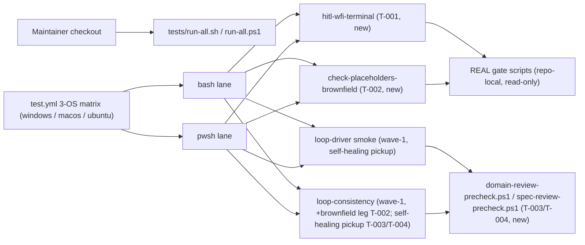

# Infrastructure Specification: epic-159-pillar-a2

Local test-infrastructure work plus two new PowerShell precheck scripts and
CI suite registration. No cloud service, deployment target, IaC resource,
network route, or data store is added or changed. The only
infrastructure-facing edits are the suite arrays in `tests/run-all.sh` /
`tests/run-all.ps1` and the suite steps in `.github/workflows/test.yml` —
none of which are protected-gate files (verified in design.md's
Protected-File Statement).

## Deployment Topology

## CI/CD Sequence

`.github/workflows/test.yml`'s existing 3-OS matrix (`windows-latest`,
`macos-latest`, `ubuntu-latest`, `test.yml:18`) and existing pwsh/bash step
patterns (direct `.ps1` invocation; tee-to-log for bash) are unchanged by
this feature. Two new suite pairs join the arrays alongside the four
wave-1 suites already registered there
(`tests/run-all.sh:45-48`; `test.yml`'s
"Test loop inventory/driver/consistency/escalation" steps): `hitl-wfi-terminal`
(T-001) and `check-placeholders-brownfield` (T-002), following the same
bash-then-pwsh step pairing precedent.

`domain-review-precheck.ps1` (T-003) and `spec-review-precheck.ps1` (T-004)
require NO new CI steps: they are picked up automatically by the existing
pwsh steps for `tests/loop-driver.tests.ps1` and
`tests/loop-consistency.tests.ps1`, whose existence-guard dispatch
(`tests/lib/loop-driver.ps1:204-230,538-551,1083-1092`) already names both
paths. The CI-observable effect of landing either file is a reduction in
named-SKIP lines within an already-running, already-registered step's
output — not a new step.

Determinism lane (#126 note, carried from wave-1): every suite in this
feature is fully deterministic — no LLM invocation, no network, fixed
fixtures (including the WFI-audit reference check, which is a pure
field-mutation-rule comparison, not an audit performed by an LLM). When
#126 lands the deterministic/LLM CI lane separation, both new suites join
the deterministic lane unchanged; until then they run in the standard
matrix.

## Runtime Dependencies

| Dependency | Used by | Absence behavior |
|---|---|---|
| bash | `.sh` suites, run-all | lane unavailable (CI always provides it) |
| pwsh (PowerShell 7) | `.ps1` twins, the two new precheck ports | recorded SKIP, matching the run-all.sh guard-r10-port precedent |
| jq | brownfield-profile leg (transitively, via the existing loop driver); not required by the HITL/WFI-audit reference-check leg, which uses only shell string/field parsing | suite fails fast with a named diagnostic where used (already a repository dependency) |
| python3 | not a direct dependency of any new file in this feature (unlike wave-1's escalation leg) | n/a |
| git | none newly required (no RED-differential procedure in this feature) | n/a |

No new services, containers, package installations, or network access.

## Environments

| Environment | URL | Auth | Trigger | Classification | Promotion Rule |
|---|---|---|---|---|---|
| local | repository checkout | none / synthetic fixtures | `bash tests/run-all.sh` / `pwsh tests/run-all.ps1` | internal fixtures + two read-only real-doc copies | suites green |
| CI matrix | no network use by suites | scoped GITHUB_TOKEN (unchanged) | push / PR | synthetic fixtures | all required checks green on 3 OSes |

## Runtime Budget

`tests/hitl-wfi-terminal.tests.sh`/`.ps1` (T-001) is the one new suite in
this feature whose runtime is self-monitored, reusing wave-1's
`assert_runtime_budget` / `LOOP_SUITE_BUDGET_SECONDS=300`
(`tests/lib/loop-driver.sh:58,1462-1465`) rather than reimplementing it; the
suite is expected to run well under budget (five short-lived HITL
iterations plus a handful of file-based field comparisons, no multi-round
review-loop driving). `tests/check-placeholders-brownfield.tests.sh`/`.ps1`
(T-002) is two direct invocations of a fast, existing shell gate against a
small fixture and carries no separate runtime-budget assertion, mirroring
`tests/check-placeholders.tests.sh`'s existing (unbudgeted) pattern. The
brownfield-profile leg added to `tests/loop-consistency.tests.sh`/`.ps1`
(also T-002) runs inside that suite's own existing TEST-017 runtime-budget
assertion (epic-159-pillar-a design.md Test Strategy 1b) — no new budget
constant is introduced.

## Infrastructure as Code, Scaling, SLOs, and Residency

N/A — no change: no deployed service. The only IaC-like artifact is
`test.yml`, whose change is limited to registering the two new suite steps.

## Observability

| Logs | Traces | Metrics | Alert | Owner | Runbook |
|---|---|---|---|---|---|
| suite output with counter-based ok/FAIL lines, named SKIP-with-reason for degradations, and (T-003/T-004 only) a decreasing named-SKIP count across two existing wave-1 suites | N/A | pass/fail per suite per OS per lane; SKIP count in `loop-driver.tests.ps1`/`loop-consistency.tests.ps1` output (OQ-7 observable) | CI failure | maintainers | rerun the failing suite locally; for a domain/spec `.ps1` port regression, compare the port's output against its `.sh` twin on matching fixture input |

## Rollback

Per-item reviewed revert (one issue = one task = one commit). No
human-copy step exists in the rollback path because nothing protected is
touched. Reverting T-003 or T-004 (deleting the new `.ps1` file) causes the
existing wave-1 suites to revert to their current named-SKIP state
automatically, via the same existence-guard dispatch that would have picked
the file up — no suite edit is needed on rollback either. Deregistering
`hitl-wfi-terminal` or `check-placeholders-brownfield` from
run-all/test.yml without deleting the suite is caught by that suite's own
self-registration check.

## Open Questions

None. Owner: maintainers; non-blocking.
