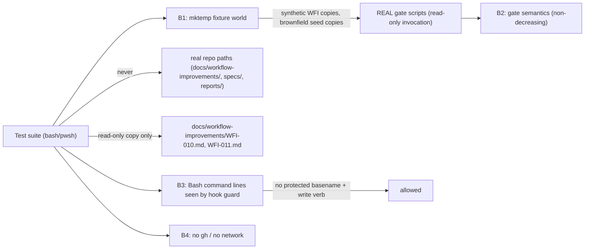

# Security Specification: epic-159-pillar-a2

Impact assessment is ALWAYS required for this feature class: two legs of
this feature drive real enforcement scripts (`check-placeholders.sh`, the
loop driver's real precheck dispatch) with synthetic fixtures, one leg pins
a documented but skill-only enforcement rule as a reference check, and two
legs add new PowerShell scripts that a real review-gate precheck path will
execute unattended in CI. A harness that leaks fixture state into real
paths, weakens a real gate, teaches an agent-forgeable pattern, or reaches
GitHub from a test would damage the very chain it verifies or the
maintainers' trust in CI. No credential value, secret, or exploit payload
belongs in fixtures, source, logs, or persisted evidence.

## Trust Boundaries

| Boundary | Source | Destination | Assets | Validation | AuthN/AuthZ | REQ | AC |
|---|---|---|---|---|---|---|---|
| B1 | test suites | fixture filesystem + two real WFI docs | synthetic WFI/HITL/brownfield fixtures; read-only copies of two real WFI documents | `mktemp -d` + trap cleanup; explicit fixture-root-outside-repo assertion (inherited from wave-1's `loop_fixture_init`); real `docs/workflow-improvements/` never written | filesystem isolation | REQ-001, REQ-002 | AC-003, AC-005, AC-007 |
| B2 | harness | real gate semantics | `check-placeholders.sh`/`.ps1`, the loop driver's real precheck dispatch, the two new `.ps1` precheck ports | scripts invoked READ-ONLY where they already exist; the two new `.ps1` scripts are authored as full-parity ports, not weakened subsets; the WFI-audit rule is pinned as an explicitly labeled reference check, never presented as if it drove the real skill | non-decreasing guarantee | REQ-001..004 | AC-001..016 |
| B3 | test payloads | hook-guard command-line analysis | Bash command lines executed by suites | protected basenames + write verbs stay inside script files, never on Bash tool command lines | guard compatibility by construction | REQ-001, REQ-002 | AC-001, AC-007 |
| B4 | WFI-audit fixture world | GitHub | none — no network call is reachable | no file added by this feature invokes `gh`; verified by a grep-based self-check (TEST-004), not a runtime stub or mock endpoint | construction, not runtime enforcement | REQ-001 | AC-004 |

## STRIDE Analysis

| Boundary | Threat | STRIDE | Abuse Case | Mitigation | Verification | REQ | AC |
|---|---|---|---|---|---|---|---|
| B1 | WFI-audit fixture accidentally written to a real `docs/workflow-improvements/` path | Tampering | a fixture WFI-NNN.md lands in the real tree and corrupts a real, human-tracked audit record | mktemp-only fixture roots; the suite constructs its own WFI-NNN.md fixture path under `$LOOP_FIXTURE_ROOT`, never under the real `docs/` tree | TEST-003 | REQ-001 | AC-003 |
| B1 | reading `WFI-010.md`/`WFI-011.md` accidentally mutates them | Tampering | the reference smoke check opens the real files with write intent | files are copied into the fixture BEFORE any parsing; only the copies are read; the real paths are opened read-only if at all | TEST-005 | REQ-001 | AC-005 |
| B2 | WFI-audit reference check silently drifts from the real skill's prose (false green: harness says "matches the rule" for a rule the skill no longer implements) | Spoofing (of skill semantics) | the skill's precondition text changes and the reference check keeps citing stale line numbers | AC-005's read-only cross-check against two real, human-authored WFI documents fails if the documented rule and observed reality diverge; the reference function's comments cite exact SKILL.md line numbers, making a stale citation reviewable | TEST-005 | REQ-001 | AC-003, AC-005 |
| B2 | a broken `CHECK` wiring in the HITL leg silently reports false-positive "never reproduces" | Repudiation | `export -f CHECK` omitted; `CHECK: command not found` (exit 127) is silently treated as "not reproduced" by `hitl-loop.template.sh`'s own `if CHECK; then` | AC-002 is a mandatory canary requiring the RED branch to be independently observed | TEST-002 | REQ-001 | AC-001, AC-002 |
| B2 | the two new `.ps1` precheck ports are authored as a weakened subset that accepts inputs the `.sh` original rejects | Tampering / Elevation of Privilege | a contributor "fixes" a Windows failure by loosening a precondition in the `.ps1` twin only | full-parity-port requirement (design.md Field Definitions); the existing loop-driver dispatch drives the `.ps1` through the same fixture flow the `.sh` original is driven through on the bash lane, so a loosened precondition would surface as a behavioral difference the moment either wave-1 suite exercises the divergent path | TEST-013, TEST-016 | REQ-003, REQ-004 | AC-011, AC-014 |
| B3 | suite command line triggers or trains a guard bypass | Elevation of Privilege | a Bash line pairing a protected basename with a write verb is normalized as "test noise" | such patterns confined to script-file interiors; fixture filenames never reuse protected basenames | code review + suite convention check | REQ-001, REQ-002 | AC-001, AC-007 |
| B4 | WFI-audit leg reaches GitHub (network egress from CI) | Elevation of Privilege / unintended egress | a future edit adds a `gh` call to make the leg "more realistic" | TEST-004's grep self-check fails the suite if any new file contains a `gh` invocation; the design's own construction (never invoking the skill) makes this structurally unlikely, not merely policy | TEST-004 | REQ-001 | AC-004 |

## Authorization

| Actor / Role | Resource | Action | Decision Point | Default | Denial Evidence | REQ | AC |
|---|---|---|---|---|---|---|---|
| test suite | `check-placeholders.sh`/`.ps1`, loop-driver precheck dispatch | invoke (read-only) | filesystem + guard | allow | n/a | REQ-002, REQ-003, REQ-004 | AC-008, AC-009, AC-013, AC-016 |
| test suite | real `docs/workflow-improvements/*.md`, `specs/`, `reports/`, registry, protected files | write | design constraint + R-10 guard for the protected subset | deny (never attempted) | guard non-zero exit if attempted | REQ-001 | AC-003, AC-005 |
| test suite | `gh` / GitHub API | invoke | design constraint (B4) | never | grep self-check (TEST-004) | REQ-001 | AC-004 |
| test suite | `tests/guard-ps1-ascii.tests.sh` `TARGETS` array | append entry | code review (Global Constraint, design.md) | allow, serialized | n/a | REQ-003, REQ-004 | AC-012, AC-015 |
| human maintainer | self-healing SKIP-to-green evidence (T-003/T-004 implementation reports) | review / approve | PR review | n/a | n/a | REQ-003, REQ-004 | AC-013, AC-016 |

## Data Classification and Protection

| Entity | Classification | At Rest | In Transit | Retention | Deletion | Access Log | REQ | AC |
|---|---|---|---|---|---|---|---|---|
| `tests/fixtures/loops/brownfield-seed/` | internal, committed, inert fixture | repository | local only | repo lifetime | reviewed revert | git history | REQ-002 | AC-007 |
| synthetic HITL / WFI-audit fixture copies | synthetic internal | mktemp directory | local only | test lifetime | trap cleanup | test output only | REQ-001 | AC-001..005 |
| read-only copies of `WFI-010.md`/`WFI-011.md` | internal (already-committed docs, copied not modified) | mktemp directory | local only | test lifetime | trap cleanup | test output only | REQ-001 | AC-005 |
| `plugins/sdd-domain/scripts/domain-review-precheck.ps1`, `plugins/sdd-review-loop/scripts/spec-review-precheck.ps1` | internal, unprotected gate-adjacent script | repository | local only | repo lifetime | reviewed revert | git history | REQ-003, REQ-004 | AC-011, AC-014 |

No secret, token, credential, or real approval identity appears anywhere in
fixtures or evidence. The WFI-audit fixture's synthetic fields (feature
slug, run identifiers where applicable) use obviously-synthetic constant
values, consistent with wave-1's convention.

## OWASP Mapping

| OWASP Risk | Exposure | Control | Verification | Owner |
|---|---|---|---|---|
| Broken Access Control | fixture writes escaping isolation into real `docs/workflow-improvements/` | mktemp + fixture-scoped-copy-only convention | TEST-003, TEST-005 | maintainers |
| Security Misconfiguration | new suites registered but silently skipped, or a `.ps1` port silently loosened | self-registration grep (TEST-006) + full-parity-port requirement + external SKIP-to-green observable (TEST-013, TEST-016) | TEST-006, TEST-013, TEST-016 | maintainers |
| Integrity / Supply Chain | WFI-audit reference check drifting from the real skill's prose | line-cited reference function + read-only cross-check against real WFI documents | TEST-005 | maintainers |
| Server-Side Request Forgery / unintended egress | a `gh` call reaching GitHub from a deterministic test suite | construction (never invoking the skill) + grep self-check | TEST-004 | maintainers |
| Injection | guard-triggering command lines | B3 convention (basenames + write verbs inside scripts only) | code review | maintainers |

## Secrets Management

No secret is added, read, or logged. Suites make no network call and read
no `.env`. Nothing in this feature computes or verifies any cryptographic
hash chain (unlike wave-1's identity-ledger genesis work) — the WFI-audit
reference check is a plain string/field comparison, and the two new `.ps1`
scripts reuse the same SHA-256-over-file-content pattern their `.sh`
originals already use (consistent with ADR-0008's no-signature-crypto
boundary; no new crypto surface is introduced).

## Security Tests

| Test | Boundary | Attack / Control | Expected Result | Evidence | AC |
|---|---|---|---|---|---|
| TEST-003 | B1/B2 | WFI-audit rule threshold mutated in a temp copy | red on drift | `tests/hitl-wfi-terminal.tests.sh` | AC-003 |
| TEST-004 | B4 | grep for `gh` invocation across new files | zero matches | `tests/hitl-wfi-terminal.tests.sh` | AC-004 |
| TEST-005 | B1/B2 | real WFI docs copied read-only, parsed, cross-checked | consistent with the documented rule; real files unmodified | `tests/hitl-wfi-terminal.tests.sh` | AC-005 |
| TEST-002 | B2 | `CHECK` returns 0 on iteration 3 | immediate exit 1, `RED:` message | `tests/hitl-wfi-terminal.tests.sh` | AC-002 |
| TEST-008 / TEST-009 | B2 | check-placeholders brownfield changed-files-only vs full-directory | PASS / FAIL pair, matching documented behavior | `tests/check-placeholders-brownfield.tests.sh` | AC-008, AC-009 |
| TEST-012 / TEST-015 | B2 | ASCII/BOM/CR byte scan on the two new `.ps1` files | zero non-ASCII bytes, no BOM, no CR | `tests/guard-ps1-ascii.tests.sh` | AC-012, AC-015 |

## Open Questions

None security-blocking. All investigation.md security-relevant open
questions (OQ-2's GitHub-reachability concern) are resolved by construction
in design.md and verified by TEST-004; see requirements.md Open Questions
for the full resolution list.
