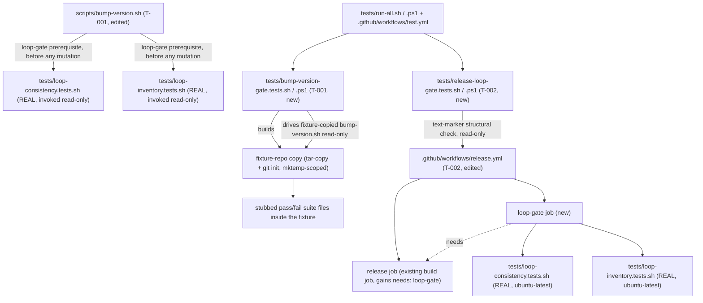

# Design: epic-159-pillar-b

Impl-Review-Status: Pending
Feature Type: release-gate wiring (two additive test suites + edits to two
already-existing release surfaces)

## Technical Summary

Two independent legs, matching requirements.md REQ-001/REQ-002 and the
issue's own Done condition wording (OQ-001): a CLI-side loop-gate
prerequisite inside `scripts/bump-version.sh` (T-001) and a CI-side
required job inside `.github/workflows/release.yml` (T-002). Neither leg
reimplements loop-consistency or loop-inventory semantics — both invoke the
real, already-registered suites (INV-002) and consume only their exit
code. T-001 and T-002 are independent of each other (different files,
different suites) except for three shared registration surfaces
(`tests/run-all.sh`/`.ps1`, `.github/workflows/test.yml`,
`CHANGELOG.md`'s `## Unreleased` section — see Global Constraints).

The guiding principle carried from epic-159-pillar-a2: no safety property
is asserted by reimplementation. Where a real script exists (the two loop
suites), both legs drive it read-only; where a real file must be inspected
structurally (`release.yml`'s job graph), the design uses a text-marker
technique already established in this repository
(`tests/workflow-state-ci-integration.tests.sh`) rather than introducing a
new YAML-parsing dependency.

## Architecture



## Components

| Component | Responsibility | Technology | New/Existing | Protected? |
|---|---|---|---|---|
| `scripts/bump-version.sh` | +loop-gate prerequisite (fail-closed, pre-mutation, no bypass) | Bash | existing, edited (T-001) | no (verified) |
| `tests/bump-version-gate.tests.sh` / `.ps1` | green/red/no-bypass/ordering/CI-resilience lock against a fixture-repo copy | Bash / PowerShell (shells to `bash`) | new | no |
| `.github/workflows/release.yml` | +required `loop-gate` job; existing build job gains `needs:` | GitHub Actions YAML | existing, edited (T-002) | no (verified) |
| `tests/release-loop-gate.tests.sh` / `.ps1` | text-marker lock on the job/`needs:` structure, incl. negative-branch canary | Bash (python3 heredoc) / PowerShell (native regex) | new | no |
| `tests/run-all.sh` / `.ps1` | suite registration (both new suites) | Bash / PowerShell | existing, edited | no (verified) |
| `.github/workflows/test.yml` | CI wiring (3-OS, bash+pwsh lanes) for both new suites | GitHub Actions YAML | existing, edited | no (verified) |
| `docs/contributor/release-runbook.md` | documents both loop-gate legs + REQ-004 degradation note | Markdown | new | no |
| `CHANGELOG.md` | `## Unreleased` entry citing #148 | Markdown | existing, edited | no (verified) |

Real surfaces exercised READ-ONLY (never modified in place):
`tests/loop-consistency.tests.sh`, `tests/loop-inventory.tests.sh` (both
invoked by the new gate legs and, separately, copied verbatim into
`tests/bump-version-gate.tests.sh`'s fixture, but never edited by this
feature).

## Protected-File Statement

No protected-gate-file modification is needed anywhere in this feature.
Verified directly against `_PROTECTED_GATE_SUFFIXES`
(`plugins/sdd-quality-loop/scripts/sdd-hook-guard.py:886-927`): the full
protected `tests/` list is exactly `tests/gates.tests.sh`,
`tests/eval.tests.sh`, `tests/guard-parity.tests.sh`,
`tests/constant-parity.tests.sh` — none of which this feature touches.
Neither `scripts/bump-version.sh` nor `.github/workflows/release.yml`
appears anywhere in `_PROTECTED_GATE_SUFFIXES` or
`_PROTECTED_GATE_PLUGIN_JSON_SUFFIXES`
(`sdd-hook-guard.py:886-927,929-931`). `tests/run-all.sh`/`.ps1` and
`.github/workflows/test.yml` (shared registration edits) and
`docs/contributor/release-runbook.md`/`CHANGELOG.md` (new/edited docs) are
likewise absent from that list. Rule stated for completeness: IF any
wiring were ever to require touching a protected file, the epic-136
human-copy procedure applies — the agent stages the corrected file under
`specs/epic-159-pillar-b/human-copy/` with a SHA-256 manifest, and only the
human copies it into place. Not needed here.

## Layer Specifications

| Layer | Summary | Canonical Detail | Owner | Status |
|---|---|---|---|---|
| UX | N/A — no change: no GUI or user-facing surface | [UX specification](ux-spec.md#scope-and-user-journeys) | maintainers | N/A |
| Frontend | N/A — no change: shell/PowerShell/YAML/Markdown only | [Frontend specification](frontend-spec.md#technology-stack) | maintainers | N/A |
| Infrastructure | `release.yml` required-job wiring; CI suite registration on the existing matrix | [Infrastructure specification](infra-spec.md#cicd-sequence) | maintainers | Planned |
| Security | weakened-gate threat mitigation; fixture isolation; release-path integrity | [Security specification](security-spec.md#trust-boundaries) | maintainers | Planned |

## Design System Compliance

N/A — ds_profile: none. Not a UI application; no mockup provided; optional
visualization skipped.

## Cross-Layer Dependencies

| From | To | Contract / Decision | REQ | AC | Verification |
|---|---|---|---|---|---|
| requirements.md | design.md | `bump-version.sh` loop-gate prerequisite, fail-closed, no bypass | REQ-001 | AC-001..006 | TEST-001..006 |
| requirements.md | design.md | `release.yml` required loop-gate job | REQ-002 | AC-007..010 | TEST-007..010 |
| requirements.md | design.md | doc + CHANGELOG follow (same PR) | REQ-003 | AC-011..012 | TEST-011..012 |
| requirements.md | design.md | `bump-version.ps1` non-twin, recorded degradation | REQ-004 | AC-013..014 | TEST-013..014 |
| requirements.md | security-spec.md | weakened-gate threat; fixture isolation; release-path integrity | REQ-001, REQ-002 | AC-002..004, AC-008..009 | TEST-002..004, TEST-008..009 + security tests |
| requirements.md | infra-spec.md | `ubuntu-latest`-only loop-gate job wiring; deterministic lane | REQ-002 | AC-007, AC-010 | TEST-007, TEST-010 |

## ADR Change Log

No new ADR. This feature wires two already-existing, already-registered
(INV-002) test suites into two already-existing release surfaces
(`scripts/bump-version.sh`, `.github/workflows/release.yml`); it
introduces no new vocabulary, schema, or architectural pattern beyond what
epic-159-pillar-a2 already established: the fixture-copy testing precedent
(`tests/repository-release-validation.tests.sh:9-16`) and the text-marker
CI-content-assertion precedent (`tests/workflow-state-ci-integration.tests.sh`).

## Data Plan

None. No data entity is introduced, stored, or migrated. The only
filesystem artifacts this feature creates are mktemp-scoped fixture-repo
copies (deleted via `trap ... EXIT`) and one new committed documentation
file (`docs/contributor/release-runbook.md`). Existing Data Affected: none
— the real `README.md`, `CHANGELOG.md`, plugin manifests, and
`tests/validate-repository.ps1` are never written by either new suite;
only a genuine `scripts/bump-version.sh <version>` invocation against the
real repository (unchanged, human-run) writes them, exactly as today.

## API / Contract Plan

### `scripts/bump-version.sh` loop-gate prerequisite (T-001)

Insertion point: immediately after the existing CHANGELOG-heading
precondition's closing `fi` (`scripts/bump-version.sh:42`), before the
`OLD_PLAIN_RE`/pattern-derivation comment (`scripts/bump-version.sh:44`) —
i.e., directly after the block INV-001 cites (`:38-42`), still strictly
before every mutation step (the mutation section begins at
`scripts/bump-version.sh:51`, first `sed -i` at `:58`). Placing the new
block after the (cheap, file-existence-only) CHANGELOG check and before
the (more expensive, subprocess-invoking) loop-gate check preserves a
fail-fast precondition ordering while keeping both checks strictly ahead
of any mutation.

Planned shape (implementation detail, authored at task time):

```
# Loop-suite prerequisite (issue #148): both suites must pass before any
# release surface is mutated. Fail closed; no bypass.
for suite in tests/loop-consistency.tests.sh tests/loop-inventory.tests.sh; do
    suite_log="$(mktemp)"
    if ! "${ROOT}/${suite}" >"${suite_log}" 2>&1; then
        echo "Error: ${suite} failed; no release surface was modified." >&2
        cat "${suite_log}" >&2
        rm -f "${suite_log}"
        exit 1
    fi
    rm -f "${suite_log}"
done
```

Invoking the suites via `"${ROOT}/${suite}"` (reusing the script's own
`ROOT="$(cd "$(dirname "$0")/.." && pwd)"` resolution,
`scripts/bump-version.sh:18`) is what makes the fixture-copy test technique
below correct without any `PATH` manipulation: when the fixture's own copy
of `bump-version.sh` runs, `$0` resolves inside the fixture, so `$ROOT`
(and therefore `${ROOT}/${suite}`) automatically resolves to the fixture's
own suite files — real suites for the green path, stubs for the red path.
Output is captured and only surfaced on failure, matching the script's
existing terse-on-success convention (compare the single `echo` lines at
`scripts/bump-version.sh:36,93`).

### `tests/bump-version-gate.tests.sh` / `.ps1` test technique (T-001)

1. Build a fixture-repository copy via the tar-copy technique already
   established at `tests/repository-release-validation.tests.sh:9-16`
   (`tar --exclude='./.git' -cf - . | (cd fixture && tar -xf -)`), then
   `git init` the fixture and commit the copy as a baseline — this is a
   deliberate extension beyond that precedent (which does not `git init`
   its fixture), needed so `git status --porcelain` becomes a meaningful
   zero-mutation proof (Design Decisions below).
2. Normalize the fixture root with `pwd -P` immediately after creation
   (INV-030-equivalent macOS `$TMPDIR` symlink convention, matching
   `tests/lib/loop-driver.sh:124`'s established pattern, requirements.md
   AC-006).
3. Rename the fixture's `CHANGELOG.md` heading from `## Unreleased` to a
   synthetic `## v<test-version>` so the script's pre-existing
   CHANGELOG-heading precondition (`scripts/bump-version.sh:38-42`) is
   satisfied and the test isolates the NEW loop-gate precondition
   specifically.
4. Per case, replace the fixture's own
   `tests/loop-consistency.tests.sh`/`tests/loop-inventory.tests.sh` with
   either the unmodified real copy (already present from step 1) or a
   two-line failing stub (`#!/usr/bin/env bash` / `exit 1`), independently
   per suite (AC-002 vs. AC-003).
5. Run `bash "${fixture_root}/scripts/bump-version.sh" <test-version>` and
   capture its exit code.
6. Assert the exit code and, for the red cases, `git -C "${fixture_root}"
   status --porcelain` is empty; for the green case (AC-001), assert the
   fixture's plugin manifests/`README.md`/`tests/validate-repository.ps1`
   contain the new test version string.

The `.ps1` twin follows `tests/hitl-wfi-terminal.tests.ps1`'s established
idiom for driving a bash-only real script from PowerShell
(`Get-Command bash -ErrorAction SilentlyContinue`; `& bash <path> <args>`):
it builds the identical fixture (via `git`/`Copy-Item`, PowerShell-native)
and invokes `& bash "$fixtureRoot/scripts/bump-version.sh" $testVersion`.
If `bash` is not found on `PATH`, the suite emits a named SKIP with reason
(`"SKIP: bash not found on PATH; scripts/bump-version.sh is bash-only
(REQ-004 recorded degradation)"`) rather than failing silently, mirroring
`tests/hitl-wfi-terminal.tests.ps1:101-107`'s established degradation
pattern.

AC-004 (no-bypass self-check) and AC-005 (ordering self-check) run
directly against the REAL `scripts/bump-version.sh` source (no fixture
needed): a grep-based scan for the absence of an environment-variable
conditional around the new block, and a line-number comparison between the
loop-gate invocation and the first `sed -i` mutation call
(`scripts/bump-version.sh:58`).

### `.github/workflows/release.yml` required loop-gate job (T-002)

Planned shape (implementation detail, authored at task time):

```yaml
jobs:
  loop-gate:
    runs-on: ubuntu-latest
    steps:
      - uses: actions/checkout@9c091bb21b7c1c1d1991bb908d89e4e9dddfe3e0 # v7.0.0
      - name: Test loop consistency suite
        shell: bash
        run: bash ./tests/loop-consistency.tests.sh
      - name: Test loop inventory suite
        shell: bash
        run: bash ./tests/loop-inventory.tests.sh
  release:
    needs: loop-gate
    runs-on: ubuntu-latest
    steps:
      # unchanged (release.yml:33-99)
```

`release.yml`'s existing single job (`release:`, `release.yml:30-100`)
keeps its name to minimize diff churn (requirements.md Field Definitions:
`build job`); only a `needs: loop-gate` line is added. No new permissions
are needed for the `loop-gate` job (it only checks out the repository and
runs local scripts — no `contents: write`/`id-token: write` scope
required, unlike the existing job's upload/attestation steps,
`release.yml:25-29`).

### `tests/release-loop-gate.tests.sh` / `.ps1` test technique (T-002)

Follows the text-marker technique already established at
`tests/workflow-state-ci-integration.tests.sh:8-43` (a `python3 -` heredoc
reading the workflow file as text and asserting substring presence,
substring index ordering, and slice-scoped substring absence) rather than
adding a YAML-parsing library dependency:

1. Read `.github/workflows/release.yml` as text.
2. Assert both `bash ./tests/loop-consistency.tests.sh` and
   `bash ./tests/loop-inventory.tests.sh` (or their eventual literal step
   `run:` strings) appear inside the slice of text between the `loop-gate:`
   job key and the next top-level job key (AC-007).
3. Assert a `needs: loop-gate` (or equivalent YAML list form) substring
   appears inside the slice of text scoped to the `release:` job body
   (AC-008), and that neither that slice nor the `loop-gate:` job's slice
   contains `continue-on-error: true` or `if: always()`/`if: success() ||
   failure()` (AC-008, weakened-gate threat).
4. Assert the `loop-gate:` job's slice contains `runs-on: ubuntu-latest`
   and no `strategy:`/`matrix:` key (AC-010).
5. Negative-branch canary (AC-009): copy `release.yml` into a small mktemp
   fixture, textually strip the `needs:` line (a one-line `sed`/Python
   string replace), and re-run the same marker-check function against the
   mutated copy — assert it now reports non-compliance, proving step 3's
   assertion is not vacuously true.

The `.ps1` twin re-implements the same substring/index logic natively
(`Get-Content -Raw` + `.IndexOf(...)`/`-match` regex) rather than shelling
out to `python3`, following the full-parity-port translation idiom
established by `impl-review-precheck.ps1`/`task-review-precheck.ps1`
(epic-159-pillar-a2 design.md Field Definitions) — `release.yml` parsing
does not depend on any bash-only real script the way T-001's fixture does,
so there is no `Get-Command`-degradation branch needed here; both lanes run
unconditionally.

## Test Strategy

1. T-001's green/red pair is the RED-demonstrable proof for REQ-001:
   AC-001 (green, passing stubs or real suites) and AC-002/AC-003 (red, one
   suite stubbed failing at a time) are a positive/negative triple, mirroring
   `tests/check-placeholders.tests.sh`'s and epic-159-pillar-a2's
   AC-008/AC-009 pair pattern. AC-001 defaults to trivially-passing stubs
   rather than the full real suites for speed; genuine real-suite
   invocation correctness is independently covered by AC-005's line-position
   assertion (the invocation is provably reachable and pre-mutation) and by
   `test.yml`'s own direct execution of the real suites on every push/PR
   (INV-002) — see Design Decisions.
2. T-002's structural check is RED-demonstrable via AC-009's negative-branch
   canary on a mutated fixture copy of `release.yml`, mirroring
   `tests/workflow-state-ci-integration.tests.sh`'s own established
   technique (that suite's ordering assertions are likewise provable false
   on a hypothetically reordered file, though it does not carry an explicit
   canary case itself — this feature's canary is a strengthening, not a
   gap fix, of the inherited pattern).
3. No runtime-budget assertion is added to either new suite: T-001's suite
   uses stub-driven fast paths by design (item 1 above); T-002's suite is
   pure text parsing with no subprocess loop-driving, mirroring
   epic-159-pillar-a2 design.md Test Strategy item 4's exemption for suites
   whose own driving cost never approaches the 300s threshold.
4. Full suite: `bash tests/run-all.sh` and `pwsh tests/run-all.ps1` locally;
   the 3-OS CI matrix (for the two new suites) plus the release-only
   `ubuntu-latest` job (for the loop-gate job itself, exercised only when
   `release.yml` actually runs) are authoritative.
5. Self-registration: `tests/bump-version-gate.tests.sh` and
   `tests/release-loop-gate.tests.sh` each grep
   `tests/run-all.sh`/`.ps1`/`.github/workflows/test.yml` for their own
   basename, mirroring `tests/second-approval-mask.tests.sh:285-289`'s
   established pattern (requirements.md AC-006, AC-010).

## Design Decisions (resolving open questions)

- OQ-001 → both legs (CLI prerequisite + required CI job), matching the
  issue's own Done condition wording (requirements.md REQ-001, REQ-002).
- OQ-002 → the 300s budget is not a concern for either new suite (Test
  Strategy item 3); the loop suites themselves already prove viable under
  budget on `ubuntu-latest` via `test.yml` (INV-002).
- OQ-003 → no `bump-version.ps1` twin; `scripts/bump-version.sh` is a
  release-operator CLI, not a test suite, so the twin mandate the loop
  suites and this feature's own new test suites follow does not bind it;
  the `release.yml` leg is the recorded Windows-host equivalent
  (requirements.md REQ-004).
- OQ-004 → documentation home is `docs/contributor/release-runbook.md`
  (new) + `README.md` release note + `CHANGELOG.md` `## Unreleased` entry
  (requirements.md REQ-003).
- OQ-005 → out of scope; suites self-manage their own runtime budgets.
- OQ-006 → non-goal; suite timings are not emitted into release notes or
  the attestation.
- OQ-007 → no bypass override; fail-closed with no exception
  (requirements.md AC-004).
- New decision (not carried from an investigation OQ): whether to extend
  `tests/workflow-state-ci-integration.tests.sh` itself to also parse
  `release.yml`, versus authoring a new suite that follows its technique.
  Decided: new suite (`tests/release-loop-gate.tests.sh`/`.ps1`). That
  suite is scoped by name and by its own header comment
  (`tests/workflow-state-ci-integration.tests.sh:1-6`) to `test.yml` +
  quality-gate wiring specifically; conflating a release-gate structural
  check into a file named for workflow-state CI integration would blur two
  suites' ownership boundaries for no additional enforcement benefit — the
  same reasoning epic-159-pillar-a2 design.md applied when declining to
  extend `CANONICAL_BASENAMES`.
- New decision: whether `tests/bump-version-gate.tests.sh`'s green-path
  case (AC-001) drives the real, full `tests/loop-consistency.tests.sh`/
  `tests/loop-inventory.tests.sh` inside the fixture, or trivially-passing
  stubs. Decided: stubs by default, for suite speed and determinism (the
  real suites' own multi-round driving cost is unrelated to what this
  suite needs to prove). This is a deliberate trade-off: the fixture-copy
  technique itself (invoking the fixture's OWN `bump-version.sh`, which in
  turn resolves `$ROOT`-relative suite paths) is what is being tested, not
  the loop suites' internal correctness — that is already covered
  elsewhere (`test.yml`, INV-002; the loop suites' own test files).
- New decision: the fixture-repo copy is `git init`-ed and committed as a
  baseline (extending, not merely reusing,
  `tests/repository-release-validation.tests.sh:9-16`'s plain tar-copy,
  which never initializes git). This is required specifically because
  AC-002/AC-003's zero-mutation proof is expressed as `git status
  --porcelain` being empty — a plain tar-copy without a git baseline could
  not express that assertion.

## Global Constraints

Three files/sections are edited by more than one task in this feature,
mirroring epic-159-pillar-a2's commit-serialization precedent
(epic-159-pillar-a2 design.md Global Constraints section):

- `tests/run-all.sh` / `tests/run-all.ps1` — T-001 adds
  `bump-version-gate.tests`; T-002 adds `release-loop-gate.tests`. Both
  edits are additive array entries; land them in separate, serialized
  commits (one per task) to avoid a merge collision on the same array.
- `.github/workflows/test.yml` — same two additions, same serialization
  note.
- `CHANGELOG.md`'s `## Unreleased` section — both tasks cite the same
  issue (#148); whichever task lands second should extend the existing
  entry the first task added rather than create a duplicate `#148` line.

## Security Boundaries

| Trust Boundary | Auth/Authz Mechanism | Data Classification | OWASP Concerns |
|---|---|---|---|
| B1: release path vs. test-suite fixtures | fixture-repository copies (tar-based, mktemp-scoped, `git init`-ed locally) never overwrite the real repository; real release surfaces read only, never written by any suite in this feature | synthetic fixture copies only | Broken Access Control (prevented) |
| B2: weakened-gate / bypass threat | no env-var/CLI-flag bypass in the CLI leg (AC-004); no `continue-on-error`/`if: always()` escape hatch in the CI leg (AC-008) | internal source | Security Misconfiguration |
| B3: fixture world vs. real repository state | mktemp isolation; `pwd -P` normalization; real files copied read-only to build the fixture | internal source | Integrity |
| B4: GitHub release path | `needs:` structurally gates every artifact-producing step; no network call added by either new suite | internal source | Supply Chain Integrity |

Detailed controls: [Security specification](security-spec.md#trust-boundaries).

## External Integrations

None. No network calls, no new services, no third-party actions beyond
what `release.yml` already performs (checkout, SBOM generation, sigstore
attestation, release-asset upload — all unchanged by this feature). The
new `loop-gate` job checks out the repository (already-pinned
`actions/checkout` SHA, `release.yml:34`) and runs only local scripts.

## Deployment / CI Plan

No runtime deployment. Two new suites join `tests/run-all.sh`/`.ps1` and
`.github/workflows/test.yml` on the existing 3-OS matrix, deterministic
lane (no LLM invocation anywhere in this feature — #126 lane separation
note, unchanged from wave-1/epic-159-pillar-a2). The `release.yml` leg's
observable effect only occurs when a `release: [published]` event or a
`workflow_dispatch` run against `release.yml` actually happens; it does
not run on ordinary push/PR (`test.yml`'s trigger surface, unchanged).
Rollback for either leg is a reviewed revert of that leg's commit; because
nothing protected is touched, no human-copy re-copy step exists in the
rollback path. Reverting the `release.yml` `needs:` line restores today's
ungated behavior; reverting `bump-version.sh`'s new block restores today's
CHANGELOG-heading-only precondition.

## Constraint Compliance

| Requirement Constraint | Design Response |
|---|---|
| no protected file modified | all deliverables are new files or edits to unprotected registration/release surfaces (verified above) |
| `.sh`/`.ps1` twin pairs mandatory | `bump-version-gate` and `release-loop-gate` ship as twins from the start, following epic-159-pillar-a2's REQ-005 cross-host convention |
| cross-host (Claude Code / Codex) | host-neutral twins + CI matrix; the `bump-version.sh` non-twin degradation (REQ-004) is explicit and recorded, never silent |
| no false green | both loop-gate legs invoke the real suites (or, for T-001's own test suite, fixture-scoped real/stubbed copies of them, never a reimplementation); the `release.yml` structural check is a text-marker lock on the real file, with a negative-branch canary proving it is not vacuous |
| doc-following in same PR | REQ-003 surface list; `CHANGELOG.md` `## Unreleased` entry per #148 |
| version bump via `scripts/bump-version.sh` only | this feature strengthens, not bypasses, that existing rule (`specs/epic-159-pillar-a/requirements.md:164-173`) — it adds a precondition to the same, sole entry point |
| CI resilience: bash 3.2 `set -u` empty-array safety (INV-017) | neither new suite declares a possibly-empty array under `set -u`; `tests/bump-version-gate.tests.sh`'s per-suite loop iterates a literal two-element list, not a dynamically-sized array |
| CI resilience: macOS `$TMPDIR` symlink normalization (INV-017, `pwd -P` convention) | `tests/bump-version-gate.tests.sh`'s fixture root and `tests/release-loop-gate.tests.sh`'s negative-branch fixture are both normalized with `pwd -P` immediately after creation, mirroring `tests/lib/loop-driver.sh:124` |
| CI resilience: Windows jq CRLF stripping (INV-017) | neither new suite consumes jq output (non-use declaration IS the compliance, mirroring epic-159-pillar-a2's INV-031 non-use declaration) |
| CI resilience: real-validator capability probe (INV-017) | neither new suite drives `validate-review-context-set.sh` or any other real validator gate (non-use declaration) |

## Assumptions

`scripts/bump-version.sh`'s `ROOT="$(cd "$(dirname "$0")/.." && pwd)"`
resolution (`scripts/bump-version.sh:18`) remains as observed at design
time — the fixture-copy test technique depends on it resolving relative to
the invoked script's own location, not a hardcoded repository path.
`.github/workflows/release.yml`'s single-job, single-OS structure
(`release.yml:30-100`) remains as observed; a future unrelated edit that
restructures the job graph would not invalidate this design's correctness,
only the exact text markers `tests/release-loop-gate.tests.sh` looks for
(review-time concern, not a design flaw). `tests/workflow-state-ci-integration.tests.sh`'s
technique remains available as an unmodified precedent.

## Open Questions

None blocking. All investigation.md OQ-001..OQ-007 are resolved above with
design decisions; the two additional decisions this design makes (new
`release-loop-gate` suite rather than extending
`tests/workflow-state-ci-integration.tests.sh`; stub-driven green path for
`bump-version-gate`) are stated as resolved decisions, not left open,
because both are reversible, low-risk, additive choices a future issue
could revisit without touching this feature's deliverables.

## Risks

Principal risk is the weakened-gate threat: a future, unrelated edit to
`release.yml` could add `continue-on-error: true` or `if: always()` to
neutralize the `needs:` dependency without anyone intending to bypass the
gate (e.g., while debugging a flaky release run). Mitigation is AC-008's
assertion that no such escape hatch exists, re-verified on every CI run.
Secondary risk is the CLI leg's fixture-copy technique depending on
`bump-version.sh`'s `$ROOT`-relative resolution remaining stable
(Assumptions above); mitigation is that any change breaking this
resolution would also break the real script's own existing behavior
(plugin-manifest globbing, `README.md`/`tests/validate-repository.ps1`
paths all already depend on the same `$ROOT` variable), so it is
inherently a well-exercised, low-drift assumption. Tertiary risk is the
shared-file edits (`run-all.sh`/`.ps1`, `test.yml`, `CHANGELOG.md`)
colliding across T-001/T-002; mitigation is the Global Constraints section
above plus per-task serialized commits.
